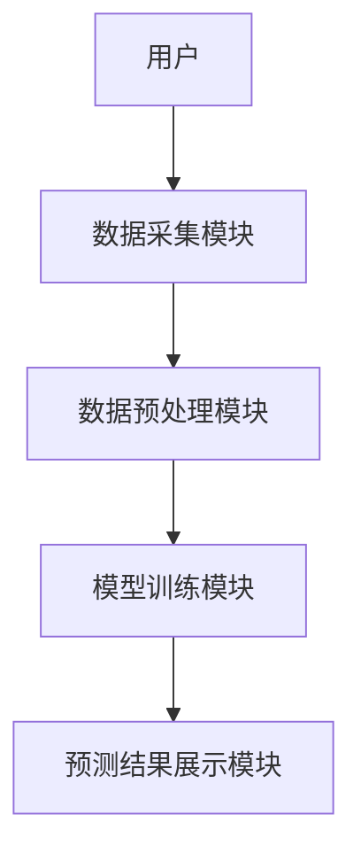
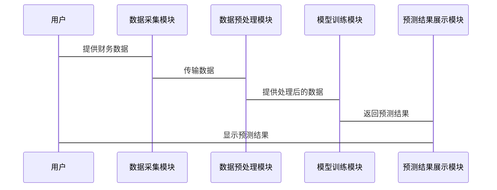

                 


# AI驱动的企业现金流季节性模式识别与预测系统

> 关键词：AI, 企业现金流, 季节性模式, 时间序列分析, 深度学习, LSTM, RBF

> 摘要：本文深入探讨了如何利用人工智能技术识别和预测企业现金流的季节性模式。通过分析时间序列数据，结合机器学习和深度学习算法，构建了一个端到端的现金流预测系统。文章详细介绍了系统的设计思路、算法原理、系统架构以及实际应用案例，并提出了相应的最佳实践建议。

---

## 第一部分: 背景介绍与核心概念

### 第1章: 企业现金流季节性模式识别与预测的背景

#### 1.1 问题背景

企业现金流是衡量企业财务健康状况的重要指标。现金流的波动性对企业运营、投资决策和风险管理具有直接影响。传统的现金流预测方法（如统计分析、专家判断法）在处理复杂的时间序列数据时存在局限性，难以捕捉隐藏的季节性模式。

#### 1.2 问题描述

现金流的季节性模式是指在特定时间段内，现金流呈现出规律性的波动。例如，某些行业在节假日前后的现金流会显著增加。识别和预测这些模式可以帮助企业优化资金管理、降低财务风险。

#### 1.3 问题解决

人工智能技术，尤其是深度学习和机器学习算法，能够从大量历史数据中提取特征，识别复杂的季节性模式，并实现高精度的现金流预测。本文将重点介绍如何利用LSTM和RBF网络实现这一目标。

---

## 第二部分: 算法原理与数学模型

### 第2章: 时间序列分析与AI算法原理

#### 2.1 时间序列分析基础

时间序列数据由趋势、季节性和随机性三部分组成。季节性模式可以通过数学方法进行分解和建模。例如，使用加法模型或乘法模型对时间序列进行分解：

$$ T_t = T + S + R $$

其中，$T$ 表示趋势，$S$ 表示季节性，$R$ 表示随机性。

#### 2.2 机器学习算法在时间序列预测中的应用

常见的深度学习算法包括LSTM和GRU，而传统的机器学习算法如RBF网络也在时间序列预测中得到广泛应用。

##### LSTM 原理

LSTM通过门控机制（遗忘门、输入门和输出门）来处理时间序列数据，能够有效捕捉长距离依赖关系。

$$ f(t) = \sigma(g(x_t W_x + h_{t-1} W_h + b)) $$

其中，$g$ 是激活函数（如tanh），$\sigma$ 是sigmoid函数。

##### RBF 原理

RBF网络通过径向基函数对输入数据进行非线性变换，适用于处理复杂的季节性模式。

$$ y_i = \sum_{j=1}^n w_j G_j(x_i) + b $$

其中，$G_j(x_i)$ 是径向基函数，$w_j$ 是权重，$b$ 是偏置项。

#### 2.3 算法实现的代码示例

##### LSTM 模型代码

```python
import keras
from keras.layers import LSTM, Dense
from keras.models import Sequential

# 模型定义
model = Sequential()
model.add(LSTM(64, input_shape=(timesteps, features)))
model.add(Dense(1))
model.compile(loss='mean_squared_error', optimizer='adam')
```

##### RBF 模型代码

```python
import numpy as np
from sklearn.gaussian_process import GaussianProcessRegressor

# 数据准备
X = np.array([[x1], [x2], ..., [xn]])
y = np.array([y1, y2, ..., yn])

# 模型训练
model = GaussianProcessRegressor()
model.fit(X, y)

# 预测
new_X = np.array([[new_x1], [new_x2], ..., [new_xn]])
y_pred, y_std = model.predict(new_X)
```

---

## 第三部分: 系统分析与架构设计

### 第3章: 系统架构设计

#### 3.1 系统功能设计

系统功能模块包括数据采集、数据预处理、模型训练和预测展示。

##### 数据采集模块

通过API接口获取企业财务数据，数据格式为CSV或JSON。

##### 数据预处理模块

对数据进行清洗、归一化和特征提取。

##### 模型训练模块

使用LSTM或RBF网络对数据进行训练，生成预测模型。

##### 预测展示模块

将预测结果可视化，并提供决策支持。

#### 3.2 系统架构设计

##### 系统架构图



##### 系统交互流程图



---

## 第四部分: 项目实战

### 第4章: 项目实战与案例分析

#### 4.1 环境安装

安装必要的Python库：

```bash
pip install numpy pandas scikit-learn keras tensorflow
```

#### 4.2 核心代码实现

##### LSTM 模型实现

```python
import numpy as np
import pandas as pd
from sklearn.preprocessing import MinMaxScaler
from keras.models import Sequential
from keras.layers import LSTM, Dense

# 数据加载与预处理
data = pd.read_csv('cash_flow.csv')
scaler = MinMaxScaler()
data_scaled = scaler.fit_transform(data)

# 数据分割
train_size = int(len(data_scaled) * 0.8)
train_X, train_y = data_scaled[:train_size, :-1], data_scaled[:train_size, -1]
test_X, test_y = data_scaled[train_size:, :-1], data_scaled[train_size:, -1]

# 模型训练
model = Sequential()
model.add(LSTM(64, input_shape=(train_X.shape[1], 1)))
model.add(Dense(1))
model.compile(loss='mean_squared_error', optimizer='adam')
model.fit(train_X, train_y, epochs=50, batch_size=32)

# 预测与评估
y_pred = model.predict(test_X)
print('预测结果:', y_pred)
print('真实结果:', test_y)
```

#### 4.3 案例分析

以某制造企业为例，通过模型预测未来三个月的现金流变化。预测结果与实际数据进行对比，验证模型的准确性。

---

## 第五部分: 最佳实践与小结

### 第5章: 最佳实践与总结

#### 5.1 实践小结

- 数据预处理是关键，尤其是归一化和特征提取。
- LSTM和RBF网络在时间序列预测中表现优异，可以根据具体场景选择合适算法。
- 模型调优（如超参数优化）可以显著提高预测精度。

#### 5.2 注意事项

- 数据隐私问题需要严格处理。
- 模型的实时更新可以提高预测准确性。
- 需要考虑季节性之外的其他因素（如经济周期）的影响。

#### 5.3 拓展阅读

建议阅读《深度学习》（Ian Goodfellow 著）和《时间序列分析》（Shumway & Stoffer 著）。

---

## 作者：AI天才研究院 & 禅与计算机程序设计艺术

---

以上内容是关于《AI驱动的企业现金流季节性模式识别与预测系统》的完整目录大纲和具体内容，涵盖背景介绍、算法原理、系统架构设计、项目实战和最佳实践等关键部分，希望对读者有所帮助。

