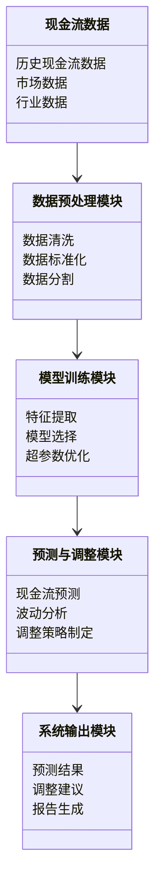

                 


# AI驱动的企业现金流季节性调整系统

## 关键词
AI技术，现金流管理，季节性调整，机器学习，深度学习

## 摘要
本文详细探讨了AI技术在企业现金流季节性调整中的应用，从背景介绍、核心概念到算法原理、系统设计，再到项目实战和最佳实践，全面解析了如何利用AI技术优化企业现金流管理。通过本文，读者将深入了解AI驱动现金流调整系统的工作原理、实现方法及其在实际应用中的效果。

---

# 第一部分: 企业现金流季节性调整系统概述

## 第1章: 企业现金流与季节性调整的背景

### 1.1 企业现金流管理的重要性
#### 1.1.1 企业现金流的核心作用
现金流是企业的生命线，直接关系到企业的生存与发展。健康的现金流能够确保企业按时支付账单、偿还债务、投资新项目，从而维持企业的正常运营。现金流的波动性，尤其是季节性波动，往往会影响企业的财务健康状况。

#### 1.1.2 季节性波动对企业现金流的影响
企业的现金流通常会受到季节性因素的影响。例如，零售企业在节假日销售旺季可能会出现现金流激增，而在淡季则可能出现现金流短缺。这种波动性如果不加以调整，可能导致企业在特定时期面临资金链断裂的风险。

#### 1.1.3 传统现金流管理的局限性
传统的现金流管理方法主要依赖于历史数据和人工经验。这种方法在面对复杂多变的市场环境时显得力不从心，难以准确预测和调整季节性波动带来的影响。此外，人工操作的主观性和不准确性也可能导致决策失误。

### 1.2 AI技术在财务领域的应用潜力
#### 1.2.1 AI技术的基本概念与优势
人工智能（AI）技术通过机器学习、深度学习等方法，能够从大量数据中提取规律并进行预测。其优势在于能够快速处理大量数据，发现人类难以察觉的模式，并提供准确的预测结果。

#### 1.2.2 AI在企业财务管理中的应用场景
在财务管理领域，AI技术可以应用于财务预测、风险评估、成本控制等多个方面。特别是在现金流管理中，AI技术可以通过历史数据和市场信息，预测未来的现金流波动，为企业提供科学的决策支持。

#### 1.2.3 AI驱动现金流管理的创新性
AI技术的应用为现金流管理带来了创新性的解决方案。通过机器学习模型，企业可以实时监控现金流波动，快速调整财务策略，从而有效应对季节性变化带来的挑战。

### 1.3 本章小结
本章从企业现金流管理的重要性入手，分析了季节性波动对企业现金流的影响，指出了传统管理方法的局限性。同时，介绍了AI技术在财务领域的应用潜力及其在现金流管理中的创新性。通过本章的分析，读者可以理解AI技术在现金流管理中的重要性及其应用前景。

---

## 第2章: 企业现金流季节性调整系统的核心概念

### 2.1 现金流季节性调整的基本定义
#### 2.1.1 现金流波动的周期性特征
现金流波动通常具有周期性特征。例如，某些行业可能在每年的特定季度出现销售高峰，导致现金流激增。通过分析这些周期性特征，企业可以更好地预测未来的现金流波动。

#### 2.1.2 季节性调整的定义与目标
季节性调整是指通过技术手段，对企业的现金流数据进行分析和预测，从而消除季节性波动的影响，优化现金流管理。其目标是提高现金流预测的准确性，降低季节性波动对企业财务状况的影响。

#### 2.1.3 现金流调整的核心要素
现金流调整的核心要素包括数据来源、模型选择、调整策略等。企业需要根据自身的实际情况，选择合适的模型和策略，以实现有效的现金流调整。

### 2.2 AI驱动现金流调整系统的构成
#### 2.2.1 数据来源与处理
AI驱动的现金流调整系统需要大量的数据支持，包括历史现金流数据、市场数据、行业数据等。这些数据需要经过清洗、整理和预处理，以确保模型的准确性。

#### 2.2.2 模型选择与训练
根据企业的实际情况，选择合适的机器学习模型（如ARIMA、LSTM）或深度学习模型（如Transformer）进行训练。模型的选择需要考虑数据的特征、波动性以及预测的准确性。

#### 2.2.3 调整策略与实施
基于模型的预测结果，企业可以制定相应的调整策略，例如调整库存水平、优化应收账款管理等，以实现现金流的优化管理。

### 2.3 现金流调整系统的属性对比
#### 2.3.1 传统方法与AI方法的对比
传统方法主要依赖人工经验，预测准确性较低，且难以应对复杂的变化。AI方法通过机器学习模型，能够更准确地预测现金流波动，提高管理效率。

#### 2.3.2 系统性能指标的定义
系统性能指标包括预测准确率、运行效率、调整效果等。这些指标可以帮助企业评估系统的性能，并进行优化。

#### 2.3.3 系统扩展性与适应性
AI驱动的现金流调整系统具有良好的扩展性和适应性。随着数据的积累和模型的优化，系统可以不断进化，适应新的市场环境和企业需求。

### 2.4 本章小结
本章详细介绍了现金流季节性调整的核心概念，分析了AI驱动系统的构成及其优势。通过对传统方法与AI方法的对比，读者可以更好地理解AI技术在现金流管理中的应用价值。

---

## 第3章: 现金流季节性调整系统的算法原理

### 3.1 时间序列分析的基本原理
#### 3.1.1 时间序列的分解方法
时间序列分析是一种常用的预测方法，其核心是将时间序列分解为趋势、季节性、周期性和随机性成分。通过分解，可以更好地理解数据的内在规律。

#### 3.1.2 常见的时间序列模型
常见的时间序列模型包括ARIMA、SARIMA、Prophet等。这些模型通过不同的方法捕捉数据的特征，提供准确的预测结果。

### 3.2 机器学习模型在现金流预测中的应用
#### 3.2.1 线性回归模型
线性回归模型是一种简单但有效的预测方法。它通过建立自变量与因变量之间的线性关系，进行预测。

#### 3.2.2 非线性回归模型
非线性回归模型适用于复杂的数据关系。常见的非线性模型包括多项式回归、逻辑回归等。

#### 3.2.3 支持向量机（SVM）
支持向量机是一种监督学习模型，适用于分类和回归问题。在现金流预测中，SVM可以用于分类和回归任务。

#### 3.2.4 随机森林
随机森林是一种基于决策树的集成学习方法。它通过构建多个决策树并进行投票或平均，提高预测的准确性。

### 3.3 深度学习模型的应用
#### 3.3.1 循序记忆网络（LSTM）
LSTM是一种特殊的RNN，能够有效捕捉时间序列中的长距离依赖关系。在现金流预测中，LSTM表现出色。

#### 3.3.2 Transformer模型
Transformer模型通过自注意力机制，捕捉数据中的全局关系。在处理长序列数据时，Transformer模型表现出色。

### 3.4 算法选择与优化
#### 3.4.1 算法选择的依据
算法选择需要考虑数据特征、预测目标、计算资源等因素。不同的算法适用于不同的场景。

#### 3.4.2 超参数优化
通过调整模型的超参数，可以提高模型的预测准确性。常用的优化方法包括网格搜索、随机搜索等。

#### 3.4.3 模型评估与验证
模型评估需要使用合适的指标（如均方误差、平均绝对误差）进行验证。通过交叉验证等方法，可以提高模型的泛化能力。

### 3.5 本章小结
本章详细介绍了现金流预测中的常见算法，分析了不同模型的优缺点及其应用场景。通过对算法的选择与优化，读者可以更好地理解如何构建高效的现金流预测模型。

---

## 第4章: 现金流季节性调整系统的系统分析与架构设计

### 4.1 系统分析
#### 4.1.1 问题场景介绍
现金流季节性调整系统需要解决的问题包括数据采集、模型训练、预测与调整等。

#### 4.1.2 项目介绍
本项目旨在通过AI技术，构建一个能够自动预测和调整企业现金流的系统，优化企业的财务管理。

### 4.2 系统功能设计
#### 4.2.1 领域模型（mermaid类图）


#### 4.2.2 系统架构设计（mermaid架构图）


#### 4.2.3 系统接口设计
系统需要设计合理的接口，实现数据的输入、模型的调用和结果的输出。例如，API接口可以用于与前端系统的交互。

#### 4.2.4 系统交互流程（mermaid序列图）
```mermaid
sequenceDiagram
    客户端 -> API Gateway: 请求预测
    API Gateway -> 数据库: 获取历史数据
    API Gateway -> 模型服务: 调用预测模型
    模型服务 -> 返回预测结果
    API Gateway -> 客户端: 返回预测结果和调整建议
```

### 4.3 本章小结
本章通过系统分析与架构设计，明确了现金流季节性调整系统的功能模块和交互流程。通过类图、架构图和序列图的展示，读者可以清晰地理解系统的整体结构和各部分的协同工作方式。

---

## 第5章: 现金流季节性调整系统的项目实战

### 5.1 环境安装与配置
#### 5.1.1 安装Python与相关库
```bash
pip install numpy pandas scikit-learn tensorflow
```

#### 5.1.2 安装其他依赖
```bash
pip install mermaid
```

### 5.2 核心代码实现
#### 5.2.1 数据预处理代码
```python
import pandas as pd
import numpy as np

# 数据加载
data = pd.read_csv('cash_flow.csv')

# 数据清洗
data = data.dropna()
data = data.drop_duplicates()

# 数据标准化
from sklearn.preprocessing import StandardScaler
scaler = StandardScaler()
data_scaled = scaler.fit_transform(data)
```

#### 5.2.2 模型训练代码
```python
from sklearn.ensemble import RandomForestRegressor
from sklearn.model_selection import GridSearchCV

# 超参数优化
param_grid = {
    'n_estimators': [100, 200],
    'max_depth': [None, 10, 20],
    'min_samples_split': [2, 5]
}

grid_search = GridSearchCV(RandomForestRegressor(), param_grid, cv=5)
grid_search.fit(X_train, y_train)
best_model = grid_search.best_estimator_
```

#### 5.2.3 预测与调整代码
```python
from sklearn.metrics import mean_squared_error

# 预测
y_pred = best_model.predict(X_test)

# 调整
adjusted_flow = y_pred * 1.1  # 示例性调整
```

### 5.3 项目小结
通过项目实战，读者可以掌握现金流季节性调整系统的核心代码实现。从数据预处理到模型训练，再到预测与调整，整个过程涵盖了系统的实现步骤和关键点。

---

## 第6章: 现金流季节性调整系统的最佳实践

### 6.1 小结
AI驱动的现金流季节性调整系统通过机器学习和深度学习技术，能够有效地预测和调整现金流波动，优化企业的财务管理。

### 6.2 注意事项
在实际应用中，需要注意数据的准确性和完整性，模型的选择和优化，以及系统的可扩展性和可维护性。

### 6.3 未来趋势
随着AI技术的不断发展，现金流季节性调整系统将更加智能化和自动化。未来的研究方向包括更复杂的模型、多模态数据的融合、实时预测等。

### 6.4 拓展阅读
推荐阅读以下书籍和论文：
- 《机器学习实战》
- 《深度学习》
- 《时间序列分析》

---

## 作者信息

作者：AI天才研究院/AI Genius Institute & 禅与计算机程序设计艺术/Zen And The Art of Computer Programming

---

以上是《AI驱动的企业现金流季节性调整系统》的技术博客文章的详细目录和内容概要。通过本文，读者可以全面了解AI技术在企业现金流管理中的应用，从理论到实践，从算法到系统设计，掌握现金流季节性调整的核心方法和实现技巧。

