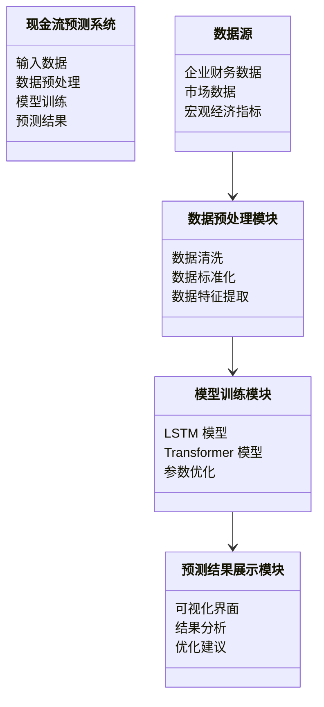

                 

# AI驱动的企业现金流预测与优化系统

## 关键词：现金流预测，人工智能，机器学习，深度学习，时间序列分析，系统架构

## 摘要：本篇文章深入探讨了如何利用人工智能技术进行企业现金流预测与优化。文章从现金流预测的背景和挑战入手，详细介绍了AI技术在现金流预测中的应用，分析了多种算法原理，包括时间序列分析、机器学习和深度学习模型，并通过系统架构设计展示了AI驱动的现金流预测系统的构建过程。最后，通过实际案例分析，验证了系统的有效性和实用性。

---

# 第1章: 企业现金流预测与优化的背景与挑战

## 1.1 企业现金流的重要性
### 1.1.1 现金流在企业运营中的核心地位
### 1.1.2 现金流预测与优化的必要性
### 1.1.3 现金流管理的常见挑战

## 1.2 AI技术在企业财务管理中的应用前景
### 1.2.1 AI技术对企业财务分析的革命性影响
### 1.2.2 现金流预测与优化的AI解决方案
### 1.2.3 企业现金流管理的智能化转型

## 1.3 本章小结
### 1.3.1 现金流预测的核心价值
### 1.3.2 AI驱动现金流优化的潜力
### 1.3.3 本书的研究目标与意义

---

# 第2章: 现金流预测的核心概念与AI技术的结合

## 2.1 现金流预测的定义与分类
### 2.1.1 现金流预测的基本定义
### 2.1.2 现金流预测的分类与应用场景
### 2.1.3 现金流预测的关键要素

## 2.2 AI技术在现金流预测中的应用
### 2.2.1 机器学习在时间序列预测中的优势
### 2.2.2 神经网络在现金流预测中的潜力
### 2.2.3 AI驱动现金流优化的实现路径

## 2.3 现金流预测与优化的系统架构
### 2.3.1 系统输入与输出的定义
### 2.3.2 系统功能模块的划分
### 2.3.3 系统的边界与外延

## 2.4 本章小结
### 2.4.1 现金流预测的核心概念
### 2.4.2 AI技术在现金流预测中的作用
### 2.4.3 系统架构的设计思路

---

# 第3章: 现金流预测的算法原理与实现

## 3.1 时间序列分析的基本原理
### 3.1.1 时间序列分析的定义与特点
### 3.1.2 常见的时间序列预测方法
### 3.1.3 时间序列分析的数学模型

## 3.2 基于机器学习的现金流预测算法
### 3.2.1 线性回归模型在现金流预测中的应用
### 3.2.2 支持向量机（SVM）在时间序列预测中的应用
### 3.2.3 随机森林在现金流预测中的应用

## 3.3 基于深度学习的现金流预测算法
### 3.3.1 长短期记忆网络（LSTM）的原理与实现
### 3.3.2 Transformer模型在时间序列预测中的应用
### 3.3.3 深度学习模型的优缺点分析

## 3.4 算法实现的代码示例
### 3.4.1 LSTM模型的Python代码实现
### 3.4.2 模型训练与优化的代码示例
### 3.4.3 模型评估与调优的代码实现

## 3.5 本章小结
### 3.5.1 现金流预测算法的多样性
### 3.5.2 深度学习模型的优势与挑战
### 3.5.3 算法实现的关键步骤

---

# 第4章: 现金流预测系统的架构设计

## 4.1 系统目标与功能需求
### 4.1.1 系统目标的定义
### 4.1.2 系统功能模块划分
### 4.1.3 系统的边界与外延

## 4.2 系统功能设计
### 4.2.1 领域模型设计（Mermaid 类图）

## 4.3 系统架构设计（Mermaid 架构图）

## 4.4 系统接口设计
### 4.4.1 API接口定义
### 4.4.2 接口交互流程
### 4.4.3 接口安全与权限管理

## 4.5 本章小结
### 4.5.1 系统架构设计的重要性
### 4.5.2 各模块之间的协同工作
### 4.5.3 系统架构的可扩展性

---

# 第5章: 项目实战——AI驱动现金流预测系统的实现

## 5.1 环境安装与配置
### 5.1.1 Python 环境的安装与配置
### 5.1.2 机器学习库的安装（如TensorFlow、Keras）
### 5.1.3 数据处理库的安装（如Pandas、NumPy）

## 5.2 数据收集与预处理
### 5.2.1 数据来源与获取方法
### 5.2.2 数据清洗与处理
### 5.2.3 数据特征工程

## 5.3 模型训练与优化
### 5.3.1 LSTM 模型的训练
### 5.3.2 Transformer 模型的训练
### 5.3.3 模型调优与优化

## 5.4 模型部署与应用
### 5.4.1 模型的保存与加载
### 5.4.2 模型的实时预测
### 5.4.3 系统的集成与应用

## 5.5 实际案例分析
### 5.5.1 案例背景介绍
### 5.5.2 数据分析与模型训练
### 5.5.3 模型预测与结果解读

## 5.6 本章小结
### 5.6.1 项目实战的实现步骤
### 5.6.2 模型训练与优化的关键点
### 5.6.3 系统应用的实际效果

---

# 第6章: 现金流预测系统的最佳实践与注意事项

## 6.1 最佳实践
### 6.1.1 数据质量的重要性
### 6.1.2 模型选择的策略
### 6.1.3 系统维护与更新

## 6.2 注意事项
### 6.2.1 数据隐私与安全
### 6.2.2 模型的局限性
### 6.2.3 系统的可解释性

## 6.3 本章小结
### 6.3.1 现金流预测系统的成功关键
### 6.3.2 AI技术的局限性与挑战
### 6.3.3 未来研究的方向

---

# 第7章: 结论与展望

## 7.1 本章总结
### 7.1.1 本文的主要内容
### 7.1.2 AI技术在现金流预测中的应用价值
### 7.1.3 系统设计与实现的总结

## 7.2 未来研究与展望
### 7.2.1 更先进的AI算法研究
### 7.2.2 系统的扩展与优化
### 7.2.3 与其他企业管理系统的集成

## 7.3 本章小结
### 7.3.1 本文的核心结论
### 7.3.2 未来研究的方向
### 7.3.3 对读者的启示与建议

---

# 作者：AI天才研究院/AI Genius Institute & 禅与计算机程序设计艺术 /Zen And The Art of Computer Programming

---

这一目录大纲涵盖了从理论到实践的各个方面，确保读者能够全面理解AI驱动的企业现金流预测与优化系统的构建与应用。每一章都详细具体，逻辑清晰，适合企业财务管理人员、数据科学家、IT架构师以及对现金流预测和优化感兴趣的技术人员阅读。

