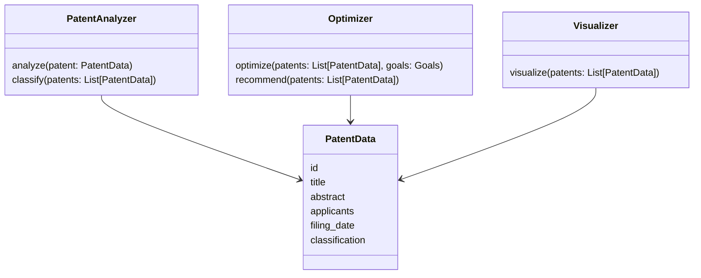

                 


# AI驱动的企业知识产权战略：专利组合优化与布局的智能化

> 关键词：AI, 知识产权, 专利组合, 企业战略, 智能化, 技术博客, 知识产权管理

> 摘要：随着人工智能技术的快速发展，企业知识产权管理正经历一场深刻的变革。本文深入探讨了AI如何驱动企业专利组合的优化与布局，通过智能化技术提升知识产权管理效率和价值。文章详细分析了专利组合优化的核心问题与挑战，揭示了AI在专利分析、分类、评估及布局中的应用，提出了基于机器学习的优化算法和系统架构设计，并通过实际案例展示了AI驱动的知识产权战略在企业中的应用价值。

---

# 第一部分: AI驱动的企业知识产权战略背景与概念

## 第1章: 企业知识产权战略概述

### 1.1 知识产权的基本概念
#### 1.1.1 知识产权的定义与范围
知识产权是指依法保护的智力成果和标记，包括专利权、商标权、版权、商业秘密等。其范围涵盖技术、文学、艺术、商业标识等多个领域，是企业创新成果的重要保护手段。

#### 1.1.2 企业知识产权管理的重要性
在现代商业竞争中，知识产权不仅是企业创新的核心成果，更是市场竞争的重要武器。有效的知识产权管理能够保护企业的创新成果，防止技术泄露，同时为企业创造经济价值。

#### 1.1.3 知识产权在企业竞争中的作用
知识产权是企业技术壁垒的重要组成部分，能够通过专利布局限制竞争对手的技术发展，同时为企业创造市场优势。

### 1.2 企业专利组合管理的核心要素
#### 1.2.1 专利组合的定义与特征
专利组合是指一组相互关联的专利资产，通常围绕企业的核心技术和业务领域构建。其特征包括技术相关性、战略一致性、资产多样性等。

#### 1.2.2 专利组合管理的关键环节
专利组合管理包括专利检索、分类、评估、布局、维护等多个环节。每个环节都需要结合企业的战略目标和技术创新方向进行动态调整。

#### 1.2.3 专利组合与企业战略的关系
专利组合是企业技术创新战略的重要组成部分，通过优化专利组合，企业能够更好地保护创新成果，提升市场竞争力。

## 第2章: AI在知识产权管理中的应用背景

### 2.1 AI技术对企业知识产权管理的变革
#### 2.1.1 AI技术的基本概念与发展趋势
人工智能（AI）是一种模拟人类智能的技术，包括机器学习、自然语言处理、计算机视觉等领域。AI技术的快速发展为企业知识产权管理提供了新的工具和方法。

#### 2.1.2 AI在知识产权领域的潜在价值
AI技术能够通过自动化处理和数据分析，提高知识产权管理的效率和精准度，降低管理成本。

#### 2.1.3 企业专利组合优化的智能化需求
随着专利数量的快速增长，传统的手动管理方式已难以应对复杂的技术和市场变化，企业需要通过智能化手段优化专利组合。

### 2.2 企业知识产权战略的智能化转型
#### 2.2.1 传统专利管理的局限性
传统专利管理方式效率低下，难以应对海量专利数据的分析和管理，且容易受到主观因素的影响。

#### 2.2.2 AI驱动的专利组合优化优势
AI技术能够通过大数据分析和机器学习算法，快速识别高价值专利，发现技术空白，制定最优的专利布局策略。

#### 2.2.3 企业知识产权管理的智能化转型路径
企业需要结合自身特点，选择合适的AI技术工具，逐步实现知识产权管理的智能化转型。

## 第3章: 专利组合优化的核心问题与挑战

### 3.1 专利组合优化的基本问题
#### 3.1.1 专利组合优化的目标与原则
专利组合优化的目标是最大化专利资产的价值，同时降低管理成本。其原则包括战略一致性、技术相关性、资产多样性等。

#### 3.1.2 专利组合优化的关键挑战
专利组合优化面临数据复杂性、计算复杂性和战略动态性等多重挑战，需要结合企业的实际需求和技术能力进行优化。

#### 3.1.3 专利组合与企业战略的关系
专利组合需要与企业的技术创新战略、市场竞争策略紧密结合，才能真正发挥其战略价值。

### 3.2 AI驱动专利组合优化的核心问题
#### 3.2.1 数据驱动的专利分析需求
AI驱动的专利组合优化需要大量高质量的专利数据，包括专利文本、技术领域、法律状态等。

#### 3.2.2 AI算法在专利组合优化中的应用
AI算法能够通过数据挖掘和机器学习，发现专利之间的关联性，识别高价值专利，优化专利布局。

#### 3.2.3 专利组合优化的智能化路径
智能化路径包括数据采集、分析、优化推荐、监控和调整等环节，形成闭环的优化流程。

---

# 第二部分: AI驱动的专利组合优化原理与方法

## 第4章: AI驱动专利组合优化的核心概念与原理

### 4.1 专利组合优化的AI技术原理
#### 4.1.1 文本挖掘与专利分析
文本挖掘技术能够从专利文本中提取关键词、主题和相关技术领域，帮助识别高价值专利和技术创新方向。

#### 4.1.2 机器学习在专利分类中的应用
机器学习算法能够根据专利的技术特征和法律状态，自动分类和聚类专利，形成高效的专利组合。

#### 4.1.3 知识图谱构建与专利关联分析
知识图谱技术能够将专利与技术领域、市场趋势、竞争对手等关联起来，形成完整的专利网络，帮助制定最优的专利布局策略。

### 4.2 专利组合优化的数学模型与算法
#### 4.2.1 专利组合优化的数学建模
专利组合优化可以建立基于线性规划或非线性规划的数学模型，考虑专利的价值、风险和战略目标。

#### 4.2.2 机器学习专利价值评估
基于机器学习的专利价值评估模型可以通过特征提取和模型训练，预测每项专利的市场价值和法律风险。

#### 4.2.3 优化算法在专利组合中的应用
优化算法如遗传算法、模拟退火算法等，可以用于解决专利组合优化中的多目标优化问题，寻找最优解。

## 第5章: 专利组合优化的AI算法实现

### 5.1 基于机器学习的专利分类算法
#### 5.1.1 算法原理
基于TF-IDF和聚类算法的专利分类流程如下：
1. 从专利文本中提取关键词和摘要；
2. 计算关键词的TF-IDF值；
3. 使用K-means算法进行聚类；
4. 根据聚类结果进行专利分类。

#### 5.1.2 代码实现
```python
from sklearn.feature_extraction.text import TfidfVectorizer
from sklearn.cluster import KMeans
import numpy as np

# 假设 patent_texts 是包含专利文本的列表
vectorizer = TfidfVectorizer()
tfidf = vectorizer.fit_transform(patent_texts)
tfidf_array = tfidf.toarray()

# 使用K-means进行聚类
kmeans = KMeans(n_clusters=5, random_state=42)
clusters = kmeans.fit_predict(tfidf_array)

# 输出每个聚类的关键词
for cluster_id in range(5):
    cluster_patents = [patent_texts[i] for i in range(len(clusters)) if clusters[i] == cluster_id]
    print(f"Cluster {cluster_id}: {', '.join(vectorizer.get_feature_names_out()[np.where(tfidf_array[0] == max(tfidf_array[0]))[0][0]])}")
```

#### 5.1.3 示例分析
通过TF-IDF和K-means算法，我们可以将专利分为不同的技术类别，帮助企业快速识别技术领域的分布和重点。

### 5.2 基于深度学习的专利价值评估
#### 5.2.1 深度学习模型原理
基于BERT模型的专利价值评估流程如下：
1. 将专利文本输入BERT模型，获取词向量；
2. 使用注意力机制提取关键特征；
3. 基于这些特征进行专利价值评分。

#### 5.2.2 代码实现
```python
from transformers import BertTokenizer, BertModel
import torch

# 加载预训练的BERT模型和分词器
tokenizer = BertTokenizer.from_pretrained('bert-base-uncased')
model = BertModel.from_pretrained('bert-base-uncased')

# 定义专利价值评估函数
def evaluate_patent_value(text):
    inputs = tokenizer(text, return_tensors='np', padding=True, truncation=True)
    with torch.no_grad():
        outputs = model(**inputs)
    # 假设使用最后一层的输出作为特征
    features = outputs.last_hidden_state[:, 0, :]
    # 使用简单的平均池化计算价值评分
    value_score = torch.mean(features, dim=1).item()
    return value_score

# 示例分析
patent_text = "一种基于深度学习的图像识别方法"
print(evaluate_patent_value(patent_text))  # 输出价值评分
```

#### 5.2.3 案例分析
通过BERT模型评估专利价值，可以帮助企业在专利申请和布局中做出更明智的决策。

## 第6章: 系统分析与架构设计

### 6.1 系统功能设计
#### 6.1.1 领域模型设计
领域模型包括专利数据采集、分析、优化推荐和可视化模块。

#### 6.1.2 领域模型Mermaid类图


### 6.2 系统架构设计
#### 6.2.1 系统架构Mermaid图
```mermaid
architecturalDiagram
    component AI-Patent-Optimizer {
        PatentDataCollector
        PatentAnalyzer
        Optimizer
        Visualizer
    }
    PatentDataCollector --> PatentAnalyzer
    PatentAnalyzer --> Optimizer
    Optimizer --> Visualizer
```

#### 6.2.2 接口设计
系统接口包括专利数据接口、优化算法接口和可视化接口。

#### 6.2.3 交互设计
系统交互流程包括数据采集、分析、优化和可视化。

### 6.3 项目实战

#### 6.3.1 项目背景
某科技公司希望通过AI技术优化其专利组合，提升技术壁垒和市场竞争力。

#### 6.3.2 环境安装
需要安装Python、TensorFlow、Keras、BERT等工具。

#### 6.3.3 核心代码实现
```python
import pandas as pd
from sklearn.metrics.pairwise import cosine_similarity

# 假设专利数据存储在DataFrame中
patent_df = pd.read_csv('patents.csv')

# 计算专利之间的相似性
similarity_matrix = cosine_similarity(patent_df['abstract'].values)

# 找出与特定专利最相关的专利
target_index = 10  # 目标专利的索引
similar_patents = similarity_matrix[target_index].argsort()[::-1]

# 输出前5个最相关的专利
for i in similar_patents[:5]:
    print(patent_df['title'][i])
```

#### 6.3.4 案例分析
通过AI技术优化专利组合，帮助企业识别高价值专利，发现技术空白，制定最优的专利布局策略。

---

# 第三部分: 最佳实践与小结

## 第7章: 最佳实践与小结

### 7.1 最佳实践
- 数据质量是专利组合优化的基础，需确保专利数据的准确性和完整性。
- 算法选择需结合企业的实际需求和数据特点，避免盲目使用复杂的模型。
- 可视化是专利组合优化的重要工具，能够帮助企业更好地理解和决策。

### 7.2 小结
AI技术正在深刻改变企业知识产权管理的方式，通过智能化的专利组合优化，企业能够更高效地保护创新成果，提升市场竞争力。

---

# 作者：AI天才研究院 & 禅与计算机程序设计艺术

