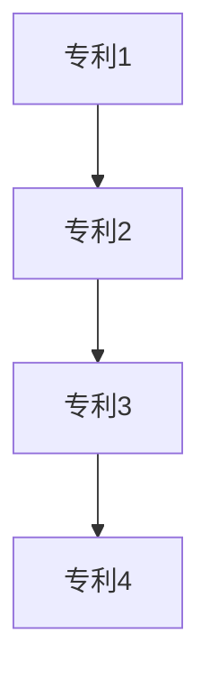
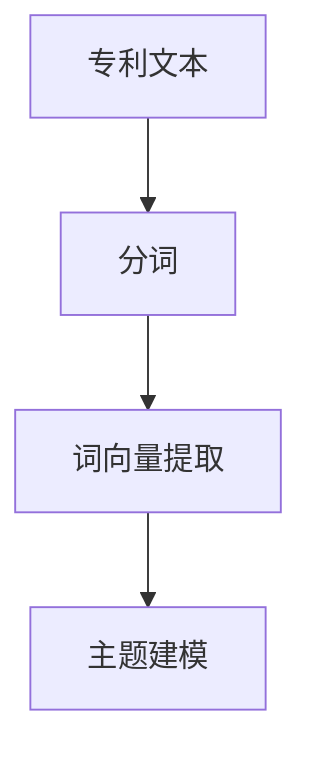
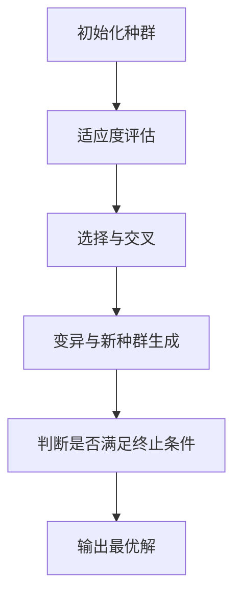
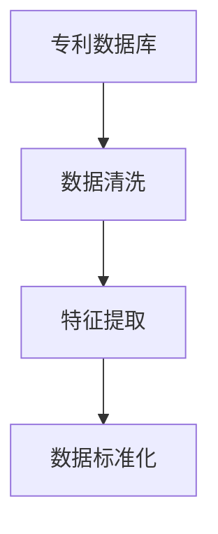
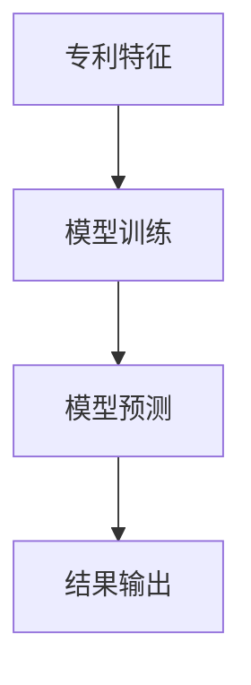
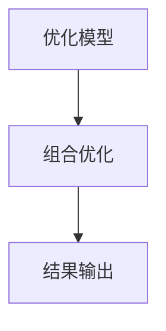
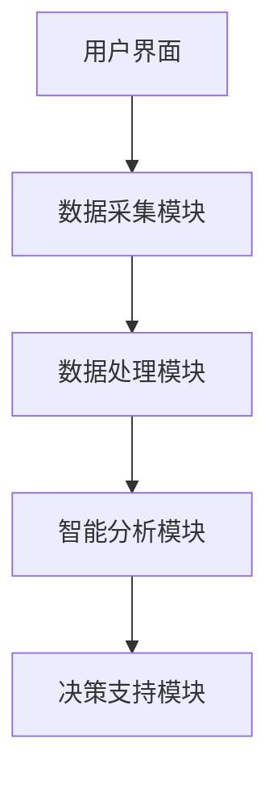
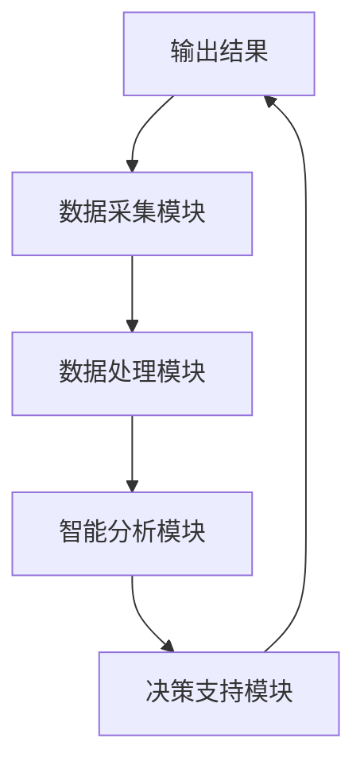

                 


---

# AI驱动的企业知识产权战略：专利组合分析与布局优化

> 关键词：AI技术，知识产权管理，专利组合分析，专利布局优化，企业战略，知识产权保护

> 摘要：随着人工智能技术的飞速发展，企业知识产权管理正在经历一场深刻的变革。本文将探讨AI技术如何驱动企业知识产权战略，重点分析专利组合分析的核心概念与方法，详细阐述基于AI的专利组合优化算法原理，并结合实际案例，展示如何通过AI技术实现专利布局的优化。文章最后总结了最佳实践与未来发展方向，为企业制定高效的知识产权战略提供参考。

---

## 第1章: AI驱动的企业知识产权战略概述

### 1.1 企业知识产权管理的背景与挑战

#### 1.1.1 知识产权在企业战略中的地位
知识产权是企业的核心资产之一，涵盖了专利、商标、版权等多个方面。在创新驱动的经济环境中，知识产权不仅能够保护企业的创新成果，还能为企业带来竞争优势和经济价值。然而，随着技术的快速发展，专利数量激增，专利管理的复杂性也在不断增加。

#### 1.1.2 传统专利管理的局限性
传统专利管理主要依赖人工操作，存在以下问题：
- **信息分散**：专利数据分散在不同数据库中，难以快速检索和分析。
- **效率低下**：人工分析专利数据耗时耗力，难以应对大量专利的管理需求。
- **缺乏深度分析**：传统方法难以对专利的技术关联性和市场价值进行深入分析。

#### 1.1.3 AI技术对企业知识产权管理的推动作用
AI技术的引入，为企业知识产权管理带来了革命性的变化：
- **高效数据处理**：AI能够快速处理海量专利数据，提高管理效率。
- **深度分析能力**：基于自然语言处理（NLP）和机器学习算法，AI可以对专利的技术内容、法律状态和市场价值进行深度分析。
- **智能化决策支持**：AI能够为企业制定专利布局策略提供数据支持和决策建议。

### 1.2 AI在知识产权管理中的应用前景

#### 1.2.1 AI技术的核心优势
AI技术的核心优势在于其强大的数据处理能力和智能化的分析能力：
- **数据处理能力**：AI能够快速处理和整合来自不同来源的专利数据。
- **智能化分析**：通过机器学习算法，AI可以发现数据中的隐含关系和趋势。
- **实时监控**：AI可以实时跟踪专利的法律状态和市场动态。

#### 1.2.2 企业专利组合分析的必要性
专利组合分析是企业知识产权管理的重要组成部分，其目的是通过分析专利的分布和技术关联性，优化专利布局，降低管理风险。

#### 1.2.3 专利布局优化的潜力与价值
专利布局优化可以帮助企业：
- **降低管理成本**：通过优化专利组合，减少无效专利的持有。
- **提升市场竞争力**：通过合理的专利布局，增强企业技术壁垒。
- **提高资产价值**：通过优化专利组合，提升企业知识产权的整体价值。

### 1.3 本章小结
本章介绍了AI技术在企业知识产权管理中的应用背景，分析了传统专利管理的局限性，并阐述了AI技术在专利组合分析和布局优化中的潜力与价值。

---

## 第2章: 专利组合分析的理论基础

### 2.1 专利组合分析的定义与特点

#### 2.1.1 专利组合的概念
专利组合是指一组具有技术关联性的专利集合，其目的是通过组合专利来覆盖特定的技术领域或市场。

#### 2.1.2 专利组合分析的核心要素
专利组合分析的核心要素包括：
- **技术关联性**：专利之间的技术关联性是专利组合分析的基础。
- **市场价值**：专利的市场价值是专利组合分析的重要指标。
- **法律状态**：专利的法律状态（如有效性、保护期限）是专利组合分析的重要考虑因素。

#### 2.1.3 专利组合分析的维度与指标
专利组合分析的维度包括：
- **技术维度**：专利的技术领域、技术层次等。
- **市场维度**：专利的市场应用前景、竞争对手分析等。
- **法律维度**：专利的法律状态、无效风险等。

### 2.2 专利组合分析的原理与方法

#### 2.2.1 专利组合分析的基本原理
专利组合分析的基本原理是通过分析专利的技术关联性和市场价值，优化专利组合的结构和分布。

#### 2.2.2 专利组合分析的步骤与流程
专利组合分析的步骤包括：
1. **数据收集**：收集相关的专利数据。
2. **数据预处理**：对专利数据进行清洗和标准化处理。
3. **技术分析**：对专利的技术内容进行分析，提取关键技术特征。
4. **价值评估**：评估专利的市场价值和法律风险。
5. **组合优化**：基于分析结果，优化专利组合的结构和分布。

#### 2.2.3 基于AI的专利组合分析方法
基于AI的专利组合分析方法包括：
- **基于NLP的文本分析**：通过自然语言处理技术，提取专利的技术特征。
- **基于机器学习的分类与聚类**：利用机器学习算法，对专利进行分类和聚类分析。
- **基于图论的网络分析**：通过构建专利网络，分析专利之间的技术关联性。

### 2.3 专利组合分析的数学模型

#### 2.3.1 基于概率论的专利价值评估模型
基于概率论的专利价值评估模型可以表示为：
$$ P(value) = P(effective) \times P(marketsuccess) $$
其中，$P(effective)$ 表示专利的有效性概率，$P(marketsuccess)$ 表示专利的市场成功概率。

#### 2.3.2 基于线性规划的专利组合优化模型
基于线性规划的专利组合优化模型可以表示为：
$$ \max \sum_{i=1}^{n} w_i x_i $$
其中，$w_i$ 是专利 $i$ 的权重，$x_i$ 是专利 $i$ 的选择变量（0或1）。

#### 2.3.3 基于图论的专利网络分析模型
基于图论的专利网络分析模型可以通过构建专利网络图（如图1所示）来分析专利之间的技术关联性。



### 2.4 本章小结
本章详细介绍了专利组合分析的理论基础，包括专利组合的定义、分析的维度与指标、分析的原理与方法，以及基于AI的专利组合分析方法。

---

## 第3章: 基于AI的专利组合分析算法原理

### 3.1 专利文本挖掘与特征提取

#### 3.1.1 基于NLP的专利文本处理
基于NLP的专利文本处理流程如图2所示：



#### 3.1.2 专利关键词提取与主题建模
专利关键词提取可以通过TF-IDF方法实现，主题建模可以通过LDA算法实现。

#### 3.1.3 专利分类与聚类算法
专利分类可以基于TF-IDF特征向量进行K-means聚类分析。

### 3.2 专利组合优化的数学模型

#### 3.2.1 基于线性规划的优化模型
基于线性规划的优化模型可以表示为：
$$ \max \sum_{i=1}^{n} v_i x_i $$
其中，$v_i$ 是专利 $i$ 的价值，$x_i$ 是专利 $i$ 的选择变量（0或1）。

#### 3.2.2 基于遗传算法的组合优化
基于遗传算法的组合优化过程如图3所示：



#### 3.2.3 基于深度学习的专利价值预测
基于深度学习的专利价值预测可以通过神经网络模型实现。

### 3.3 基于AI的专利组合分析流程

#### 3.3.1 数据收集与预处理
数据收集与预处理流程如图4所示：



#### 3.3.2 专利特征提取与建模
专利特征提取与建模流程如图5所示：



#### 3.3.3 专利组合优化与结果输出
专利组合优化与结果输出流程如图6所示：



### 3.4 本章小结
本章详细介绍了基于AI的专利组合分析算法原理，包括专利文本挖掘与特征提取、专利组合优化的数学模型，以及基于AI的专利组合分析流程。

---

## 第4章: 企业知识产权管理系统架构设计

### 4.1 系统功能模块设计

#### 4.1.1 数据采集模块
数据采集模块负责从专利数据库中获取专利数据。

#### 4.1.2 数据处理模块
数据处理模块负责对专利数据进行清洗和标准化处理。

#### 4.1.3 智能分析模块
智能分析模块负责对专利数据进行深度分析，生成专利组合分析报告。

#### 4.1.4 决策支持模块
决策支持模块负责基于分析结果，提供专利布局优化的决策支持。

### 4.2 系统架构设计

#### 4.2.1 系统架构图
系统架构图如图7所示：



#### 4.2.2 系统功能模块交互图
系统功能模块交互图如图8所示：



### 4.3 系统接口设计
系统接口设计包括数据接口、算法接口和用户接口。

### 4.4 本章小结
本章详细介绍了企业知识产权管理系统的架构设计，包括系统的功能模块设计、系统架构图、系统功能模块交互图，以及系统的接口设计。

---

## 第5章: 项目实战

### 5.1 环境安装与配置

#### 5.1.1 安装Python环境
安装Python 3.8或更高版本。

#### 5.1.2 安装必要的库
安装以下Python库：
- `numpy`
- `pandas`
- `scikit-learn`
- `gensim`
- `networkx`

#### 5.1.3 安装Mermaid图生成工具
安装`graphviz`以支持Mermaid图的生成。

### 5.2 系统核心实现源代码

#### 5.2.1 专利文本处理代码
```python
import gensim
from gensim.models import Word2Vec

# 假设patents是一个包含专利文本的列表
model = Word2Vec(patents, vector_size=100, window=5, min_count=1, workers=4)
```

#### 5.2.2 专利分类与聚类代码
```python
from sklearn.cluster import KMeans
from sklearn.feature_extraction.text import TfidfVectorizer

vectorizer = TfidfVectorizer()
tfidf_matrix = vectorizer.fit_transform(patents)
model = KMeans(n_clusters=5)
model.fit(tfidf_matrix)
```

#### 5.2.3 专利组合优化代码
```python
import numpy as np

# 假设values是一个包含专利价值的列表
values = np.array([1, 2, 3, 4, 5])
# 使用遗传算法进行组合优化
#（此处需要实现遗传算法的具体步骤）
```

### 5.3 实际案例分析与详细解读
以一个实际案例为例，展示如何利用AI技术进行专利组合分析和布局优化。

### 5.4 项目小结
总结项目实施的过程和成果，分析可能的改进空间。

---

## 第6章: 最佳实践与未来展望

### 6.1 最佳实践 tips

#### 6.1.1 数据质量管理
确保专利数据的准确性和完整性。

#### 6.1.2 模型优化与调参
根据实际需求，不断优化模型参数和算法。

#### 6.1.3 结果验证与反馈
定期验证分析结果，并根据反馈进行优化。

### 6.2 小结
总结本文的核心内容和主要观点。

### 6.3 注意事项
在实际应用中，需要注意专利数据的隐私保护和法律合规性。

### 6.4 拓展阅读
推荐相关领域的优秀书籍和论文。

---

## 作者：AI天才研究院/AI Genius Institute & 禅与计算机程序设计艺术/Zen And The Art of Computer Programming

---

这篇文章系统地介绍了AI驱动的企业知识产权战略，从理论基础到实际应用，结合了丰富的案例和详细的代码实现，为读者提供了全面的视角和实用的指导。

