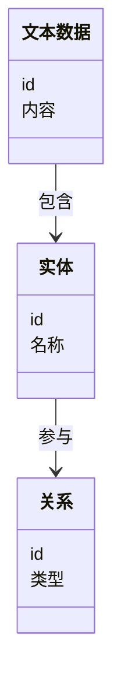
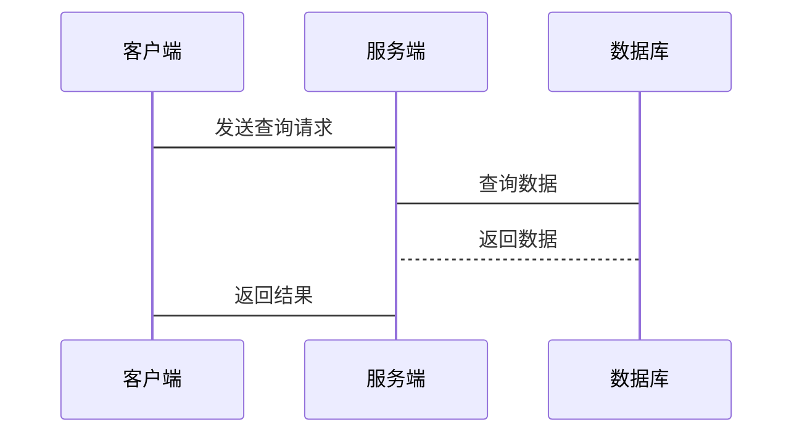

                 


```markdown
# AI驱动的企业知识挖掘：从非结构化数据中提取价值

---

## 关键词
- 企业知识挖掘
- 非结构化数据
- AI驱动
- 知识图谱
- 自然语言处理
- 数据价值提取
- 企业数据分析

---

## 摘要
在当今数据驱动的时代，企业面临着海量的非结构化数据，如文本、图像、音频和视频等。这些数据蕴含着巨大的价值，但传统的数据分析方法难以从中提取有用的信息。通过人工智能技术，特别是自然语言处理和知识图谱构建，企业可以有效地从非结构化数据中挖掘出隐藏的知识和洞察。本文将详细探讨AI驱动的企业知识挖掘的核心概念、关键技术、系统设计与架构，以及实际应用案例，帮助读者理解如何在企业中高效地从非结构化数据中提取价值。

---

# 第一部分: AI驱动的企业知识挖掘基础

# 第1章: 企业知识挖掘概述

## 1.1 非结构化数据的定义与特点

### 1.1.1 非结构化数据的类型
- 文本数据（如文档、邮件、报告）
- 图像数据（如图片、图形）
- 音频数据（如语音记录）
- 视频数据（如会议录像）

### 1.1.2 非结构化数据的特点
- 格式多样：文本、图像、音频、视频等多种形式
- 无固定结构：缺乏统一的组织和格式
- 信息丰富：包含大量潜在的价值信息
- 处理复杂：需要复杂的算法和工具进行分析

### 1.1.3 非结构化数据对企业价值的体现
- 提高决策效率：从大量非结构化数据中提取关键信息，辅助企业决策
- 优化业务流程：通过知识挖掘发现隐藏的模式和关联
- 增强竞争力：利用非结构化数据中的洞察提升企业创新能力

## 1.2 知识挖掘的基本概念

### 1.2.1 知识挖掘的定义
知识挖掘是从数据中提取隐含的知识和模式，以帮助人类或系统做出更明智的决策。

### 1.2.2 知识挖掘的核心目标
- 发现数据中的关联和模式
- 提供可操作的洞察和建议
- 支持决策制定和业务优化

### 1.2.3 知识挖掘与数据分析的区别
- 数据分析侧重于数据的统计分析和可视化
- 知识挖掘侧重于从数据中提取隐含的知识和模式

## 1.3 AI在知识挖掘中的作用

### 1.3.1 AI技术如何助力知识挖掘
- 提供高效的算法和工具，从非结构化数据中提取信息
- 通过自然语言处理技术理解文本内容
- 利用机器学习模型发现数据中的模式和关联

### 1.3.2 机器学习在知识挖掘中的应用
- 文本分类：将文本数据划分为不同的类别
- 实体识别：从文本中提取特定实体（如人名、地名）
- 关系抽取：发现文本中实体之间的关系

### 1.3.3 自然语言处理在知识挖掘中的重要性
- 自然语言处理技术能够理解人类语言，是知识挖掘的关键工具
- 通过分词、句法分析等技术，提取文本中的有用信息
- 在知识图谱构建中，自然语言处理技术起着核心作用

## 1.4 本章小结
本章介绍了非结构化数据的定义与特点，知识挖掘的基本概念，以及AI在知识挖掘中的作用。通过这些内容，读者可以理解知识挖掘的核心目标和AI在其中的重要性。

---

# 第二部分: 知识挖掘的关键技术

# 第2章: 自然语言处理基础

## 2.1 NLP的核心技术

### 2.1.1 分词技术
- 分词：将连续的文本分割成有意义的词语或短语
- 中文分词：如“中国”可以被分词为“中”和“国”，但实际应用中通常将其视为一个整体
- 英文分词：如“artificial intelligence”会被分词为“artificial”和“intelligence”

### 2.1.2 词性标注
- 词性标注：为每个词语标注其词性（如名词、动词、形容词等）
- 例如：“猫”是名词，“跑”是动词

### 2.1.3 句法分析
- 句法分析：分析句子的结构，确定词语之间的关系
- 例如：“猫追老鼠”中，“猫”是主语，“追”是动词，“老鼠”是宾语

## 2.2 常见的NLP算法

### 2.2.1 朴素贝叶斯分类
- 朴素贝叶斯分类是一种基于概率的分类算法
- 常用于文本分类任务，如垃圾邮件识别
- 公式：$$P(c|x) = \frac{P(x|c)P(c)}{P(x)}$$

### 2.2.2 支持向量机
- 支持向量机是一种监督学习算法，用于分类和回归
- 常用于文本分类任务
- 公式：$$w \cdot x + b = 0$$

### 2.2.3 长短期记忆网络（LSTM）
- LSTM是一种递归神经网络，能够处理长序列数据
- 常用于自然语言处理任务，如机器翻译和文本生成
- 公式：$$i_t = \sigma(W_i x_t + U_i h_{t-1} + b_i)$$

## 2.3 NLP在知识挖掘中的应用

### 2.3.1 文本分类
- 文本分类：将文本数据划分为不同的类别
- 应用：如情感分析、垃圾邮件识别

### 2.3.2 实体识别
- 实体识别：从文本中提取特定实体（如人名、地名、组织名）
- 应用：如信息抽取、知识图谱构建

### 2.3.3 关系抽取
- 关系抽取：发现文本中实体之间的关系
- 应用：如知识图谱构建、信息检索

## 2.4 本章小结
本章介绍了自然语言处理的核心技术，包括分词、词性标注和句法分析，并详细讲解了常见的NLP算法，如朴素贝叶斯、支持向量机和LSTM。同时，还探讨了NLP在知识挖掘中的应用，如文本分类、实体识别和关系抽取。

---

# 第3章: 知识图谱构建

## 3.1 知识图谱的定义与特点

### 3.1.1 知识图谱的定义
- 知识图谱：一种图形化的知识表示方法，由节点（实体）和边（关系）组成
- 例如：节点“猫”与节点“老鼠”之间有一条边“追”

### 3.1.2 知识图谱的特点
- 结构化：将非结构化数据转化为结构化的知识表示
- 可视化：通过图形化的方式展示实体之间的关系
- 可扩展性：支持大规模数据的存储和查询

### 3.1.3 知识图谱与数据库的区别
- 数据库：用于存储和管理数据，关注数据的结构和存储
- 知识图谱：用于表示知识，关注实体之间的关系和语义

## 3.2 知识图谱构建的步骤

### 3.2.1 数据预处理
- 数据清洗：去除噪声数据，如重复数据、无效数据
- 数据标注：对数据进行标注，如标注实体和关系

### 3.2.2 实体识别与链接
- 实体识别：从文本中提取实体
- 实体链接：将提取的实体与知识图谱中的节点进行匹配

### 3.2.3 关系抽取与构建
- 关系抽取：从文本中抽取实体之间的关系
- 关系构建：将抽取的关系添加到知识图谱中

## 3.3 知识图谱的存储与查询

### 3.3.1 知识图谱的存储方式
- 图数据库：如Neo4j，专为存储和查询图数据设计
- 关系型数据库：如MySQL，通过关系型表存储图数据

### 3.3.2 知识图谱的查询语言
- SPARQL：用于查询RDF格式的知识图谱
- Cypher：用于查询Neo4j中的图数据

### 3.3.3 知识图谱的可视化
- 使用工具如Gephi、Cytoscape等进行可视化
- 通过图表展示实体之间的关系

## 3.4 本章小结
本章介绍了知识图谱的定义与特点，并详细讲解了知识图谱的构建步骤，包括数据预处理、实体识别与链接、关系抽取与构建。最后，还探讨了知识图谱的存储与查询方式。

---

# 第三部分: 系统设计与架构

# 第4章: 知识挖掘系统设计与架构

## 4.1 问题场景介绍
- 某企业有大量的非结构化数据，如客户邮件、产品描述等
- 企业希望通过知识挖掘技术，从这些数据中提取有用的知识和洞察

## 4.2 系统功能设计

### 4.2.1 领域模型设计


### 4.2.2 系统架构设计


### 4.2.3 系统接口设计
- API接口：提供RESTful API，供其他系统调用
- 数据接口：与数据源（如数据库、文件系统）进行数据交互

### 4.2.4 系统交互设计


## 4.3 本章小结
本章从问题场景出发，设计了知识挖掘系统的功能模块、架构和接口。通过领域模型、系统架构图和交互图，展示了系统的整体设计和各部分的协作关系。

---

# 第四部分: 项目实战

# 第5章: 从非结构化数据中提取价值的实战

## 5.1 环境配置

### 5.1.1 安装必要的工具
- Python：3.8+
- Numpy：用于数值计算
- Pandas：用于数据处理
- Scikit-learn：用于机器学习
- NLTK：用于自然语言处理
- Neo4j：用于知识图谱存储

## 5.2 系统核心实现

### 5.2.1 文本预处理
```python
import nltk
from nltk.tokenize import word_tokenize
from nltk.corpus import stopwords

text = "This is a sample text. It contains some words."
tokens = word_tokenize(text)
stop_words = set(stopwords.words('english'))
filtered_tokens = [word for word in tokens if word not in stop_words]
print(filtered_tokens)
```

### 5.2.2 实体识别与关系抽取
```python
from spacy import load
nlp = load('en_core_web_sm')
doc = nlp("猫追老鼠")
for token in doc:
    print(token.text, token.pos_)
```

### 5.2.3 知识图谱构建
```python
from neo4j import GraphDatabase
driver = GraphDatabase.driver('bolt://localhost:7687', auth=('neo4j', 'password'))
session = driver.session()
session.run("CREATE (:Entity {name: '猫'})")
session.run("CREATE (:Entity {name: '老鼠'})")
session.run("MATCH (a:Entity {name: '猫'}), (b:Entity {name: '老鼠'}) CREATE (a)-[r:关系 {type: '追'}]->(b)")
driver.close()
```

## 5.3 项目小结
通过本章的实战，读者可以了解如何在实际项目中应用知识挖掘技术，从非结构化数据中提取价值。从环境配置到代码实现，再到案例分析，全面展示了知识挖掘的整个流程。

---

# 第五部分: 最佳实践与总结

# 第6章: 最佳实践与总结

## 6.1 小结
- 知识挖掘是企业从非结构化数据中提取价值的关键技术
- 自然语言处理和知识图谱构建是知识挖掘的核心技术
- AI技术的应用能够显著提高知识挖掘的效率和准确性

## 6.2 注意事项
- 数据隐私和安全问题需要高度重视
- 知识图谱的构建需要结合实际业务需求
- 模型的选择和调优需要根据具体场景进行

## 6.3 拓展阅读
- 《自然语言处理实战：基于Python的机器学习和深度学习》
- 《知识图谱：从概念到应用》
- 《图灵奖获得者论文精选》

---

# 作者：AI天才研究院/AI Genius Institute & 禅与计算机程序设计艺术 /Zen And The Art of Computer Programming
```

