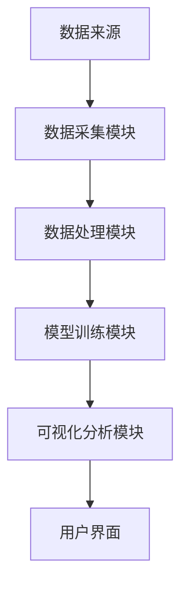

                 

# AI驱动的企业破产重组可行性分析

## 关键词
- 人工智能（AI）
- 破产重组
- 可行性分析
- 机器学习
- 数据分析

## 摘要
随着企业经营环境的复杂化，破产重组成为企业挽救和优化的重要手段。本文探讨了AI技术在企业破产重组可行性分析中的应用，结合实际案例，分析了AI驱动的模型构建、数据处理及系统架构设计，为企业提供智能化的决策支持。

---

## 第一部分: AI驱动的企业破产重组可行性分析概述

### 第1章: 企业破产重组的背景与挑战

#### 1.1 企业破产重组的基本概念
- **1.1.1 企业破产的定义与法律框架**
  - 破产是指企业无法偿还债务，依法宣告终止营业的状态。
  - 破产重组是在破产法框架下，通过调整债务结构和经营策略，使企业恢复生机的过程。
- **1.1.2 企业重组的常见模式**
  - 章程重组：调整公司章程，优化治理结构。
  - 资产重组：出售非核心资产，优化资产结构。
  - 债务重组：通过债务谈判，减轻债务负担。
- **1.1.3 破产重组中的核心问题**
  - 确定企业是否具备重整价值。
  - 设计合理的重组方案。
  - 预测重组后的经营恢复情况。

#### 1.2 AI技术在企业破产重组中的应用潜力
- **1.2.1 AI技术对企业破产重组的赋能**
  - 通过数据分析，识别企业财务风险。
  - 利用自然语言处理（NLP），分析企业内部文档和外部报告。
  - 运用机器学习模型，预测企业破产可能性。
- **1.2.2 AI在破产重组中的优势与局限性**
  - 优势：提高分析效率，提供数据支持，辅助决策。
  - 局限性：依赖数据质量，模型结果仅供参考，不能完全替代专业判断。
- **1.2.3 当前AI在企业破产重组中的应用现状**
  - AI技术已在破产预测中得到广泛应用，但在具体重组方案设计中仍需进一步探索。

---

### 第2章: AI驱动的可行性分析模型

#### 2.1 可行性分析的核心概念
- **2.1.1 可行性分析的基本框架**
  - 企业经营状况评估。
  - 重整价值判断。
  - 重组方案可行性分析。
- **2.1.2 破产重组可行性分析的关键指标**
  - 财务指标：资产负债率、流动比率、速动比率。
  - 经营指标：销售收入增长率、净利润率。
  - 偿债能力指标：息税折旧及摊销前利润（EBITDA）。
- **2.1.3 AI驱动的可行性分析模型的构建**
  - 数据采集：企业财务数据、市场数据、法律文件。
  - 数据清洗：处理缺失值、异常值。
  - 特征提取：提取关键财务指标和文本特征。

#### 2.2 AI驱动的可行性分析模型原理
- **2.2.1 数据采集与处理**
  - 数据源：企业财务报表、市场研究报告、新闻报道。
  - 数据清洗：使用Python的pandas库进行数据清洗。
- **2.2.2 模型训练与优化**
  - 使用逻辑回归、随机森林等机器学习算法。
  - 通过交叉验证优化模型参数。
- **2.2.3 模型评估与验证**
  - 使用ROC-AUC曲线评估模型性能。
  - 比较不同算法的准确率、召回率和F1分数。

---

### 第3章: 破产重组中的关键数据与信息

#### 3.1 破产重组中的关键数据
- **3.1.1 企业财务数据**
  - 资产负债表：资产、负债、所有者权益。
  - 利润表：收入、成本、利润。
- **3.1.2 企业经营数据**
  - 销售数据：销售额、增长率。
  - 供应链数据：供应商、库存。
- **3.1.3 企业信用数据**
  - 信用评分、违约历史。

#### 3.2 数据的预处理与特征提取
- **3.2.1 数据清洗与标准化**
  - 去除重复数据，填补缺失值。
  - 标准化处理：将数据缩放到统一范围。
- **3.2.2 特征选择与降维**
  - 使用主成分分析（PCA）进行降维。
  - 选择重要特征，如财务比率和市场指标。
- **3.2.3 数据标注与标注规则**
  - 标注企业是否破产，分为两类：破产（1）和非破产（0）。

---

### 第4章: AI算法在破产重组中的应用

#### 4.1 文本挖掘与自然语言处理
- **4.1.1 文本特征提取**
  - 使用TF-IDF提取关键词。
  - 分析企业新闻报道的关键词。
- **4.1.2 基于NLP的企业信息分析**
  - 分析企业公告的情感倾向。
  - 提取行业趋势信息。
- **4.1.3 文本挖掘在破产预测中的应用**
  - 通过文本特征预测企业破产风险。

#### 4.2 机器学习模型的构建与优化
- **4.2.1 常见机器学习算法介绍**
  - 逻辑回归、支持向量机（SVM）、随机森林。
- **4.2.2 破产预测模型的构建**
  - 使用训练数据训练模型。
  - 通过验证集调整模型参数。
- **4.2.3 模型调优与评估**
  - 使用网格搜索优化参数。
  - 评估模型的准确率、召回率和F1分数。

---

### 第5章: 基于AI的破产重组可行性分析系统架构

#### 5.1 系统架构设计
- **5.1.1 系统功能模块划分**
  - 数据采集模块：收集企业数据。
  - 数据处理模块：清洗和特征提取。
  - 模型训练模块：训练机器学习模型。
  - 可视化分析模块：展示分析结果。
- **5.1.2 系统数据流设计**
  - 数据从各来源流入系统，经过处理后供模型使用。
  - 模型输出结果，供用户分析。
- **5.1.3 系统架构图（Mermaid）**

#### 5.2 系统接口设计
- **5.2.1 数据接口设计**
  - RESTful API接口，用于数据传输。
- **5.2.2 用户接口设计**
  - �界面上的输入字段和按钮。
- **5.2.3 API接口设计**
  - 提供查询接口，返回分析结果。

---

### 第6章: 项目实战与案例分析

#### 6.1 环境搭建与数据准备
- **6.1.1 开发环境安装**
  - 安装Python、Jupyter Notebook、Scikit-learn。
- **6.1.2 数据集获取与处理**
  - 下载企业财务数据集。
  - 数据清洗和预处理。

#### 6.2 系统核心实现
- **6.2.1 文本挖掘模块实现**
  - 使用NLTK库进行文本处理。
- **6.2.2 机器学习模型实现**
  - 编写代码训练模型，评估性能。
- **6.2.3 系统功能模块实现**
  - 实现数据采集、处理、模型训练和结果展示。

---

## 第七章: 结论与展望

### 7.1 最佳实践 tips
- 数据质量是关键，确保数据准确性和完整性。
- 选择合适的算法，根据数据特点调整模型参数。
- 结合领域知识，解释模型结果。

### 7.2 小结
本文详细探讨了AI在企业破产重组中的应用，从数据处理到模型构建，再到系统设计，为企业提供了一套完整的解决方案。

### 7.3 注意事项
- AI模型不能完全替代专业判断，需结合实际情况使用。
- 数据隐私和合规性需严格遵守相关法律法规。

### 7.4 拓展阅读
建议读者进一步学习机器学习和NLP相关知识，深入研究企业破产预测的其他方法。

---

## 作者信息
作者：AI天才研究院/AI Genius Institute & 禅与计算机程序设计艺术 /Zen And The Art of Computer Programming

---

希望这篇文章能够为读者提供关于AI驱动的企业破产重组可行性分析的全面了解，从理论到实践，帮助企业在复杂多变的市场环境中做出明智的决策。

