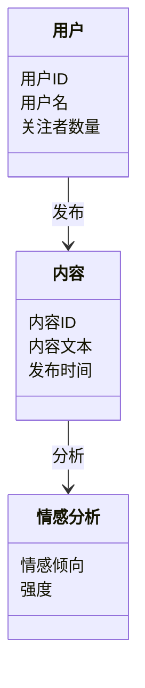
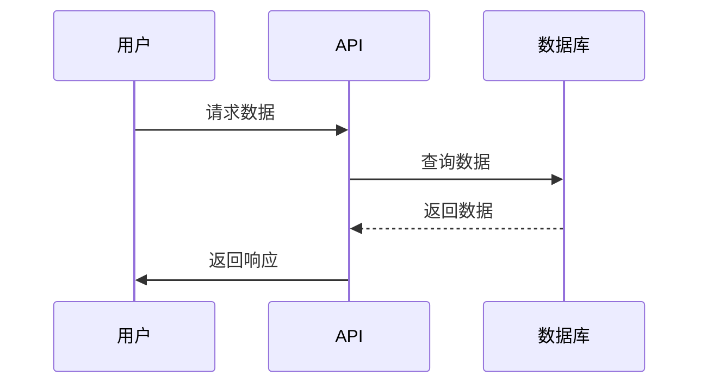

                 


# AI驱动的企业社交媒体管理：策略与实践

> 关键词：人工智能, 社会媒体管理, 自然语言处理, 机器学习, 数据分析

> 摘要：随着人工智能技术的快速发展，企业社交媒体管理正经历一场深刻的变革。本文将探讨AI在企业社交媒体管理中的应用策略，从背景、技术基础到系统架构、项目实战，全面解析AI如何提升企业社交媒体管理的效率与效果。

---

## 第一部分: AI驱动的企业社交媒体管理概述

### 第1章: AI与企业社交媒体管理的背景

#### 1.1 人工智能与社交媒体的结合
##### 1.1.1 人工智能的基本概念
人工智能（AI）是模拟人类智能的计算机系统，涵盖机器学习、自然语言处理和计算机视觉等领域。AI通过数据驱动的方式，帮助计算机理解和执行复杂的任务。

##### 1.1.2 社交媒体的演变与现状
社交媒体从最初的社交平台发展为信息传播和商业互动的主要渠道。企业利用社交媒体与客户互动、推广品牌，但面对海量数据和复杂场景，传统方法难以高效处理。

##### 1.1.3 AI在社交媒体管理中的作用
AI通过自然语言处理、机器学习等技术，帮助企业在社交媒体上实现自动化内容生成、情感分析和用户行为预测，提升管理效率和决策能力。

#### 1.2 企业社交媒体管理的核心问题
##### 1.2.1 传统社交媒体管理的挑战
传统方法依赖人工监控和分析，效率低下，难以处理大量数据和复杂场景。

##### 1.2.2 AI驱动管理的优势与潜力
AI能够快速处理大量数据，提供实时洞察，优化内容策略，增强用户体验。

##### 1.2.3 企业社交媒体管理的边界与外延
社交媒体管理不仅限于内容发布，还包括用户互动、声誉管理、趋势预测等多方面。

---

## 第二部分: AI驱动的社交媒体管理技术基础

### 第2章: 人工智能与自然语言处理

#### 2.1 人工智能的核心技术
##### 2.1.1 机器学习概述
机器学习是AI的核心，通过训练数据模型，使计算机能够从经验中学习并做出预测。

##### 2.1.2 深度学习与神经网络
深度学习利用多层神经网络，能够处理复杂的数据模式，如图像和文本。

##### 2.1.3 自然语言处理（NLP）的基本原理
NLP使计算机能够理解、生成和处理人类语言，是社交媒体分析的关键技术。

#### 2.2 自然语言处理在社交媒体中的应用
##### 2.2.1 文本分类与情感分析
通过机器学习模型，自动分类文本并识别情感倾向，帮助企业了解用户情绪。

##### 2.2.2 实体识别与关键词提取
NLP技术用于识别文本中的实体和关键词，提取有价值的信息。

##### 2.2.3 语义理解与对话生成
基于语义理解，AI能够生成自然的对话，提升用户体验。

#### 2.3 本章小结

### 第3章: 社交媒体数据分析与挖掘

#### 3.1 数据预处理与清洗
##### 3.1.1 数据收集与存储
通过API和爬虫收集社交媒体数据，存储在数据库中。

##### 3.1.2 数据清洗与标准化
去除噪声数据，统一数据格式，确保分析准确性。

##### 3.1.3 数据增强与特征提取
通过特征工程提取有用的信息，提升模型性能。

#### 3.2 数据分析与挖掘算法
##### 3.2.1 基于机器学习的分类算法
使用逻辑回归、支持向量机等算法进行分类任务，如情感分析。

##### 3.2.2 基于深度学习的文本生成模型
如GPT模型，用于生成自然语言文本，优化内容创作。

##### 3.2.3 时间序列分析与预测
通过ARIMA等模型预测社交媒体趋势，帮助制定策略。

#### 3.3 本章小结

---

## 第三部分: AI驱动的社交媒体管理策略与实践

### 第4章: 企业社交媒体管理策略

#### 4.1 数据驱动的管理策略
##### 4.1.1 数据收集与监控
实时监控社交媒体数据，识别关键指标如参与率和品牌声誉。

##### 4.1.2 数据分析与洞察提取
通过分析数据，提取用户行为和市场趋势的洞察，指导决策。

##### 4.1.3 数据驱动的决策优化
基于数据驱动的洞察，优化内容策略和用户互动方式。

#### 4.2 内容生成与优化策略
##### 4.2.1 基于AI的内容生成
利用NLP技术自动生成高质量内容，提升效率。

##### 4.2.2 内容个性化推荐
通过用户画像和行为分析，推荐个性化内容，提升用户参与度。

##### 4.2.3 内容效果评估
使用A/B测试和数据分析，评估内容的效果，持续优化。

#### 4.3 本章小结

---

## 第五部分: 项目实战

### 第5章: AI驱动的社交媒体管理系统开发

#### 5.1 系统功能设计
##### 5.1.1 领域模型设计
使用Mermaid类图展示系统模块及其关系。



##### 5.1.2 系统架构设计
使用Mermaid架构图展示系统的分层架构。


##### 5.1.3 系统接口设计
定义RESTful API接口，如获取用户数据和发布内容。

##### 5.1.4 系统交互设计
使用Mermaid序列图展示用户与系统之间的交互流程。



#### 5.2 核心代码实现
##### 5.2.1 环境安装
安装Python、TensorFlow、NLTK等库，配置开发环境。

##### 5.2.2 情感分析模型实现
使用Python代码训练和部署情感分析模型。

```python
import tensorflow as tf
from tensorflow.keras import layers

model = tf.keras.Sequential([
    layers.Embedding(10000, 16),
    layers.LSTM(32),
    layers.Dense(2, activation='softmax')
])

model.compile(optimizer='adam', loss='sparse_categorical_crossentropy', metrics=['accuracy'])
model.fit(X_train, y_train, epochs=5, batch_size=32)
```

##### 5.2.3 内容生成模块实现
使用预训练的生成模型，生成符合要求的社交媒体内容。

```python
from transformers import GPT2LMHeadModel, GPT2Tokenizer

tokenizer = GPT2Tokenizer.from_pretrained('gpt2')
model = GPT2LMHeadModel.from_pretrained('gpt2')

input = "Today's news: "
input_ids = tokenizer.encode(input, return_tensors='np')
output = model.generate(input_ids, max_length=50, temperature=0.7)
print(tokenizer.decode(output[0]))
```

#### 5.3 项目小结
详细分析项目中的问题、解决方案和优化建议，总结经验教训。

---

## 第六部分: 总结与展望

### 第6章: 总结与未来展望

#### 6.1 全书总结
回顾文章的核心内容，强调AI在企业社交媒体管理中的重要性。

#### 6.2 未来展望
讨论AI技术的发展趋势，如更智能的内容生成和用户行为预测，为企业社交媒体管理带来更大价值。

---

## 作者信息

作者：AI天才研究院/AI Genius Institute & 禅与计算机程序设计艺术 /Zen And The Art of Computer Programming

---

**注**：以上是一个详细的目录和内容概述，涵盖了从背景介绍到技术实现、项目实战的各个方面。实际撰写时，可以根据需要扩展每个部分的具体内容，添加更多细节、代码示例和图表。

