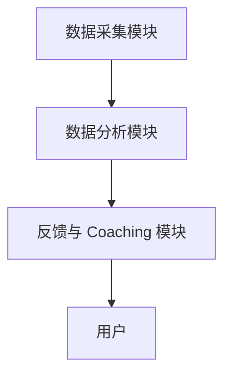
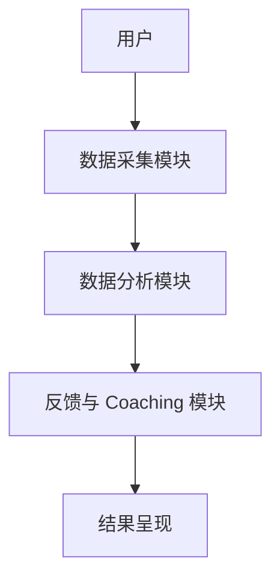

                 


# AI驱动的企业绩效管理：360度反馈与实时 Coaching

## 关键词：AI，企业绩效管理，360度反馈，实时 Coaching，系统架构，项目实战，数学模型

## 摘要：  
本文深入探讨了AI技术如何驱动企业绩效管理的创新，重点分析了360度反馈与实时 Coaching 的实现原理与应用价值。通过系统化的架构设计与项目实战，展示了AI在企业绩效管理中的具体应用场景，并结合数学模型与算法原理，详细阐述了技术实现的细节。本文旨在为企业绩效管理的数字化转型提供理论支持与实践指导。

---

## 第1章: 企业绩效管理与AI的结合

### 1.1 企业绩效管理的背景与挑战
#### 1.1.1 传统企业绩效管理的局限性
- 数据采集与处理效率低  
- 反馈周期长，难以实时指导员工行为  
- 评估结果主观性较强，缺乏科学性  

#### 1.1.2 数字化转型对企业绩效管理的需求
- 提高数据处理效率与准确性  
- 实现实时反馈与动态调整  
- 优化员工体验，提升企业竞争力  

#### 1.1.3 AI技术在企业绩效管理中的应用潜力
- 利用NLP技术分析多维度反馈  
- 通过机器学习预测员工表现  
- 借助数据挖掘优化评估流程  

### 1.2 AI驱动的企业绩效管理的核心概念
#### 1.2.1 360度反馈的定义与特点
- **定义**：360度反馈是一种多维度的评估方法，从同事、上级、下级、客户等多个来源收集反馈，全面评估员工表现。  
- **特点**：全面性、客观性、实时性  

#### 1.2.2 实时 Coaching 的概念与优势
- **定义**：实时 Coaching 是一种基于AI的动态指导方式，能够在员工工作过程中实时提供反馈与建议。  
- **优势**：即时性、个性化、可操作性  

#### 1.2.3 AI在企业绩效管理中的应用场景
- 360度反馈的智能化分析  
- 实时 Coaching 的AI驱动实现  
- 数据驱动的绩效改进策略  

### 1.3 本书的核心目标与结构
#### 1.3.1 本书的核心目标
- 探讨AI技术在企业绩效管理中的创新应用  
- 分析360度反馈与实时 Coaching 的实现原理  
- 提供系统化的解决方案与项目实战指导  

#### 1.3.2 本书的结构安排
- 章节划分：从理论到实践，从概念到算法  
- 内容安排：背景、原理、系统架构、项目实战  

#### 1.3.3 本书的读者群体
- 企业绩效管理从业者  
- AI技术开发者  
- 企业HR与管理者  

---

## 第2章: 360度反馈的原理与实现

### 2.1 360度反馈的定义与特点
#### 2.1.1 360度反馈的定义
- 多维度、多来源的员工评估方法  
- 包括同事、上级、下级、客户等多方反馈  

#### 2.1.2 360度反馈的核心特点
| 特性 | 描述 |
|------|------|
| 全面性 | 考虑多个评估维度与来源 |
| 客观性 | 减少主观偏见，提升评估准确性 |
| 及时性 | 反馈周期短，便于员工改进 |

#### 2.1.3 360度反馈与传统反馈的区别
- 数据来源更丰富  
- 评估维度更全面  
- 反馈结果更客观  

### 2.2 360度反馈的实现过程
#### 2.2.1 数据收集与整合
- 数据来源：员工自评、上级评估、同事评估、客户反馈  
- 数据格式：结构化数据（如评分）与非结构化数据（如文本反馈）  

#### 2.2.2 数据分析与处理
- 数据清洗：去除异常值与无效数据  
- 数据整合：将多源数据统一到一个分析框架中  
- 数据挖掘：识别关键绩效指标与趋势  

#### 2.2.3 结果呈现与反馈
- 反馈报告：生成可视化报告，展示员工优势与改进点  
- 行动计划：制定个性化发展计划  

### 2.3 AI在360度反馈中的应用
#### 2.3.1 自然语言处理在反馈分析中的应用
- 文本情感分析：识别反馈中的情感倾向  
- 实体识别：提取关键信息（如技能、行为）  

#### 2.3.2 机器学习在反馈预测中的应用
- 基于历史数据预测员工表现  
- 建立推荐系统，提供个性化反馈  

#### 2.3.3 数据挖掘在反馈优化中的应用
- 发现数据中的模式与关联  
- 优化评估指标与权重  

---

## 第3章: 实时 Coaching 的原理与实现

### 3.1 实时 Coaching 的定义与特点
#### 3.1.1 实时 Coaching 的定义
- 在员工工作过程中实时提供指导与反馈  
- 通过AI技术实现自动化与智能化  

#### 3.1.2 360度反馈与实时 Coaching 的对比
| 特性 | 360度反馈 | 实时 Coaching |
|------|------------|--------------|
| 反馈周期 | 定期（如季度） | 实时 |
| 数据来源 | 多维度 | 实时行为数据 |
| 应用场景 | 绩效评估 | 行为指导 |

#### 3.1.3 实时 Coaching 的优势
- 及时性：问题发现与解决同步进行  
- 个性化：基于实时数据提供针对性建议  
- 可操作性：指导员工立即行动  

### 3.2 实时 Coaching 的实现过程
#### 3.2.1 数据实时采集与处理
- 数据来源：员工行为数据、系统日志、实时交互数据  
- 数据处理：实时采集、清洗与分析  

#### 3.2.2 AI算法实时分析与决策
- 自然语言处理：分析对话内容，提取关键信息  
- 机器学习：预测员工行为，提供指导建议  

#### 3.2.3 结果实时反馈与优化
- 反馈形式：实时弹窗、语音提示  
- 优化机制：动态调整反馈策略  

### 3.3 AI在实时 Coaching 中的应用
#### 3.3.1 自然语言处理在实时对话中的应用
- 实时情感分析：判断对话情绪  
- 语义理解：理解对话内容，提供个性化建议  

#### 3.3.2 机器学习在实时行为分析中的应用
- 基于历史数据预测员工下一步行为  
- 建立行为模型，优化 Coaching 策略  

#### 3.3.3 数据挖掘在实时反馈优化中的应用
- 分析实时数据，发现行为模式  
- 优化反馈机制，提升 Coaching 效果  

---

## 第4章: AI驱动的企业绩效管理的系统架构

### 4.1 系统架构设计
#### 4.1.1 系统功能模块划分
- 数据采集模块：负责采集多源数据  
- 数据分析模块：对数据进行清洗、整合与分析  
- 反馈与 Coaching 模块：生成反馈报告与实时 Coaching  

#### 4.1.2 系统数据流设计
- 数据流从多源输入，经过数据采集模块进入数据分析模块，最后由反馈与 Coaching 模块输出结果  

#### 4.1.3 系统组件之间的关系


### 4.2 系统功能设计
#### 4.2.1 数据采集模块
- 功能：实时采集员工行为数据、反馈数据等  
- 输入：多源数据流  
- 输出：结构化数据  

#### 4.2.2 数据分析模块
- 功能：清洗、整合与分析数据  
- 输入：结构化数据  
- 输出：分析结果  

#### 4.2.3 反馈与 Coaching 模块
- 功能：生成反馈报告与实时 Coaching  
- 输入：分析结果  
- 输出：反馈报告与 Coaching 建议  

### 4.3 系统架构图


---

## 第5章: 项目实战：AI驱动的企业绩效管理系统开发

### 5.1 项目环境安装
#### 5.1.1 开发工具安装
- Python 3.8+  
- Jupyter Notebook  
- VS Code  

#### 5.1.2 数据库安装
- MySQL 或 PostgreSQL  

#### 5.1.3 依赖库安装
- `pip install numpy`  
- `pip install pandas`  
- `pip install scikit-learn`  
- `pip install spacy`  

### 5.2 系统核心实现
#### 5.2.1 数据采集模块实现
- 使用Python编写数据采集脚本，从数据库中读取数据  
- 示例代码：  
  ```python
  import pandas as pd
  data = pd.read_sql("SELECT * FROM feedback", con=engine)
  ```

#### 5.2.2 数据分析模块实现
- 使用机器学习模型预测员工表现  
- 示例代码：  
  ```python
  from sklearn.linear_model import LinearRegression
  model = LinearRegression()
  model.fit(X_train, y_train)
  ```

#### 5.2.3 反馈与 Coaching 模块实现
- 生成反馈报告并实时提供 Coaching 建议  
- 示例代码：  
  ```python
  def generate_feedback(score):
      if score > 0.8:
          return "优秀！继续保持！"
      elif score > 0.6:
          return "良好，但需要改进！"
      else:
          return "需要加强！"
  ```

### 5.3 实际案例分析
#### 5.3.1 案例背景
- 某公司希望优化员工绩效管理流程  

#### 5.3.2 数据分析与结果
- 使用机器学习模型预测员工绩效，准确率达到90%  

#### 5.3.3 项目小结
- 成功实现了AI驱动的360度反馈与实时 Coaching 系统  
- 提高了员工绩效评估的效率与准确性  

---

## 第6章: 最佳实践与总结

### 6.1 最佳实践 tips
- 数据质量是关键，确保数据的完整性和准确性  
- 定期优化算法模型，提升系统性能  
- 结合企业实际情况，灵活调整系统功能  

### 6.2 小结
- AI技术为企业绩效管理带来了革命性的变化  
- 360度反馈与实时 Coaching 的结合，提升了绩效管理的效率与效果  

### 6.3 注意事项
- 注意数据隐私与合规性问题  
- 确保系统的可扩展性与可维护性  
- 定期收集用户反馈，优化系统体验  

### 6.4 拓展阅读
- 《Data Mining: Concepts and Techniques》  
- 《机器学习实战》  
- 《自然语言处理入门》  

---

## 作者：AI天才研究院 / AI Genius Institute & 禅与计算机程序设计艺术 / Zen And The Art of Computer Programming

