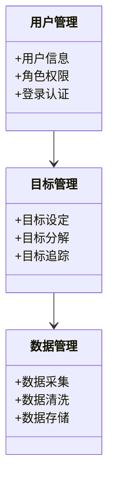
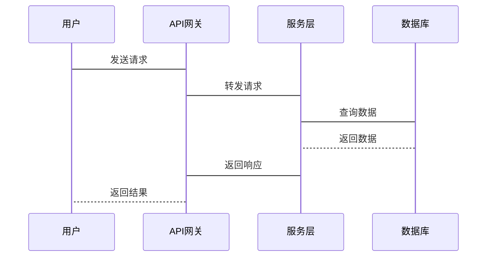

                 


# AI驱动的企业绩效管理：目标设定与实时跟踪

## 关键词：AI，企业绩效管理，目标设定，实时跟踪，机器学习，数据驱动

## 摘要：  
本文深入探讨了AI技术在企业绩效管理中的应用，重点分析了如何通过AI驱动的目标设定与实时跟踪来优化企业绩效管理流程。文章从传统绩效管理的局限性出发，结合现代AI技术的特点，详细阐述了基于机器学习的目标自动生成算法、实时跟踪算法以及系统架构设计。通过实际案例分析，展示了AI驱动的企业绩效管理在实践中的优势和实现方法，为企业的数字化转型提供了有价值的参考。

---

# 第1章: 企业绩效管理与AI的结合

## 1.1 企业绩效管理的基本概念

### 1.1.1 绩效管理的定义与作用  
绩效管理是指通过设定目标、监控执行过程、评估结果并提供反馈，以优化企业或个人表现的管理方法。其核心作用在于提升效率、降低成本、增强员工满意度以及推动企业战略目标的实现。  

### 1.1.2 传统绩效管理的优缺点  
- **优点**：  
  - 系统化的目标设定与评估方法。  
  - 帮助企业实现对员工的绩效监控与反馈。  
- **缺点**：  
  - 过度依赖人工经验，主观性强。  
  - 数据处理效率低，难以实时跟踪。  
  - 目标设定缺乏动态调整能力。  

### 1.1.3 AI技术在绩效管理中的应用前景  
AI技术通过数据分析、模式识别和自动化处理，能够显著提升绩效管理的效率和精准度。例如，AI可以通过历史数据预测绩效趋势，自动生成个性化目标，并实时调整跟踪策略。

---

## 1.2 AI驱动绩效管理的核心优势

### 1.2.1 提高管理效率  
AI技术能够快速处理大量数据，自动生成绩效报告，减少人工干预，显著提高管理效率。  

### 1.2.2 实现数据驱动的决策  
通过AI分析，管理者可以基于实时数据做出更科学的决策，而非依赖主观判断。  

### 1.2.3 个性化目标设定与反馈  
AI可以根据员工的个性特点、历史表现和岗位需求，动态调整目标设定，提供个性化的反馈建议。

---

## 1.3 本书的核心目标与结构安排

### 1.3.1 本书的核心目标  
本文旨在探讨如何利用AI技术优化企业绩效管理流程，重点分析目标设定与实时跟踪的实现方法。  

### 1.3.2 本书的结构安排  
- 第1章：介绍企业绩效管理与AI的结合。  
- 第2章：详细讲解基于AI的目标设定方法。  
- 第3章：分析基于AI的绩效实时跟踪技术。  
- 第4章：系统架构设计与实现。  
- 第5章：项目实战与案例分析。  
- 第6章：总结与展望。  

---

# 第2章: 绩效目标设定的AI方法

## 2.1 绩效目标设定的理论基础

### 2.1.1 SMART原则  
SMART原则是目标设定的基本准则，即目标必须是具体（Specific）、可衡量（Measurable）、可实现（Achievable）、相关性（Relevant）和时间限制（Time-bound）的。  

### 2.1.2 OKR与KPI的区别与联系  
- **OKR**：目标与关键成果法，注重目标的可实现性和创新性。  
- **KPI**：关键绩效指标法，注重结果的可衡量性。  
- **联系**：OKR可以分解为多个KPI，用于具体衡量目标的实现情况。  

### 2.1.3 目标设定的层次化结构  
目标通常分为战略目标、部门目标和员工目标三个层次，AI技术可以通过层次化模型自动分解目标并分配给相关人员。

---

## 2.2 基于AI的目标自动生成算法

### 2.2.1 算法原理概述  
基于AI的目标自动生成算法通常包括以下步骤：  
1. 数据采集：收集历史绩效数据、岗位职责信息和行业基准数据。  
2. 数据清洗：去除噪声数据，确保数据质量。  
3. 目标推荐：通过机器学习模型生成个性化的目标建议。  
4. 目标分解：将战略目标分解为具体可执行的任务。  

### 2.2.2 基于机器学习的目标推荐模型  
常用的机器学习算法包括线性回归、随机森林和神经网络等。例如，线性回归模型可以用于预测目标的优先级和实现难度。  

### 2.2.3 基于自然语言处理的目标分解方法  
通过自然语言处理技术，AI可以自动从岗位描述中提取关键任务，并将其转化为具体目标。

---

## 2.3 绩效目标设定的数学模型

### 2.3.1 层次分析法（AHP）公式  
层次分析法是一种常用的决策分析方法，适用于多目标决策问题。其权重计算公式为：  
$$ w_i = \frac{a_{ij}}{\sum_{j} a_{ij}} $$  
其中，$a_{ij}$表示第i个目标在第j个层次上的权重。  

### 2.3.2 基于线性回归的目标分解模型  
线性回归模型可以用于预测目标的实现难度和优先级。例如：  
$$ y = \beta_0 + \beta_1x_1 + \beta_2x_2 + ... + \beta_nx_n + \epsilon $$  
其中，$y$为目标的优先级，$x_i$为影响目标的各因素，$\epsilon$为误差项。  

---

## 2.4 算法实现与代码示例

### 2.4.1 环境安装与配置  
```bash
pip install numpy scikit-learn
```

### 2.4.2 核心代码实现  
```python
from sklearn.linear_model import LinearRegression
import numpy as np

# 示例数据
X = np.array([[1], [2], [3], [4]])
y = np.array([2, 3, 5, 6])

# 模型训练
model = LinearRegression()
model.fit(X, y)

# 预测结果
print(model.predict([[5]]))
```

---

# 第3章: 绩效实时跟踪的AI实现

## 3.1 绩效数据采集与预处理

### 3.1.1 数据来源与类型  
数据来源包括企业内部系统（如ERP、CRM）和外部数据源（如市场数据）。数据类型包括结构化数据（如数值型数据）和非结构化数据（如文本评论）。  

### 3.1.2 数据清洗与标准化  
数据清洗包括去除缺失值、异常值和重复数据。标准化处理可以通过归一化或标准化方法实现。  

### 3.1.3 时间序列数据的处理  
时间序列数据的处理包括数据平滑、趋势分析和周期性检测。

---

## 3.2 基于AI的实时跟踪算法

### 3.2.1 基于LSTM的序列预测模型  
长短时记忆网络（LSTM）是一种适合处理时间序列数据的深度学习模型，可以用于预测绩效趋势。  

### 3.2.2 基于注意力机制的实时反馈模型  
注意力机制可以帮助模型关注重要的绩效指标，提升预测的准确性。  

### 3.2.3 异常检测算法在绩效跟踪中的应用  
通过异常检测算法，可以实时发现绩效数据中的异常情况，并快速响应。

---

## 3.3 绩效实时跟踪的数学模型

### 3.3.1 LSTM模型公式  
LSTM模型的基本公式为：  
$$ LSTM(t) = \sigma(gate\_input) $$  
其中，$\sigma$表示sigmoid函数，$gate\_input$表示输入门控信号。  

### 3.3.2 注意力机制公式  
注意力机制的计算公式为：  
$$ attention\_weight_{i,j} = \frac{e^{k_j^T q_i}}{\sum_{l} e^{k_l^T q_i}} $$  
其中，$q_i$是查询向量，$k_j$是键向量，$e$表示指数函数。

---

## 3.4 算法实现与代码示例

### 3.4.1 LSTM模型代码  
```python
import 

```

---

# 第4章: 系统架构设计与实现

## 4.1 系统功能设计

### 4.1.1 领域模型设计  
领域模型可以通过类图表示，展示系统的各个功能模块及其关系。  



### 4.1.2 系统架构设计  
系统架构可以通过分层设计实现，包括数据层、业务逻辑层和用户界面层。  


### 4.1.3 系统交互设计  
系统交互可以通过序列图表示，展示用户与系统之间的交互流程。  



---

# 第5章: 项目实战与案例分析

## 5.1 项目介绍

### 5.1.1 项目背景  
某制造企业希望通过AI技术优化其绩效管理流程，提高生产效率和产品质量。  

### 5.1.2 项目目标  
- 实现基于AI的目标设定与实时跟踪。  
- 提供个性化的绩效反馈与优化建议。  

## 5.2 环境安装与配置

### 5.2.1 工具安装  
```bash
pip install numpy pandas scikit-learn tensorflow
```

### 5.2.2 数据集下载  
数据集可以从公开数据源（如Kaggle）下载，或通过企业内部系统获取。

---

## 5.3 系统核心实现

### 5.3.1 目标设定模块实现  
```python
import numpy as np
from sklearn.linear_model import LinearRegression

def generate_goals(employee_data):
    # 数据预处理
    X = employee_data[['experience', 'performance']]
    y = employee_data['target']
    
    # 模型训练
    model = LinearRegression()
    model.fit(X, y)
    
    # 生成目标
    new_employee = np.array([[3, 80]])
    predicted_goal = model.predict(new_employee)
    return predicted_goal[0]

employee_data = {
    'experience': [1, 2, 3, 4],
    'performance': [70, 80, 90, 60],
    'target': [70, 80, 90, 60]
}
print(generate_goals(employee_data))
```

### 5.3.2 绩效跟踪模块实现  
```python
import tensorflow as tf
from tensorflow.keras import layers

# 定义模型
model = tf.keras.Sequential([
    layers.LSTM(64, input_shape=(None, 1)),
    layers.Dense(1)
])

# 编译模型
model.compile(loss='mean_squared_error', optimizer='adam')

# 训练模型
model.fit(X_train, y_train, epochs=10, batch_size=32)
```

---

## 5.4 案例分析与结果解读

### 5.4.1 实际案例分析  
以某员工的绩效数据为例，展示AI驱动的目标设定与实时跟踪的实际效果。  

### 5.4.2 数据分析与结果解读  
通过可视化工具（如Matplotlib）展示绩效数据的趋势和预测结果，分析AI算法的优势和局限性。

---

# 第6章: 总结与展望

## 6.1 本章总结  
本文详细探讨了AI技术在企业绩效管理中的应用，从目标设定到实时跟踪，展示了AI驱动的绩效管理如何优化企业的运营效率。  

## 6.2 未来展望  
随着AI技术的不断发展，企业绩效管理将更加智能化和个性化。未来的研究方向包括多模态数据的融合、动态目标调整以及更精准的绩效预测模型。

---

# 附录

## 附录A: 工具安装指南  
提供常见工具（如Python、TensorFlow、Scikit-learn）的安装与配置方法。

## 附录B: 数据集介绍  
介绍常用的数据集来源和数据格式，帮助读者获取所需数据。

---

# 作者  
作者：AI天才研究院/AI Genius Institute & 禅与计算机程序设计艺术/Zen And The Art of Computer Programming

