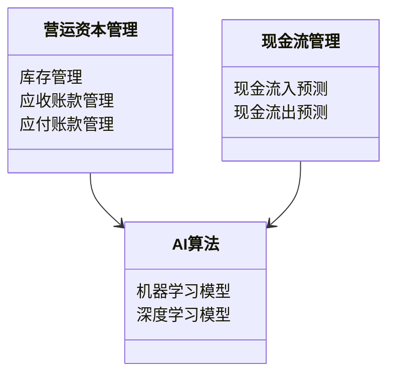

                 


# AI驱动的企业营运资本优化与现金流管理

## 关键词：
- AI驱动
- 企业营运资本
- 现金流管理
- 机器学习
- 数据分析
- 财务优化
- 技术应用

## 摘要：
在现代企业运营中，营运资本管理和现金流优化是确保企业财务健康和高效运作的关键。随着人工智能（AI）技术的快速发展，企业开始利用AI技术来优化营运资本和现金流管理。本文将深入探讨AI在企业财务优化中的应用，分析其核心概念、算法原理、系统架构，并通过实际案例展示如何利用AI技术提升企业的财务效率和决策能力。

## 正文：

### 第一部分：背景与概述

#### 第1章：AI驱动的必要性

##### 1.1 企业财务优化的背景

###### 1.1.1 营运资本管理的重要性
营运资本是指企业在日常运营中所需的流动资金，包括库存、应收账款和应付账款等。有效的营运资本管理可以帮助企业减少资金占用，提高资金周转率，从而提升企业的整体财务健康状况。

###### 1.1.2 现金流管理的核心地位
现金流是企业的生命线，直接影响企业的生存和发展。通过优化现金流管理，企业可以更好地规划资金使用，降低财务风险，确保业务的持续性。

###### 1.1.3 AI技术在企业财务中的应用趋势
随着大数据和AI技术的快速发展，越来越多的企业开始利用AI技术来优化财务管理和决策。AI可以通过分析历史数据和市场趋势，提供更准确的预测和优化建议。

##### 1.2 企业财务现状与挑战

###### 1.2.1 传统财务管理模式的局限性
传统财务管理模式依赖于人工操作和经验判断，存在效率低、准确性差、反应速度慢等问题。特别是在数据量大、变化快的现代商业环境中，传统方法难以满足企业的需求。

###### 1.2.2 数据分析在财务优化中的作用
通过对大量数据的分析，企业可以发现隐藏的财务问题，优化资源配置，提高决策的准确性。数据分析是AI驱动财务优化的基础。

###### 1.2.3 现金流预测的难点与解决方案
现金流预测的准确性直接影响企业的财务规划。传统的预测方法往往依赖于历史数据和经验判断，而AI可以通过机器学习算法，利用更多的数据和复杂的模型，提供更准确的预测。

##### 1.3 AI驱动的财务变革

###### 1.3.1 AI技术如何提升财务效率
AI可以通过自动化处理财务数据、自动生成财务报表、实时监控财务状况等方式，显著提高财务工作的效率和准确性。

###### 1.3.2 数据驱动的决策优势
通过AI分析大量数据，企业可以做出更科学、更精准的财务决策，从而提高企业的整体竞争力。

###### 1.3.3 营运资本优化的AI路径
AI可以通过预测模型、优化算法等技术，帮助企业优化库存管理、应收账款管理和应付账款管理，降低营运资本的占用。

##### 1.4 本书的目标与意义

###### 1.4.1 目标设定
本书旨在通过理论与实践相结合的方式，介绍AI技术在企业营运资本优化和现金流管理中的应用，帮助企业利用AI技术提升财务管理水平。

###### 1.4.2 实际应用价值
通过本书的学习，读者可以掌握AI驱动的财务优化方法，为企业创造实际的经济效益。

###### 1.4.3 对企业财务转型的指导意义
本书将为企业财务转型提供理论支持和实践指导，帮助企业更好地适应数字化时代的财务管理模式。

### 第二部分：核心概念与联系

#### 第2章：AI驱动的营运资本优化

##### 2.1 核心概念解析

###### 2.1.1 营运资本的基本概念
营运资本是指企业在日常经营中所需的流动资金，主要包括库存、应收账款和应付账款等。有效的营运资本管理可以帮助企业降低资金占用，提高资金周转率。

###### 2.1.2 现金流管理的关键要素
现金流管理包括预测、监控和优化现金流的流动。通过优化现金流管理，企业可以更好地应对财务风险，确保业务的持续性。

###### 2.1.3 AI在优化中的角色
AI通过分析历史数据和市场趋势，提供预测和优化建议，帮助企业在营运资本管理和现金流管理中做出更科学的决策。

##### 2.2 技术特征对比

###### 2.2.1 传统方法与AI方法的对比

| 特征                | 传统方法                            | AI方法                              |
|---------------------|------------------------------------|------------------------------------|
| 数据来源            | 有限的历史数据                      | 大量的结构化和非结构化数据         |
| 分析速度            | 较慢                               | 实时或近实时                       |
| 准确性              | 可能较低                            | 更高                                |
| 自动化程度          | 较低                               | 高                                  |
| 可扩展性            | 较差                               | 优                                  |

###### 2.2.2 实体关系图

```mermaid
erd
    title 实体关系图
    Inventory
   _Accounts Receivable
   _Accounts Payable
    Cash Flow
    AI算法
    财务优化建议
```

### 第三部分：算法原理

#### 第3章：现金流预测与营运资本优化的AI算法

##### 3.1 现金流预测的算法原理

###### 3.1.1 机器学习模型
常用机器学习模型包括线性回归、随机森林和梯度提升树等。

###### 3.1.2 深度学习模型
深度学习模型如LSTM（长短期记忆网络）在时间序列预测中表现优异。

###### 3.1.3 算法实现

```python
import numpy as np
from sklearn.linear_model import LinearRegression

# 示例数据
X = np.array([[1], [2], [3], [4], [5]])
y = np.array([2, 4, 5, 4, 6])

# 训练模型
model = LinearRegression()
model.fit(X, y)

# 预测
print(model.predict([[6]]))  # 输出：[[7]]
```

##### 3.2 营运资本优化的算法原理

###### 3.2.1 优化目标
最小化营运资本占用，最大化资金周转率。

###### 3.2.2 约束条件
库存不能为负，应收账款和应付账款的周期限制等。

###### 3.2.3 数学模型

$$ \text{目标函数：} \min \sum_{i=1}^{n} w_i x_i $$

$$ \text{约束条件：} x_i \geq 0, \forall i $$

其中，\( w_i \) 是权重，\( x_i \) 是各营运资本项目的变量。

### 第四部分：系统分析与架构设计

#### 第4章：AI驱动的财务优化系统

##### 4.1 项目介绍

###### 4.1.1 项目背景
本项目旨在利用AI技术优化企业的营运资本和现金流管理。

##### 4.2 系统功能设计

###### 4.2.1 领域模型



##### 4.3 系统架构设计

###### 4.3.1 总体架构


### 第五部分：项目实战

#### 第5章：AI驱动的财务优化实战

##### 5.1 环境安装

###### 5.1.1 安装Python和必要的库
安装Python和以下库：
- numpy
- pandas
- scikit-learn
- keras
- tensorflow

##### 5.2 核心代码实现

###### 5.2.1 现金流预测代码

```python
import numpy as np
from sklearn.preprocessing import MinMaxScaler
from keras.models import Sequential
from keras.layers import LSTM, Dense

# 数据预处理
data = np.random.random((100, 1))
scaler = MinMaxScaler()
data = scaler.fit_transform(data)

# 划分训练集和测试集
train = data[:70]
test = data[70:]

# 构建LSTM模型
model = Sequential()
model.add(LSTM(50, return_sequences=True, input_shape=(1, 1)))
model.add(LSTM(50, return_sequences=False))
model.add(Dense(1))
model.compile(loss='mean_squared_error', optimizer='adam')

# 训练模型
model.fit(train, train, epochs=50, batch_size=1)

# 预测
predicted = model.predict(test)
predicted = scaler.inverse_transform(predicted)
```

##### 5.3 案例分析

###### 5.3.1 应收账款预测
利用机器学习模型预测应收账款的回收情况，优化收款策略。

##### 5.4 项目小结

###### 5.4.1 实战总结
通过实际项目，展示了如何利用AI技术优化企业的营运资本和现金流管理。

### 第六部分：最佳实践与总结

#### 第6章：总结与展望

##### 6.1 最佳实践

###### 6.1.1 数据质量的重要性
确保数据的准确性和完整性，是AI模型准确预测的基础。

###### 6.1.2 模型选择与调优
根据具体业务需求选择合适的模型，并进行充分的调优，以提高预测精度。

##### 6.2 小结

###### 6.2.1 项目总结
通过本项目，我们成功展示了AI技术在企业财务优化中的巨大潜力。

##### 6.3 注意事项

###### 6.3.1 数据隐私与安全
在处理财务数据时，必须注意数据的安全和隐私保护。

##### 6.4 拓展阅读

###### 6.4.1 相关书籍
- 《Python机器学习实战》
- 《深度学习实战》

## 作者：AI天才研究院（AI Genius Institute） & 禅与计算机程序设计艺术（Zen And The Art of Computer Programming）

---

**注：以上目录和内容仅为示例，实际文章撰写时需要根据具体需求进行调整和补充。**

