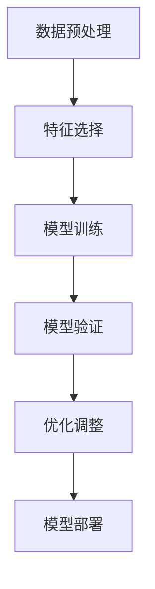
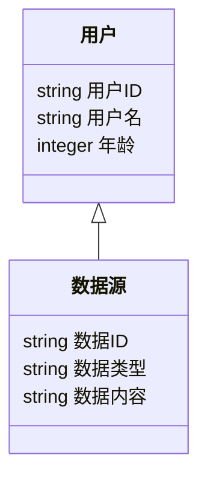

                 


# AI驱动的企业营运资本优化模型

> 关键词：AI驱动，企业营运资本，优化模型，人工智能，企业财务管理

> 摘要：本文探讨了AI技术如何驱动企业营运资本优化，构建了一个基于机器学习的模型，通过数据预处理、特征选择和模型训练，实现对企业营运资本的有效预测与优化，提升企业的资金利用效率和整体竞争力。

---

## 第一章: 背景介绍

### 1.1 问题背景
企业营运资本是指企业在日常经营活动中所需的流动资金，包括现金、应收账款、存货等。营运资本管理的核心目标是优化资金配置，降低运营成本，提高资金使用效率。传统方法依赖于财务人员的经验和静态数据分析，难以实时捕捉市场变化和企业内部数据的动态调整。AI技术的应用为企业营运资本优化提供了新的可能性，通过大数据分析和机器学习算法，可以实现更加精准和实时的预测与优化。

### 1.2 问题描述
企业营运资本管理面临的主要问题包括：  
1. 数据量大且复杂，传统方法难以高效处理。  
2. 市场环境变化快，静态分析难以适应动态需求。  
3. 缺乏实时反馈机制，难以及时调整策略。  

AI驱动的优化模型通过机器学习算法，能够实时分析大量数据，捕捉潜在的优化机会，从而提高营运资本管理的效率和效果。

### 1.3 问题解决
AI技术的应用使得营运资本管理更加智能化和自动化。通过构建机器学习模型，企业可以实现对营运资本的实时预测、动态优化和风险控制。本文将详细介绍如何利用AI技术构建优化模型，帮助企业实现营运资本的高效管理。

---

## 第二章: 核心概念与联系

### 2.1 核心概念原理
营运资本优化模型的核心是通过机器学习算法，对企业的财务数据进行分析，预测未来的需求，优化资金分配。AI技术能够从海量数据中提取有价值的信息，帮助企业在资金使用上做出更明智的决策。

### 2.2 概念属性特征对比
下表展示了传统方法与AI驱动方法在营运资本管理中的对比：

| 特性         | 传统方法               | AI驱动方法               |
|--------------|------------------------|--------------------------|
| 数据处理     | 依赖人工筛选           | 自动化数据清洗与特征提取   |
| 预测准确性   | 受限于经验判断           | 基于机器学习模型，准确性高   |
| 处理速度     | 较慢                   | 实时处理，速度快           |
| 灵活性       | 较低                   | 高度灵活，适应性强         |

### 2.3 ER实体关系图架构
以下是企业营运资本优化模型的实体关系图：

```mermaid
erDiagram
    用户 {
        string 用户ID
        string 用户名
        integer 年龄
    }
    数据源 {
        string 数据ID
        string 数据类型
        string 数据内容
    }
    用户 --> 数据源 : 请求数据
    用户 <-- 数据源 : 返回数据
```

---

## 第三章: 算法原理讲解

### 3.1 算法流程
以下是AI驱动的优化模型的算法流程图：



### 3.2 数学模型
优化模型的核心是回归分析，假设营运资本需求与销售额、成本、库存等因素相关。构建线性回归模型：

$$ Y = \beta_0 + \beta_1 X_1 + \beta_2 X_2 + \dots + \beta_n X_n + \epsilon $$

其中，$Y$ 表示营运资本需求，$X_i$ 表示相关特征，$\beta_i$ 是回归系数，$\epsilon$ 是误差项。

### 3.3 Python代码实现
以下是模型训练的代码示例：

```python
import pandas as pd
from sklearn.linear_model import LinearRegression
from sklearn.model_selection import train_test_split
from sklearn.metrics import mean_squared_error

# 数据加载与预处理
data = pd.read_csv('operating_capital.csv')
data = data.dropna()

# 特征选择
features = ['sales', 'cost', 'inventory']
target = 'capital'

X = data[features]
y = data[target]

# 数据分割
X_train, X_test, y_train, y_test = train_test_split(X, y, test_size=0.2, random_state=42)

# 模型训练
model = LinearRegression()
model.fit(X_train, y_train)

# 模型预测与评估
y_pred = model.predict(X_test)
mse = mean_squared_error(y_test, y_pred)
print(f"均方误差: {mse}")
```

---

## 第四章: 系统分析与架构设计

### 4.1 领域模型
以下是系统功能的领域模型：



### 4.2 系统架构
以下是系统的架构设计图：

```mermaid
containerDiagram
    客户端 --> 优化模型服务
    优化模型服务 --> 数据存储
    数据存储 --> 数据源
```

### 4.3 系统接口设计
系统接口主要分为数据接口和API接口。数据接口用于数据的导入与导出，API接口用于模型调用和结果返回。

---

## 第五章: 项目实战

### 5.1 环境配置
需要安装以下库：
```bash
pip install pandas scikit-learn mermaid4jupyter
```

### 5.2 核心代码实现
以下是优化模型的核心代码：

```python
import numpy as np
import pandas as pd
from sklearn.ensemble import RandomForestRegressor
from sklearn.model_selection import GridSearchCV

# 数据加载与预处理
data = pd.read_csv('operating_capital.csv')
data = data.dropna()

# 特征选择
features = ['sales', 'cost', 'inventory']
target = 'capital'

X = data[features]
y = data[target]

# 参数优化
param_grid = {
    'n_estimators': [100, 200],
    'max_depth': [None, 10, 20],
    'min_samples_split': [2, 5]
}

# 模型训练与优化
model = RandomForestRegressor()
grid_search = GridSearchCV(model, param_grid, cv=5)
grid_search.fit(X, y)

best_model = grid_search.best_estimator_
print(f"最佳参数组合: {grid_search.best_params_}")
```

---

## 第六章: 优化与应用

### 6.1 模型优化
通过超参数调优和特征工程，进一步提升模型的预测精度。例如，增加特征交互项或使用集成学习方法。

### 6.2 应用案例
某制造企业通过部署AI驱动的优化模型，实现了营运资本需求的精准预测，降低了库存成本，提高了资金周转率。

---

## 第七章: 总结与展望

### 7.1 本章小结
本文详细介绍了AI驱动的企业营运资本优化模型，从背景介绍到项目实战，全面阐述了模型的构建与应用。通过AI技术的应用，企业可以实现更高效的营运资本管理。

### 7.2 未来展望
随着AI技术的不断发展，未来优化模型将更加智能化和自动化。结合区块链和物联网技术，AI驱动的优化模型将进一步提升企业的财务管理水平。

---

## 作者
作者：AI天才研究院 & 禅与计算机程序设计艺术

---

以上内容涵盖了从背景介绍到项目实战的各个方面，详细讲解了AI驱动的企业营运资本优化模型的构建与应用，确保读者能够全面理解和掌握相关知识。

