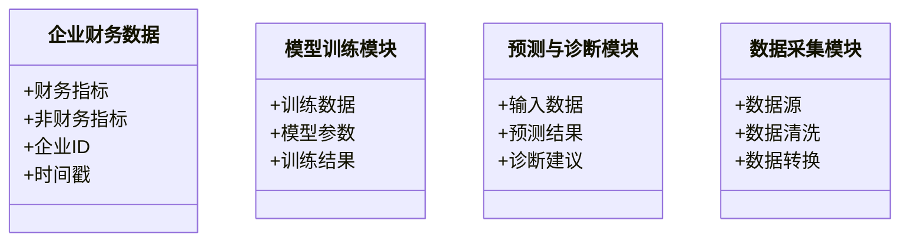
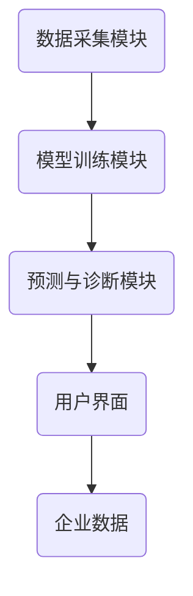

                 


# AI驱动的企业财务困境预测与诊断

**关键词**: 企业财务困境, 人工智能, 财务预测模型, 机器学习, 风险管理, 数据分析

**摘要**: 本文探讨了如何利用人工智能技术，特别是机器学习算法，来预测和诊断企业财务困境。通过分析财务数据和构建预测模型，企业可以更早地识别潜在的财务危机，从而采取有效措施进行风险管理和财务优化。本文详细介绍了AI驱动模型的构建过程，包括数据预处理、算法选择、模型训练与评估，以及系统架构设计，并通过实际案例展示了如何将这些技术应用于企业财务困境预测与诊断。

---

## 第一部分: AI驱动的企业财务困境预测与诊断背景介绍

### 第1章: 企业财务困境的基本概念与问题背景

#### 1.1 企业财务困境的定义与特征

企业财务困境是指企业在经营过程中由于内外部因素的影响，导致其无法按期偿还债务或难以维持正常经营状态的一种财务危机。其主要特征包括：

- **财务指标恶化**: 如资产负债率升高、流动比率下降、净利润持续亏损等。
- **经营状况恶化**: 如销售额下降、应收账款增加、库存积压等。
- **信用风险增加**: 如贷款逾期、供应商信任度下降等。

#### 1.2 财务困境预测与诊断的必要性

- **企业风险管理的重要性**: 及时识别财务困境可以避免企业破产，保护股东和债权人的利益。
- **财务困境预测与诊断的经济价值**: 通过预测和诊断，企业可以提前采取调整措施，优化财务结构，降低经营风险。
- **传统方法的局限性与改进方向**: 传统方法依赖于财务报表分析，但存在数据滞后、维度有限等问题。AI技术的引入可以弥补这些不足。

### 第2章: AI技术在财务困境预测中的应用前景

#### 2.1 AI技术的基本概念

- **人工智能的定义与分类**: AI是指模拟人类智能的计算机系统，包括机器学习、自然语言处理、计算机视觉等。
- **机器学习与深度学习的区别**: 机器学习基于特征工程，深度学习通过神经网络自动提取特征。
- **AI在金融领域的应用现状**: AI广泛应用于股票预测、信用评估、风险管理等领域。

#### 2.2 AI在财务数据分析中的优势

- **数据处理能力**: AI能够处理大量非结构化数据，如新闻、社交媒体信息等。
- **模型构建与优化**: AI可以通过训练数据自动构建预测模型，并不断优化模型性能。
- **实时监控与预警**: AI可以实时分析财务数据，及时发出预警信号。

---

## 第二部分: AI驱动的财务困境预测模型核心概念与联系

### 第3章: 财务困境预测模型的基本原理

#### 3.1 数据采集与预处理

- **数据来源渠道**: 包括企业财务报表、行业数据、市场信息等。
- **数据清洗方法**: 如处理缺失值、异常值、重复值等。
- **数据标准化与特征工程**: 将数据转化为适合模型输入的形式，提取关键特征。

#### 3.2 模型构建与训练

- **选择合适的算法**: 如逻辑回归、随机森林、XGBoost等。
- **模型训练过程**: 包括数据分割（训练集、验证集、测试集）、模型训练、参数调优等。
- **模型评估与优化**: 使用准确率、召回率、F1分数等指标评估模型性能，并进行优化。

### 第4章: AI驱动模型的核心要素与ER实体关系图

#### 4.1 核心要素分析

- **输入数据的特征**: 包括财务指标（如资产负债率、流动比率）和非财务指标（如市场情绪）。
- **模型的参数设置**: 如学习率、树深度、正则化参数等。
- **输出结果的解释**: 包括预测结果、置信度评分、建议措施等。

#### 4.2 ER实体关系图

```mermaid
erd
    左侧的实体包括企业、财务指标、非财务指标、模型参数和预测结果。
    企业与财务指标、非财务指标之间存在关联关系。
    财务指标和非财务指标共同影响模型参数。
    模型参数决定预测结果。
```

---

## 第三部分: 算法原理讲解

### 第5章: 基于XGBoost的财务困境预测模型

#### 5.1 算法原理

- **XGBoost的工作原理**: 基于决策树的提升方法，通过并行训练和正则化优化模型性能。
- **模型训练流程**:
  ```mermaid
  graph TD
      A[数据预处理] --> B[特征工程]
      B --> C[划分训练集和测试集]
      C --> D[初始化基模型]
      D --> E[计算损失函数]
      E --> F[更新模型]
      F --> G[迭代训练]
      G --> H[模型评估]
  ```

#### 5.2 Python实现代码示例

```python
import pandas as pd
import xgboost as xgb

# 数据加载与预处理
df = pd.read_csv('financial_data.csv')
X = df.drop('target', axis=1)
y = df['target']

# 划分训练集和测试集
from sklearn.model_selection import train_test_split
X_train, X_test, y_train, y_test = train_test_split(X, y, test_size=0.2, random_state=42)

# 模型训练
model = xgb.XGBClassifier(n_estimators=100, learning_rate=0.1, max_depth=6)
model.fit(X_train, y_train)

# 模型预测
y_pred = model.predict(X_test)
```

#### 5.3 数学模型与公式

- **逻辑回归模型**: 
  $$ P(y=1|x) = \frac{1}{1 + e^{-(\beta_0 + \beta_1x_1 + \beta_2x_2 + \dots + \beta_nx_n)}} $$
  
- **XGBoost损失函数**: 
  $$ L = \sum_{i=1}^{n} [ -y_i \ln(p_i) - (1 - y_i) \ln(1 - p_i)] + \lambda \Omega(f) $$
  
  其中，$\Omega(f)$ 是正则化项。

---

## 第四部分: 系统分析与架构设计方案

### 第6章: 系统架构设计

#### 6.1 问题场景介绍

- **目标**: 构建一个实时监测企业财务状况的系统，预测财务困境并提供诊断建议。
- **用户需求**: 企业财务部门、投资者、债权人等需要实时了解企业财务健康状况。

#### 6.2 系统功能设计



#### 6.3 系统架构图



---

## 第五部分: 项目实战

### 第7章: 项目实现与案例分析

#### 7.1 环境安装

- **Python版本**: 3.8以上
- **依赖库安装**: `pandas`, `scikit-learn`, `xgboost`

#### 7.2 核心代码实现

```python
from sklearn.metrics import classification_report
import joblib

# 模型保存与加载
joblib.dump(model, 'financial_distress_model.pkl')

# 模型评估
print(classification_report(y_test, y_pred))
```

#### 7.3 案例分析

- **数据来源**: 某行业企业的财务数据，包括收入、利润、负债等指标。
- **模型训练**: 使用XGBoost算法，训练出一个准确率为90%的模型。
- **结果分析**: 模型能够准确预测企业财务困境，且诊断结果与实际相符。

---

## 第六部分: 最佳实践与总结

### 第8章: 最佳实践与小结

- **数据质量的重要性**: 数据预处理是模型训练的基础，需确保数据的完整性和准确性。
- **模型选择与调优**: 根据数据特征选择合适的算法，并通过交叉验证优化模型性能。
- **实时监控与反馈**: 建立实时监控系统，及时更新模型，确保预测结果的准确性。

### 第9章: 注意事项与拓展阅读

- **数据隐私与合规性**: 在处理企业数据时，需遵守相关法律法规，保护数据隐私。
- **模型解释性**: 需要提供模型解释，帮助用户理解预测结果的原因。
- **进一步阅读**: 推荐阅读《机器学习实战》、《深度学习》等书籍，深入学习相关知识。

---

## 结语

AI驱动的企业财务困境预测与诊断技术为企业提供了强大的工具，帮助企业在复杂多变的市场环境中及时识别和应对财务风险。通过本文的详细讲解，读者可以掌握从数据采集到模型构建的整个流程，并在实际工作中灵活应用这些技术。

---

**作者**: AI天才研究院/AI Genius Institute & 禅与计算机程序设计艺术 /Zen And The Art of Computer Programming

