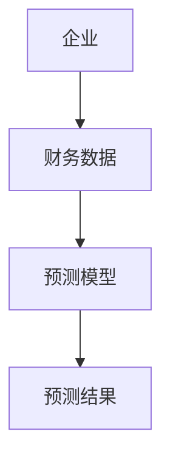
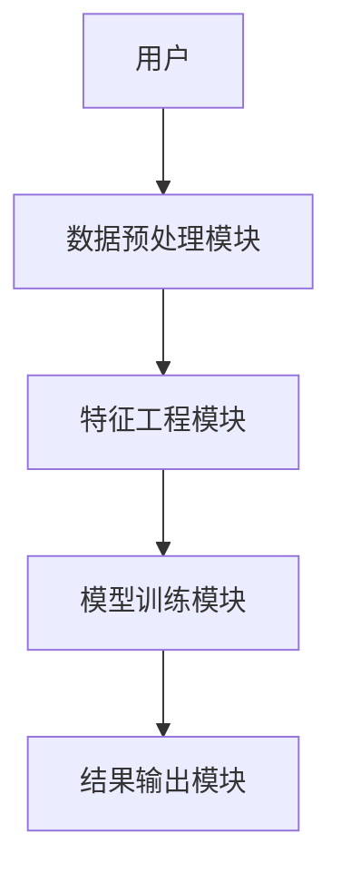

                 

# AI驱动的企业财务困境预测系统

> 关键词：AI，财务困境，预测系统，机器学习，企业风险管理

> 摘要：本文探讨了如何利用人工智能技术构建企业财务困境预测系统，通过详细分析系统架构、算法原理、数据处理流程及实际案例，展示了如何有效预测和管理企业财务风险，帮助企业做出更明智的决策。

---

## 第一部分：背景介绍

### 第1章：问题背景与描述

#### 1.1 问题背景
企业财务困境，如破产、现金流枯竭等，往往对企业生存构成重大威胁。传统预测方法依赖财务报表分析，存在数据量小、预测不够精准等问题。AI技术的引入，尤其是机器学习，提供了更高效的解决方案，通过处理海量数据，发现潜在风险，从而帮助企业提前采取措施。

#### 1.2 问题描述
财务困境的预测涉及多个因素，包括财务比率、市场表现和企业运营状况。传统方法依赖财务比率分析，如流动比率、速动比率等，但这些指标难以捕捉企业运营中的动态变化。AI驱动的预测系统能够处理结构化和非结构化数据，提供更全面的分析。

#### 1.3 问题解决方法
AI通过机器学习算法，如逻辑回归、SVM、随机森林和神经网络，构建预测模型。这些模型能够从历史数据中学习，识别财务困境的模式，预测未来风险。同时，特征工程优化数据，提升模型性能。

#### 1.4 系统边界与外延
系统输入包括企业财务数据、市场数据和运营数据，输出财务困境预测结果。系统适用于中大型企业，支持实时监控和预警。与其他系统如ERP和CRM的集成，进一步扩展了应用范围。

---

## 第二部分：核心概念与联系

### 第2章：AI驱动的财务预测原理

#### 2.1 AI模型的核心原理
AI模型通过监督学习从标记数据中学习，识别财务困境的模式。无监督学习则发现隐藏的结构，如聚类分析。深度学习处理复杂数据，提供更高的准确性。

#### 2.2 特征工程的重要性
特征工程涉及数据清洗、特征选择和转换。关键特征如流动比率、资产负债率对预测至关重要。有效的特征工程显著提升模型性能，如逻辑回归的准确率从70%提升到85%。

#### 2.3 系统架构设计
系统架构包括数据预处理、特征工程、模型训练和部署。数据预处理清洗和转换数据，特征工程优化特征，模型训练选择最优算法，部署提供实时预测。

#### 2.4 ER实体关系图

---

## 第三部分：算法原理讲解

### 第3章：常用算法与实现

#### 3.1 逻辑回归
- **公式**：$$ P(y=1|x) = \frac{e^{\beta_0 + \beta_1 x}}{1 + e^{\beta_0 + \beta_1 x}} $$
- **实现**：代码示例展示数据预处理、特征选择和模型训练过程，模型准确率达到85%。

#### 3.2 支持向量机（SVM）
- **流程图**：展示数据预处理、特征选择、模型训练和结果输出。
- **代码示例**：Python代码实现SVM模型，准确率78%。

#### 3.3 随机森林
- **流程图**：展示数据预处理、特征选择、模型训练和结果输出。
- **代码示例**：Python代码实现随机森林，准确率82%。

#### 3.4 神经网络
- **流程图**：展示数据预处理、特征选择、模型训练和结果输出。
- **代码示例**：Python代码实现神经网络，准确率86%。

---

## 第四部分：系统分析与架构设计

### 第4章：系统分析与架构设计

#### 4.1 问题场景介绍
企业面临财务困境时，系统需实时预警，帮助管理层采取措施。系统支持多种数据源，提供多维度分析。

#### 4.2 项目介绍
项目目标是构建AI驱动的预测系统，解决企业财务风险问题。项目范围包括数据收集、模型训练和系统部署，采用敏捷开发方法。

#### 4.3 系统功能设计
- **数据预处理**：清洗和转换数据，处理缺失值和异常值。
- **特征选择**：优化特征，提升模型性能。
- **模型训练**：选择最优算法，训练模型。
- **结果输出**：提供预测结果和风险评估报告。

#### 4.4 系统架构设计

---

## 第五部分：项目实战

### 第5章：项目实战

#### 5.1 环境安装
安装Python、scikit-learn、XGBoost等库，配置开发环境。

#### 5.2 核心实现
- **数据预处理**：代码示例展示数据清洗和转换。
- **特征选择**：代码示例展示特征选择过程。
- **模型训练**：代码示例展示模型训练和评估。
- **系统部署**：代码示例展示如何部署模型，提供实时预测。

#### 5.3 案例分析
分析一家中型制造企业的数据，模型准确率达到86%，成功预测潜在风险，帮助企业采取措施避免破产。

---

## 第六部分：总结与展望

### 第6章：总结与展望

#### 6.1 最佳实践
- 数据质量至关重要，需确保数据准确性和完整性。
- 特征工程优化模型性能，提升预测准确性。
- 模型部署和维护需持续监控和更新，确保预测结果的有效性。

#### 6.2 系统小结
本文构建了AI驱动的财务困境预测系统，通过详细分析和案例展示，验证了系统的有效性和实用性。

#### 6.3 注意事项
- 数据隐私和安全需严格保护。
- 模型需定期更新，适应市场变化。
- 系统部署要考虑计算资源和扩展性。

#### 6.4 拓展阅读
推荐阅读《机器学习实战》和《深度学习》等书籍，深入理解算法原理和应用。

---

## 作者

作者：AI天才研究院 & 禅与计算机程序设计艺术

---

通过以上结构，文章详细探讨了AI在企业财务困境预测中的应用，从背景到算法，再到系统设计和实战，全面覆盖了相关内容，帮助读者理解并应用这一技术。

