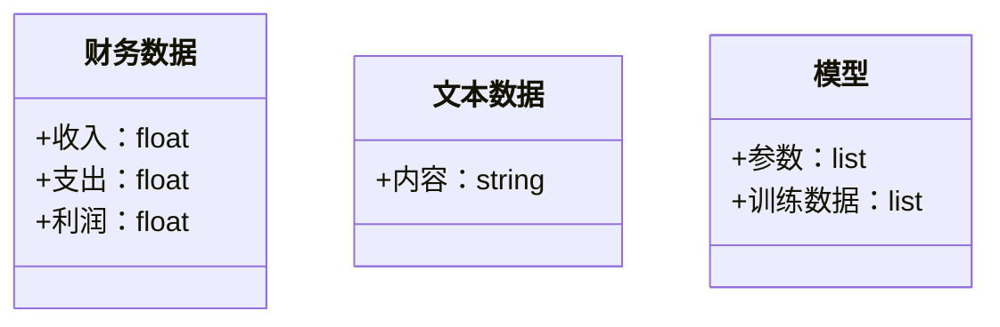
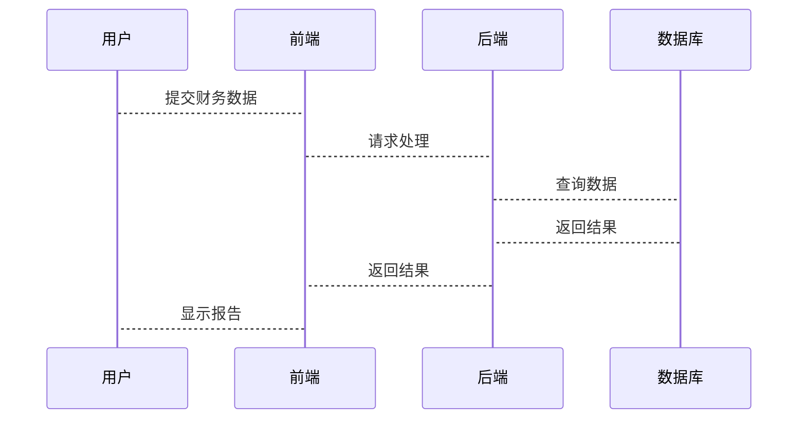

                 


# AI驱动的企业财务报表比较分析系统

> 关键词：AI，财务报表，NLP，大模型，比较分析，企业财务

> 摘要：本文将详细探讨如何利用AI技术，特别是大语言模型（LLM），来实现企业财务报表的自动化比较分析。通过分析财务报表中的关键指标和趋势，结合自然语言处理技术，本文提出了一种创新的解决方案，能够显著提高财务分析的效率和准确性。文章将从问题背景、核心概念、算法原理、系统架构到项目实战，系统性地展开讨论。

---

# 第一部分：AI驱动的企业财务报表比较分析系统概述

## 第1章：问题背景与需求分析

### 1.1 企业财务报表比较分析的背景

#### 1.1.1 传统财务报表分析的局限性
- 传统财务报表分析依赖人工操作，耗时且易出错。
- 数据量大、维度多，难以快速提取关键信息。
- 不同行业、不同企业的财务报表格式和内容差异大，增加了分析的复杂性。

#### 1.1.2 企业财务数据处理的痛点
- 数据清洗和预处理工作繁琐，需要大量人工干预。
- 财务数据的非结构化特征（如注释、说明性文字）难以有效利用。
- 跨年度、跨行业的数据对比分析难度大。

#### 1.1.3 AI技术在财务分析中的潜力
- 利用AI技术可以快速处理大量结构化和非结构化数据。
- 自然语言处理（NLP）技术可以提取文本中的财务信息，实现自动化分析。
- 深度学习模型能够识别财务数据中的潜在模式和趋势。

### 1.2 问题描述与目标设定

#### 1.2.1 财务报表比较分析的核心问题
- 如何快速提取财务报表中的关键指标？
- 如何实现跨年度、跨行业、跨公司的数据对比？
- 如何自动化识别财务数据中的异常值和潜在风险？

#### 1.2.2 AI驱动系统的目标
- 实现财务报表数据的自动化清洗和预处理。
- 提供基于NLP的财务文本分析能力。
- 支持多维度的财务数据比较分析，并生成可视化报告。

#### 1.2.3 系统边界与外延
- 本系统仅关注财务报表的比较分析，不涉及具体的财务决策。
- 适用于企业内部审计、财务分析人员以及投资者。

### 1.3 核心概念与系统架构

#### 1.3.1 系统核心要素组成
| 核心要素 | 描述 |
|----------|------|
| 数据源   | 包括财务报表数据和相关文本说明 |
| NLP模型  | 用于提取文本中的财务信息 |
| 比较分析模块 | 对比不同财务指标，识别趋势和异常值 |
| 可视化模块 | 生成图表和报告 |

#### 1.3.2 实体关系图（ER图）架构


#### 1.3.3 系统功能模块划分
1. 数据预处理模块
2. NLP文本分析模块
3. 数据比较分析模块
4. 可视化报告生成模块

---

## 第2章：AI大模型与NLP技术基础

### 2.1 AI大模型的基本原理

#### 2.1.1 大模型的定义与特点
- 大模型：基于Transformer架构的大型语言模型，如GPT、BERT等。
- 特点：参数量大、通用性强、能够处理多种任务。

#### 2.1.2 大模型在NLP中的应用
- 文本生成
- 文本分类
- 实体识别
- 问答系统

#### 2.1.3 大模型与传统机器学习的区别
| 对比维度 | 大模型 | 传统机器学习 |
|----------|--------|---------------|
| 数据需求 | 需要大量标注数据 | 数据量较小，依赖特征工程 |
| 模型复杂度 | 高 | 较低 |
| 任务通用性 | 强 | 较弱 |

### 2.2 NLP技术在财务分析中的应用

#### 2.2.1 文本预处理与特征提取
- 分词：将财务文本分割成词语或短语。
- 去停用词：去除无意义的词汇，如“的、是、在”等。
- 词向量化：使用Word2Vec或TF-IDF将文本转化为向量。

#### 2.2.2 文本分类与实体识别
- 文本分类：识别财务文本中的关键类别，如收入、支出、利润等。
- 实体识别：提取文本中的具体数值，如金额、日期等。

#### 2.2.3 财务文本语义理解
- 基于上下文理解财务文本的含义。
- 识别财务文本中的潜在风险和机会。

### 2.3 大模型与财务数据结合的可行性

#### 2.3.1 大模型在财务数据处理中的优势
- 能够处理非结构化数据，提取隐含信息。
- 可以快速适应不同行业的财务报表格式。

#### 2.3.2 财务数据的结构化与非结构化特点
| 数据类型 | 描述 |
|----------|------|
| 结构化数据 | 如收入、支出等财务指标，适合直接计算和比较。 |
| 非结构化数据 | 如财务报告中的说明性文字，需要通过NLP技术提取信息。 |

#### 2.3.3 系统实现的关键技术
- 多任务学习：同时处理结构化和非结构化数据。
- 模型微调：针对财务领域进行模型微调，提高准确率。

---

## 第3章：系统算法原理与实现

### 3.1 系统算法概述

#### 3.1.1 系统整体流程


#### 3.1.2 核心算法选择
- 使用预训练的大语言模型（如GPT、BERT）进行文本分析。
- 结合传统的机器学习算法（如随机森林、SVM）进行分类和回归分析。

#### 3.1.3 算法实现步骤
1. 数据清洗与预处理。
2. 特征提取与向量化。
3. 模型训练与优化。
4. 模型预测与结果分析。

### 3.2 算法原理详细讲解

#### 3.2.1 损失函数与优化器
- 损失函数：交叉熵损失函数。
$$ L = -\frac{1}{N}\sum_{i=1}^{N} y_i \log p(y_i| x_i) $$

- 优化器：Adam优化器。
$$ \text{Adam} = \text{Momentum} + \text{RMSProp} $$

#### 3.2.2 模型训练流程


#### 3.2.3 分类算法
- 使用随机森林进行分类，代码示例：
```python
from sklearn.ensemble import RandomForestClassifier
model = RandomForestClassifier(n_estimators=100)
model.fit(X_train, y_train)
y_pred = model.predict(X_test)
```

---

## 第4章：系统分析与架构设计

### 4.1 系统功能设计

#### 4.1.1 功能模块划分
1. 数据预处理模块。
2. NLP文本分析模块。
3. 数据比较分析模块。
4. 可视化报告生成模块。

#### 4.1.2 领域模型类图


### 4.2 系统架构设计

#### 4.2.1 系统架构图


#### 4.2.2 系统接口设计
- 前端接口：提供用户输入和输出界面。
- 后端接口：处理业务逻辑和数据存储。

### 4.3 系统交互设计

#### 4.3.1 交互流程


---

## 第5章：项目实战

### 5.1 环境安装与配置

#### 5.1.1 安装Python和相关库
```bash
pip install numpy pandas scikit-learn transformers
```

### 5.2 核心代码实现

#### 5.2.1 数据预处理代码
```python
import pandas as pd
import numpy as np

# 示例数据
data = {
    '日期': ['2023-01', '2023-02', '2023-03'],
    '收入': [100000, 120000, 110000],
    '支出': [80000, 90000, 95000]
}
df = pd.DataFrame(data)
```

#### 5.2.2 NLP文本分析代码
```python
from transformers import pipeline

classifier = pipeline("text-classification", model="bert-base-uncased")
result = classifier("公司2023年收入增长了10%")
print(result)
```

### 5.3 实际案例分析

#### 5.3.1 数据比较分析
- 对比不同月份的收入和支出，识别增长趋势。
- 使用可视化工具（如Matplotlib）生成折线图。

### 5.4 项目小结

#### 5.4.1 关键点总结
- 数据预处理是关键，需要清洗和格式化。
- NLP模型的选择和调优直接影响分析结果。
- 可视化报告是用户友好交互的重要组成部分。

#### 5.4.2 最佳实践
- 定期更新模型，以适应新的财务数据和行业变化。
- 结合领域知识，优化特征提取和模型调参。

---

## 第6章：总结与展望

### 6.1 系统总结
- 本系统通过结合AI大模型和NLP技术，实现了企业财务报表的自动化比较分析。
- 系统具有高效性、准确性和易用性的特点。

### 6.2 当前挑战
- 数据隐私和安全问题。
- 模型的可解释性问题。

### 6.3 未来展望
- 探索更多AI技术在财务分析中的应用，如实时监控、风险预警等。
- 结合区块链技术，提升系统的安全性和可信度。

---

## 第7章：注意事项与拓展阅读

### 7.1 注意事项
- 数据处理时，要注意数据的准确性和完整性。
- 模型训练时，要避免过拟合和欠拟合问题。

### 7.2 小结
- 本文详细介绍了AI驱动的企业财务报表比较分析系统的设计与实现。
- 通过理论与实践相结合，展示了AI技术在财务领域的巨大潜力。

### 7.3 拓展阅读
- 《Deep Learning for NLP》
- 《Financial Statement Analysis and Ratio Calculation》

---

## 作者：AI天才研究院/AI Genius Institute & 禅与计算机程序设计艺术 /Zen And The Art of Computer Programming

---

**本文完**

