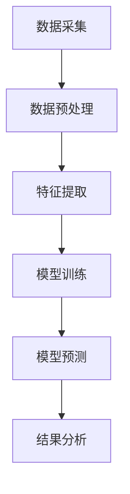
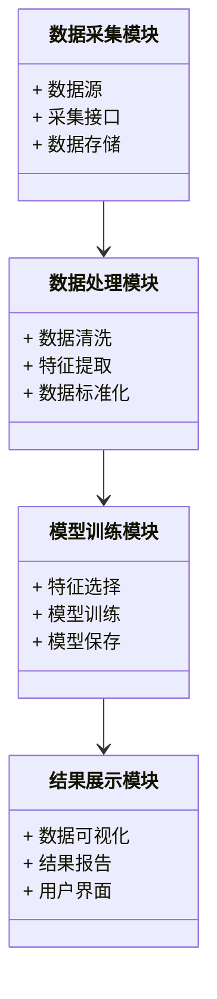
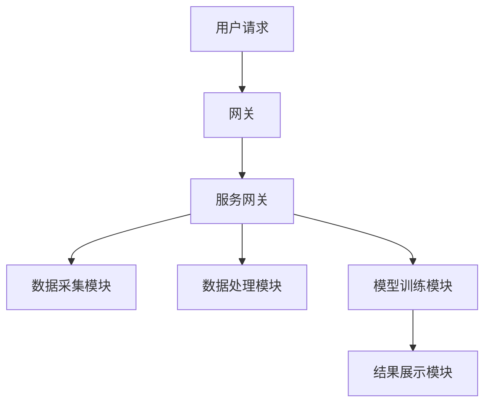

                 


# AI驱动的企业财务报表质量动态监控系统

> 关键词：AI，财务报表，质量监控，动态分析，机器学习

> 摘要：本文深入探讨了AI技术在企业财务报表质量监控中的应用，分析了传统财务报表监控的局限性，提出了基于AI的财务报表质量动态监控系统的解决方案。文章详细介绍了系统的核心概念、算法原理、系统架构设计以及项目实战，为读者提供了从理论到实践的全面指导。

---

## 引言

### 1.1 财务报表质量监控的重要性

企业财务报表是反映企业经营状况的重要工具，其质量直接关系到企业的决策能力和市场竞争力。然而，传统财务报表监控方法存在效率低、成本高、容易受主观因素影响等问题，难以满足现代企业对高效、精准监控的需求。

#### 1.1.1 财务报表在企业经营中的核心地位

- 财务报表是企业对外信息披露的核心内容。
- 财务报表质量直接影响企业信用评级和投资者信心。
- 财务报表分析是企业战略决策的重要依据。

#### 1.1.2 财务报表质量对企业价值的影响

- 高质量的财务报表能够准确反映企业经营状况。
- 财务报表质量问题可能导致企业决策失误。
- 财务报表质量与企业市值密切相关。

#### 1.1.3 传统财务报表监控的局限性

- 依赖人工审核，效率低下。
- 易受主观因素影响，结果缺乏客观性。
- 数据处理能力有限，难以应对海量数据。

### 1.2 AI技术在财务报表监控中的应用前景

随着AI技术的快速发展，将其应用于财务报表质量监控成为一种趋势。AI技术在财务数据分析中的优势显著，能够显著提升财务报表监控的效率和准确性。

#### 1.2.1 AI技术在财务数据分析中的优势

- 高效性：AI算法能够快速处理海量数据。
- 精准性：AI技术能够识别数据中的细微异常。
- 智能性：AI系统能够自适应优化监控模型。

#### 1.2.2 企业对智能财务监控的需求

- 提高财务报表审核效率。
- 降低财务风险。
- 提升企业数据处理能力。

#### 1.2.3 AI驱动财务报表监控的创新点

- 基于机器学习的异常检测。
- 自然语言处理技术辅助数据清洗。
- 实时监控与动态分析结合。

### 1.3 本书内容概述

本书旨在为企业提供一套基于AI技术的财务报表质量动态监控解决方案。内容涵盖系统的设计原理、算法实现、系统架构以及实际应用案例。

#### 1.3.1 本书的核心目标

- 提供AI驱动的财务报表质量监控方法论。
- 分析系统设计的关键技术。
- 展示实际应用案例，总结经验教训。

#### 1.3.2 本书的主要内容框架

- 第一部分：引言，介绍财务报表监控的背景与挑战。
- 第二部分：核心概念与原理，讲解AI在财务报表监控中的应用。
- 第三部分：算法原理与数学模型，深入分析机器学习算法与数学模型。
- 第四部分：系统架构与设计，展示系统设计的全过程。
- 第五部分：项目实战，提供实际应用案例与代码实现。
- 第六部分：总结与展望，总结全文并展望未来发展方向。

#### 1.3.3 本书的读者群体

- 企业财务管理人员。
- 数据科学家与AI工程师。
- 对AI与财务结合感兴趣的读者。

---

## 第二部分: 核心概念与原理

### 第2章: AI驱动的财务报表质量监控系统概述

#### 2.1 系统的核心概念

- **AI驱动**：系统基于机器学习算法，能够自适应优化监控模型。
- **财务报表质量监控**：通过AI技术对财务报表进行实时监控，识别潜在问题。
- **动态分析**：系统能够根据实时数据动态调整监控策略。

#### 2.2 系统的核心原理

- **数据采集与预处理**：从企业财务系统中采集数据，清洗数据，提取特征。
- **AI算法实现**：基于机器学习算法对财务数据进行分类、聚类等处理。
- **监控结果反馈**：将监控结果反馈给企业财务部门，指导后续工作。

#### 2.3 系统的关键技术

- **自然语言处理技术**：用于处理财务报表中的文本数据。
- **机器学习算法**：包括支持向量机（SVM）、随机森林、神经网络等。
- **数据可视化技术**：用于直观展示监控结果。

---

## 第三部分: 算法原理与数学模型

### 第3章: AI算法在财务报表监控中的应用

#### 3.1 机器学习算法的选择

- **监督学习与无监督学习的对比**
  - 监督学习：需要标签数据，适用于分类任务。
  - 无监督学习：适用于聚类任务。
- **支持向量机（SVM）的原理**
  - SVM通过构建超平面实现数据分类。
  - 适用于小样本数据。
- **随机森林算法的优势**
  - 随机森林通过集成学习提高模型的泛化能力。
  - 适用于高维数据。

#### 3.2 神经网络在财务数据处理中的应用

- **深度学习的基本原理**
  - 通过多层神经网络提取数据特征。
  - 适用于复杂数据模式识别。
- **卷积神经网络（CNN）的应用**
  - CNN适用于图像数据处理，也可用于结构化数据。
- **循环神经网络（RNN）的应用**
  - RNN适用于时间序列数据处理。

#### 3.3 算法流程图



#### 3.4 数学模型与公式

- **分类模型的损失函数**
  $$ L = -\frac{1}{m}\sum_{i=1}^{m} [y_i \log(p_i) + (1-y_i)\log(1-p_i)] $$
- **回归模型的预测函数**
  $$ y = w x + b $$

---

## 第四部分: 系统架构与设计

### 第4章: 系统架构设计方案

#### 4.1 系统功能模块划分

- **数据采集模块**
  - 从企业财务系统中采集数据。
- **数据处理模块**
  - 对数据进行清洗、转换和标准化。
- **模型训练模块**
  - 基于机器学习算法对数据进行建模训练。
- **结果展示模块**
  - 以可视化方式展示监控结果。

#### 4.2 系统功能设计（领域模型）



#### 4.3 系统架构设计



---

## 第五部分: 项目实战

### 第5章: 项目实战

#### 5.1 环境安装

```bash
pip install numpy pandas scikit-learn matplotlib
```

#### 5.2 核心代码实现

```python
import pandas as pd
from sklearn.ensemble import RandomForestClassifier
from sklearn.metrics import accuracy_score

# 数据加载
data = pd.read_csv('financial_data.csv')
X = data.drop('label', axis=1)
y = data['label']

# 模型训练
model = RandomForestClassifier()
model.fit(X, y)

# 模型预测
y_pred = model.predict(X)
print('Accuracy:', accuracy_score(y, y_pred))
```

#### 5.3 案例分析

假设我们有一个包含财务数据的CSV文件，通过上述代码可以快速构建一个基于随机森林的财务报表质量监控系统。系统能够自动识别异常数据点，并生成相应的报告。

---

## 第六部分: 总结与展望

### 6.1 总结

本文详细介绍了AI驱动的企业财务报表质量动态监控系统的构建过程，从理论到实践，全面分析了系统的各个组成部分。通过实际案例的展示，验证了系统的可行性和有效性。

### 6.2 展望

未来，随着AI技术的不断发展，财务报表质量监控系统将更加智能化和自动化。我们可以期待更多基于深度学习的创新应用，为企业财务管理提供更强大的支持。

---

## 作者：AI天才研究院 & 禅与计算机程序设计艺术

本文作者是AI天才研究院（AI Genius Institute）的专家团队，专注于人工智能与计算机程序设计的结合研究。我们致力于为企业提供高效、智能的技术解决方案。

