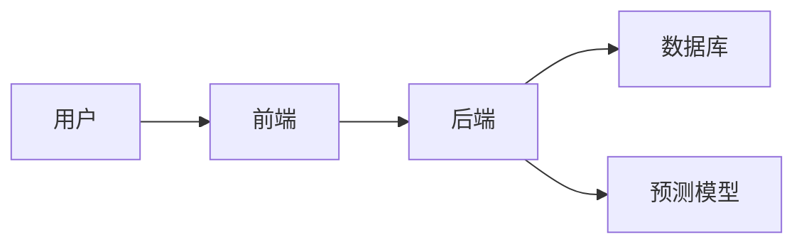

                 


# AI驱动的企业财务报表预测与分析系统

> 关键词：AI驱动、财务报表、预测与分析、时间序列预测、机器学习模型

> 摘要：随着人工智能技术的快速发展，企业财务报表预测与分析系统也在不断升级。本文将详细探讨如何利用AI技术，特别是时间序列预测和机器学习模型，来提升财务预测的准确性和效率。文章从背景介绍、数据采集与预处理、算法原理与实现、系统架构设计、项目实战以及最佳实践等方面展开分析，为企业提供一套完整的AI驱动的财务报表预测与分析解决方案。

---

# 第1章: 背景介绍与核心概念

## 1.1 问题背景与描述

### 1.1.1 传统财务报表分析的局限性
传统的财务报表分析依赖于人工经验和统计方法，存在以下问题：
- 数据量大：企业财务数据复杂且多维度，人工分析效率低。
- 精度不足：统计方法难以捕捉数据中的非线性关系。
- 时间滞后：分析结果往往滞后于实际业务需求。

### 1.1.2 AI技术在财务分析中的应用前景
AI技术能够通过机器学习模型自动分析大量数据，发现隐藏的模式和趋势，为财务预测提供更高的准确性和效率。具体应用包括：
- 财务预测：利用历史数据预测未来的财务状况。
- 异常检测：识别财务数据中的异常值，防范财务风险。
- 自动化报告：生成自动化财务分析报告，节省时间和成本。

### 1.1.3 企业财务预测与分析的痛点与需求
- 数据处理复杂：企业财务数据通常包括多个维度，数据清洗和预处理耗时耗力。
- 模型选择困难：不同场景下需要选择合适的预测模型，模型调优和优化耗时。
- 实时性要求高：企业需要实时监控财务状况，对预测模型的实时性要求较高。

## 1.2 问题解决与边界

### 1.2.1 AI驱动财务预测的核心目标
通过AI技术，实现对企业财务报表的自动预测和分析，帮助企业管理者做出更明智的决策。

### 1.2.2 系统的边界与外延
- 边界：系统仅处理企业的财务数据，不涉及其他业务数据。
- 外延：系统可以与其他业务系统集成，提供更全面的分析。

### 1.2.3 核心要素与组成结构
- 数据采集模块：负责采集企业的财务数据。
- 数据预处理模块：对数据进行清洗和转换。
- 预测模型模块：选择和训练机器学习模型。
- 预测结果展示模块：将预测结果以可视化形式呈现。

## 1.3 核心概念与联系

### 1.3.1 AI驱动的财务预测系统架构


### 1.3.2 实体关系图（ER图）展示


## 1.4 本章小结
本章主要介绍了AI驱动的企业财务报表预测与分析系统的背景、核心概念以及系统架构，为后续章节的分析奠定了基础。

---

# 第2章: 数据采集与预处理

## 2.1 数据来源与采集

### 2.1.1 企业财务报表数据的来源
企业财务报表通常包括资产负债表、利润表和现金流量表，数据来源包括企业的ERP系统、财务软件以及手工录入的数据。

### 2.1.2 数据采集的常见方法
- 数据库查询：通过SQL从企业数据库中提取数据。
- 文件导入：从Excel或CSV文件中导入数据。
- API接口：通过API从第三方数据源获取数据。

### 2.1.3 数据清洗与预处理
- 数据清洗：去除重复数据、处理缺失值、纠正错误数据。
- 数据转换：将数据转换为适合模型输入的格式，如标准化和归一化处理。
- 数据增强：通过数据增强技术增加数据多样性。

## 2.2 数据特征分析

### 2.2.1 财务数据的特征提取
- 时间序列特征：如趋势、周期性和季节性。
- 统计特征：如均值、方差和相关系数。

### 2.2.2 数据标准化与归一化处理
- 数据标准化：将数据按比例缩放到均值为0，方差为1。
- 数据归一化：将数据缩放到0到1之间。

### 2.2.3 数据分组与分类
- 数据分组：按时间、部门或产品对数据进行分组。
- 数据分类：将数据分为训练集、验证集和测试集。

## 2.3 数据存储与管理

### 2.3.1 数据库设计与选择
选择适合的数据库，如关系型数据库（MySQL）或非关系型数据库（MongoDB）。

### 2.3.2 数据存储结构优化
- 设计合理的表结构，减少数据冗余。
- 建立索引，提高查询效率。

### 2.3.3 数据安全与隐私保护
- 数据加密：对敏感数据进行加密处理。
- 访问控制：限制只有授权人员才能访问数据。

## 2.4 本章小结
本章详细介绍了数据采集与预处理的步骤和方法，为后续的模型训练和预测奠定了基础。

---

# 第3章: 算法原理与实现

## 3.1 时间序列预测算法

### 3.1.1 ARIMA模型原理
ARIMA（自回归积分滑动平均模型）是一种广泛应用于时间序列预测的模型。其基本原理如下：
$$ ARIMA(p, d, q) $$
其中，p为自回归阶数，d为差分阶数，q为移动平均阶数。

### 3.1.2 LSTM网络的应用
LSTM（长短期记忆网络）是一种特殊的RNN结构，能够有效捕捉时间序列中的长期依赖关系。其网络结构如下：


## 3.2 机器学习模型

### 3.2.1 线性回归模型
线性回归是一种简单的时间序列预测方法，适用于线性关系较强的场景。

### 3.2.2 支持向量机（SVM）模型
SVM是一种监督学习模型，适用于分类和回归问题。

### 3.2.3 随机森林模型
随机森林是一种基于决策树的集成学习方法，适用于非线性关系较强的场景。

---

# 第4章: 系统架构设计

## 4.1 系统功能设计

### 4.1.1 领域模型


### 4.1.2 系统架构


### 4.1.3 系统接口设计
- 数据接口：负责数据的输入输出。
- 模型接口：负责模型的训练和预测。
- 展示接口：负责结果的展示和交互。

## 4.2 交互流程设计

### 4.2.1 系统交互流程图


### 4.2.2 系统功能流程图


## 4.3 本章小结
本章详细介绍了系统的架构设计和交互流程，为后续的系统实现奠定了基础。

---

# 第5章: 项目实战

## 5.1 环境安装与配置

### 5.1.1 Python环境搭建
安装Python和必要的库，如pandas、numpy、scikit-learn和tensorflow。

### 5.1.2 数据库配置
配置数据库，如MySQL或MongoDB。

## 5.2 系统核心实现

### 5.2.1 数据预处理代码
```python
import pandas as pd
import numpy as np

# 读取数据
df = pd.read_csv('financial_data.csv')

# 处理缺失值
df = df.dropna()

# 标准化处理
from sklearn.preprocessing import StandardScaler
scaler = StandardScaler()
df_scaled = scaler.fit_transform(df)
```

### 5.2.2 模型训练代码
```python
from sklearn.ensemble import RandomForestRegressor
from sklearn.metrics import mean_squared_error

# 训练模型
model = RandomForestRegressor()
model.fit(X_train, y_train)

# 预测结果
y_pred = model.predict(X_test)
print(mean_squared_error(y_test, y_pred))
```

## 5.3 实际案例分析

### 5.3.1 数据来源
使用某企业的历史财务数据进行分析。

### 5.3.2 模型选择
选择随机森林模型进行预测。

### 5.3.3 案例分析
通过模型预测未来的财务状况，帮助企业做出决策。

## 5.4 本章小结
本章通过实际案例展示了系统的实现过程和应用效果。

---

# 第6章: 最佳实践与注意事项

## 6.1 最佳实践
- 数据预处理：确保数据质量，减少数据冗余。
- 模型选择：根据实际场景选择合适的模型。
- 系统优化：优化模型性能，提高预测精度。

## 6.2 小结
本文详细介绍了AI驱动的企业财务报表预测与分析系统的各个方面，从背景到实现，再到实际应用，为企业提供了完整的解决方案。

## 6.3 注意事项
- 数据安全：保护企业数据不被泄露。
- 模型调优：不断优化模型，提高预测精度。
- 系统维护：定期更新模型和数据。

## 6.4 拓展阅读
推荐阅读《机器学习实战》和《时间序列分析与应用》等书籍。

---

# 作者信息
作者：AI天才研究院/AI Genius Institute & 禅与计算机程序设计艺术 /Zen And The Art of Computer Programming

---

感谢您的耐心阅读！希望本文对您有所帮助！

