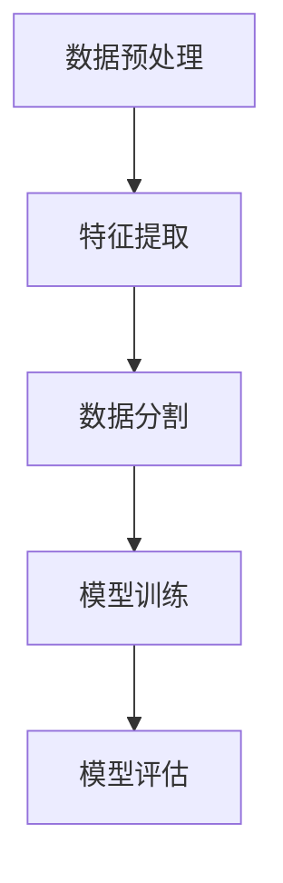
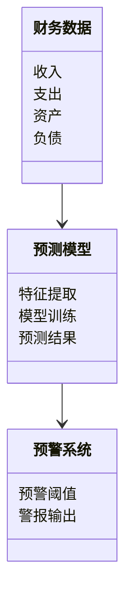

                 


# AI驱动的企业财务舞弊模式演化预测系统

> **关键词**: AI, 财务舞弊, 模式预测, 机器学习, 系统设计

> **摘要**: 本文探讨了利用人工智能技术预测企业财务舞弊模式的演化过程。通过分析财务数据、构建预测模型和设计系统架构，提出了一种基于AI的解决方案，旨在帮助企业提前识别潜在的财务舞弊行为，优化企业治理和风险管理。

---

# 第一部分: 背景介绍

## 第1章: 企业财务舞弊的背景与问题

### 1.1 问题背景

近年来，企业财务舞弊问题日益严重，不仅影响企业的健康发展，还可能导致巨大的经济损失和社会信任危机。传统的财务舞弊识别方法依赖于审计人员的经验和人工审查，效率低且容易受到主观因素的影响。随着人工智能技术的快速发展，利用AI技术进行财务舞弊预测成为一种新的趋势。

### 1.2 问题描述

财务舞弊行为通常表现为虚构交易、虚增收入、隐瞒债务等。这些行为往往通过复杂的手段隐藏在财务数据中，传统的统计分析方法难以有效识别。而AI技术，尤其是机器学习和深度学习算法，能够从大量数据中发现隐藏的模式和异常，为财务舞弊预测提供了新的可能性。

### 1.3 问题解决

AI驱动的财务舞弊模式演化预测系统通过收集和分析企业的财务数据，利用机器学习算法训练模型，识别潜在的舞弊模式。系统能够实时监控企业的财务状况，提前预警可能的舞弊行为，帮助企业采取相应的防范措施。

### 1.4 边界与外延

本系统主要关注企业的财务数据，包括收入、支出、资产、负债等指标。同时，系统也考虑企业的外部环境，如行业竞争状况、市场波动等。系统不直接处理企业的非财务数据，如供应链管理、员工行为等。

### 1.5 核心要素组成

系统的核心要素包括：
- 数据采集模块：负责收集企业的财务数据。
- 数据预处理模块：对数据进行清洗和特征提取。
- 模型训练模块：基于机器学习算法训练预测模型。
- 预警系统：根据模型预测结果发出舞弊预警。

---

# 第二部分: 核心概念与联系

## 第2章: AI驱动财务舞弊模式预测的核心概念

### 2.1 财务舞弊模式的构成要素

财务舞弊模式通常由以下要素构成：
- 时间维度：舞弊行为的频率和时间分布。
- 数据特征：收入、支出、资产等财务指标的异常变化。
- 行为模式：舞弊行为的具体操作手法。

### 2.2 AI技术在模式预测中的应用原理

AI技术通过以下步骤实现财务舞弊模式预测：
1. 数据采集：收集企业的历史财务数据。
2. 特征提取：从数据中提取有助于预测的特征。
3. 模型训练：基于机器学习算法训练预测模型。
4. 预测与预警：根据模型预测结果发出预警。

### 2.3 核心概念的对比分析

#### 2.3.1 财务舞弊模式与企业行为模式的对比

| 财务舞弊模式 | 企业行为模式 |
|--------------|--------------|
| 强调异常数据 | 强调正常业务 |
| 数据特征显著 | 数据特征多样 |

#### 2.3.2 AI预测模型与传统统计模型的对比

| AI预测模型 | 传统统计模型 |
|-------------|---------------|
| 高度自动化 | 需要手动调整 |
| 高度灵活 | 灵活性较低 |
| 高精度 | 精度较低 |

#### 2.3.3 不同行业舞弊模式的对比

以制造业和服务业为例：
- 制造业舞弊模式可能涉及虚增收入、成本转移。
- 服务业舞弊模式可能涉及虚构交易、费用隐瞒。

---

# 第三部分: AI驱动财务舞弊模式预测的算法原理

## 第3章: 基于监督学习的财务舞弊预测

### 3.1 监督学习的基本原理

监督学习是一种基于标签数据的机器学习方法。系统通过训练数据学习特征与标签之间的关系，从而能够对新数据进行分类或预测。

#### 3.1.1 样本分类与标签定义

- **正常交易**：标签为0。
- **舞弊交易**：标签为1。

#### 3.1.2 常见监督学习算法

- **逻辑回归**：适用于二分类问题。
- **随机森林**：适用于高维数据。
- **支持向量机**：适用于非线性可分数据。

### 3.2 算法实现

#### 3.2.1 逻辑回归模型

$$ P(y=1|x) = \frac{1}{1 + e^{-\beta x}} $$

其中，$\beta$ 是模型参数，$x$ 是输入特征。

#### 3.2.2 算法流程图



### 3.3 模型优化

- **过拟合与欠拟合**：通过交叉验证选择合适的模型参数。
- **特征选择**：使用特征重要性分析选择关键特征。

---

# 第四部分: 系统分析与架构设计

## 第4章: 系统功能设计

### 4.1 领域模型



### 4.2 系统架构设计


---

# 第五部分: 项目实战

## 第5章: 环境安装与核心实现

### 5.1 环境配置

安装必要的Python库：
```bash
pip install numpy pandas scikit-learn
```

### 5.2 核心代码实现

#### 5.2.1 数据预处理

```python
import pandas as pd
import numpy as np

# 数据加载
data = pd.read_csv('financial_data.csv')

# 数据清洗
data = data.dropna()
```

#### 5.2.2 模型训练

```python
from sklearn.model import LogisticRegression

# 特征选择
X = data[['收入', '支出', '资产', '负债']]
y = data['标签']

# 模型训练
model = LogisticRegression()
model.fit(X, y)
```

#### 5.2.3 模型评估

```python
from sklearn.metrics import accuracy_score

# 模型预测
y_pred = model.predict(X)

# 准确率计算
print(accuracy_score(y, y_pred))
```

---

# 第六部分: 总结与展望

## 第6章: 总结与注意事项

### 6.1 总结

本文提出了一种基于AI的财务舞弊模式演化预测系统，通过机器学习算法实现了财务舞弊的自动预测和预警。系统能够帮助企业及时发现潜在的财务舞弊行为，优化企业治理和风险管理。

### 6.2 注意事项

- 数据质量：确保数据的完整性和准确性。
- 模型更新：定期更新模型，以应对舞弊模式的变化。
- 隐私保护：注意保护企业的数据隐私。

---

# 作者：AI天才研究院/AI Genius Institute & 禅与计算机程序设计艺术 /Zen And The Art of Computer Programming

---

**注意事项**：
- 本文仅为示例，实际应用中需要根据具体情况进行调整。
- 如需转载请注明出处。
- 代码和图表均为示例，实际实现可能有所不同。

