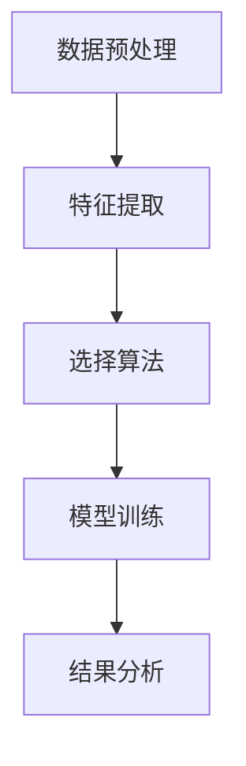

                 


# AI驱动的企业财务舞弊模式识别系统

**关键词**：AI、财务舞弊、模式识别、机器学习、企业风险管理

**摘要**：随着企业规模的不断扩大和财务复杂性的增加，传统的财务舞弊识别方法逐渐显露出效率低下、准确性不足的问题。本文将详细介绍如何利用人工智能技术，特别是机器学习和深度学习算法，构建一个高效的企业财务舞弊模式识别系统。通过分析财务数据的特征，提取潜在的舞弊模式，并结合实际案例，本文将展示如何利用AI技术提升财务舞弊识别的效率和准确性。

---

## 第一部分：企业财务舞弊识别的背景与挑战

### 第1章：企业财务舞弊的现状与问题

#### 1.1 财务舞弊的定义与类型

财务舞弊是指企业通过虚构交易、隐瞒收入、虚增成本等方式，故意粉饰财务报表，误导利益相关者的行为。常见的财务舞弊类型包括：

1. **虚构交易**：通过伪造销售合同或采购订单，虚增收入或成本。
2. **收入操纵**：通过提前确认收入或延迟确认成本，虚增利润。
3. **资产虚增**：通过虚增资产或隐瞒资产减值，虚增资产负债表的资产价值。
4. **关联交易舞弊**：通过与关联方进行不公允的交易，转移资金或利润。

#### 1.2 传统财务舞弊识别方法的局限性

传统的财务舞弊识别方法主要依赖人工审计，存在以下问题：

1. **效率低下**：人工审计需要逐一审查财务数据，效率较低，难以应对海量数据。
2. **主观性强**：审计人员的经验和判断会影响舞弊识别的准确性。
3. **覆盖面有限**：传统方法难以覆盖所有可能的舞弊模式，尤其是复杂的舞弊行为。

#### 1.3 AI技术在财务舞弊识别中的优势

人工智能技术通过以下方式提升了财务舞弊识别的效率和准确性：

1. **高效数据处理**：AI能够快速处理海量财务数据，发现潜在的舞弊模式。
2. **模式识别能力强**：通过机器学习算法，AI能够识别复杂的舞弊行为模式。
3. **实时监控**：AI系统可以实时分析财务数据，及时发现舞弊行为。

---

### 第2章：企业财务舞弊识别的核心概念

#### 2.1 财务数据的特征与属性

财务数据主要包括收入、成本、利润、资产和负债等信息。以下是财务数据的几个关键特征：

1. **时间序列性**：财务数据通常具有时间序列特性，能够反映企业的经营状况。
2. **多维度性**：财务数据通常涉及多个维度，如收入来源、成本构成等。
3. **关联性**：不同财务数据之间可能存在较强的关联性，如收入与成本的配比关系。

#### 2.2 舞弊行为的模式与规律

舞弊行为通常具有以下模式和规律：

1. **异常波动**：某些财务指标在短期内出现异常波动，如收入突然激增或成本突然下降。
2. **数据分布异常**：某些财务数据的分布可能偏离正常分布，如销售额的长尾分布。
3. **关联性异常**：财务数据之间的关联性出现异常，如收入与成本的配比关系异常。

#### 2.3 AI驱动的模式识别方法

AI驱动的模式识别方法主要包括以下几种：

1. **监督学习**：通过标注数据训练分类模型，识别正常和异常的财务数据。
2. **无监督学习**：通过聚类算法发现数据中的异常模式。
3. **深度学习**：通过神经网络模型学习复杂的财务数据特征。

---

## 第二部分：AI驱动的财务舞弊识别算法原理

### 第3章：AI与财务舞弊识别的核心原理

#### 3.1 AI技术在财务分析中的应用

1. **机器学习**：用于分类和聚类分析，识别财务数据中的异常模式。
2. **深度学习**：用于特征提取和模式识别，尤其是处理非结构化财务数据。
3. **自然语言处理**：用于分析财务报告和合同文本，发现潜在的舞弊线索。

#### 3.2 财务舞弊识别的算法选择

1. **监督学习算法**：逻辑回归、随机森林、支持向量机（SVM）。
2. **无监督学习算法**：K-means聚类、DBSCAN聚类。
3. **深度学习算法**：卷积神经网络（CNN）、长短时记忆网络（LSTM）。

#### 3.3 算法原理的数学模型与公式

##### 3.3.1 逻辑回归模型
$$ P(y=1|x) = \frac{1}{1 + e^{-(w \cdot x + b)}} $$

##### 3.3.2 支持向量机模型
$$ \text{max} \{ \frac{1}{2}||w||^2 + C \sum_{i=1}^n \xi_i \} $$

##### 3.3.3 神经网络模型
$$ y = \sigma(w_2 \cdot \sigma(w_1 \cdot x + b_1) + b_2) $$

#### 3.4 算法流程图


---

### 第4章：系统架构与设计

#### 4.1 问题场景介绍

企业财务舞弊识别系统需要处理以下问题：

1. **数据来源多样**：包括财务报表、交易流水、合同文本等。
2. **数据量大**：需要处理海量数据，对计算能力要求高。
3. **实时性要求**：需要实时监控财务数据，及时发现舞弊行为。

#### 4.2 系统功能设计

1. **数据采集模块**：从企业财务系统中采集数据。
2. **特征提取模块**：提取财务数据的特征，如收入增长率、成本利润率等。
3. **模型训练模块**：训练机器学习模型，识别舞弊模式。
4. **结果分析模块**：输出识别结果，提供预警信息。

#### 4.3 系统架构设计


---

### 第5章：项目实战与案例分析

#### 5.1 环境安装与配置

1. **安装Python**：确保安装了最新版本的Python。
2. **安装依赖库**：安装NumPy、Pandas、Scikit-learn、TensorFlow等库。

#### 5.2 核心代码实现

##### 5.2.1 数据预处理代码
```python
import pandas as pd

# 加载数据
data = pd.read_csv('financial_data.csv')

# 数据清洗
data.dropna(inplace=True)
data = pd.get_dummies(data)
```

##### 5.2.2 模型训练代码
```python
from sklearn.model import LogisticRegression

# 训练逻辑回归模型
model = LogisticRegression()
model.fit(X_train, y_train)
```

#### 5.3 案例分析

假设我们有一个财务数据集，包含企业的收入、成本、利润等信息。通过逻辑回归模型训练，我们可以识别出异常的交易行为。例如，某企业的收入突然激增，但成本却没有相应增加，这可能表明存在收入操纵行为。

---

## 第三部分：最佳实践与总结

### 第6章：最佳实践与注意事项

1. **数据预处理**：确保数据的完整性和准确性，去除异常值和重复数据。
2. **特征选择**：选择具有代表性的特征，避免过多的无关特征影响模型性能。
3. **模型调优**：通过交叉验证和网格搜索优化模型参数。
4. **实时监控**：建立实时监控系统，及时发现潜在的舞弊行为。

### 6.1 小结

通过本文的介绍，我们了解了如何利用AI技术构建企业财务舞弊识别系统。从数据预处理到模型训练，再到结果分析，AI技术在财务舞弊识别中的应用大大提升了效率和准确性。未来，随着AI技术的不断发展，财务舞弊识别系统将更加智能化和高效化。

---

**作者：AI天才研究院/AI Genius Institute & 禅与计算机程序设计艺术/Zen And The Art of Computer Programming**

