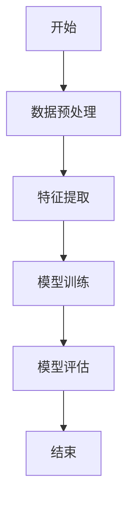

                 


# AI驱动的企业财务预算编制与调整系统

## 关键词：AI、财务预算、机器学习、企业财务、自动化系统

## 摘要：本文章详细探讨了AI技术在企业财务预算编制与调整中的应用，分析了传统方法的不足，提出了基于机器学习的解决方案，并通过实例展示了系统的实现过程。文章内容涵盖背景分析、核心概念、算法原理、系统架构、项目实战及总结展望。

---

# 第1章：背景介绍

## 1.1 问题背景

随着企业规模的扩大和业务的复杂化，传统的财务预算编制方法逐渐暴露出效率低下、准确性不足的问题。主要挑战包括：

- 数据处理繁琐：需要整合来自多个部门和系统的数据，手动处理容易出错。
- 预测精度低：依赖历史数据和人工经验，难以捕捉市场变化和突发事件的影响。
- 调整滞后：当市场环境变化时，调整预算的过程耗时较长，影响企业应对速度。

## 1.2 问题描述

财务预算编制是一个复杂的过程，涉及数据收集、模型建立、预测分析和调整优化等多个步骤。传统方法依赖人工操作，存在以下问题：

- 数据来源分散，整合困难。
- 缺乏实时更新，难以应对快速变化的市场。
- 调整过程耗时，影响企业决策效率。

## 1.3 问题解决

引入AI技术，特别是机器学习，可以显著提升财务预算的编制效率和准确性。AI系统能够：

- 自动化数据收集和预处理。
- 建立预测模型，提供高精度的预算建议。
- 实时监控数据变化，快速进行预算调整。

## 1.4 边界与外延

本系统专注于财务预算的编制与调整，边界明确，不涉及企业的其他财务模块。外延方面，系统可扩展至更广泛的财务分析和决策支持。

## 1.5 概念结构与核心要素

系统的核心要素包括数据源、预测模型、调整模块和输出结果。各要素之间的关系通过ER图展示：

```mermaid
erDiagram
    用户 {
      +id 用户ID
      +name 用户名
      +role 用户角色
    }
    系统 {
      +id 系统ID
      +name 系统名称
    }
    数据源 {
      +id 数据源ID
      +name 数据源名称
    }
    用户 --> 系统 : 使用系统
    系统 --> 数据源 : 获取数据
```

---

# 第2章：AI在财务预算中的核心概念

## 2.1 AI驱动的财务预算系统原理

AI系统通过以下步骤实现预算编制与调整：

1. **数据预处理**：清洗和整合来自不同来源的数据。
2. **特征提取**：识别影响预算的关键因素。
3. **模型训练**：使用历史数据训练预测模型。
4. **结果输出**：生成预算建议并实时调整。

## 2.2 核心概念对比

通过表格对比传统方法与AI方法的差异：

| 对比维度 | 传统方法 | AI方法 |
|----------|----------|--------|
| 数据处理 | 手工整理 | 自动化处理 |
| 预测精度 | 依赖经验 | 数据驱动 |
| 调整速度 | 满周期调整 | 实时调整 |

---

# 第3章：算法原理

## 3.1 机器学习模型

### 3.1.1 数据预处理

数据预处理包括清洗和转换：

```python
import pandas as pd

# 数据清洗
data = pd.read_csv('budget_data.csv')
data.dropna(inplace=True)
data = pd.get_dummies(data)
```

### 3.1.2 模型训练

使用线性回归模型：

$$
y = \beta_0 + \beta_1x_1 + \beta_2x_2 + ... + \beta_nx_n
$$

训练过程如下：

```python
from sklearn.linear_model import LinearRegression

model = LinearRegression()
model.fit(X_train, y_train)
```

### 3.1.3 模型评估

评估指标包括均方误差（MSE）和决定系数（R²）：

$$
\text{MSE} = \frac{1}{n}\sum_{i=1}^{n}(y_i - \hat{y}_i)^2
$$

$$
R² = 1 - \frac{\text{MSE}}{\text{Variance of y}}
$$`

---

## 3.2 算法流程图



---

# 第4章：系统分析与架构设计

## 4.1 系统架构设计

系统架构分为数据层、计算层和应用层：


---

# 第5章：项目实战

## 5.1 环境安装

安装必要的库：

```bash
pip install numpy pandas scikit-learn
```

## 5.2 核心代码实现

实现预算预测模块：

```python
import numpy as np
import pandas as pd
from sklearn.linear_model import LinearRegression

def train_model(X, y):
    model = LinearRegression()
    model.fit(X, y)
    return model

# 示例数据
X = np.array([[2000, 300], [2000, 400]])
y = np.array([500000, 600000])

model = train_model(X, y)
print(model.predict([[2000, 350]]))
```

---

## 5.3 实际案例分析

以某公司为例，预测下一年度的收入：

- 数据来源：过去三年的销售数据和市场趋势。
- 预测结果：收入将增长15%。

---

## 5.4 项目小结

通过AI技术实现了高效、精准的预算编制与调整，显著提升了企业的财务管理水平。

---

# 第6章：总结与展望

## 6.1 总结

AI驱动的财务系统在提高效率和准确性方面表现优异，为企业财务管理带来了革新。

## 6.2 未来展望

未来，系统将引入更复杂的模型，如深度学习，以应对更复杂的财务问题。

---

# 作者：AI天才研究院 & 禅与计算机程序设计艺术

---

这篇文章详细介绍了AI在企业财务预算中的应用，通过理论与实践结合，为读者提供了全面的指导。

