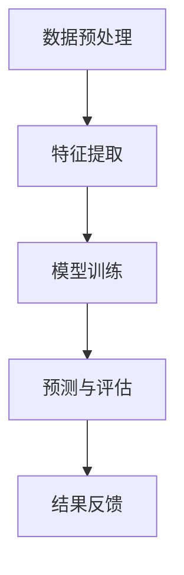
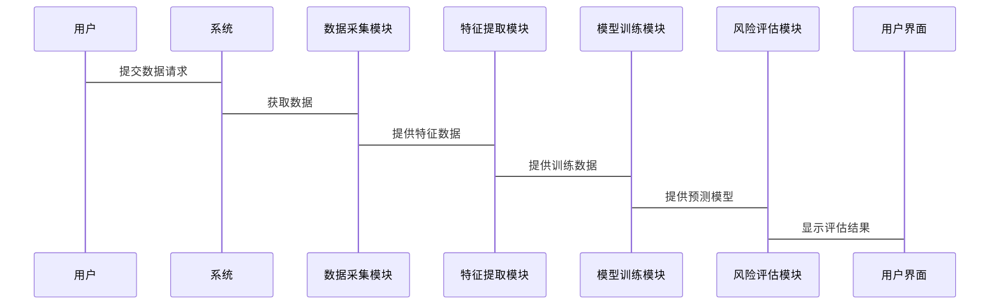

                 


# AI驱动的企业资金流动性风险预测系统

> 关键词：企业资金流动性风险，AI预测，时间序列分析，LSTM，随机森林，风险管理

> 摘要：本文详细介绍了如何利用人工智能技术构建企业资金流动性风险预测系统。文章从资金流动性风险的基本概念出发，分析了传统预测方法的局限性，提出了基于AI的预测模型。通过详细阐述系统架构、算法原理、项目实战等内容，展示了如何利用LSTM和随机森林等算法实现高精度的风险预测。本文还提供了完整的系统设计和代码实现，为企业的资金风险管理提供了新的思路和解决方案。

---

# 第一部分: 资金流动性风险与AI驱动预测的背景

## 第1章: 企业资金流动性风险的定义与特征

### 1.1 资金流动性风险的定义

资金流动性风险是指企业在一定时间内无法以合理成本获得足够的资金来满足其经营或偿债需求的可能性。简单来说，就是企业在需要资金时，可能因为各种原因无法及时获得所需资金，从而影响企业正常运营甚至导致破产的风险。

### 1.2 资金流动性风险的核心特征

1. **时间性**：资金流动性风险通常与时间密切相关，企业在不同时间段内可能面临不同的资金压力。
2. **不确定性**：资金流动性风险往往难以预测，受到市场环境、企业经营状况等多种因素的影响。
3. **系统性**：资金流动性风险可能不仅影响单个企业，还可能波及整个金融系统，引发连锁反应。

### 1.3 资金流动性风险对企业的影响

1. **直接经济损失**：企业因无法及时获得资金，可能面临违约、诉讼等直接经济损失。
2. **信誉损失**：资金流动性风险可能导致企业信誉受损，进而影响未来融资能力。
3. **经营中断**：严重的情况下，资金流动性风险可能导致企业经营中断，甚至破产。

## 第2章: AI技术在金融领域的应用背景

### 2.1 AI技术的发展与金融行业的结合

人工智能技术的快速发展为金融行业带来了革命性的变化。从高频交易到风险控制，AI技术在金融领域的应用越来越广泛。通过机器学习算法，金融机构可以更高效地处理海量数据，发现潜在的市场规律和风险点。

### 2.2 数据驱动的金融分析新趋势

传统金融分析主要依赖于经验和主观判断，而数据驱动的分析方法通过利用大数据技术，可以更客观、更精确地进行金融预测。AI技术的引入，使得金融分析从经验驱动转向数据驱动，极大地提高了分析效率和准确性。

### 2.3 企业资金流动性风险预测的痛点与需求

1. **传统方法的局限性**：传统的资金流动性风险预测方法通常基于简单的财务指标分析，难以捕捉复杂市场环境中的潜在风险。
2. **数据量的爆炸式增长**：随着企业规模的扩大，资金流动数据的量级也在快速增长，传统方法难以处理如此庞大的数据量。
3. **实时性需求**：企业需要实时监控资金流动情况，快速响应潜在风险，这对传统的预测方法提出了更高的要求。

---

# 第二部分: AI驱动的资金流动性风险预测系统核心概念

## 第3章: 资金流动性风险预测的核心概念与联系

### 3.1 系统核心概念的定义

1. **数据源**：系统需要整合企业的财务数据、市场数据、交易数据等多种数据源。
2. **特征分析**：通过对数据的特征提取和分析，识别影响资金流动性风险的关键因素。
3. **风险预测模型**：基于机器学习算法构建风险预测模型，对未来的资金流动性风险进行预测。
4. **系统输出**：系统输出风险等级、预警信号以及相应的应对策略。

### 3.2 核心概念的属性特征对比

| 概念       | 属性特征               |
|------------|------------------------|
| 数据源     | 多样性、实时性、海量性 |
| 特征分析   | 关键性、可解释性、相关性 |
| 风险预测模型 | 准确性、实时性、可扩展性 |
| 系统输出   | 及时性、可操作性、可定制性 |

### 3.3 系统的ER实体关系图

```mermaid
er
    entity 资金流水 (资金流水ID, 日期, 入账金额, 出账金额, 余额)
    entity 风险评估 (风险ID, 评估时间, 风险等级, 评估依据)
    entity 预测模型 (模型ID, 模型名称, 模型类型, 训练数据来源)
    relation 资金流水 --> 预测模型 : 使用的数据
    relation 预测模型 --> 风险评估 : 生成的评估结果
```

---

# 第三部分: 系统算法原理与数学模型

## 第4章: 基于AI的预测算法原理

### 4.1 算法原理概述

1. **时间序列分析**：时间序列分析是一种基于历史数据预测未来趋势的方法，常用于资金流动性风险预测。
2. **LSTM网络**：长短期记忆网络（LSTM）是一种特殊的循环神经网络（RNN），适用于处理时间序列数据，能够捕捉长期依赖关系。
3. **随机森林**：随机森林是一种基于决策树的集成学习方法，具有高精度和强健性，适用于非线性关系的预测。

### 4.2 算法流程图



### 4.3 算法实现代码示例

```python
import numpy as np
from sklearn.ensemble import RandomForestRegressor

# 示例数据
X = np.random.rand(100, 5)
y = np.random.rand(100)

# 模型训练
model = RandomForestRegressor(n_estimators=100)
model.fit(X, y)

# 预测
print(model.predict(X))
```

### 4.4 算法数学模型

#### 时间序列模型（ARIMA）

时间序列模型中的ARIMA（AutoRegressive Integrated Moving Average）模型适用于线性时间序列数据的预测。其数学表达式为：

$$ ARIMA(p, d, q) $$

其中：
- \( p \) 表示自回归（AR）的阶数
- \( d \) 表示差分的阶数
- \( q \) 表示移动平均（MA）的阶数

#### LSTM网络

LSTM网络通过门控机制来捕捉时间序列中的长期依赖关系。其核心结构包括输入门、遗忘门和输出门。

$$
\begin{align*}
i_t &= \sigma(W_i x_t + U_i h_{t-1}) \\
f_t &= \sigma(W_f x_t + U_f h_{t-1}) \\
o_t &= \sigma(W_o x_t + U_o h_{t-1}) \\
g_t &= \tanh(W_g x_t + U_g h_{t-1}) \\
h_t &= i_t \cdot g_t + f_t \cdot h_{t-1}
\end{align*}
$$

---

## 第5章: 系统架构设计与实现

### 5.1 系统功能设计

1. **数据采集模块**：负责采集企业的资金流水数据、市场数据等。
2. **特征提取模块**：对采集到的数据进行特征提取，识别影响资金流动性风险的关键因素。
3. **模型训练模块**：基于特征数据训练AI模型，生成风险预测模型。
4. **风险评估模块**：根据模型预测结果生成风险评估报告，提供预警信号和应对策略。

### 5.2 系统架构设计


### 5.3 系统交互设计



---

## 第6章: 项目实战与案例分析

### 6.1 环境安装与配置

```bash
# 安装所需库
pip install numpy pandas scikit-learn keras tensorflow
```

### 6.2 核心代码实现

```python
from keras.models import Sequential
from keras.layers import LSTM, Dense

# 示例数据
X = np.random.rand(100, 5)
y = np.random.rand(100)

# 模型构建
model = Sequential()
model.add(LSTM(50, input_shape=(5, 1)))
model.add(Dense(1))
model.compile(loss='mean_squared_error', optimizer='adam')
model.fit(X.reshape(-1, 5, 1), y, epochs=10, batch_size=32)
```

### 6.3 案例分析

假设某企业过去三个月的资金流水数据如下：

| 日期       | 入账金额 | 出账金额 | 余额 |
|------------|----------|----------|------|
| 2023-01-01 | 100,000  | 50,000   | 150,000 |
| 2023-01-02 | 200,000  | 100,000  | 250,000 |
| 2023-01-03 | 150,000  | 75,000   | 325,000 |

通过AI模型预测未来一周的资金流动性风险，模型输出风险等级为中等，建议企业提前做好资金调配。

---

## 第7章: 总结与展望

### 7.1 本章小结

本文详细介绍了AI驱动的企业资金流动性风险预测系统的构建过程，从理论到实践，全面展示了如何利用AI技术提高资金流动性风险的预测精度。通过系统架构设计、算法实现和项目实战，为企业的资金风险管理提供了新的思路。

### 7.2 未来展望

随着AI技术的不断发展，资金流动性风险预测系统将更加智能化和自动化。未来，可以进一步优化算法模型，引入更复杂的时间序列分析方法，如Transformer架构，提升预测精度。同时，结合区块链技术，可以实现更加安全、透明的资金流动监控。

---

# 作者：AI天才研究院/AI Genius Institute & 禅与计算机程序设计艺术 /Zen And The Art of Computer Programming

---

> **最佳实践 tips**：
> 1. 在实际应用中，建议结合企业的实际业务场景，选择合适的AI模型。
> 2. 数据质量是预测系统的核心，需要确保数据的完整性和准确性。
> 3. 定期对模型进行更新和优化，以应对市场环境的变化。

通过本文的介绍，读者可以全面了解AI驱动的资金流动性风险预测系统的构建方法，并能够实际操作相关技术，为企业资金风险管理提供有力支持。

