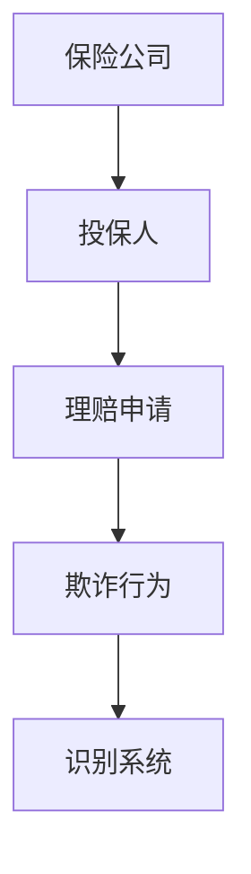
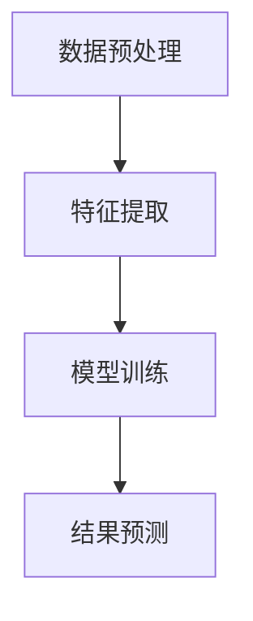
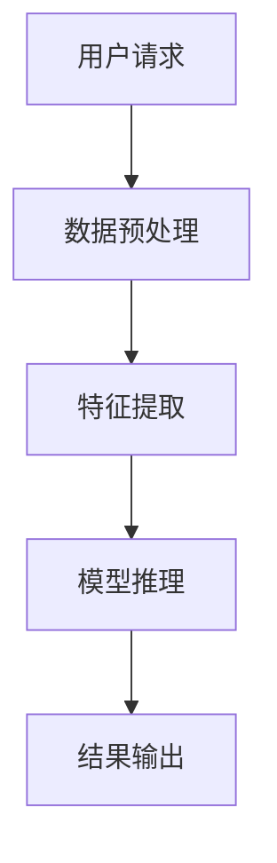

                 


# AI驱动的保险理赔欺诈模式识别

> 关键词：保险欺诈，人工智能，模式识别，机器学习，深度学习

> 摘要：保险欺诈是保险行业中一个长期存在的问题，不仅增加了保险公司的成本，还影响了客户的信任度。随着人工智能技术的快速发展，AI在保险欺诈识别中的应用日益广泛。本文将详细探讨保险欺诈的定义与类型，分析AI技术在欺诈识别中的作用，介绍常用算法及其原理，并通过实际案例展示如何利用AI技术构建保险欺诈识别系统。最后，我们将讨论模型优化与未来趋势。

---

# 第一部分: AI驱动的保险理赔欺诈模式识别概述

# 第1章: 保险行业与欺诈问题概述

## 1.1 保险行业的基本概念

### 1.1.1 保险的基本定义与分类

保险是一种风险管理工具，通过合同形式将风险转移给保险公司，以获得经济补偿。保险主要分为人身保险和财产保险两大类。人身保险包括人寿保险、健康保险等，财产保险包括车险、房屋保险等。

### 1.1.2 保险行业的核心业务流程

保险公司的核心业务流程包括承保、理赔和再保险。承保是评估风险并确定保险费率的过程；理赔是处理客户索赔的过程；再保险是保险公司为了分散风险而购买的保险。

### 1.1.3 保险行业的数字化转型趋势

随着技术的发展，保险公司正在利用大数据、人工智能等技术优化业务流程，提高效率，降低成本。数字化转型已成为保险行业的重要趋势。

## 1.2 保险理赔中的欺诈问题

### 1.2.1 保险欺诈的定义与类型

保险欺诈是指故意提供虚假信息或制造虚假事件，以骗取保险金的行为。常见的欺诈类型包括夸大损失、虚构事故、隐瞒既往病史等。

### 1.2.2 保险欺诈的常见手段与特征

欺诈者通常会利用保险条款的漏洞，通过隐藏信息或制造复杂的情节来掩盖欺诈行为。例如，在车险中，欺诈者可能会夸大事故损失，或编造事故原因。

### 1.2.3 保险欺诈对行业和社会的影响

保险欺诈增加了保险公司的赔付成本，导致保费上升，影响了保险行业的健康发展。同时，欺诈行为也损害了诚信客户的利益，破坏了社会信任。

## 1.3 AI技术在保险欺诈识别中的作用

### 1.3.1 AI技术的基本概念与优势

人工智能（AI）是指计算机系统模拟人类智能的能力，包括学习、推理和自我改进。AI技术在保险欺诈识别中的优势在于其高效的数据处理能力和模式识别能力。

### 1.3.2 AI在保险欺诈识别中的应用场景

AI技术可以应用于保险欺诈的预防、检测和调查。例如，通过机器学习模型分析理赔数据，识别异常行为；利用自然语言处理技术分析索赔描述，发现虚假信息。

### 1.3.3 保险欺诈识别的未来发展趋势

随着技术的进步，未来的保险欺诈识别将更加智能化和自动化。AI技术将与其他先进技术（如区块链）结合，构建更加安全和高效的保险系统。

---

# 第二部分: 欺诈模式识别的核心概念与理论

# 第2章: 欺诈模式识别的理论基础

## 2.1 机器学习与深度学习的基本原理

### 2.1.1 机器学习的基本概念与分类

机器学习是一种通过数据训练模型的技术，分为监督学习、无监督学习和强化学习。监督学习用于分类和回归问题，无监督学习用于聚类和异常检测。

### 2.1.2 深度学习的核心原理与特点

深度学习是一种基于人工神经网络的机器学习方法，具有非线性特征提取能力强、模型复杂度高等特点。常用的深度学习模型包括卷积神经网络（CNN）和循环神经网络（RNN）。

### 2.1.3 无监督学习与监督学习的对比

监督学习需要标注的数据，适用于已知分类的场景；无监督学习适用于未知分类的场景，常用于异常检测。

## 2.2 欺诈模式识别的关键技术

### 2.2.1 特征工程与数据预处理

特征工程是将原始数据转换为适合模型的特征，例如将文本数据转换为数值特征。数据预处理包括数据清洗、特征缩放等。

### 2.2.2 分类算法在欺诈识别中的应用

常用的分类算法包括逻辑回归、支持向量机（SVM）、随机森林和梯度提升树（如XGBoost）。这些算法在欺诈检测中的表现各有优劣。

### 2.2.3 时间序列分析与异常检测

时间序列分析用于处理具有时间依赖性的数据，常用于检测异常事件。异常检测方法包括基于统计的方法和基于机器学习的方法。

## 2.3 欺诈模式识别的数学模型与公式

### 2.3.1 逻辑回归模型

$$ P(y=1|x) = \frac{1}{1 + e^{-\beta x}} $$

逻辑回归用于分类问题，模型输出为概率值，表示样本属于某一类的概率。

### 2.3.2 支持向量机模型

支持向量机通过构建超平面将数据分成两类，适用于线性可分的数据。

### 2.3.3 随机森林与XGBoost算法对比

随机森林通过构建多棵决策树进行投票，XGBoost则通过提升树模型优化性能。

## 2.4 欺诈模式识别的实体关系图



---

# 第三部分: 欺诈模式识别的算法原理与实现

# 第3章: 常见算法的原理与流程

## 3.1 监督学习算法

### 3.1.1 逻辑回归算法流程



逻辑回归通过训练模型，将输入特征映射到输出概率，判断样本是否为欺诈。

### 3.1.2 支持向量机算法流程

支持向量机通过寻找最优超平面，将数据分为两类，适用于小规模数据集。

## 3.2 无监督学习算法

### 3.2.1 K-means聚类算法

K-means是一种常见的聚类算法，适用于无标签数据的异常检测。

### 3.2.2 Isolation Forest算法

Isolation Forest是一种基于树结构的异常检测算法，适用于高维数据。

## 3.3 深度学习算法

### 3.3.1 卷积神经网络（CNN）

CNN适用于图像数据的处理，常用于识别图像中的异常特征。

### 3.3.2 循环神经网络（RNN）

RNN适用于时间序列数据的处理，常用于检测时间依赖的异常行为。

---

# 第四部分: 系统分析与架构设计

# 第4章: 保险欺诈识别系统的架构与实现

## 4.1 项目背景与目标

保险欺诈识别系统的目的是通过AI技术提高欺诈检测的准确性和效率，降低保险公司的损失。

## 4.2 系统功能设计

系统功能包括数据采集、特征提取、模型训练、欺诈检测和结果分析。

## 4.3 系统架构设计



系统架构包括数据预处理模块、特征提取模块、模型推理模块和结果输出模块。

---

# 第五部分: 项目实战

# 第5章: 保险欺诈识别系统的实战部署

## 5.1 环境安装与配置

安装Python、TensorFlow、Scikit-learn等库，配置开发环境。

## 5.2 核心代码实现

以下是逻辑回归模型的实现代码：

```python
import pandas as pd
from sklearn.linear_model import LogisticRegression
from sklearn.model_selection import train_test_split

# 数据加载与预处理
data = pd.read_csv('insurance_fraud.csv')
X = data.drop('fraud_flag', axis=1)
y = data['fraud_flag']

# 数据分割
X_train, X_test, y_train, y_test = train_test_split(X, y, test_size=0.2, random_state=42)

# 模型训练
model = LogisticRegression()
model.fit(X_train, y_train)

# 模型预测
y_pred = model.predict(X_test)
print("预测结果:", y_pred)
```

## 5.3 实际案例分析

以车险为例，分析模型如何识别虚假理赔请求，例如识别夸大损失的索赔。

## 5.4 项目总结与优化

总结项目成果，提出优化建议，如引入更复杂的模型或增加更多的特征。

---

# 第六部分: 优化与展望

# 第6章: 模型优化与未来趋势

## 6.1 模型优化策略

通过超参数调优、特征工程优化等方法提升模型性能。

## 6.2 模型的可解释性与合规性

确保模型的可解释性，符合相关法规要求。

## 6.3 未来发展趋势

未来，AI技术将与区块链、物联网等技术结合，构建更加智能和安全的保险系统。

---

# 结语

保险欺诈识别是AI技术在金融领域的典型应用之一。通过机器学习和深度学习技术，我们可以有效识别欺诈行为，降低保险公司的损失，提升客户信任度。未来，随着技术的不断进步，AI在保险行业的应用将更加广泛和深入。

---

作者：AI天才研究院/AI Genius Institute & 禅与计算机程序设计艺术 /Zen And The Art of Computer Programming

