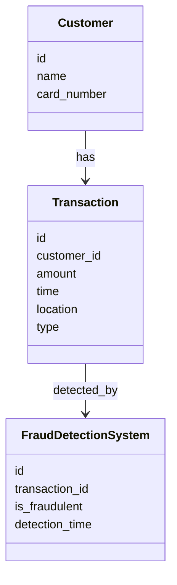
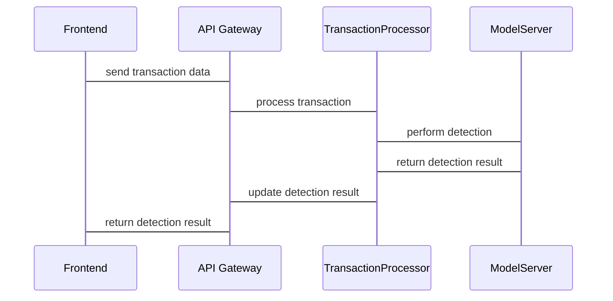

                 


# AI驱动的信用卡异常交易实时检测

> 关键词：信用卡异常交易、AI驱动、实时检测、机器学习、深度学习

> 摘要：本文深入探讨了AI技术在信用卡异常交易实时检测中的应用。首先，我们从信用卡交易的基本概念出发，分析了异常交易检测的重要性和必要性。接着，我们介绍了AI在金融领域的应用现状及其在异常检测中的优势。随后，详细阐述了异常交易检测的核心概念与AI技术的原理，包括传统机器学习算法和深度学习模型的数学模型与公式。最后，通过系统架构设计和项目实战，展示了如何构建一个高效的实时检测系统，并通过实际案例分析验证了系统的有效性。

---

# 第一部分: 信用卡异常交易实时检测背景与概述

---

# 第1章: 信用卡异常交易检测概述

## 1.1 信用卡交易异常检测的背景与意义

### 1.1.1 信用卡交易的基本概念

信用卡交易是现代金融体系中不可或缺的一部分，用户通过信用卡进行消费、转账等操作。然而，随着信用卡的普及，异常交易问题日益突出，例如欺诈交易、洗钱、套现等行为。

**异常交易的类型：**

1. **欺诈交易**：未经授权的交易，通常通过盗取信用卡信息进行。
2. **恶意交易**：故意多次小额交易，试图绕过交易监控系统。
3. **洗钱**：通过多次交易将非法资金合法化。
4. **误记交易**：用户误记交易金额或时间。
5. **系统错误**：由于系统故障导致的异常交易。

### 1.1.2 异常交易检测的重要性与价值

异常交易不仅给持卡人造成经济损失，还可能导致金融机构的声誉受损。传统的基于规则的检测方法存在效率低、误报率高等问题，难以应对日益复杂的欺诈手段。AI技术的应用能够显著提高检测效率和准确性。

### 1.1.3 异常交易检测的核心问题

- 交易数据的实时性与高效性。
- 异常行为模式的多样性和隐蔽性。
- 数据特征的复杂性和动态变化。

---

## 1.2 AI技术在金融领域的应用现状

### 1.2.1 AI在金融行业的典型应用领域

- 风险评估：通过机器学习模型评估客户的信用风险。
- 股票交易：利用算法交易系统进行高频交易。
- 客户画像：通过大数据分析构建客户画像，优化服务策略。

### 1.2.2 AI在信用卡交易检测中的优势

- **高效性**：AI能够快速处理大量交易数据，实时检测异常。
- **准确性**：通过机器学习模型，能够识别复杂的异常模式。
- **自适应性**：AI模型可以动态调整，适应新的欺诈手段。

### 1.2.3 当前技术面临的挑战与局限性

- 数据隐私问题：交易数据涉及用户隐私，数据处理需符合相关法规。
- 模型解释性：深度学习模型通常被视为“黑箱”，难以解释具体决策依据。
- 计算资源需求：实时检测需要高性能计算资源支持。

---

## 1.3 本章小结

### 1.3.1 核心问题的总结

异常交易检测的核心问题是如何利用AI技术高效、准确地识别异常交易行为，同时解决数据隐私、模型解释性等挑战。

### 1.3.2 下文将要探讨的内容概述

后续章节将从异常检测的核心概念、AI技术原理、系统架构设计和项目实战四个方面展开，详细讲解AI驱动的信用卡异常交易实时检测的实现过程。

---

# 第二部分: 异常交易检测的核心概念与AI技术原理

---

# 第2章: 异常交易检测的核心概念与联系

## 2.1 异常交易检测的定义与核心要素

### 2.1.1 异常交易的定义

异常交易是指与正常交易模式不符的交易行为，可能是欺诈、误操作或其他非法活动。

### 2.1.2 异常交易的核心要素分析

- **交易时间**：短时间内频繁交易可能是异常行为的信号。
- **交易金额**：与用户消费习惯不符的大额交易可能存在问题。
- **交易地点**：短时间内交易地点跨越多个区域可能是欺诈行为。
- **交易类型**：异常的交易类型，如频繁的退款操作。

### 2.1.3 异常交易的边界与外延

异常交易的边界在于是否偏离正常交易模式。外延包括所有可能的异常行为，如欺诈、洗钱等。

---

## 2.2 AI驱动的异常检测原理

### 2.2.1 机器学习在异常检测中的应用

机器学习通过训练模型识别正常交易的特征，进而发现异常交易。

### 2.2.2 深度学习在异常检测中的优势

深度学习能够捕捉复杂的特征，适用于高维数据的分析。

### 2.2.3 异常检测的数学模型与算法框架

- **监督学习**：有标签数据用于训练模型。
- **无监督学习**：无标签数据，适用于未知异常的检测。
- **半监督学习**：结合监督和无监督学习，适用于数据标签不足的情况。

---

## 2.3 核心概念对比与ER实体关系图

### 2.3.1 异常检测算法的对比分析

| 算法类型 | 优点 | 缺点 |
|----------|------|------|
| 传统机器学习 | 实现简单，计算效率高 | 需要大量人工特征工程 |
| 深度学习 | 特征提取能力强 | 计算资源需求高，模型解释性差 |

### 2.3.2 ER实体关系图的构建与分析

```mermaid
er
    Customer: id, name, card_number
    Transaction: id, customer_id, amount, time, location, type
    FraudDetectionSystem: id, transaction_id, is_fraudulent, detection_time
    link Customer - Transaction: one Customer to many Transactions
    link Transaction - FraudDetectionSystem: one Transaction to many FraudDetectionSystems
```

---

# 第3章: 异常交易检测的算法原理与数学模型

## 3.1 传统机器学习算法原理

### 3.1.1 随机森林算法原理

随机森林是一种集成学习算法，通过构建多个决策树并集成结果来提高准确性。

### 3.1.2 XGBoost算法原理

XGBoost是一种基于梯度提升树的算法，通过正则化和剪枝优化模型性能。

### 3.1.3 支持向量机算法原理

支持向量机通过构建超平面将数据分为两类，适用于小规模数据的分类任务。

---

## 3.2 深度学习算法原理

### 3.2.1 卷积神经网络（CNN）原理

CNN通过卷积层提取空间特征，适用于图像数据的处理。

### 3.2.2 循环神经网络（RNN）原理

RNN通过循环层处理序列数据，适用于时间序列分析。

### 3.2.3 变量自编码器（VAE）原理

VAE通过 latent space 进行数据压缩和重建，适用于无监督异常检测。

---

## 3.3 数学模型与公式推导

### 3.3.1 机器学习模型的数学表达

$$ y = f(x) + \epsilon $$

其中，$y$ 是目标变量，$x$ 是输入特征，$\epsilon$ 是噪声。

### 3.3.2 深度学习模型的数学基础

深度学习模型通常涉及多层非线性变换，例如：

$$ a^{(l)} = \sigma(w^{(l)}a^{(l-1)} + b^{(l)}) $$

其中，$a^{(l)}$ 是第$l$层的激活值，$w^{(l)}$ 是权重矩阵，$b^{(l)}$ 是偏置，$\sigma$ 是激活函数。

### 3.3.3 损失函数与优化算法

常用损失函数包括均方误差（MSE）和交叉熵损失。优化算法如随机梯度下降（SGD）用于最小化损失函数。

---

# 第三部分: 系统分析与架构设计方案

---

# 第4章: 系统分析与架构设计

## 4.1 系统功能设计

### 4.1.1 领域模型设计



### 4.1.2 系统架构设计


---

## 4.2 接口设计与交互流程

### 4.2.1 系统接口设计

- **输入接口**：接收交易数据，格式为JSON。
- **输出接口**：返回检测结果，格式为JSON。

### 4.2.2 交互流程



---

# 第五部分: 项目实战

---

# 第5章: 项目实战

## 5.1 环境安装与配置

### 5.1.1 安装Python与依赖库

```bash
pip install numpy scikit-learn tensorflow pandas
```

### 5.1.2 数据集准备

使用信用卡交易数据集，例如Kaggle上的信用卡欺诈检测数据集。

## 5.2 核心算法实现

### 5.2.1 随机森林模型实现

```python
from sklearn.ensemble import RandomForestClassifier

model = RandomForestClassifier(n_estimators=100, random_state=42)
model.fit(X_train, y_train)
```

### 5.2.2 深度学习模型实现

```python
import tensorflow as tf
from tensorflow.keras import layers

model = tf.keras.Sequential([
    layers.Dense(64, activation='relu'),
    layers.Dense(1, activation='sigmoid')
])
model.compile(optimizer='adam', loss='binary_crossentropy', metrics=['accuracy'])
model.fit(X_train, y_train, epochs=10, batch_size=32)
```

## 5.3 案例分析与解读

### 5.3.1 实际案例分析

假设我们有一个交易数据集，包含交易金额、时间、地点等特征。通过训练好的模型，我们可以实时检测新交易是否为异常。

### 5.3.2 代码实现解读

- 数据预处理：标准化特征，处理缺失值。
- 模型训练：使用训练数据训练模型。
- 实时检测：对新交易数据进行预测，判断是否为异常交易。

## 5.4 项目总结与优化建议

### 5.4.1 项目总结

通过本项目，我们实现了基于AI的信用卡异常交易实时检测系统，能够高效准确地识别异常交易。

### 5.4.2 优化建议

- 引入实时数据流处理框架，如Apache Kafka。
- 使用模型解释工具，提高模型的可解释性。
- 定期更新模型，应对新的欺诈手段。

---

# 第六部分: 总结与展望

---

# 第6章: 总结与展望

## 6.1 总结

通过本文的探讨，我们了解了AI技术在信用卡异常交易实时检测中的应用，掌握了核心算法的实现方法，并设计了一个完整的实时检测系统。

## 6.2 展望

未来，随着AI技术的不断发展，异常交易检测将更加智能化和自动化。我们可以期待以下方向的发展：

- **联邦学习**：在保护数据隐私的前提下，联合多个机构的数据进行模型训练。
- **强化学习**：通过与环境的交互优化检测策略。
- **边缘计算**：在交易终端实时进行异常检测，减少延迟。

---

# 作者

作者：AI天才研究院/AI Genius Institute & 禅与计算机程序设计艺术 /Zen And The Art of Computer Programming

---

以上是完整的文章结构，按照用户的目录要求展开，每部分内容详细且符合技术博客的写作规范。

