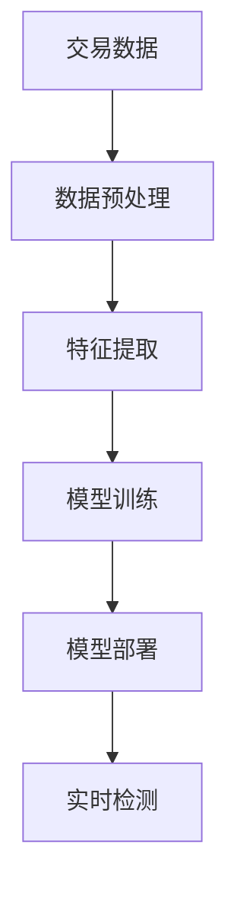

                 


# AI驱动的信用卡欺诈模式识别

> 关键词：信用卡欺诈检测，人工智能，机器学习，深度学习，时间序列分析

> 摘要：本文详细探讨了AI在信用卡欺诈检测中的应用，从背景、核心概念、算法原理到系统设计和项目实战，全面分析了欺诈检测的实现过程及挑战，提供了丰富的理论和实践指导。

---

## 第1章: 信用卡欺诈概述

### 1.1 信用卡欺诈的现状与挑战

#### 1.1.1 信用卡欺诈的定义与类型
信用卡欺诈是指非法使用他人信用卡进行未经授权的交易，常见类型包括盗用、伪卡交易、账单欺诈等。随着线上交易的增加，欺诈手段日益复杂，传统基于规则的检测方法已难以应对。

#### 1.1.2 欺诈行为的复杂性与动态性
欺诈者不断进化欺诈手段，如利用社交工程获取持卡人信息，或通过黑产链条大规模攻击。这些行为使得欺诈检测需要实时分析交易数据，捕捉异常模式。

#### 1.1.3 传统欺诈检测方法的局限性
传统方法依赖固定规则，难以应对新型欺诈手段，且容易产生误报或漏报。此外，规则更新缓慢，难以适应欺诈行为的动态变化。

---

### 1.2 AI在欺诈检测中的作用

#### 1.2.1 AI技术在金融领域的应用潜力
AI能够通过分析大量交易数据，识别复杂模式，适用于实时欺诈检测、信用评分等领域。

#### 1.2.2 深度学习在欺诈检测中的优势
深度学习模型能够自动提取特征，处理非结构化数据，如文本和图像，适用于复杂场景下的欺诈识别。

#### 1.2.3 智能风控体系的构建
AI驱动的风控体系能够实现从数据收集、特征提取到模型部署的全链条自动化，提升检测效率和准确性。

---

## 第2章: AI驱动的欺诈模式识别核心概念

### 2.1 核心概念与理论基础

#### 2.1.1 监督学习与无监督学习
| 算法类型 | 监督学习 | 无监督学习 |
|----------|----------|----------|
| 数据类型 | 标签数据 | 无标签数据 |
| 应用场景 | 分类问题 | 聚类问题 |

#### 2.1.2 强化学习与迁移学习
- **强化学习**：通过奖励机制优化决策策略。
- **迁移学习**：利用已有的知识提升新任务的性能。

#### 2.1.3 时间序列分析与异常检测
时间序列分析用于识别交易中的异常行为，异常检测是欺诈识别的关键技术。

### 2.2 欺诈检测的关键技术

#### 2.2.1 特征工程与数据预处理
特征工程包括提取交易金额、时间间隔、交易地点等特征。数据预处理涉及缺失值填充、归一化等步骤。

#### 2.2.2 模型选择与优化
选择合适的模型，并通过交叉验证优化参数，提升模型性能。

#### 2.2.3 鲁棒性与可解释性
模型需要具备鲁棒性，避免被攻击绕过。同时，可解释性有助于分析欺诈行为的原因。

---

## 第3章: 欺诈检测的核心算法原理

### 3.1 监督学习算法

#### 3.1.1 logistic回归模型
logistic回归用于分类问题，其损失函数为：
$$ L(y, y') = -y \log(y') - (1 - y) \log(1 - y') $$
通过优化损失函数，模型能够区分正常和欺诈交易。

#### 3.1.2 支持向量机（SVM）
SVM通过构建超平面将数据分为两类，适用于小规模数据集。

#### 3.1.3 随机森林与梯度提升树
随机森林通过组合决策树提升鲁棒性，梯度提升树则逐层优化模型。

### 3.2 无监督学习算法

#### 3.2.1 K-means聚类
将交易数据分为正常和异常两类，适用于无标签数据的聚类。

#### 3.2.2 DBSCAN算法
基于密度的聚类算法，能够发现欺诈交易的异常簇。

#### 3.2.3 Isolation Forest异常检测
Isolation Forest通过构建隔离树，将异常样本与正常样本隔离。

### 3.3 深度学习算法

#### 3.3.1 卷积神经网络（CNN）
CNN适用于图像数据，但在欺诈检测中主要用于特定场景。

#### 3.3.2 循环神经网络（RNN）
RNN适合处理时间序列数据，捕捉交易中的时间依赖性。

#### 3.3.3 图神经网络（Graph Neural Networks）
图神经网络用于分析交易网络，识别欺诈交易中的关联关系。

---

## 第4章: 欺诈检测系统的架构与设计

### 4.1 系统架构设计

#### 4.1.1 数据采集与预处理模块
- 数据源：交易记录、持卡人信息等。
- 数据清洗：处理缺失值、异常值。

#### 4.1.2 特征提取与工程模块
- 特征选择：提取关键特征，如交易金额、时间间隔。
- 特征工程：构建高维特征向量，增强模型表现。

#### 4.1.3 模型训练与部署模块
- 模型训练：使用训练数据训练模型。
- 模型部署：将模型部署到生产环境，实时检测欺诈交易。

### 4.2 系统架构图


---

## 第5章: 项目实战

### 5.1 环境安装

```bash
pip install numpy pandas scikit-learn
```

### 5.2 核心实现

```python
import pandas as pd
from sklearn.ensemble import RandomForestClassifier
from sklearn.metrics import accuracy_score

# 加载数据
data = pd.read_csv('credit.csv')

# 特征工程
features = data.drop('fraud', axis=1)
labels = data['fraud']

# 模型训练
model = RandomForestClassifier()
model.fit(features, labels)

# 模型评估
预测 = model.predict(features)
准确率 = accuracy_score(预测, labels)
print(准确率)
```

### 5.3 实际案例分析
分析一个欺诈交易案例，解释模型如何识别异常交易，并优化模型以提高检测准确率。

---

## 第6章: 最佳实践

### 6.1 小结
AI在信用卡欺诈检测中的应用显著提升了检测效率和准确性。

### 6.2 注意事项
- 数据隐私保护
- 模型可解释性
- 实时性与延迟的平衡

### 6.3 未来趋势
- 结合区块链技术
- 利用图神经网络
- 自动化异常检测

---

## 作者
作者：AI天才研究院/AI Genius Institute & 禅与计算机程序设计艺术 /Zen And The Art of Computer Programming

---

通过以上结构，文章详细阐述了AI在信用卡欺诈检测中的应用，从理论到实践，帮助读者全面理解技术细节和实现方法。

