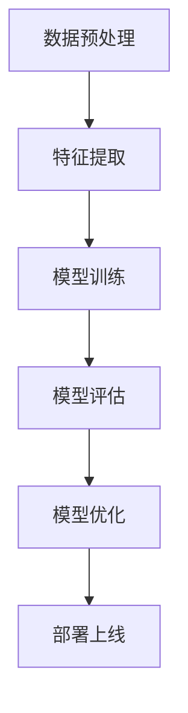

                 


# AI驱动的信用卡额度优化模型

> 关键词：信用卡额度优化，AI驱动，机器学习，风险管理，信用评估

> 摘要：本文详细探讨了如何利用人工智能技术优化信用卡额度分配，通过分析用户行为、信用评估和市场趋势，构建高效的风险控制模型，实现精准的额度调整策略。

---

# 第1章: 背景介绍

## 1.1 问题背景

### 1.1.1 传统信用卡额度管理的挑战
传统的信用卡额度管理主要依赖人工审核和简单的规则引擎，存在以下问题：
- 人工审核效率低，成本高。
- 规则引擎难以应对复杂的用户行为和市场变化。
- 风险控制不够精准，可能导致过度授信或授信不足。

### 1.1.2 AI技术在金融领域的应用潜力
人工智能技术的快速发展为金融行业带来了新的机遇，特别是在信用卡额度优化方面：
- 通过机器学习算法分析海量数据，发现潜在规律。
- 利用自然语言处理技术分析用户行为和市场趋势。
- 通过深度学习模型实现更精准的风险评估。

### 1.1.3 信用卡额度优化的业务价值
信用卡额度优化能够带来以下业务价值：
- 提高客户满意度：通过个性化额度调整，提升用户体验。
- 降低风险：通过精准的额度控制，降低违约风险。
- 提高收益：通过科学的额度分配，实现收益最大化。

## 1.2 问题描述

### 1.2.1 信用卡额度优化的核心问题
信用卡额度优化的核心问题是：如何根据用户的行为、信用状况和市场环境，动态调整信用卡额度，以实现风险可控、收益最大化的目标。

### 1.2.2 用户行为与信用风险的关系
用户行为（如消费频率、还款习惯）与信用风险密切相关。通过分析用户行为，可以预测其信用状况，从而优化信用卡额度。

### 1.2.3 数据驱动的决策优势
数据驱动的决策优势体现在以下几个方面：
- 基于海量数据的分析，能够发现潜在规律。
- 能够实时监控用户行为，动态调整额度。
- 通过数据建模，实现精准的风险评估。

## 1.3 问题解决

### 1.3.1 AI技术如何优化信用卡额度
AI技术可以通过以下方式优化信用卡额度：
- 利用机器学习算法分析用户数据，预测信用风险。
- 通过深度学习模型实现用户画像，精准定位高风险用户。
- 利用强化学习技术动态调整额度，实现收益与风险的平衡。

### 1.3.2 数据分析在额度优化中的作用
数据分析在额度优化中的作用包括：
- 数据清洗和特征提取：为模型提供高质量的数据输入。
- 数据建模：通过数据分析发现变量之间的关系。
- 数据可视化：帮助理解数据分布和模型表现。

### 1.3.3 模型驱动的决策流程
模型驱动的决策流程包括以下步骤：
1. 数据收集与预处理：清洗数据，提取特征。
2. 模型训练：基于训练数据训练模型。
3. 模型评估：通过测试数据评估模型性能。
4. 模型部署：将模型应用于实际业务场景。

## 1.4 边界与外延

### 1.4.1 模型适用的业务场景
模型适用于以下业务场景：
- 新客户授信额度的确定。
- 存量客户的额度调整。
- 风险事件后的额度重新评估。

### 1.4.2 模型的局限性与限制条件
模型的局限性包括：
- 数据质量：模型性能依赖于数据质量，数据不足或不准确会影响模型效果。
- 模型解释性：复杂的模型可能难以解释其决策逻辑。
- 模型泛化能力：模型在不同场景下的表现可能不稳定。

### 1.4.3 模型与其他系统的关系
模型与其他系统的关系包括：
- 与客户关系管理系统（CRM）集成，实现客户画像。
- 与交易系统集成，实时监控交易风险。
- 与风控系统集成，实现风险预警和控制。

## 1.5 核心概念结构与组成

### 1.5.1 模型输入与输出
模型输入包括：
- 用户基本信息：年龄、性别、职业等。
- 信用历史：还款记录、逾期情况等。
- 消费行为：消费频率、消费金额等。

模型输出包括：
- 推荐的信用卡额度。
- 风险评估结果。
- 额度调整建议。

### 1.5.2 关键变量与参数
关键变量包括：
- 用户信用评分：基于FICO评分或其他信用评分模型。
- 消费行为特征：如平均消费金额、最大单笔消费等。
- 风险因子：如欺诈风险、违约概率等。

### 1.5.3 模型的核心逻辑
模型的核心逻辑包括：
1. 数据预处理：清洗数据，处理缺失值和异常值。
2. 特征提取：从原始数据中提取有用的特征。
3. 模型训练：基于训练数据训练模型。
4. 模型评估：通过测试数据评估模型性能。
5. 模型部署：将模型应用于实际业务场景。

---

# 第2章: 核心概念与联系

## 2.1 核心概念原理

### 2.1.1 数据驱动的决策模型
数据驱动的决策模型基于数据分析和建模技术，通过数据驱动的方式进行决策。与传统的基于规则的决策方式相比，数据驱动的决策模型具有更高的灵活性和准确性。

### 2.1.2 AI算法在信用评估中的应用
AI算法在信用评估中的应用包括：
- 机器学习算法：如逻辑回归、随机森林、梯度提升树等。
- 深度学习算法：如神经网络、卷积神经网络等。
- 强化学习算法：通过与环境交互，优化决策策略。

### 2.1.3 信用卡额度优化的数学模型
信用卡额度优化的数学模型可以通过以下方式构建：
1. 确定目标函数：如最大化收益、最小化风险等。
2. 确定约束条件：如额度上限、信用评分等。
3. 通过优化算法求解模型，得到最优解。

## 2.2 核心概念属性对比

### 2.2.1 不同模型的性能对比
不同模型的性能对比可以通过以下指标进行评估：
- 准确率：模型预测的准确程度。
- 召回率：模型召回正样本的能力。
- F1分数：综合考虑准确率和召回率的指标。
- ROC-AUC：模型区分正负样本的能力。

### 2.2.2 数据特征的维度分析
数据特征的维度分析包括：
- 特征重要性：通过特征重要性分析，确定哪些特征对模型影响最大。
- 特征相关性：分析特征之间的相关性，避免多重共线性问题。
- 特征分布：分析特征的分布情况，如正态分布、偏态分布等。

### 2.2.3 模型的可解释性与鲁棒性
模型的可解释性与鲁棒性是模型应用的重要考虑因素：
- 可解释性：模型的决策逻辑是否清晰，是否易于理解和解释。
- 鲁棒性：模型在面对数据变化和噪声时，是否能够保持稳定性能。

## 2.3 ER实体关系图

```mermaid
er
    Customer: 用户信息
    CreditCard: 信用卡信息
    Transaction: 交易记录
    Model: 优化模型
    Risk: 风险评估
    Customer --|> CreditCard: 持卡人
    CreditCard --|> Transaction: 产生交易
    Transaction --|> Risk: 影响风险评估
    CreditCard --|> Model: 输入模型
    Model --|> Risk: 输出风险结果
```

---

# 第3章: 算法原理讲解

## 3.1 算法原理

### 3.1.1 基于机器学习的信用卡额度优化
基于机器学习的信用卡额度优化可以通过以下步骤实现：
1. 数据收集与预处理：清洗数据，处理缺失值和异常值。
2. 特征提取：从原始数据中提取有用的特征。
3. 模型训练：基于训练数据训练模型。
4. 模型评估：通过测试数据评估模型性能。
5. 模型优化：通过调整模型参数和优化算法，提高模型性能。

### 3.1.2 深度学习模型的应用
深度学习模型在信用卡额度优化中的应用包括：
- 利用神经网络模型进行信用评分。
- 利用卷积神经网络（CNN）分析交易记录。
- 利用循环神经网络（RNN）分析时间序列数据。

### 3.1.3 集成学习的优势
集成学习通过组合多个模型的结果，可以提高模型的准确性和稳定性。在信用卡额度优化中，集成学习的优势包括：
- 提高模型的泛化能力。
- 减少模型的过拟合风险。
- 提高模型的解释性。

## 3.2 算法流程图



## 3.3 算法实现代码

```python
# 示例代码：信用卡额度优化模型训练
import pandas as pd
from sklearn.model import Model
from sklearn.metrics import accuracy_

# 数据预处理
data = pd.read_csv('credit_card_data.csv')
data = data.dropna()
data = pd.get_dummies(data)

# 特征提取
X = data.drop('target', axis=1)
y = data['target']

# 模型训练
model = Model()
model.fit(X, y)

# 模型评估
accuracy = accuracy_(y, model.predict(X))
print(f'Accuracy: {accuracy}')
```

## 3.4 数学模型与公式

### 3.4.1 风险评估模型
风险评估模型可以通过以下公式表示：
$$
\text{风险评分} = \beta_0 + \beta_1 x_1 + \beta_2 x_2 + \ldots + \beta_n x_n
$$
其中，$x_i$ 是特征变量，$\beta_i$ 是对应的系数。

### 3.4.2 额度优化模型
额度优化模型可以通过以下公式表示：
$$
\text{推荐额度} = \alpha \times \text{信用评分} + (1 - \alpha) \times \text{消费能力}
$$
其中，$\alpha$ 是调节参数，表示信用评分和消费能力的权重。

---

# 总结

## 作者：AI天才研究院 & 禅与计算机程序设计艺术

