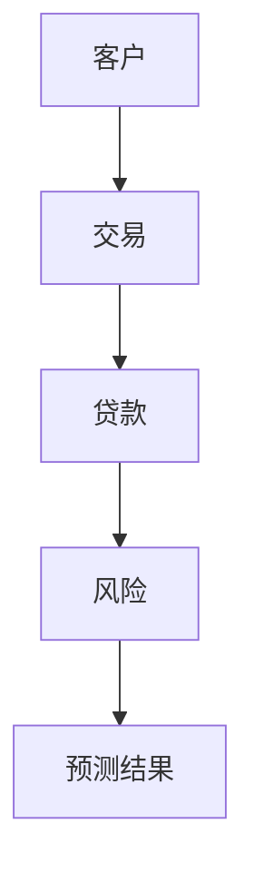
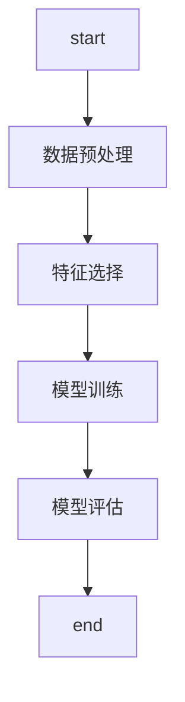
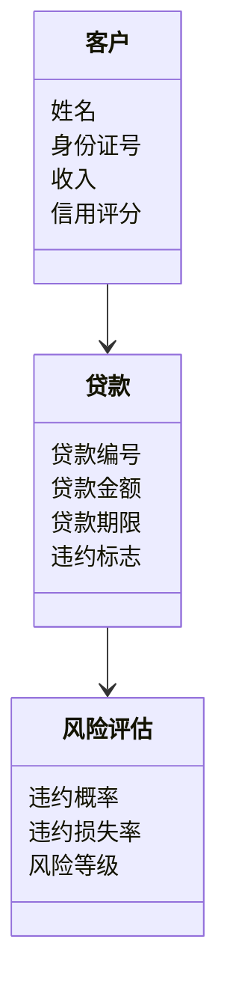
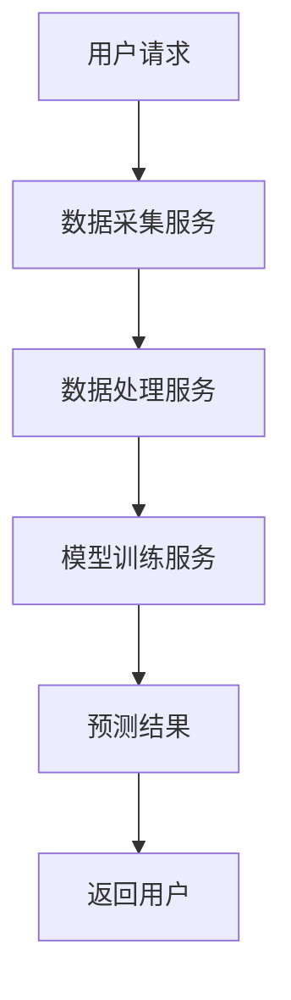

                 


# AI驱动的信用违约预测

## 关键词：信用违约、人工智能、机器学习、预测模型、金融风险、数据挖掘

## 摘要：  
本文深入探讨了如何利用人工智能技术驱动信用违约预测，通过分析信用违约的基本概念、AI在信用评估中的应用现状，以及常见算法（如逻辑回归和XGBoost）的原理和流程，结合系统架构设计和项目实战，为读者提供全面的技术指导。文章还总结了最佳实践经验和注意事项，帮助读者更好地理解和应用AI技术进行信用违约预测。

---

# 第一部分: 信用违约预测的背景与概述

## 第1章: 信用违约预测的背景与问题

### 1.1 信用违约的基本概念

#### 1.1.1 信用违约的定义与特征  
信用违约是指借款人未能按照约定偿还贷款本息的情况。其主要特征包括：  
- **违约概率**：借款人在一定期限内违约的可能性大小。  
- **违约损失率**：在违约发生时，债权人实际损失的比例。  
- **违约风险**：与宏观经济环境、借款人资质、担保情况等因素密切相关。  

#### 1.1.2 信用违约的经济影响  
信用违约不仅影响金融机构的资产质量，还会导致系统性金融风险。例如，2008年金融危机中，信用违约的急剧上升直接引发了全球性的经济危机。  

#### 1.1.3 信用违约预测的现实意义  
准确预测信用违约可以帮助金融机构提前采取措施，降低风险损失，同时优化资源配置，提升整体金融系统的稳定性。  

---

### 1.2 AI在信用评估中的应用现状

#### 1.2.1 传统信用评估方法的局限性  
传统信用评估主要依赖于信用评分模型（如FICO评分），存在以下问题：  
- 数据维度有限，难以捕捉复杂风险因素。  
- 模型更新周期长，难以适应快速变化的市场环境。  
- 对非结构化数据（如社交媒体数据）的利用不足。  

#### 1.2.2 AI技术在信用评估中的优势  
AI技术通过引入机器学习算法，能够处理海量数据，发现传统方法难以识别的模式和规律。例如：  
- **非线性关系**：AI可以捕捉借款人资质与违约概率之间的非线性关系。  
- **实时更新**：AI模型可以实时学习新的数据，快速适应市场变化。  
- **多维度分析**：AI能够整合结构化和非结构化数据，提升预测精度。  

#### 1.2.3 当前市场中的AI信用评估应用案例  
目前，许多金融机构已经在信用评估中引入AI技术。例如：  
- 某银行利用自然语言处理技术分析借款人的社交媒体数据，预测其违约概率。  
- 某金融科技公司通过深度学习模型预测小微企业贷款的违约风险。  

---

### 1.3 信用违约预测的核心问题

#### 1.3.1 信用违约预测的定义  
信用违约预测是通过分析借款人及相关因素，预测其在未来一定时间内发生违约的概率。  

#### 1.3.2 信用违约预测的关键因素  
- 借款人资质：包括收入、职业、信用历史等。  
- 宏观经济指标：如GDP增长率、失业率等。  
- 贷款特征：如贷款金额、还款期限、担保方式等。  

#### 1.3.3 信用违约预测的边界与外延  
信用违约预测的边界包括：  
- 数据范围：仅限于可获取的借款人数据。  
- 时间范围：预测未来一定时间内的违约概率。  
- 模型假设：假设模型在训练数据中的表现能够在未来数据中重复。  

---

## 第2章: 信用违约预测的核心概念与联系

### 2.1 核心概念原理

#### 2.1.1 信用评分模型的基本原理  
传统信用评分模型通常基于线性回归或逻辑回归，假设违约概率与借款人特征之间存在线性关系。  

#### 2.1.2 机器学习在信用评估中的应用  
机器学习算法（如随机森林、支持向量机、神经网络等）能够更好地捕捉复杂的非线性关系，提升预测精度。  

#### 2.1.3 AI驱动信用违约预测的数学基础  
AI驱动的信用违约预测依赖于概率论、统计学、线性代数和优化理论等数学基础。  

---

### 2.2 核心概念属性特征对比

#### 2.2.1 传统信用评估模型的特征对比  
| 特征 | 传统模型 | AI模型 |  
|------|----------|--------|  
| 数据维度 | 结构化数据为主 | 结构化+非结构化数据 |  
| 模型更新 | 周期性更新 | 实时更新 |  
| 预测精度 | 较低 | 较高 |  

#### 2.2.2 AI模型的特征对比  
| 特征 | AI模型 |  
|------|--------|  
| 数据处理能力 | 支持多维度、非线性数据 |  
| 模型复杂度 | 可处理高维数据，发现隐含规律 |  
| 可解释性 | 部分模型（如逻辑回归）可解释性较强，部分模型（如神经网络）可解释性较弱 |  

#### 2.2.3 两种模型的优劣势对比表格  
| 项目 | 传统模型优势 | AI模型优势 |  
|------|---------------|-------------|  
| 可解释性 | 高 | 较低（部分模型） |  
| 模型更新 | 周期性 | 实时 |  
| 数据需求 | 低 | 高 |  

---

### 2.3 ER实体关系图架构



---

# 第二部分: AI驱动信用违约预测的算法原理

## 第3章: 常见算法原理与流程图

### 3.1 逻辑回归算法

#### 3.1.1 逻辑回归的基本原理  
逻辑回归是一种广泛应用于分类任务的算法，适用于二分类问题。其核心思想是通过sigmoid函数将线性回归的输出映射到概率空间。  

#### 3.1.2 逻辑回归的数学模型  
逻辑回归的损失函数为：  
$$ L(y, y_{\text{pred}}) = -y \log(y_{\text{pred}}) - (1 - y) \log(1 - y_{\text{pred}}) $$  
其中，$y$ 为真实标签，$y_{\text{pred}}$ 为预测概率。  

#### 3.1.3 逻辑回归的流程图  


---

### 3.2 XGBoost算法

#### 3.2.1 XGBoost的基本原理  
XGBoost是一种基于树的集成算法，通过优化决策树的结构，提升模型的预测精度。  

#### 3.2.2 XGBoost的数学模型  
XGBoost的目标函数为：  
$$ \text{loss} = \sum_{i=1}^n \left[ -y_i \log(p_i) - (1 - y_i) \log(1 - p_i) \right] + \sum_{i=1}^n \lambda t_i^2 $$  
其中，$y_i$ 为真实标签，$p_i$ 为预测概率，$t_i$ 为树的结构参数。  

#### 3.2.3 XGBoost的流程图  


---

## 第4章: 算法原理的数学公式与代码实现

### 4.1 逻辑回归的Python实现

#### 4.1.1 数据预处理  
```python
import pandas as pd
from sklearn.model_selection import train_test_split
from sklearn.linear_model import LogisticRegression
from sklearn.metrics import accuracy_score

# 加载数据
data = pd.read_csv('credit.csv')
X = data[['income', 'loan_amount', 'credit_score']]
y = data['default']

# 划分训练集和测试集
X_train, X_test, y_train, y_test = train_test_split(X, y, test_size=0.2, random_state=42)
```

#### 4.1.2 模型训练与评估  
```python
# 训练模型
model = LogisticRegression()
model.fit(X_train, y_train)

# 预测与评估
y_pred = model.predict(X_test)
print("Accuracy:", accuracy_score(y_test, y_pred))
```

---

### 4.2 XGBoost的Python实现

#### 4.2.1 数据预处理  
```python
import xgboost as xgb

# 加载数据
data = pd.read_csv('credit.csv')
X = data[['income', 'loan_amount', 'credit_score']]
y = data['default']

# 划分训练集和测试集
X_train, X_test, y_train, y_test = train_test_split(X, y, test_size=0.2, random_state=42)
```

#### 4.2.2 模型训练与评估  
```python
# 训练模型
model = xgb.XGBClassifier()
model.fit(X_train, y_train)

# 预测与评估
y_pred = model.predict(X_test)
print("Accuracy:", accuracy_score(y_test, y_pred))
```

---

## 第5章: 系统分析与架构设计方案

### 5.1 问题场景介绍  
本文的系统旨在构建一个基于AI的信用违约预测系统，帮助金融机构实时预测客户的违约风险。

### 5.2 系统功能设计

#### 5.2.1 领域模型  


#### 5.2.2 系统架构设计  


---

## 第6章: 项目实战

### 6.1 环境安装  
```bash
pip install pandas scikit-learn xgboost
```

### 6.2 核心实现代码

#### 6.2.1 数据预处理  
```python
import pandas as pd
from sklearn.model_selection import train_test_split
from sklearn.preprocessing import StandardScaler

# 加载数据
data = pd.read_csv('credit.csv')

# 数据清洗
data.dropna(inplace=True)

# 特征选择
X = data[['income', 'loan_amount', 'credit_score']]
y = data['default']

# 数据标准化
scaler = StandardScaler()
X_scaled = scaler.fit_transform(X)

# 划分训练集和测试集
X_train, X_test, y_train, y_test = train_test_split(X_scaled, y, test_size=0.2, random_state=42)
```

#### 6.2.2 模型训练与部署  
```python
from sklearn.linear_model import LogisticRegression
from sklearn.metrics import classification_report

# 训练模型
model = LogisticRegression()
model.fit(X_train, y_train)

# 预测与评估
y_pred = model.predict(X_test)
print(classification_report(y_test, y_pred))
```

---

## 第7章: 最佳实践与注意事项

### 7.1 最佳实践  
- **数据清洗**：确保数据的完整性和准确性。  
- **特征工程**：通过特征选择和特征构建提升模型性能。  
- **模型调优**：使用交叉验证和超参数优化提升模型效果。  

### 7.2 注意事项  
- **数据隐私**：确保数据处理符合隐私保护法规。  
- **模型解释性**：选择合适的模型，在可解释性和性能之间找到平衡。  
- **实时更新**：定期更新模型，确保其适应市场变化。  

### 7.3 拓展阅读  
- 《机器学习实战》  
- 《深入浅出机器学习》  
- 《信用评分模型开发与应用》  

---

# 作者：AI天才研究院/AI Genius Institute & 禅与计算机程序设计艺术 /Zen And The Art of Computer Programming

