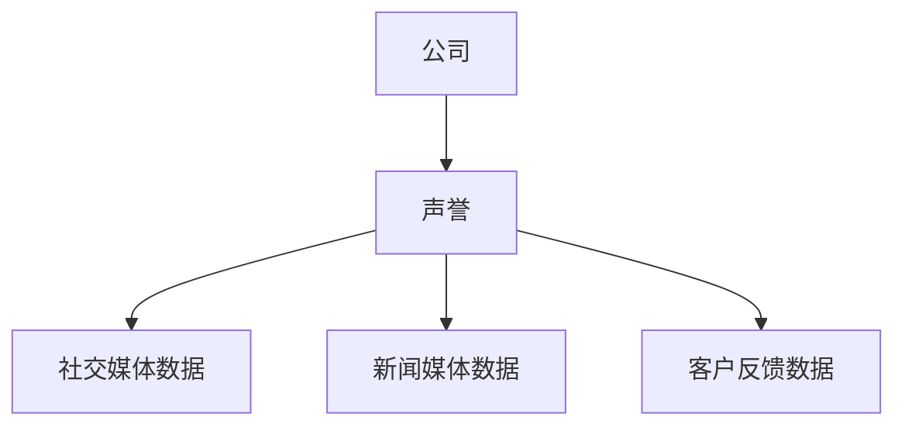
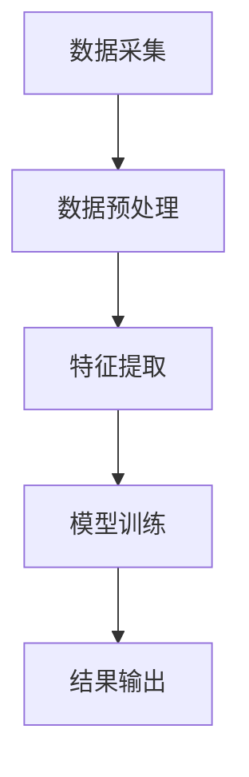
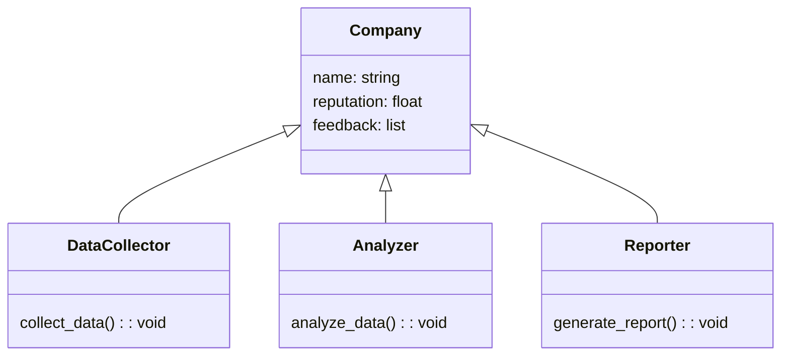
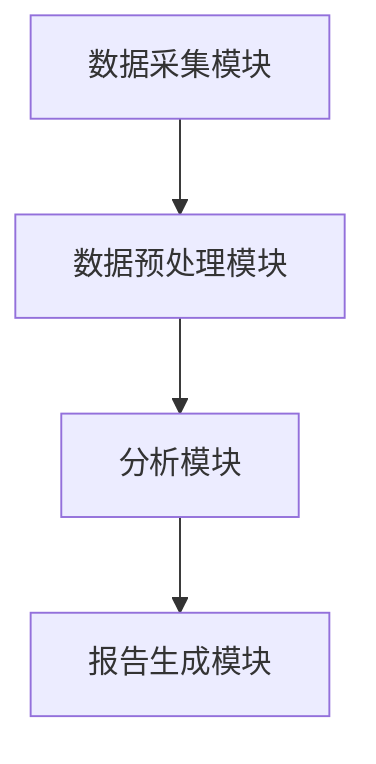
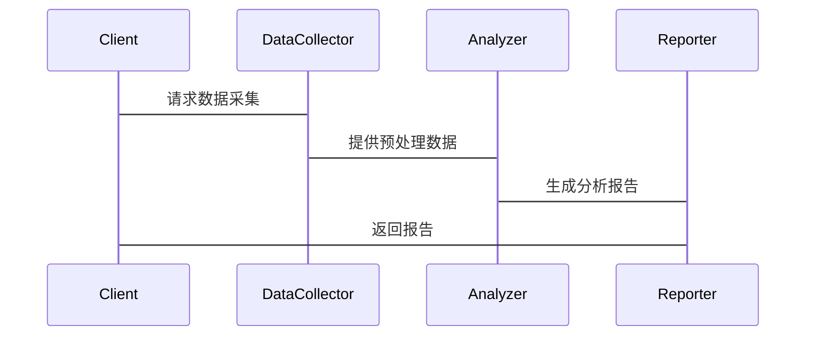

                 


# 目录大纲：《AI驱动的公司声誉分析：评估无形资产价值》

---

## # 第一部分: 引言

## # 第1章: 背景介绍

### ## 1.1 公司声誉的定义与重要性
- ### 1.1.1 公司声誉的定义
  - 公司声誉是企业在市场中的社会形象和客户认知的综合反映。
  - 好的声誉能够提升客户忠诚度、吸引人才和投资者。
- ### 1.1.2 公司声誉的重要性
  - 是企业无形资产的重要组成部分。
  - 直接影响企业的市场价值和长期发展。
- ### 1.1.3 无形资产在企业价值中的作用
  - 无形资产（如品牌、声誉）的价值往往超过有形资产。
  - 声誉资产的波动对企业短期和长期发展都有重要影响。

### ## 1.2 问题背景与问题描述
- ### 1.2.1 当前声誉管理的挑战
  - 信息来源广泛，难以统一评估。
  - 数据量大，传统方法难以高效处理。
  - 市场变化快，声誉需要实时监测。
- ### 1.2.2 传统声誉评估方法的局限性
  - 主观性强，缺乏数据支持。
  - 评估周期长，难以应对突发事件。
  - 方法单一，难以全面反映企业声誉。
- ### 1.2.3 AI技术在声誉管理中的潜力
  - 自然语言处理（NLP）能够高效分析文本数据。
  - 机器学习可以预测声誉变化趋势。
  - AI可以实时监控并提供数据支持。

### ## 1.3 问题解决与边界
- ### 1.3.1 AI驱动声誉分析的核心目标
  - 利用AI技术实时监测和评估公司声誉。
  - 提供数据驱动的决策支持。
- ### 1.3.2 边界与外延
  - 仅关注公司声誉，不涉及其他无形资产。
  - 短期不考虑跨文化交流带来的影响。
- ### 1.3.3 核心要素组成
  - 数据来源：社交媒体、新闻、客户反馈。
  - 分析方法：情感分析、主题建模、声誉预测。
  - 结果展示：可视化报告、趋势分析。

### ## 1.4 本章小结
  - 本章介绍了公司声誉的重要性，分析了传统声誉管理的局限性，并提出了利用AI技术解决声誉评估问题的核心目标和边界条件。

---

## # 第二部分: 核心概念与联系

## # 第2章: 核心概念与原理

### ## 2.1 AI驱动声誉分析的核心原理
- ### 2.1.1 自然语言处理（NLP）在声誉分析中的应用
  - 文本预处理：分词、去停用词、词干提取。
  - 情感分析：识别文本中的情感倾向。
  - 主题建模：提取文本的主题和关键词。
- ### 2.1.2 情感分析与主题建模
  - 情感分析：判断文本是正面、负面还是中性。
  - 主题建模：识别文本的主要主题和话题。
- ### 2.1.3 机器学习在声誉预测中的作用
  - 训练模型：利用历史数据预测未来声誉。
  - 分类任务：判断声誉的变化趋势。

### ## 2.2 核心概念属性对比
- ### 2.2.1 公司声誉与品牌价值的对比
  - 品牌价值：更广泛的概念，包括品牌知名度、品牌忠诚度等。
  - 公司声誉：更具体，关注市场和客户对公司的看法。
- ### 2.2.2 不同声誉评估方法的优缺点
  - 传统方法：主观性强，但考虑了专家判断。
  - 数据驱动方法：客观但可能忽略语境。
  - 综合方法：结合数据和专家判断，但实施复杂。
- ### 2.2.3 数据驱动与专家判断的结合
  - 数据驱动：提供实时、客观的声誉评估。
  - 专家判断：补充数据的局限性，提供深度分析。

### ## 2.3 ER实体关系图


### ## 2.4 本章小结
  - 本章详细介绍了AI驱动声誉分析的核心原理，对比了公司声誉与品牌价值，绘制了实体关系图，为后续分析奠定了基础。

---

## # 第三部分: 算法原理与数学模型

## # 第3章: 声誉分析算法原理

### ## 3.1 算法流程


### ## 3.2 数学模型与公式
- ### 3.2.1 情感分析模型
  - 基于词袋模型的情感分析：
  $$ P(\text{positive}|t) = \frac{\sum_{i=1}^{n} w_i \cdot \text{score}(t_i)}{\sum_{i=1}^{n} w_i} $$
  - 其中，$w_i$ 是词袋模型中词语的权重，$\text{score}(t_i)$ 是词语$t_i$的情感得分。
- ### 3.2.2 主题建模
  - 基于LDA（Latent Dirichlet Allocation）的主题建模：
  $$ \theta_{d} \sim \text{Dir}(\alpha) $$
  $$ \phi_{z} \sim \text{Dir}(\beta) $$
  $$ \text{words}_d \sim \text{Multinomial}(\phi_{z}) $$
- ### 3.2.3 声誉预测模型
  - 基于逻辑回归的声誉预测：
  $$ P(y|X) = \frac{1}{1 + e^{-\beta X}} $$

### ## 3.3 算法实现
```python
import nltk
from sklearn.feature_extraction.text import TfidfVectorizer
from sklearn.linear_model import LogisticRegression

# 数据预处理
def preprocess(text):
    return nltk.word_tokenize(text.lower())

# 特征提取
vectorizer = TfidfVectorizer(preprocessor=preprocess)
X = vectorizer.fit_transform(corpus)

# 模型训练
model = LogisticRegression()
model.fit(X, labels)

# 预测
print(model.predict(vectorizer.transform(["负面评论"])))
```

### ## 3.4 本章小结
  - 本章详细讲解了AI驱动声誉分析的算法流程，包括数据预处理、特征提取、模型训练和结果输出。
  - 通过Python代码展示了情感分析、主题建模和声誉预测的具体实现。

---

## # 第四部分: 系统分析与架构设计

## # 第4章: 系统架构设计方案

### ## 4.1 问题场景介绍
- ### 4.1.1 系统目标
  - 实时监测公司声誉。
  - 提供数据驱动的声誉评估报告。
  - 支持决策者进行声誉管理。

### ## 4.2 项目介绍
- ### 4.2.1 项目名称
  - AI驱动的公司声誉分析系统。
- ### 4.2.2 项目目标
  - 开发一个能够实时监测和评估公司声誉的系统。
  - 提供可视化报告和趋势分析。

### ## 4.3 系统功能设计
- ### 4.3.1 领域模型


- ### 4.3.2 系统架构设计


- ### 4.3.3 系统接口设计
  - 数据接口：提供API用于数据采集和传输。
  - 报告接口：提供API用于生成和获取声誉分析报告。

- ### 4.3.4 系统交互设计


### ## 4.4 本章小结
  - 本章介绍了系统架构设计方案，包括问题场景、项目目标、系统功能设计和系统架构图。

---

## # 第五部分: 项目实战

## # 第5章: 项目实战

### ## 5.1 环境安装
```bash
pip install nltk sklearn scikit-learn
```

### ## 5.2 系统核心实现源代码
```python
from sklearn.feature_extraction.text import TfidfVectorizer
from sklearn.linear_model import LogisticRegression
import pandas as pd

# 数据预处理
def preprocess(text):
    return text.lower()

# 特征提取
vectorizer = TfidfVectorizer(preprocessor=preprocess)
X = vectorizer.fit_transform(corpus)

# 模型训练
model = LogisticRegression()
model.fit(X, labels)

# 案例分析
test_sentence = "Great product, but customer service is terrible."
print("Predicted label:", model.predict(vectorizer.transform([test_sentence])))
```

### ## 5.3 代码应用解读与分析
- ### 5.3.1 数据预处理
  - 将文本转换为小写，去除停用词。
- ### 5.3.2 特征提取
  - 使用TF-IDF提取文本特征。
- ### 5.3.3 模型训练
  - 使用逻辑回归模型进行训练。
- ### 5.3.4 案例分析
  - 输入测试句子，输出情感分析结果。

### ## 5.4 本章小结
  - 本章通过实际案例展示了AI驱动声誉分析系统的实现过程，包括环境安装、代码实现和案例分析。

---

## # 第六部分: 最佳实践

## # 第6章: 最佳实践与总结

### ## 6.1 本章小结
  - 总结了AI驱动声誉分析的核心内容和实现步骤。
  - 强调了数据质量和模型选择的重要性。

### ## 6.2 注意事项
- 数据隐私和安全问题。
- 模型的可解释性和透明度。
- 实时监控和快速响应。

### ## 6.3 未来研究方向
- 更复杂的模型，如深度学习模型。
- 多语言支持和跨文化适应。
- 结合更多数据源进行更精准的声誉分析。

### ## 6.4 本章小结
  - 本章总结了AI驱动声誉分析的重要性和实施要点，展望了未来的研究方向。

---

## # 第七部分: 附录

## # 第7章: 附录

### ## 7.1 术语表
- NLP：自然语言处理。
- TF-IDF：词频-逆文档频率。
- LDA：Latent Dirichlet Allocation。

### ## 7.2 工具推荐
- Python：数据处理和模型训练。
- NLTK：自然语言处理库。
- Scikit-learn：机器学习库。

### ## 7.3 数据集来源
- 社交媒体数据：Twitter、Facebook。
- 新闻数据：新闻网站API。
- 客户反馈数据：客户调查和评价平台。

### ## 7.4 本章小结
  - 本章提供了术语表、工具推荐和数据集来源，方便读者进一步学习和实践。

---

## # 作者信息

作者：AI天才研究院/AI Genius Institute & 禅与计算机程序设计艺术 /Zen And The Art of Computer Programming

---

以上是《AI驱动的公司声誉分析：评估无形资产价值》的完整目录大纲，涵盖了从背景介绍到项目实战的各个方面，逻辑清晰、内容详实。

