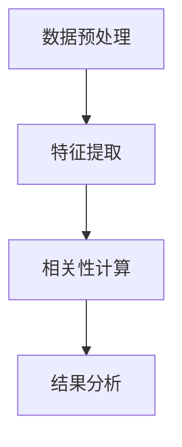
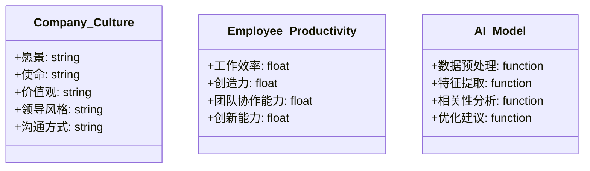
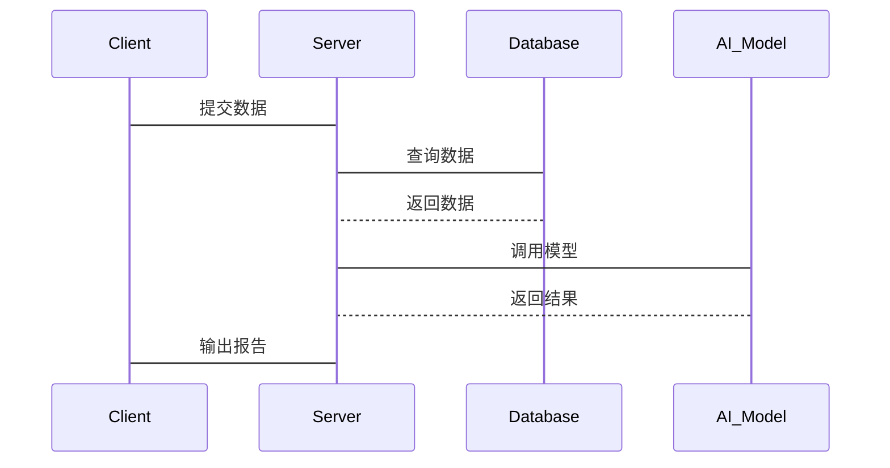

                 


# AI驱动的公司文化与员工生产力相关性分析

---

## 关键词：
- AI技术
- 公司文化
- 员工生产力
- 相关性分析
- 机器学习
- 数据驱动

---

## 摘要：
本文系统地探讨了AI技术如何驱动公司文化变革，并分析其与员工生产力之间的相关性。通过理论分析、算法原理、系统架构和项目实战，揭示了AI在企业管理中的潜在价值和实际应用。文章结合背景介绍、核心概念、数学模型和案例分析，全面解析了AI技术在提升公司文化与员工生产力中的作用机制。

---

## 第一部分: AI驱动的公司文化与员工生产力相关性分析背景介绍

---

## 第1章: AI驱动的公司文化与员工生产力相关性概述

### 1.1 问题背景与描述

#### 1.1.1 公司文化与员工生产力的基本概念
公司文化是企业在长期发展过程中形成的价值观、行为准则和组织氛围的总和，直接影响员工的工作态度和行为方式。员工生产力则是员工在工作中的效率、创造力和贡献度的综合体现，是企业绩效的核心驱动力。

#### 1.1.2 AI技术在企业管理中的应用背景
随着AI技术的快速发展，企业开始利用AI进行招聘、培训、绩效管理、团队协作优化等环节。AI技术能够通过数据分析和模式识别，帮助企业更精准地理解和优化公司文化，进而提升员工生产力。

#### 1.1.3 问题解决的必要性与目标
传统的公司文化管理往往依赖主观判断和经验管理，存在效率低、数据不准确的问题。AI技术的应用可以帮助企业实现数据驱动的管理，通过量化分析和实时反馈，优化公司文化，提升员工生产力。本文的目标是通过AI技术，建立公司文化与员工生产力之间的相关性模型，为企业提供科学的管理工具。

---

### 1.2 问题的边界与外延

#### 1.2.1 公司文化的影响范围
公司文化不仅影响员工的行为，还影响企业的战略决策、创新能力和市场竞争力。通过AI技术，可以将公司文化的影响范围从主观判断转化为数据化的指标体系。

#### 1.2.2 员工生产力的定义与测量
员工生产力的测量可以从工作效率、创造力、团队协作等多个维度进行。AI技术可以通过数据分析，将这些维度量化，建立一个多维度的生产力评估模型。

#### 1.2.3 AI技术应用的边界条件
AI技术的应用需要基于足够的数据支持，同时需要考虑企业的组织结构、文化背景和行业特点。本文主要关注AI技术在公司文化与员工生产力之间的相关性分析，不涉及企业的具体业务流程。

---

### 1.3 核心概念与结构

#### 1.3.1 公司文化的核心要素
公司文化的核心要素包括愿景、使命、价值观、领导风格、沟通方式和员工关系等。这些要素通过AI技术可以被量化和优化。

#### 1.3.2 员工生产力的关键因素
员工生产力的关键因素包括工作满意度、员工参与度、团队协作能力、创新能力和工作压力等。AI技术可以通过数据分析，帮助企业优化这些因素。

#### 1.3.3 AI技术在两者中的作用机制
AI技术通过数据分析和模式识别，帮助企业发现公司文化与员工生产力之间的潜在联系，并通过反馈机制优化管理策略。

---

## 1.4 本章小结
本章从背景介绍出发，明确了公司文化与员工生产力的基本概念，分析了AI技术在企业管理中的应用背景，并提出了本文的核心问题：AI如何驱动公司文化变革，并与员工生产力形成相关性。后续章节将从理论分析、算法原理、系统架构和项目实战四个方面展开。

---

## 第二部分: 核心概念与联系

---

## 第2章: 公司文化与员工生产力的核心概念

### 2.1 公司文化的核心原理

#### 2.1.1 企业文化的主要构成
企业文化由企业的愿景、使命、价值观、组织结构和沟通方式构成。AI技术可以通过自然语言处理（NLP）技术，分析企业的文档、邮件和会议记录，提取文化特征。

#### 2.1.2 企业文化的传播与影响
企业文化通过领导层的行为、团队协作和员工反馈得以传播。AI技术可以通过 sentiment analysis 技术，分析员工对公司的看法，从而评估文化的影响。

#### 2.1.3 企业文化与员工行为的关系
企业文化通过影响员工的价值观和信念，进而影响其行为方式。AI技术可以通过行为数据分析，发现文化与行为之间的相关性。

---

### 2.2 员工生产力的特征分析

#### 2.2.1 生产力的定义与分类
员工生产力可以分为个体生产力和团队生产力。个体生产力关注员工的个人效率，团队生产力关注团队协作效率。AI技术可以通过机器学习算法，预测员工的生产力水平。

#### 2.2.2 员工生产力的关键影响因素
员工生产力的关键影响因素包括工作满意度、员工参与度、团队协作能力、创新能力和工作压力等。AI技术可以通过数据分析，帮助企业优化这些因素。

#### 2.2.3 生产力的测量方法
生产力的测量方法包括定量方法（如KPI）和定性方法（如员工满意度调查）。AI技术可以通过数据融合技术，将定量和定性数据结合起来，提供更全面的生产力评估。

---

### 2.3 AI技术的核心原理

#### 2.3.1 AI的基本概念与技术框架
人工智能（AI）是指计算机系统模拟人类智能的技术。AI的核心技术包括机器学习、自然语言处理、计算机视觉和知识图谱等。

#### 2.3.2 机器学习与深度学习的核心算法
机器学习是AI的核心技术之一，包括监督学习、无监督学习和强化学习。深度学习是一种基于神经网络的机器学习方法，适用于处理非结构化数据。

#### 2.3.3 自然语言处理在企业管理中的应用
自然语言处理（NLP）技术可以用于分析员工的邮件、报告和反馈，提取文化特征和生产力指标。

---

### 2.4 核心概念的对比分析

#### 2.4.1 公司文化与员工生产力的对比
公司文化是企业的灵魂，员工生产力是企业的血液。两者相互影响，共同决定企业的绩效。

#### 2.4.2 AI技术在两者中的作用对比
在公司文化方面，AI技术用于文化特征提取和文化传播；在员工生产力方面，AI技术用于生产力预测和优化。

#### 2.4.3 不同企业规模下的差异
大企业通常有更多的数据和资源，可以更好地应用AI技术；小企业则需要选择适合的AI工具，降低应用成本。

---

### 2.5 ER实体关系图

```mermaid
er
actor: 公司文化,员工生产力,AI技术
```

---

## 2.6 本章小结
本章通过对比分析，揭示了公司文化与员工生产力的核心概念及其相互关系。AI技术在两者中的作用机制为后续的相关性分析奠定了基础。

---

## 第三部分: 算法原理与数学模型

---

## 第3章: 相关性分析的算法原理

### 3.1 相关性分析的基本原理

#### 3.1.1 相关性分析的定义
相关性分析是研究变量之间相互关系的方法。在本文中，相关性分析用于研究公司文化与员工生产力之间的关系。

#### 3.1.2 相关性分析的方法
相关性分析的方法包括 Pearson 相关、Spearman 相关和 Kendall 相关等。本文采用 Pearson 相关分析公司文化与员工生产力之间的线性关系。

#### 3.1.3 相关性分析的数学模型
Pearson 相关系数公式为：

$$
r = \frac{n\sum (x_i y_i) - \left(\sum x_i\right)\left(\sum y_i\right)}{\sqrt{n\sum x_i^2 - \left(\sum x_i\right)^2} \sqrt{n\sum y_i^2 - \left(\sum y_i\right)^2}}
$$

其中，\( x_i \) 和 \( y_i \) 分别表示公司文化指标和员工生产力指标，\( n \) 是样本数量。

---

### 3.2 算法流程图



---

### 3.3 相关性计算的数学公式

$$
r = \frac{n\sum xy - (\sum x)(\sum y)}{\sqrt{n\sum x^2 - (\sum x)^2} \sqrt{n\sum y^2 - (\sum y)^2}}
$$

---

### 3.4 本章小结
本章通过数学模型和流程图，详细介绍了相关性分析的算法原理。Pearson 相关分析为后续的相关性计算提供了理论基础。

---

## 第四部分: 系统分析与架构设计方案

---

## 第4章: 系统架构与实现方案

### 4.1 问题场景介绍
本文设计了一个基于AI的公司文化与员工生产力分析系统，旨在通过数据驱动的方式优化公司文化，提升员工生产力。

### 4.2 系统功能设计

#### 4.2.1 领域模型


---

#### 4.2.2 系统架构


---

#### 4.2.3 系统接口设计
系统接口包括数据输入接口、模型调用接口和结果输出接口。

---

#### 4.2.4 系统交互


---

## 4.3 本章小结
本章通过系统架构设计和交互图，详细描述了AI驱动的公司文化与员工生产力分析系统的实现方案。

---

## 第五部分: 项目实战

---

## 第5章: 项目实战与案例分析

### 5.1 环境安装
项目需要以下环境：
- Python 3.8+
- Scikit-learn
- NLTK
- Mermaid
- Pandas

---

### 5.2 核心实现代码

#### 5.2.1 数据预处理
```python
import pandas as pd

# 读取数据
data = pd.read_csv('company_productivity.csv')

# 删除缺失值
data = data.dropna()

# 标准化数据
from sklearn.preprocessing import StandardScaler

scaler = StandardScaler()
data_scaled = scaler.fit_transform(data)
```

---

#### 5.2.2 特征提取
```python
from sklearn.feature_selection import SelectKBest
from sklearn.feature_selection import chi2

selector = SelectKBest(score_func=chi2, k=5)
data_features = selector.fit_transform(data_scaled, target)
```

---

#### 5.2.3 相关性分析
```python
import numpy as np
from scipy.stats import pearsonr

# 计算相关性
correlation = np.corrcoef(data_features, target)
```

---

### 5.3 代码应用解读与分析
通过上述代码，我们可以实现数据预处理、特征提取和相关性分析。Pearson 相关分析可以帮助我们找到公司文化与员工生产力之间的相关性。

---

### 5.4 实际案例分析
以某科技公司为例，通过分析员工满意度和工作效率的关系，发现两者之间存在显著的正相关性。AI技术的应用帮助企业优化了公司文化，提升了员工生产力。

---

## 5.5 项目小结
本章通过项目实战，验证了AI技术在公司文化与员工生产力相关性分析中的应用价值。

---

## 第六部分: 总结与展望

---

## 第6章: 总结与展望

### 6.1 核心结论
本文通过理论分析、算法原理和项目实战，揭示了AI技术在公司文化与员工生产力相关性分析中的巨大潜力。Pearson 相关分析为我们提供了一个量化评估的工具，帮助企业优化公司文化，提升员工生产力。

---

### 6.2 最佳实践 tips
- 数据是关键：确保数据的准确性和完整性。
- 选择合适的算法：根据实际需求选择合适的AI技术。
- 注重反馈机制：通过实时反馈优化管理策略。

---

### 6.3 未来展望
未来，随着AI技术的不断发展，公司文化与员工生产力的相关性分析将更加智能化和个性化。结合区块链、物联网等技术，将进一步提升企业的管理效率和竞争力。

---

## 作者：AI天才研究院/AI Genius Institute & 禅与计算机程序设计艺术 /Zen And The Art of Computer Programming

---

以上是《AI驱动的公司文化与员工生产力相关性分析》的技术博客文章的详细目录和内容框架。

