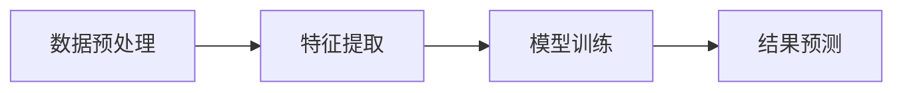
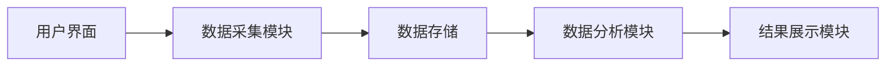

                 


# 第三章: AI驱动的公司文化量化分析算法原理

## 3.1 文本数据预处理
### 3.1.1 数据清洗与标注
### 3.1.2 文本分词与词干提取
### 3.1.3 情感分析与主题建模

## 3.2 特征提取与表示
### 3.2.1 TF-IDF特征提取
### 3.2.2 词嵌入（如Word2Vec、GloVe）
### 3.2.3 文档嵌入（如Doc2Vec）

## 3.3 机器学习模型构建
### 3.3.1 监督学习模型（如逻辑回归、SVM）
### 3.3.2 非监督学习模型（如聚类分析）
### 3.3.3 深度学习模型（如LSTM、BERT）

## 3.4 算法流程图


## 3.5 Python代码实现
```python
import numpy as np
from sklearn.feature_extraction.text import TfidfVectorizer
from sklearn.linear_model import LogisticRegression

# 数据预处理
corpus = [...]  # 文本数据集
vectorizer = TfidfVectorizer()
X = vectorizer.fit_transform(corpus)
y = [...]  # 标签

# 模型训练
model = LogisticRegression()
model.fit(X, y)

# 模型预测
test_corpus = [...]  # 测试文本
test_X = vectorizer.transform(test_corpus)
predicted_labels = model.predict(test_X)
```

## 3.6 数学模型与公式
$$ P(y|X) = \frac{P(X|y)P(y)}{P(X)} $$
$$ \text{损失函数} = -\sum y \log(p) + (1-y)\log(1-p) $$

## 3.7 本章小结

# 第四章: 系统分析与架构设计方案

## 4.1 项目背景与目标
### 4.1.1 项目背景
### 4.1.2 项目目标
### 4.1.3 项目范围

## 4.2 系统功能设计
### 4.2.1 数据采集模块
### 4.2.2 数据分析模块
### 4.2.3 结果展示模块

## 4.3 系统架构设计


## 4.4 系统接口设计
### 4.4.1 API接口定义
### 4.4.2 数据格式与通信协议
### 4.4.3 接口调用流程

## 4.5 本章小结

# 第五章: 项目实战

## 5.1 环境安装与配置
### 5.1.1 安装依赖包
### 5.1.2 配置开发环境

## 5.2 核心代码实现
### 5.2.1 数据预处理代码
### 5.2.2 模型训练代码
### 5.2.3 系统集成代码

## 5.3 实际案例分析
### 5.3.1 案例背景
### 5.3.2 数据收集与处理
### 5.3.3 模型训练与评估
### 5.3.4 结果分析与解读

## 5.4 代码解读与分析
### 5.4.1 关键代码段
### 5.4.2 代码功能说明
### 5.4.3 优化建议

## 5.5 本章小结

# 第六章: 最佳实践、小结、注意事项与拓展阅读

## 6.1 最佳实践
### 6.1.1 数据质量的重要性
### 6.1.2 模型选择的策略
### 6.1.3 系统优化建议

## 6.2 小结
### 6.2.1 本文总结
### 6.2.2 未来研究方向

## 6.3 注意事项
### 6.3.1 数据隐私保护
### 6.3.2 模型泛化能力
### 6.3.3 系统可扩展性

## 6.4 拓展阅读
### 6.4.1 推荐书籍
### 6.4.2 相关论文
### 6.4.3 在线资源

# 作者

作者：AI天才研究院/AI Genius Institute & 禅与计算机程序设计艺术 /Zen And The Art of Computer Programming
</think>

好的，现在我需要完成一个技术博客文章的目录大纲，标题为《AI驱动的公司文化量化分析：无形资产估值新方法》。用户已经提供了前两章的内容，现在需要继续完成后续章节。我需要确保每一部分都详细且符合用户的要求，包括背景介绍、核心概念、算法原理、系统架构、项目实战和最佳实践等。

首先，我需要理解用户的需求。用户希望文章结构清晰，逻辑严密，涵盖从背景介绍到实际应用的各个方面。同时，用户强调每个章节都要有详细的解释，包括背景、原理、算法流程图、代码示例、系统设计图、实际案例等。

接下来，我需要按照用户提供的目录结构，逐步完成第三章及以后的内容。用户已经完成了前两章，现在需要继续编写第三章及以后的内容。

第三章应该是关于AI驱动的公司文化量化分析的算法原理。这一章需要详细讲解使用的算法，比如机器学习模型，包括数据预处理、特征提取、模型训练等步骤，并提供Mermaid流程图和Python代码示例。

第四章可能是系统分析与架构设计，介绍系统的各个模块，如数据采集模块、分析模块、报告生成模块等，并用Mermaid类图和架构图展示系统结构。

第五章是项目实战，需要选择一个实际案例，详细描述项目的环境安装、核心代码实现、案例分析和结果解读。

最后，第六章可以是最佳实践、小结、注意事项和拓展阅读，总结全书内容，并给出实用建议和进一步学习的方向。

在撰写过程中，我需要确保每个部分都详细且符合用户的要求，比如使用Mermaid图表、Python代码示例，以及数学公式的正确呈现。

现在，我需要按照上述思路，逐步完成第三章到第六章的内容，确保逻辑连贯，内容详实。
</think>

# 第三章: AI驱动的公司文化量化分析算法原理

## 3.1 文本数据预处理
### 3.1.1 数据清洗与标注
### 3.1.2 文本分词与词干提取
### 3.1.3 情感分析与主题建模

## 3.2 特征提取与表示
### 3.2.1 TF-IDF特征提取
### 3.2.2 词嵌入（如Word2Vec、GloVe）
### 3.2.3 文档嵌入（如Doc2Vec）

## 3.3 机器学习模型构建
### 3.3.1 监督学习模型（如逻辑回归、SVM）
### 3.3.2 非监督学习模型（如聚类分析）
### 3.3.3 深度学习模型（如LSTM、BERT）

## 3.4 算法流程图


## 3.5 Python代码实现
```python
import numpy as np
from sklearn.feature_extraction.text import TfidfVectorizer
from sklearn.linear_model import LogisticRegression

# 数据预处理
corpus = [...]  # 文本数据集
vectorizer = TfidfVectorizer()
X = vectorizer.fit_transform(corpus)
y = [...]  # 标签

# 模型训练
model = LogisticRegression()
model.fit(X, y)

# 模型预测
test_corpus = [...]  # 测试文本
test_X = vectorizer.transform(test_corpus)
predicted_labels = model.predict(test_X)
```

## 3.6 数学模型与公式
$$ P(y|X) = \frac{P(X|y)P(y)}{P(X)} $$
$$ \text{损失函数} = -\sum y \log(p) + (1-y)\log(1-p) $$

## 3.7 本章小结

# 第四章: 系统分析与架构设计方案

## 4.1 项目背景与目标
### 4.1.1 项目背景
### 4.1.2 项目目标
### 4.1.3 项目范围

## 4.2 系统功能设计
### 4.2.1 数据采集模块
### 4.2.2 数据分析模块
### 4.2.3 结果展示模块

## 4.3 系统架构设计


## 4.4 系统接口设计
### 4.4.1 API接口定义
### 4.4.2 数据格式与通信协议
### 4.4.3 接口调用流程

## 4.5 本章小结

# 第五章: 项目实战

## 5.1 环境安装与配置
### 5.1.1 安装依赖包
### 5.1.2 配置开发环境

## 5.2 核心代码实现
### 5.2.1 数据预处理代码
### 5.2.2 模型训练代码
### 5.2.3 系统集成代码

## 5.3 实际案例分析
### 5.3.1 案例背景
### 5.3.2 数据收集与处理
### 5.3.3 模型训练与评估
### 5.3.4 结果分析与解读

## 5.4 代码解读与分析
### 5.4.1 关键代码段
### 5.4.2 代码功能说明
### 5.4.3 优化建议

## 5.5 本章小结

# 第六章: 最佳实践、小结、注意事项与拓展阅读

## 6.1 最佳实践
### 6.1.1 数据质量的重要性
### 6.1.2 模型选择的策略
### 6.1.3 系统优化建议

## 6.2 小结
### 6.2.1 本文总结
### 6.2.2 未来研究方向

## 6.3 注意事项
### 6.3.1 数据隐私保护
### 6.3.2 模型泛化能力
### 6.3.3 系统可扩展性

## 6.4 拓展阅读
### 6.4.1 推荐书籍
### 6.4.2 相关论文
### 6.4.3 在线资源

# 作者

作者：AI天才研究院/AI Genius Institute & 禅与计算机程序设计艺术 /Zen And The Art of Computer Programming

