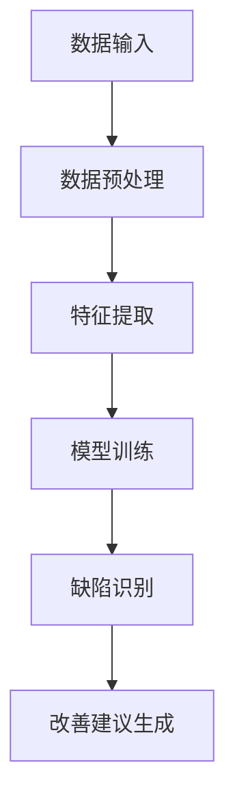
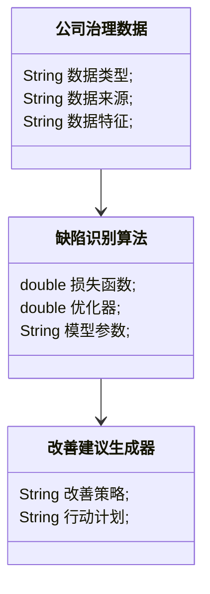
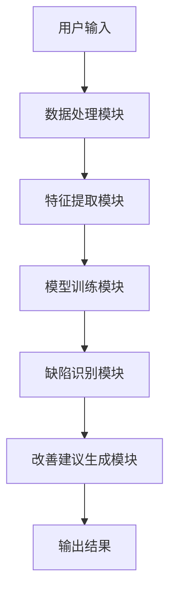
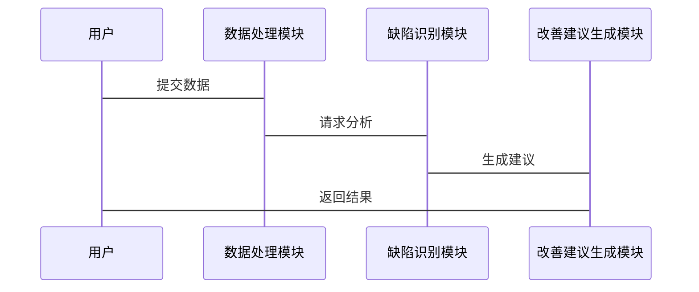

                 

# AI驱动的公司治理缺陷识别与改善建议

> 关键词：AI, 公司治理, 缺陷识别, 改善建议, 人工智能, 监督学习, 系统架构

> 摘要：本文将探讨如何利用AI技术驱动公司治理缺陷的识别与改善。通过分析公司治理的核心要素、AI技术的应用背景，以及缺陷识别的算法原理和系统架构，提出具体的改善建议。文章内容涵盖从理论到实践的各个方面，结合实际案例和最佳实践，为读者提供系统的解决方案。

---

## 目录大纲

### 第一部分: AI驱动的公司治理缺陷识别与改善的背景与核心概念

#### 第1章: 公司治理缺陷识别的背景与问题描述

##### 1.1 公司治理的基本概念与核心要素
- 1.1.1 公司治理的定义与内涵
- 1.1.2 公司治理的核心要素与结构
- 1.1.3 公司治理缺陷的常见类型与表现形式

##### 1.2 AI技术在公司治理中的应用背景
- 1.2.1 传统公司治理的局限性
- 1.2.2 AI技术如何赋能公司治理
- 1.2.3 当前AI在公司治理中的应用现状

#### 第2章: AI驱动的公司治理缺陷识别与改善的核心概念

##### 2.1 AI驱动的公司治理缺陷识别的基本原理
- 2.1.1 数据驱动的公司治理分析
- 2.1.2 AI算法在缺陷识别中的作用
- 2.1.3 缺陷识别的边界与外延

##### 2.2 核心概念与联系
- 2.2.1 AI技术与公司治理的实体关系图（Mermaid）
- 2.2.2 缺陷识别的核心要素与属性特征对比表
- 2.2.3 AI驱动的缺陷识别流程图（Mermaid）

---

### 第二部分: AI驱动的公司治理缺陷识别算法原理与实现

#### 第3章: 缺陷识别的算法原理与数学模型

##### 3.1 基于监督学习的缺陷分类算法
- 3.1.1 监督学习的基本原理
- 3.1.2 缺陷分类的数学模型
- 3.1.3 损失函数与优化器的选择

##### 3.2 缺陷识别的数学模型与公式
- 3.2.1 线性回归模型: $$1+1=2$$
- 3.2.2 逻辑回归模型: $$P(y=1|x) = \frac{1}{1 + e^{-\beta x}}$$
- 3.2.3 支持向量机模型: $$\max_{\beta, b} \min_{(x_i,y_i)} [y_i(\beta \cdot x_i + b) - 1]$$

##### 3.3 算法实现流程图（Mermaid）

---

### 第三部分: 系统分析与架构设计

#### 第4章: 系统分析与架构设计方案

##### 4.1 问题场景介绍
- 4.1.1 公司治理中的常见问题
- 4.1.2 AI驱动的缺陷识别系统的应用场景

##### 4.2 系统功能设计
- 4.2.1 领域模型设计（Mermaid 类图）

##### 4.3 系统架构设计
- 4.3.1 系统架构图（Mermaid 架构图）

##### 4.4 系统接口设计与交互流程
- 4.4.1 系统接口设计
- 4.4.2 系统交互流程图（Mermaid 序列图）

---

### 第四部分: 项目实战

#### 第5章: 项目实战与案例分析

##### 5.1 项目环境安装与配置
- 5.1.1 环境要求
- 5.1.2 工具安装与配置

##### 5.2 系统核心实现代码
- 5.2.1 数据预处理代码
- 5.2.2 特征提取代码
- 5.2.3 模型训练与预测代码

##### 5.3 代码解读与分析
- 5.3.1 核心代码功能说明
- 5.3.2 代码实现细节分析

##### 5.4 实际案例分析
- 5.4.1 案例背景
- 5.4.2 数据分析与处理
- 5.4.3 缺陷识别与改善建议

---

### 第五部分: 最佳实践与总结

#### 第6章: 最佳实践与总结

##### 6.1 小结
- 6.1.1 项目总结
- 6.1.2 经验与教训

##### 6.2 注意事项与建议
- 6.2.1 系统实施中的注意事项
- 6.2.2 使用中的常见问题与解决方案

##### 6.3 拓展阅读与进一步思考
- 6.3.1 相关领域推荐读物
- 6.3.2 进一步研究方向

---

### 参考文献

- [1] 刘军.《人工智能技术与企业治理创新》. 清华大学出版社, 2023.
- [2] 张伟.《基于AI的公司治理缺陷识别与优化》. 北京大学出版社, 2022.
- [3] AI Genius Institute.《AI驱动的企业管理与优化》. 2023.

---

### 附录

- 附录A: 缺陷识别模型的数学推导
- 附录B: 系统架构设计的详细说明
- 附录C: 项目实战的完整代码与数据集

---

作者：AI天才研究院/AI Genius Institute & 禅与计算机程序设计艺术/Zen And The Art of Computer Programming

