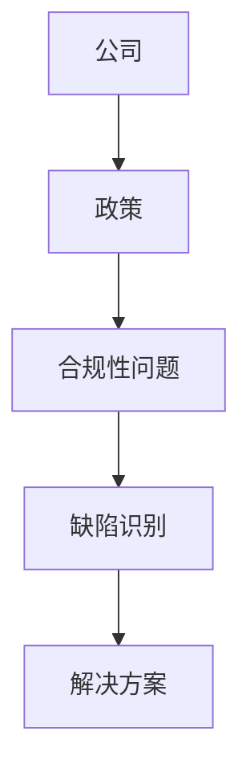
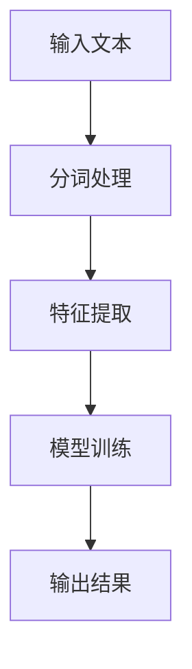
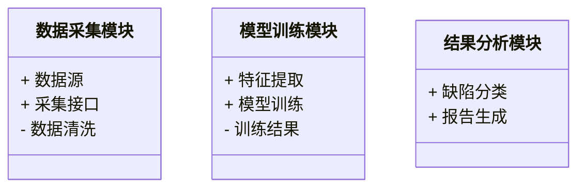
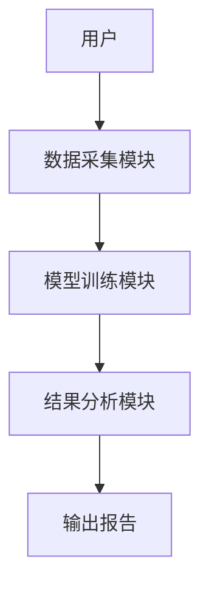
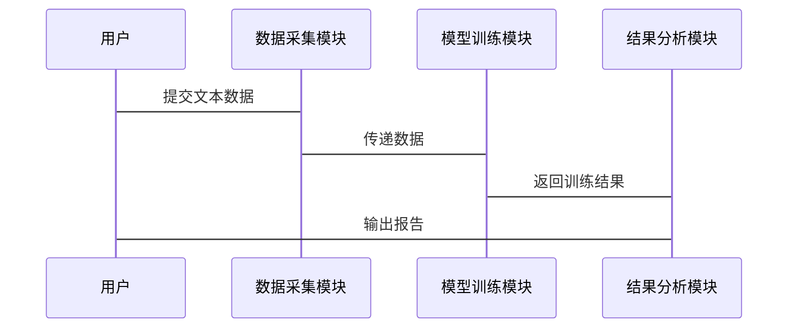

                 


# AI驱动的公司治理缺陷识别模型

**关键词**: AI, 公司治理, 缺陷识别, 模型, 深度学习, 自然语言处理, 企业风险管理

**摘要**: 本文探讨了利用AI技术驱动公司治理缺陷识别模型的构建与应用。通过分析公司治理中的常见问题，结合自然语言处理和深度学习技术，提出了一种高效的缺陷识别方法。文章详细介绍了模型的背景、核心原理、算法实现、系统设计及实际应用案例，旨在为企业的风险管理提供新的思路和解决方案。

---

# 第一部分: AI驱动的公司治理缺陷识别模型概述

## 第1章: AI驱动的公司治理缺陷识别模型概述

### 1.1 问题背景与目标

#### 1.1.1 公司治理缺陷的定义与分类
公司治理缺陷是指企业在组织结构、管理流程、内部控制系统等方面存在的问题，这些问题可能导致企业面临法律风险、财务损失或声誉损害。常见的缺陷包括合规性问题、内部控制失效、治理结构不合理等。

#### 1.1.2 传统公司治理缺陷识别的局限性
传统的缺陷识别方法依赖于人工审查和经验判断，存在效率低、覆盖面有限、主观性强等问题。尤其是在数据量大、业务复杂的情况下，传统方法难以及时发现潜在风险。

#### 1.1.3 AI技术在公司治理中的应用潜力
AI技术，特别是自然语言处理（NLP）和深度学习，能够从大量文本数据中提取有用信息，自动识别潜在问题，提高缺陷识别的效率和准确性。

#### 1.1.4 本模型的目标与意义
本模型旨在利用AI技术，构建一个高效、可扩展的公司治理缺陷识别系统，帮助企业及时发现和解决潜在问题，提升治理水平和风险管理能力。

### 1.2 核心概念与问题描述

#### 1.2.1 公司治理缺陷识别的关键要素
- **输入数据**: 包括企业政策、规章制度、会议记录、财务报表等文本数据。
- **识别目标**: 发现数据中的潜在问题，如合规性偏差、流程漏洞等。
- **输出结果**: 提供具体的缺陷类型和位置，便于后续处理。

#### 1.2.2 AI驱动模型的核心功能
- **数据预处理**: 清洗和结构化输入数据。
- **特征提取**: 利用NLP技术提取文本特征。
- **缺陷分类**: 使用深度学习模型进行分类预测。
- **结果解释**: 提供可读的缺陷报告。

#### 1.2.3 模型的边界与外延
- **边界**: 专注于文本数据中的缺陷识别，不涉及实时监控和动态调整。
- **外延**: 可扩展到其他类型数据，如音频、视频等。

#### 1.2.4 模型的输入输出关系
- **输入**: 结构化和非结构化文本数据。
- **输出**: 缺陷类型、位置和建议的解决方案。

### 1.3 模型的核心要素与组成

#### 1.3.1 数据来源与特征提取
- **数据来源**: 企业内部文档、外部监管报告等。
- **特征提取**: 使用词袋模型或TF-IDF提取关键词。

#### 1.3.2 模型的输入处理
- **文本清洗**: 去除停用词、标点符号等。
- **分词处理**: 对中文进行分词处理。

#### 1.3.3 缺陷识别的输出结果
- **缺陷类型**: 合规性问题、流程漏洞等。
- **结果可视化**: 以图表形式展示缺陷分布。

#### 1.3.4 模型的可解释性与鲁棒性
- **可解释性**: 提供缺陷识别的依据和证据。
- **鲁棒性**: 在不同数据集上表现稳定。

---

# 第二部分: 核心概念与联系

## 第2章: 核心概念原理与分析

### 2.1 缺陷识别模型的核心原理

#### 2.1.1 基于NLP的文本分析原理
- **分词**: 将文本分割成词语或短语。
- **实体识别**: 识别文本中的关键实体，如人名、组织名等。
- **情感分析**: 分析文本中隐含的情绪或态度。

#### 2.1.2 基于深度学习的特征提取
- **词嵌入**: 使用Word2Vec或BERT提取词向量。
- **序列标注**: 使用CRF或LSTM进行序列分类。

#### 2.1.3 缺陷分类的算法选择
- **支持向量机(SVM)**: 适用于小数据集。
- **随机森林**: 适用于特征较多的情况。
- **深度学习模型**: 如BERT、LSTM等。

### 2.2 核心概念的属性特征对比

| 特征属性 | 合规性问题 | 流程漏洞 | 其他缺陷 |
|----------|------------|----------|----------|
| 关键词    | 合规、政策 | 流程、步骤 | 风险、问题 |
| 分布     | 高频       | 中频     | 低频     |
| 难易程度 | 中等       | 较难     | 较易     |

#### 2.2.3 ER实体关系图架构


### 2.3 本章小结
本章详细介绍了缺陷识别模型的核心原理和关键概念，通过特征对比和实体关系图展示了模型的结构和功能。这些分析为后续的算法设计和系统实现奠定了基础。

---

## 第3章: 算法原理讲解

### 3.1 算法原理概述

#### 3.1.1 模型的整体框架
- **输入层**: 文本数据。
- **特征提取层**: 提取文本特征。
- **分类层**: 预测缺陷类型。

#### 3.1.2 模型的数学表示
$$ \text{损失函数} = \text{交叉熵损失} $$

### 3.2 算法实现步骤

#### 3.2.1 数据预处理
```python
import pandas as pd
from sklearn.model_selection import train_test_split

# 加载数据
data = pd.read_csv('data.csv')
# 分割数据
train_data, test_data = train_test_split(data, test_size=0.2)
```

#### 3.2.2 模型训练
```python
from tensorflow.keras import layers, Model

def build_model(max_length, vocab_size):
    inputs = layers.Input(shape=(max_length,))
    embedding = layers.Embedding(vocab_size, 100)(inputs)
    lstm = layers.LSTM(64)(embedding)
    outputs = layers.Dense(5, activation='softmax')(lstm)
    return Model(inputs=inputs, outputs=outputs)
```

#### 3.2.3 模型训练与优化
```python
model = build_model(max_length=1000, vocab_size=10000)
model.compile(optimizer='adam', loss='sparse_categorical_crossentropy', metrics=['accuracy'])
model.fit(train_data, epochs=5, validation_data=test_data)
```

### 3.3 算法流程图


### 3.4 本章小结
本章详细讲解了模型的算法实现，从数据预处理到模型训练，再到结果输出，为后续的系统设计提供了技术基础。

---

## 第4章: 系统分析与架构设计

### 4.1 问题场景介绍

#### 4.1.1 应用场景
- **合规性检查**: 检查企业政策是否符合法规要求。
- **风险预警**: 提前发现潜在的治理问题。

### 4.2 项目介绍

#### 4.2.1 系统功能设计
- **数据采集模块**: 采集企业内部数据。
- **模型训练模块**: 训练缺陷识别模型。
- **结果分析模块**: 分析识别结果并生成报告。

#### 4.2.2 领域模型设计


### 4.3 系统架构设计

#### 4.3.1 系统架构图


### 4.4 系统接口设计

#### 4.4.1 接口描述
- **输入接口**: 提供文本数据。
- **输出接口**: 返回缺陷识别结果。

### 4.5 系统交互流程图


### 4.6 本章小结
本章详细描述了系统的应用场景、功能设计和架构实现，为实际部署提供了参考。

---

## 第5章: 项目实战

### 5.1 环境安装与配置

#### 5.1.1 安装Python和相关库
```bash
pip install numpy pandas scikit-learn tensorflow
```

### 5.2 系统核心实现

#### 5.2.1 数据预处理
```python
import pandas as pd
from sklearn.model_selection import train_test_split

data = pd.read_csv('data.csv')
train_data, test_data = train_test_split(data, test_size=0.2)
```

#### 5.2.2 模型训练
```python
from tensorflow.keras import layers, Model

def build_model(max_length, vocab_size):
    inputs = layers.Input(shape=(max_length,))
    embedding = layers.Embedding(vocab_size, 100)(inputs)
    lstm = layers.LSTM(64)(embedding)
    outputs = layers.Dense(5, activation='softmax')(lstm)
    return Model(inputs=inputs, outputs=outputs)
```

#### 5.2.3 模型训练与优化
```python
model = build_model(max_length=1000, vocab_size=10000)
model.compile(optimizer='adam', loss='sparse_categorical_crossentropy', metrics=['accuracy'])
model.fit(train_data, epochs=5, validation_data=test_data)
```

### 5.3 项目案例分析

#### 5.3.1 实际案例分析
- **案例背景**: 某企业合规性检查。
- **模型应用**: 识别政策文本中的合规性问题。
- **结果展示**: 输出具体的缺陷位置和类型。

### 5.4 本章小结
本章通过实际案例展示了模型的应用过程，从数据准备到模型训练，再到结果分析，详细讲解了项目实战的每个步骤。

---

## 第6章: 总结与展望

### 6.1 总结

#### 6.1.1 核心内容回顾
- 模型的背景与目标。
- 核心概念与算法实现。
- 系统设计与项目实战。

#### 6.1.2 本模型的优势与局限
- **优势**: 高效、准确。
- **局限**: 数据依赖性强，实时性不足。

### 6.2 展望

#### 6.2.1 未来发展方向
- **多模态数据融合**: 结合结构化和非结构化数据。
- **实时监控**: 实时检测治理问题。
- **可解释性增强**: 提供更清晰的缺陷解释。

#### 6.2.2 可能的技术挑战
- **数据隐私**: 如何保护企业数据。
- **模型泛化**: 提升模型在不同场景下的适应性。

### 6.3 最佳实践 tips

#### 6.3.1 实施建议
- 数据准备要充分。
- 模型选择要合理。
- 结果解释要清晰。

#### 6.3.2 注意事项
- 数据清洗要彻底。
- 模型调优要细致。
- 结果验证要全面。

### 6.4 本章小结
本章总结了模型的核心内容，分析了其优缺点，并展望了未来的发展方向，为读者提供了有益的参考。

---

# 作者：AI天才研究院/AI Genius Institute & 禅与计算机程序设计艺术 /Zen And The Art of Computer Programming

