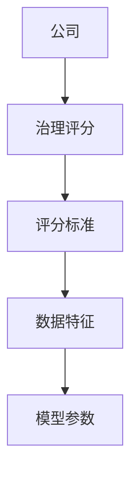
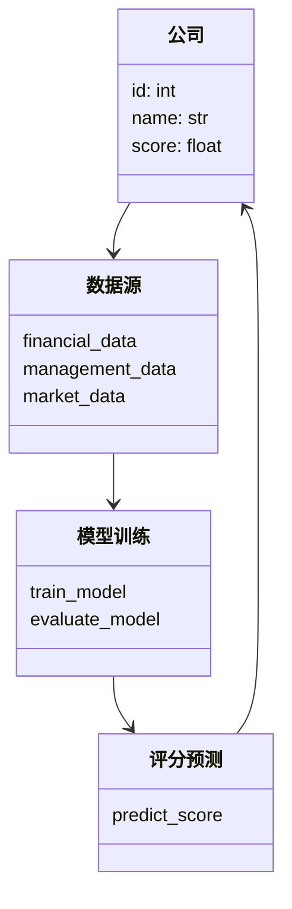
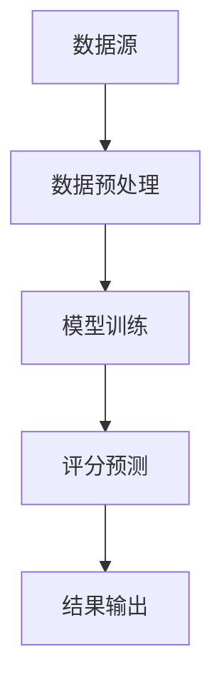

                 


# AI驱动的公司治理评分预测

> 关键词：公司治理，AI驱动，评分预测，机器学习，数据分析

> 摘要：本文探讨了如何利用人工智能技术预测公司治理评分，通过数据驱动的方法和机器学习算法，提供一种高效、准确的评分预测解决方案。

---

## 第1章：公司治理评分预测的背景与意义

### 1.1 问题背景

#### 1.1.1 公司治理的基本概念
公司治理是确保公司有效运作和实现长期目标的关键管理实践。它涉及股东、董事会、高管和利益相关者的角色与责任，确保公司透明、公正和高效地运作。公司治理的好坏直接影响公司的价值、声誉和可持续发展能力。

#### 1.1.2 评分预测的重要性
对公司治理进行评分预测可以帮助企业识别潜在风险，优化管理结构，并提升整体治理水平。此外，评分预测还能帮助投资者评估公司的治理质量，做出更明智的投资决策。

#### 1.1.3 AI技术在公司治理中的应用现状
随着大数据和人工智能技术的发展，越来越多的企业开始利用AI技术分析大量数据，提取关键指标，构建预测模型。AI在公司治理中的应用包括风险评估、合规监测、决策支持等，为公司治理提供了新的工具和方法。

---

### 1.2 问题描述

#### 1.2.1 公司治理评分预测的目标
通过分析公司的财务数据、管理结构、市场表现等多维度数据，利用AI技术构建模型，预测公司的治理评分，帮助企业识别改进机会，提升治理效率。

#### 1.2.2 评分预测的挑战与难点
- 数据获取困难：公司治理数据涉及多个来源，数据清洗和整合复杂。
- 数据质量：数据可能存在缺失或不准确，影响模型的准确性。
- 模型选择：不同算法对数据的敏感性不同，选择合适的算法是关键。
- 解释性：模型需要具备可解释性，以便企业理解和应用预测结果。

#### 1.2.3 评分预测的边界与外延
评分预测主要关注公司的治理结构、管理效率、合规性等方面，不涉及公司的战略决策或市场波动。外延则包括对模型的优化、对数据源的扩展以及对不同行业的适应性调整。

---

### 1.3 问题解决

#### 1.3.1 AI技术如何解决评分预测问题
AI技术能够处理大量复杂数据，提取关键特征，构建预测模型，提供准确的评分预测。通过机器学习算法，AI可以识别数据中的模式和趋势，帮助企业在早期发现问题并采取措施。

#### 1.3.2 数据驱动的评分预测方法
数据驱动的方法依赖于大量结构化和非结构化数据，通过清洗、预处理和特征工程，构建有效的预测模型。这种方法能够捕捉到传统方法难以察觉的细微变化，提供更精准的预测结果。

#### 1.3.3 评分预测的实际应用场景
评分预测可用于企业内部审计、风险管理、投资者决策支持等领域。例如，投资者可以根据预测评分评估公司的治理水平，选择投资标的；企业可以利用预测结果优化治理结构，提升管理效率。

---

### 1.4 核心概念结构

#### 1.4.1 公司治理评分预测的核心要素
- 数据来源：财务数据、管理结构、市场表现、合规记录等。
- 模型构建：选择合适的算法，训练预测模型。
- 评分标准：定义评分体系，确定评分指标权重。

#### 1.4.2 模型构建的关键步骤
1. 数据清洗与预处理。
2. 特征工程：提取关键特征，进行特征选择。
3. 模型训练：选择合适的算法，调整参数。
4. 模型评估：验证模型性能，优化模型。

#### 1.4.3 评分标准的制定与优化
- 定义评分指标：如透明度、合规性、管理效率等。
- 确定指标权重：根据重要性分配权重。
- 持续优化：根据反馈调整评分标准，确保评分的准确性和公平性。

---

## 第2章：AI驱动的评分预测原理

### 2.1 核心概念原理

#### 2.1.1 数据来源与特征提取
数据来源包括公司财务报表、管理结构数据、市场表现数据等。特征提取涉及将数据转换为模型可识别的特征，如财务比率、管理团队稳定性等。

#### 2.1.2 模型选择与优化
选择合适的机器学习算法，如随机森林、XGBoost等，训练模型并进行调参，以提高预测准确率。

#### 2.1.3 评分标准的动态调整
根据模型预测结果和实际数据反馈，动态调整评分标准，确保评分的准确性和适用性。

---

### 2.2 核心概念属性对比表

| **属性**       | **数据来源**                | **模型构建**                | **评分标准**                |
|----------------|-----------------------------|-----------------------------|-----------------------------|
| 数据类型       | 结构化数据（财务数据）       | 结构化数据（模型参数）       | 结构化数据（评分指标）       |
| 数据特征       | 财务比率、管理结构           | 特征向量、模型权重           | 透明度、合规性             |
| 处理方法       | 数据清洗、特征工程           | 模型训练、参数优化           | 权重分配、动态调整           |

---

### 2.3 ER实体关系图



---

## 第3章：评分预测的机器学习算法

### 3.1 算法原理

#### 3.1.1 随机森林模型

随机森林是一种基于决策树的集成学习算法，通过构建多棵决策树并进行投票或平均，提高模型的准确性和稳定性。随机森林适用于高维数据，且具有较强的抗过拟合能力。

#### 3.1.2 XGBoost算法

XGBoost是一种梯度提升树模型，通过优化目标函数，逐步构建弱分类器，最终形成强预测模型。XGBoost在处理分类和回归问题时表现优异，且支持并行计算，计算效率高。

---

### 3.2 算法实现

#### 3.2.1 随机森林的实现代码

```python
import pandas as pd
from sklearn.ensemble import RandomForestClassifier
from sklearn.metrics import accuracy_score
from sklearn.model_selection import train_test_split

# 加载数据
data = pd.read_csv('governance_data.csv')
X = data.drop('score', axis=1)
y = data['score']

# 数据分割
X_train, X_test, y_train, y_test = train_test_split(X, y, test_size=0.2, random_state=42)

# 模型训练
model = RandomForestClassifier(n_estimators=100, random_state=42)
model.fit(X_train, y_train)

# 预测与评估
y_pred = model.predict(X_test)
accuracy = accuracy_score(y_test, y_pred)
print(f'随机森林模型准确率: {accuracy:.4f}')
```

---

#### 3.2.2 XGBoost的实现代码

```python
import xgboost as xgb
from sklearn.metrics import mean_squared_error

# 数据准备
dtrain = xgb.DMatrix(X_train, label=y_train)
dtest = xgb.DMatrix(X_test, label=y_test)

# 模型参数
params = {
    'objective': 'reg:squarederror',
    'learning_rate': 0.05,
    'max_depth': 6,
    'n_estimators': 100
}

# 模型训练
model = xgb.XGBRegressor(**params)
model.fit(X_train, y_train)

# 预测与评估
y_pred = model.predict(X_test)
rmse = mean_squared_error(y_test, y_pred, squared=False)
print(f'XGBoost模型RMSE: {rmse:.4f}')
```

---

## 第4章：系统分析与架构设计

### 4.1 系统功能设计

#### 4.1.1 领域模型



---

### 4.2 系统架构设计



---

## 第5章：项目实战

### 5.1 环境安装

安装所需的库：
```bash
pip install pandas scikit-learn xgboost mermaid
```

---

### 5.2 核心实现代码

```python
import pandas as pd
from sklearn.model_selection import train_test_split
from sklearn.ensemble import RandomForestClassifier
from xgboost import XGBRegressor
from sklearn.metrics import accuracy_score, mean_squared_error

# 加载数据
data = pd.read_csv('governance_data.csv')
X = data.drop('score', axis=1)
y = data['score']

# 数据分割
X_train, X_test, y_train, y_test = train_test_split(X, y, test_size=0.2, random_state=42)

# 随机森林模型
rf_model = RandomForestClassifier(n_estimators=100, random_state=42)
rf_model.fit(X_train, y_train)
y_pred_rf = rf_model.predict(X_test)
accuracy_rf = accuracy_score(y_test, y_pred_rf)
print(f'随机森林模型准确率: {accuracy_rf:.4f}')

# XGBoost模型
xgb_model = XGBRegressor(objective='reg:squarederror', learning_rate=0.05, max_depth=6, n_estimators=100)
xgb_model.fit(X_train, y_train)
y_pred_xgb = xgb_model.predict(X_test)
rmse_xgb = mean_squared_error(y_test, y_pred_xgb, squared=False)
print(f'XGBoost模型RMSE: {rmse_xgb:.4f}')
```

---

## 第6章：总结与展望

### 6.1 项目总结

通过本项目，我们成功利用AI技术构建了公司治理评分预测模型，验证了随机森林和XGBoost算法的有效性，为企业和投资者提供了有力的决策支持工具。

### 6.2 优化方向

- 数据优化：引入更多数据源，如社交媒体数据、行业报告等，提升模型的预测能力。
- 模型优化：尝试其他算法，如神经网络，优化模型结构和参数。
- 可解释性优化：通过可视化工具，增强模型的可解释性，帮助用户更好地理解和应用预测结果。

### 6.3 未来展望

随着AI技术的不断发展，公司治理评分预测将更加智能化和精准化。未来的研究可以探索动态评分模型，实时更新评分结果，提供更及时的反馈和建议。

---

## 作者

作者：AI天才研究院 & 禅与计算机程序设计艺术

---

本文详细探讨了AI驱动的公司治理评分预测的核心概念、算法实现和系统设计，通过实际案例展示了如何利用机器学习技术提升公司治理的评估效率和准确性。希望本文能为相关领域的研究和实践提供有价值的参考和指导。

