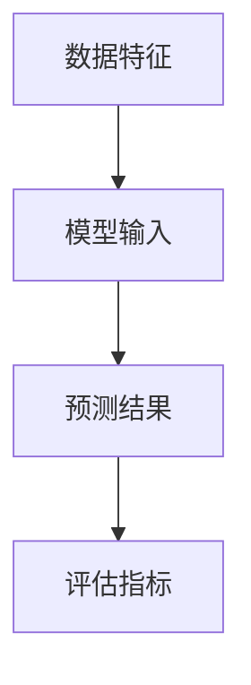

                 


# AI驱动的公司破产概率预测

> 关键词：AI预测、公司破产、概率模型、机器学习、风险管理

> 摘要：本文将详细探讨如何利用人工智能技术预测公司破产概率，结合背景介绍、核心概念、算法原理、系统架构设计和项目实战，逐步分析AI在公司破产预测中的应用与实现。通过深入分析多种机器学习算法及其优缺点，结合实际案例，为读者提供一套完整的AI驱动的公司破产概率预测解决方案。

---

## 第一部分: AI驱动的公司破产概率预测概述

### 第1章: 背景介绍与问题定义

#### 1.1 公司破产预测的背景与意义
- **企业破产问题的背景**：公司破产是商业活动中常见的现象，通常会导致企业、股东和债权人遭受重大损失。通过提前预测破产概率，可以帮助企业采取措施避免破产，同时为投资者提供决策依据。
- **破产预测对企业与投资者的价值**：企业可以通过预测结果优化经营策略，投资者可以评估风险，金融机构可以更好地进行信贷评估。
- **AI技术在破产预测中的优势**：传统方法依赖于财务指标和经验判断，而AI技术可以通过大量数据挖掘和复杂模型，提供更精准的预测结果。

#### 1.2 破产预测的核心概念
- **破产预测的定义与边界**：通过历史数据和当前信息，利用模型预测未来一定时间内公司是否会破产。
- **破产预测的关键要素与属性**：包括财务指标（如负债率、利润率）、市场环境、公司治理等因素。
- **破产预测的分类与应用场景**：分为短期预测和长期预测，应用于企业风险管理、投资决策等领域。

---

### 第2章: AI驱动破产预测的核心概念与联系

#### 2.1 AI模型的基本原理
- **数据特征的提取与分析**：破产预测的核心在于数据特征的选择，例如财务数据、市场数据、管理数据等。
- **模型选择与优化策略**：根据数据特征选择合适的模型，并通过交叉验证优化模型参数。
- **评估指标与性能优化**：常用的评估指标包括准确率、召回率、F1分数等，需要在模型训练过程中进行优化。

#### 2.2 破产预测的核心算法与联系
- **常见算法对比表格**：
```mermaid
| 算法名称 | 特点 | 优势 | 劣势 |
|----------|------|------|------|
| 逻辑回归 | 线性模型 | 易解释 | 非线性关系处理差 |
| 决策树   | 非线性模型 | 高准确性 | 易过拟合 |
| 随机森林 | 集成模型 | 高准确性 | 计算复杂 |
| XGBoost  | 集成模型 | 高准确性 | 易过拟合 |
| LSTM     | 时间序列模型 | 处理时间依赖性 | 计算复杂 |
```

- **数据流与模型关系图**：


---

## 第二部分: 破产预测的算法原理

### 第3章: 基础算法与数学模型

#### 3.1 逻辑回归模型
- **模型原理**：
  - 逻辑回归是一种用于分类任务的经典算法。
  - 其核心思想是通过sigmoid函数将线性回归的输出映射到概率空间。
  - 常用于二分类问题，如破产与否的预测。

- **数学模型**：
  $$ P(y=1|x) = \frac{1}{1 + e^{-\beta x}} $$
  其中，$x$ 为输入特征，$\beta$ 为模型参数。

- **优势与劣势**：
  - 优势：模型简单，易于解释，适合线性可分的数据。
  - 劣势：对非线性关系处理能力有限。

---

### 第4章: 随机森林与集成学习

#### 4.1 随机森林模型
- **模型原理**：
  - 随机森林是一种基于决策树的集成学习算法。
  - 通过随机选取特征和样本进行树的构建，最终通过投票或加权的方式得到预测结果。
  - 具有高准确性和较强的抗过拟合能力。

- **数学模型**：
  - 每棵决策树的预测结果通过加权或投票得到最终结果。

---

### 第5章: XGBoost模型

#### 5.1 XGBoost模型
- **模型原理**：
  - XGBoost是一种基于梯度提升树的算法。
  - 通过不断优化损失函数，构建多个弱分类器，最终形成强分类器。
  - 支持正则化，可以有效防止过拟合。

- **数学模型**：
  $$ loss = \sum_{i=1}^n \left( y_i - \hat{y}_i \right)^2 $$
  其中，$y_i$ 为真实值，$\hat{y}_i$ 为预测值。

---

## 第三部分: 系统分析与架构设计

### 第6章: 系统功能设计

#### 6.1 问题场景介绍
- 破产预测系统需要处理大量的历史数据，包括财务数据、市场数据等。
- 系统需要提供用户友好的界面，方便输入数据和查看预测结果。

#### 6.2 系统功能模块
- 数据采集模块：从数据库中提取相关数据。
- 数据预处理模块：清洗数据，处理缺失值和异常值。
- 模型训练模块：选择合适的算法，训练模型。
- 预测与评估模块：输出预测结果，并提供评估指标。

---

### 第7章: 系统架构设计

#### 7.1 系统架构图


---

## 第四部分: 项目实战

### 第8章: 数据预处理与特征工程

#### 8.1 数据采集与清洗
- 使用Python的pandas库读取数据，处理缺失值和异常值。

#### 8.2 特征提取与选择
- 使用特征重要性分析，选择对 bankruptcy 预测最有影响的特征。

### 第9章: 模型实现与优化

#### 9.1 模型训练
- 使用XGBoost模型进行训练，并调整参数以优化性能。

#### 9.2 模型评估
- 使用混淆矩阵、准确率、召回率等指标评估模型性能。

---

## 第五部分: 总结与展望

### 第10章: 总结与最佳实践

#### 10.1 总结
- 本文详细介绍了AI驱动的公司破产概率预测的实现过程，包括算法选择、模型训练和系统设计。

#### 10.2 未来展望
- 随着AI技术的发展，破产预测将更加精准和实时。
- 结合NLP技术和时间序列分析，可以进一步提高预测的准确性。

---

## 作者

作者：AI天才研究院/AI Genius Institute & 禅与计算机程序设计艺术 /Zen And The Art of Computer Programming

