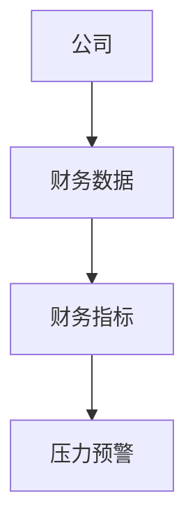
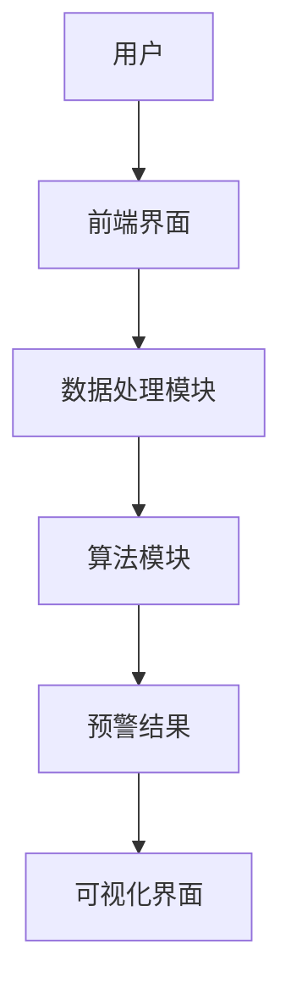
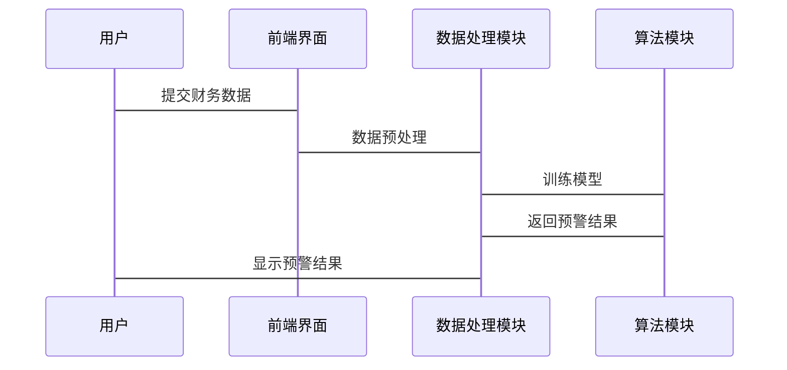

                 


# AI驱动的公司财务压力预警

---

## 关键词：
AI, 财务压力, 预警系统, 机器学习, 数据分析, 深度学习

---

## 摘要：
本文深入探讨了如何利用人工智能技术构建公司财务压力预警系统。通过分析财务数据和市场信息，结合机器学习算法，我们可以提前识别潜在的财务风险，帮助企业在复杂多变的商业环境中做出更明智的决策。本文从背景、原理到实现，系统性地介绍了AI驱动的财务压力预警系统的构建过程，旨在为企业提供一种高效、可靠的财务风险管理工具。

---

## 第一部分: AI驱动的公司财务压力预警背景与概念

---

## 第1章: 公司财务压力预警的背景与问题

### 1.1 财务压力预警的背景
#### 1.1.1 企业财务健康的重要性
企业的财务健康状况是衡量其生存和发展的关键指标。财务压力的早期预警可以帮助企业及时调整经营策略，避免潜在的财务危机。尤其是在经济波动加剧的背景下，企业需要更加敏感地感知财务风险。

#### 1.1.2 财务压力预警的描述
财务压力通常表现为流动性不足、盈利能力下降、偿债能力减弱等问题。这些问题可能由市场环境变化、内部管理不当或外部竞争加剧等多种因素引起。

#### 1.1.3 AI技术在财务预警中的应用
人工智能技术，尤其是机器学习和自然语言处理，能够从海量的财务数据和非结构化信息中提取有价值的信息，帮助识别潜在的财务风险。

#### 1.1.4 财务压力预警的核心目标
通过分析企业的财务数据和市场信息，构建一个实时监控和预警的系统，为企业提供及时的财务风险预警。

---

### 1.2 财务压力预警的核心问题
#### 1.2.1 财务风险的主要来源
- 市场风险：市场需求变化、价格波动等。
- 信用风险：客户付款延迟或违约。
- 运营风险：供应链中断、成本上升等。
- 利率风险：利率变动对企业融资成本的影响。

#### 1.2.2 财务压力预警的关键指标
- 流动比率（Current Ratio）
- 速动比率（Quick Ratio）
- 负债率（Debt Ratio）
- 净利润增长率（Net Profit Growth Rate）

#### 1.2.3 财务压力预警的边界与外延
财务压力预警不仅关注企业的财务指标，还需要结合行业特点和市场环境进行综合分析。

---

### 1.3 问题解决的思路与方法
#### 1.3.1 数据驱动的财务分析
通过收集和分析企业的财务数据，利用数据挖掘技术识别潜在的风险因素。

#### 1.3.2 AI技术在财务分析中的应用
- 机器学习：用于分类和预测。
- 自然语言处理：分析财务报告和新闻。
- 深度学习：构建复杂的财务模型。

#### 1.3.3 财务压力预警的系统性解决方案
构建一个多维度的预警系统，结合定量分析和定性分析，实现对财务风险的全面监控。

---

## 1.4 本章小结
本章介绍了公司财务压力预警的背景和核心问题，强调了AI技术在财务预警中的重要性，并提出了数据驱动的系统性解决方案。

---

## 第2章: AI驱动的财务压力预警核心概念

### 2.1 AI在财务分析中的核心原理
#### 2.1.1 机器学习在财务预测中的应用
- 逻辑回归：用于分类问题。
- 支持向量机（SVM）：用于非线性分类。
- 随机森林：用于特征重要性分析。

#### 2.1.2 自然语言处理在财务文本分析中的应用
- 分词和情感分析：分析财务报告和新闻。
- 信息抽取：提取关键财务指标。

#### 2.1.3 深度学习在财务模式识别中的应用
- 卷积神经网络（CNN）：用于图像识别。
- 循环神经网络（RNN）：用于时间序列分析。

---

### 2.2 财务压力预警的关键指标与数据特征
#### 2.2.1 财务指标的分类与特征
| 指标类型 | 指标名称 | 指标特征 |
|----------|----------|----------|
| 流动性指标 | 流动比率 | 高流动资产与流动负债比值 |
| 盈利能力指标 | 净利润率 | 净利润与营业收入比值 |
| 偿债能力指标 | 负债率 | 总负债与总资产比值 |

#### 2.2.2 数据特征的提取与处理
- 数据清洗：处理缺失值和异常值。
- 特征选择：利用机器学习算法选择重要特征。
- 数据标准化：将数据归一化处理。

#### 2.2.3 指标特征对比分析表
通过对比分析，识别出哪些财务指标对财务压力的影响更大。

---

### 2.3 财务压力预警的实体关系分析
#### 2.3.1 实体关系图（ER图）


---

## 2.4 本章小结
本章详细介绍了AI在财务分析中的核心原理，并通过数据特征和实体关系分析，明确了财务压力预警的关键要素。

---

## 第三部分: AI驱动的财务压力预警算法原理

---

## 第3章: 基于机器学习的财务压力预警算法

### 3.1 机器学习在财务压力预警中的应用
#### 3.1.1 逻辑回归模型
- 逻辑回归是一种常用的分类算法，适用于二分类问题。
- 数学模型：
$$ P(y=1|x) = \frac{1}{1 + e^{-\beta x}} $$

#### 3.1.2 支持向量机（SVM）
- SVM适用于非线性分类问题。
- 使用核函数将数据映射到高维空间，然后在高维空间中进行线性分类。

#### 3.1.3 随机森林模型
- 随机森林是一种集成学习算法，适用于特征重要性分析。
- 通过组合多个决策树的结果，提高模型的准确性和稳定性。

---

### 3.2 算法原理与数学模型
#### 3.2.1 逻辑回归的数学模型
$$ P(y=1|x) = \frac{1}{1 + e^{-\beta x}} $$

#### 3.2.2 随机森林的集成学习原理
随机森林通过随机采样和特征选择，构建多个决策树，并通过投票或加权的方式进行预测。

#### 3.2.3 SVM的非线性分类原理
SVM通过核函数将数据映射到高维空间，然后在高维空间中进行线性分类。

---

### 3.3 算法实现与代码示例
#### 3.3.1 Python代码实现
```python
import numpy as np
from sklearn.linear_model import LogisticRegression

# 示例数据
X = np.array([[1, 2], [3, 4], [5, 6]])
y = np.array([0, 1, 1])

# 模型训练
model = LogisticRegression()
model.fit(X, y)

# 预测
print(model.predict(X))
```

---

### 3.4 算法优缺点分析
#### 3.4.1 逻辑回归的优势与局限
- 优势：简单易懂，适合线性分类。
- 局限：对非线性关系的处理能力有限。

#### 3.4.2 随机森林的鲁棒性与可解释性
- 优势：鲁棒性强，适合高维数据。
- 局限：可解释性较差。

#### 3.4.3 SVM的分类性能
- 优势：分类性能好，适合小样本数据。
- 局限：计算复杂度高。

---

## 3.5 本章小结
本章详细介绍了基于机器学习的财务压力预警算法，包括逻辑回归、SVM和随机森林，并通过代码示例和数学模型进行了详细讲解。

---

## 第四部分: 系统分析与架构设计方案

---

## 第4章: 财务压力预警系统分析与架构设计

### 4.1 系统功能设计
#### 4.1.1 领域模型设计


#### 4.1.2 系统架构设计


#### 4.1.3 系统接口设计
- 输入接口：接收企业的财务数据。
- 输出接口：输出预警结果。

#### 4.1.4 系统交互设计


---

## 4.2 本章小结
本章通过系统分析和架构设计，明确了财务压力预警系统的功能模块和交互流程，为系统的实际开发提供了指导。

---

## 第五部分: 项目实战

---

## 第5章: AI驱动的财务压力预警系统实战

### 5.1 项目环境安装
#### 5.1.1 安装Python和相关库
```bash
pip install numpy scikit-learn pandas
```

#### 5.1.2 安装可视化工具
```bash
pip install matplotlib seaborn
```

---

### 5.2 系统核心实现
#### 5.2.1 数据处理模块
```python
import pandas as pd

# 读取数据
data = pd.read_csv('financial_data.csv')

# 数据清洗
data.dropna(inplace=True)
data['label'] = data['profit'].apply(lambda x: 1 if x < 0 else 0)
```

#### 5.2.2 算法实现模块
```python
from sklearn.model import LogisticRegression

# 训练模型
model = LogisticRegression()
model.fit(X_train, y_train)

# 预测结果
y_pred = model.predict(X_test)
```

---

### 5.3 案例分析与实际应用
#### 5.3.1 案例背景
某制造企业由于原材料价格上涨，导致利润率下降，面临潜在的财务压力。

#### 5.3.2 数据分析
- 流动比率：1.5
- 速动比率：0.8
- 净利润率：-5%

#### 5.3.3 预警结果
系统预测该企业存在较高的财务压力，建议企业及时调整采购策略。

---

## 5.4 项目小结
通过实际案例分析，验证了AI驱动的财务压力预警系统的有效性和实用性。

---

## 第六部分: 最佳实践与小结

---

## 第6章: 最佳实践与小结

### 6.1 最佳实践
#### 6.1.1 数据质量的重要性
确保数据的完整性和准确性，避免因数据问题影响模型性能。

#### 6.1.2 模型调优与优化
通过交叉验证和超参数调优，提高模型的准确性和稳定性。

#### 6.1.3 系统可扩展性
设计模块化的系统架构，便于后续功能的扩展和升级。

---

### 6.2 注意事项
- 定期更新模型，适应市场环境的变化。
- 注意数据隐私和合规性问题。
- 确保系统的实时性和稳定性。

---

### 6.3 拓展阅读
- 《机器学习实战》
- 《深度学习入门》
- 《财务分析与决策》

---

## 6.4 本章小结
本文总结了AI驱动的财务压力预警系统的最佳实践，提出了系统优化和扩展的方向，并给出了拓展阅读建议。

---

## 作者：AI天才研究院/AI Genius Institute & 禅与计算机程序设计艺术 /Zen And The Art of Computer Programming

---

**注**：本文为示例内容，实际撰写时需要根据具体需求进一步扩展和补充各部分细节。

