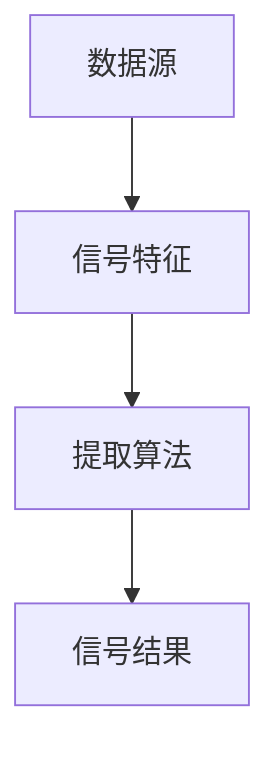
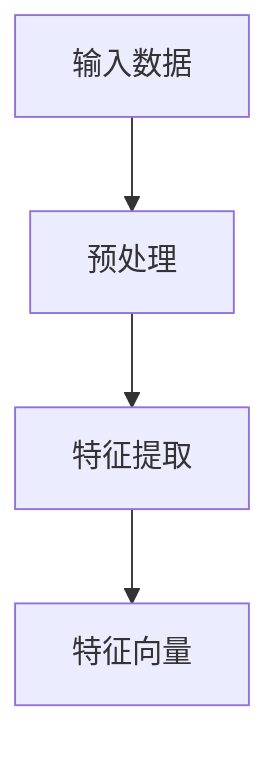
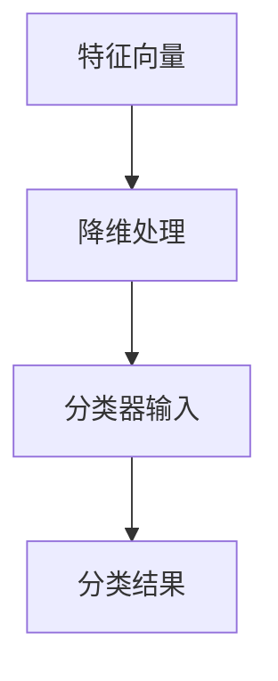
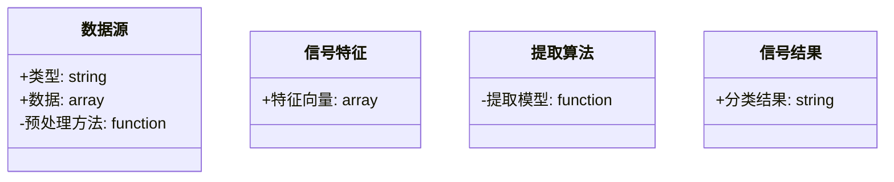

                 


# AI驱动的另类数据信号提取

> 关键词：AI驱动、另类数据、信号提取、特征提取、降维、分类算法

> 摘要：本文将深入探讨AI驱动的另类数据信号提取技术，从背景、核心概念、算法原理到系统架构设计，再到项目实战，全面解析这一领域的技术细节和应用实践。通过本文的学习，读者将能够理解如何利用AI技术从非传统数据源中提取有价值的信息，并掌握相关算法和系统设计的方法。

---

## 第一部分: AI驱动的另类数据信号提取基础

### 第1章: 另类数据信号提取的背景与定义

#### 1.1 问题背景
在当今数据驱动的世界中，传统的结构化数据（如表格数据）已经不能满足所有应用场景的需求。随着技术的进步，越来越多的非传统数据源（如文本、图像、音频、视频、传感器数据等）被引入到数据分析和决策过程中。这些数据被称为“另类数据”，它们具有多样性、复杂性和高维性的特点。

**问题解决的核心目标**：从这些另类数据中提取有价值的信号，以便进行进一步的分析和决策。例如，在金融领域，投资者可能会从社交媒体帖子中提取情绪信号；在制造业，可以从传感器数据中提取设备健康信号。

#### 1.2 核心概念定义
- **另类数据**：指非结构化或半结构化的数据，包括文本、图像、音频、视频、日志文件等。
- **数据信号提取**：指从数据中提取具有代表性和可解释性的特征或信号的过程。
- **AI驱动的信号提取**：利用人工智能算法（如深度学习、自然语言处理等）从另类数据中提取信号的方法。

#### 1.3 技术发展与现状
- **技术演进**：从传统的统计方法到现代的深度学习方法，技术不断进步。
- **当前应用**：在金融、医疗、制造、社交媒体等领域都有广泛的应用。
- **典型案例**：社交媒体情绪分析、传感器数据分析、图像识别等。

---

### 第2章: 另类数据信号提取的核心概念与联系

#### 2.1 核心概念原理
- **数据源的多样性**：不同数据源具有不同的特征。例如，文本数据具有情感特征，图像数据具有视觉特征。
- **信号特征的提取**：通过算法从数据中提取有用的特征。例如，从文本中提取情感特征，从图像中提取边缘特征。
- **AI算法的作用**：AI算法（如神经网络）能够自动学习数据的特征，无需手动设计特征。

#### 2.2 核心概念对比
- **表2-1: 不同数据源的特征对比**
  | 数据源 | 特征类型 | 示例 |
  |--------|----------|------|
  | 文本    | 情感、关键词 | 情感强度、关键词频率 |
  | 图像    | 颜色、形状 | RGB值、边缘检测 |
  | 传感器  | 时间序列 | 温度、压力 |

- **表2-2: 传统方法与AI驱动方法的对比**
  | 方法 | 优点 | 缺点 |
  |------|------|------|
  | 传统方法 | 易解释 | 特征设计复杂 |
  | AI驱动 | 自动学习 | 黑箱问题 |

#### 2.3 实体关系图


---

### 第3章: 另类数据信号提取的算法原理

#### 3.1 特征提取算法
- **基于AI的特征提取流程**
  1. 数据预处理（如归一化、降维）。
  2. 使用深度学习模型（如CNN、RNN）提取特征。
  3. 输出特征向量。

- **常用特征提取方法对比**
  | 方法 | 优点 | 缺点 |
  |------|------|------|
  | PCA  | 降维能力强 | 无法捕捉非线性特征 |
  | t-SNE | 适合可视化 | 不适合高维数据 |

- **算法流程图**


#### 3.2 降维与分类算法
- **常用降维算法**
  - PCA（主成分分析）
  - t-SNE（t-distributed Stochastic Neighbor Embedding）

- **分类算法**
  - SVM（支持向量机）
  - 随机森林
  - 神经网络

- **算法流程图**


---

### 第4章: 系统分析与架构设计方案

#### 4.1 问题场景介绍
- **信号提取的典型场景**：从社交媒体数据中提取情绪信号。
- **系统需求分析**：需要处理大规模数据，实时提取信号。
- **项目目标与范围**：设计一个能够从文本数据中提取情绪信号的系统。

#### 4.2 系统功能设计
- **领域模型类图**


---

### 第5章: 项目实战

#### 5.1 环境安装
- 安装Python、TensorFlow、Keras、Scikit-learn等工具。

#### 5.2 核心实现
```python
import numpy as np
from sklearn.decomposition import PCA
from sklearn.svm import SVC

# 示例数据
X = np.random.randn(100, 10)
y = np.random.randint(0, 2, 100)

# 特征提取
pca = PCA(n_components=2)
X_pca = pca.fit_transform(X)

# 分类
model = SVC()
model.fit(X_pca, y)

# 预测
print(model.predict(pca.transform(X[:5])))
```

#### 5.3 应用解读
- 数据预处理：归一化、降维。
- 模型训练：使用SVM进行分类。
- 结果分析：评估模型性能。

---

## 第六章: 高级应用与扩展

### 6.1 高级应用
- **实时信号处理**：在流数据中实时提取信号。
- **分布式系统**：设计分布式架构处理大规模数据。

### 6.2 最佳实践 Tips
- **数据预处理**：确保数据质量。
- **模型调优**：使用交叉验证优化模型。
- **性能优化**：利用并行计算加速处理。

---

## 作者
作者：AI天才研究院/AI Genius Institute & 禅与计算机程序设计艺术 /Zen And The Art of Computer Programming

---

通过本文的学习，读者将能够理解AI驱动的另类数据信号提取的核心原理和实际应用。从背景知识到算法实现，再到系统设计，本文提供了全面的指导。希望本文能够为相关领域的研究和实践提供有价值的参考。

