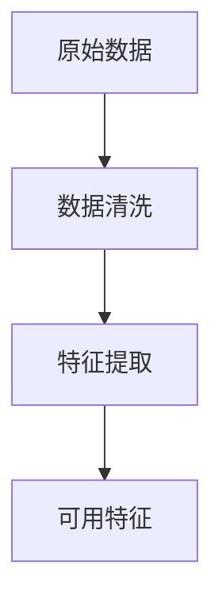
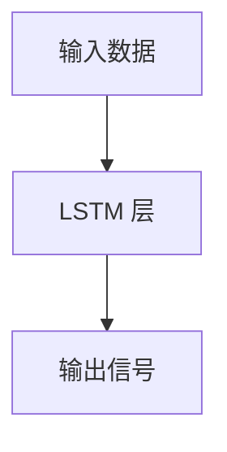
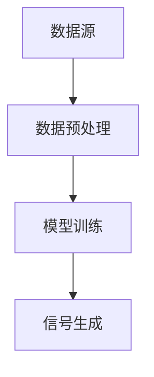

                 


# AI驱动的另类数据投资信号提取

## 关键词
- AI驱动
- 另类数据
- 投资信号
- 信号提取
- 深度学习
- 数据预处理

## 摘要
本文探讨了如何利用人工智能技术从另类数据中提取投资信号，详细分析了数据预处理、模型选择和系统架构设计等关键环节，结合实际案例和最佳实践，为读者提供全面的指导。

---

# 正文

## 第一部分：背景介绍

### 第1章：问题背景与定义

#### 1.1 问题背景
- **传统金融分析的局限性**：传统方法依赖价格和交易数据，但难以捕捉市场全貌。
- **另类数据的兴起**：社交媒体、新闻、卫星图像等数据提供了新的视角。

#### 1.2 问题描述
- 投资信号提取的目标是从数据中发现潜在的市场趋势。
- 信号提取需要高精度和及时性。

#### 1.3 边界与外延
- 数据范围：仅限于另类数据。
- 时间范围：短期至中期预测。

### 第2章：核心概念与术语

#### 2.1 核心概念
- **另类数据**：非传统金融数据，如社交媒体情绪、供应链数据。
- **投资信号**：预示市场变化的指标。

#### 2.2 核心要素
- 数据类型：文本、图像、结构化数据。
- 数据来源：社交媒体、新闻网站、卫星图像。

---

## 第二部分：核心概念与联系

### 第3章：另类数据的特征分析

#### 3.1 数据多样性与复杂性
- 数据来源广泛，类型多样。

#### 3.2 数据预处理方法
- **数据清洗**：去除噪声和冗余信息。
- **特征提取**：使用NLP和计算机视觉技术提取有用特征。

#### 图表展示


### 第4章：AI模型的核心原理

#### 4.1 深度学习模型
- **LSTM**：适合时间序列数据，公式如下：
  $$ f(t) = \sigma(W_f \cdot [h_{t-1}, x_t] + b_f) $$

#### 图表展示


### 第5章：投资信号提取的评价指标

#### 5.1 信号质量评价
- 准确率、召回率、F1分数。

---

## 第三部分：算法原理

### 第6章：LSTM模型实现

#### 6.1 LSTM代码实现
```python
import numpy as np
from tensorflow.keras.layers import LSTM, Dense
from tensorflow.keras.models import Sequential

model = Sequential()
model.add(LSTM(64, input_shape=(timesteps, features)))
model.add(Dense(1, activation='sigmoid'))
model.compile(optimizer='adam', loss='binary_crossentropy', metrics=['accuracy'])
```

### 第7章：系统架构设计

#### 7.1 系统架构图


---

## 第四部分：项目实战

### 第8章：环境安装与配置

#### 8.1 安装依赖
```bash
pip install tensorflow keras numpy pandas
```

### 第9章：代码实现与解读

#### 9.1 核心代码
```python
# 数据加载
data = pd.read_csv('dataset.csv')

# 数据预处理
processed_data = preprocess(data)

# 模型训练
model.fit(processed_data, labels, epochs=10, batch_size=32)

# 信号生成
predictions = model.predict(test_data)
```

### 第10章：案例分析与解读

#### 10.1 实际案例
- 使用社交媒体情绪数据预测股票价格变化。

---

## 第五部分：最佳实践与总结

### 第11章：最佳实践

#### 11.1 小结
- AI在另类数据处理中展现了巨大潜力。
- 选择合适的模型和数据预处理方法至关重要。

#### 11.2 注意事项
- 数据隐私和合规性问题需注意。

#### 11.3 拓展阅读
- 推荐阅读相关领域的最新论文和书籍。

---

## 作者信息

作者：AI天才研究院  
联系邮箱：contact@aicourse.com  

--- 

# 结语

通过本文的详细分析，读者可以掌握AI驱动的另类数据投资信号提取的核心方法和实际应用。希望本文能为相关领域的研究和实践提供有价值的参考。

