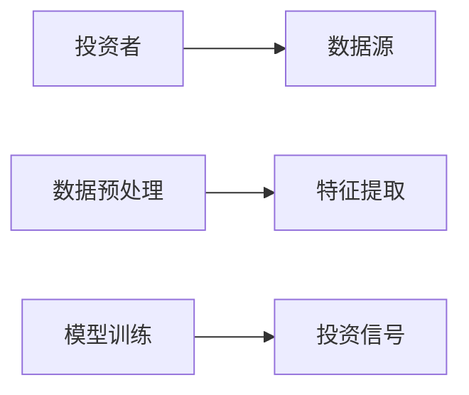
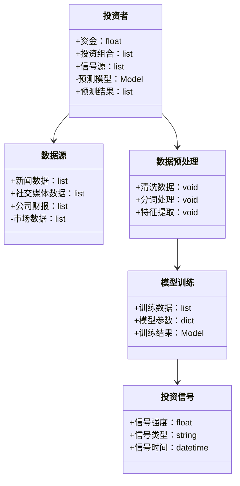

                 


# AI驱动的另类数据投资信号提取

> 关键词：AI驱动、另类数据、投资信号、自然语言处理、时间序列分析、机器学习、金融预测

> 摘要：本文将探讨如何利用人工智能技术从另类数据中提取投资信号。通过对自然语言处理、时间序列分析和机器学习等技术的深入分析，结合实际案例，展示如何构建高效的AI驱动投资信号提取系统。文章从基础概念到系统设计，再到项目实战，全面解析AI在金融投资中的应用潜力。

---

## 第1章: AI驱动的另类数据投资信号提取基础

### 1.1 问题背景与目标

#### 1.1.1 问题背景
传统的金融数据分析主要依赖于价格、成交量等有限的市场数据，这种单一的数据来源难以捕捉市场的全貌。近年来，随着大数据技术的发展，越来越多的非传统数据（如社交媒体、新闻、卫星图像等）被引入金融领域，这些数据被称为“另类数据”。通过分析这些数据，投资者可以发现传统数据无法捕捉到的市场信号。

#### 1.1.2 问题目标
本研究旨在利用人工智能技术，从另类数据中提取潜在的投资信号，帮助投资者做出更明智的投资决策。具体目标包括：
- 探讨另类数据的特征及其在投资中的应用价值。
- 分析AI技术在数据处理、特征提取和信号识别中的作用。
- 构建一个基于AI的另类数据投资信号提取系统。

#### 1.1.3 问题解决的边界与外延
- 数据范围：主要关注文本数据（如新闻、社交媒体）、图像数据（如卫星图像）和结构化数据（如公司财报）。
- 时间范围：关注短期至中期的投资信号。
- 行业范围：以股票市场为主要研究对象。

### 1.2 核心概念与联系

#### 1.2.1 另类数据类型与分析方法对比

| 数据类型       | 分析方法         | 优缺点                           |
|----------------|----------------|----------------------------------|
| 文本数据       | 情感分析、主题建模 | 高维、非结构化，需预处理         |
| 图像数据       | 目标检测、图像分割 | 低维、结构化，需特定模型         |
| 结构化数据     | 时间序列分析     | 高维、连续性，需特征提取         |

#### 1.2.2 AI技术在数据处理中的作用
- **数据清洗**：利用NLP技术去除噪声，提取有用信息。
- **特征提取**：通过深度学习模型（如BERT）提取文本特征。
- **数据增强**：对图像数据进行旋转、裁剪等操作，增强模型鲁棒性。

#### 1.2.3 实体关系图（ER图）架构



---

## 第2章: 自然语言处理在投资信号提取中的应用

### 2.1 NLP技术概述

#### 2.1.1 NLP的基本原理
自然语言处理（NLP）通过计算机理解、生成和操作人类语言。常用技术包括：
- 分词：将文本分割成词或短语。
- 词嵌入：将词表示为低维向量（如Word2Vec、GloVe）。
- 情感分析：判断文本的情感倾向。

#### 2.1.2 NLP在金融文本分析中的应用
- **新闻分析**：通过分析财经新闻的情绪，预测市场走势。
- **社交媒体分析**：挖掘Twitter、Reddit等平台上的用户情绪，辅助投资决策。
- **财报分析**：从公司财报中提取关键信息，预测财务状况。

### 2.2 投资信号提取的NLP流程

#### 2.2.1 数据清洗与分词
```python
import re
from nltk.tokenize import word_tokenize

text = "This is a sample text. It contains some words and punctuation."
text_clean = re.sub(r'[^\w\s]', '', text)
tokens = word_tokenize(text_clean)
print(tokens)
```

#### 2.2.2 情感分析与主题识别
```python
from textblob import TextBlob

text = "The company's earnings exceeded expectations."
blob = TextBlob(text)
sentiment = blob.sentiment.polarity
print(sentiment)
```

#### 2.2.3 文本向量化与相似度计算
```python
from sklearn.feature_extraction.text import TfidfVectorizer

vectorizer = TfidfVectorizer()
text = ["This is a sample text.", "Another sample text."]
tfidf = vectorizer.fit_transform(text)
print(tfidf.shape)
```

---

## 第3章: 时间序列分析与预测

### 3.1 时间序列分析基础

#### 3.1.1 时间序列的基本概念
时间序列是一种按时间顺序排列的数据，常用在股票价格、经济指标等领域的预测。

#### 3.1.2 时间序列的分解方法
时间序列可以分解为趋势、周期性和随机性三部分。

#### 3.1.3 时间序列预测的常见模型
- **ARIMA**：自回归积分滑动平均模型。
- **LSTM**：长短期记忆网络。
- **Prophet**：Facebook开源的时间序列预测模型。

### 3.2 基于AI的时间序列预测

#### 3.2.1 LSTM网络结构
LSTM是一种特殊的RNN，通过门控机制捕捉长期依赖关系。

#### 3.2.2 时间序列预测的数学模型
LSTM的结构可以用以下公式表示：
$$
f_t = \sigma(W_f \cdot [h_{t-1}, x_t] + b_f)
$$

其中，$f_t$ 是遗忘门的输出，$\sigma$ 是sigmoid函数，$W_f$ 是权重矩阵，$h_{t-1}$ 是前一时刻的状态，$x_t$ 是当前输入，$b_f$ 是偏置项。

#### 3.2.3 实际案例分析
使用LSTM模型预测股票价格：
```python
import keras
from keras.models import Sequential
from keras.layers import LSTM, Dense

model = Sequential()
model.add(LSTM(64, input_shape=(timesteps, features)))
model.add(Dense(1))
model.compile(loss='mean_squared_error', optimizer='adam')
```

---

## 第4章: 系统架构与设计

### 4.1 系统功能设计

#### 4.1.1 领域模型（领域类图）


---

## 第5章: 项目实战与最佳实践

### 5.1 环境安装与配置

#### 5.1.1 Python环境配置
```bash
pip install numpy pandas scikit-learn tensorflow keras
```

#### 5.1.2 数据集获取
使用Kaggle上的股票价格数据集：
```bash
wget https://www.kaggle.com/datasets/shubhendra23/stock-price-prediction
```

### 5.2 核心实现代码

#### 5.2.1 数据预处理
```python
import pandas as pd
from sklearn.preprocessing import MinMaxScaler

data = pd.read_csv('stock_price.csv')
scaler = MinMaxScaler()
scaled_data = scaler.fit_transform(data['Close'].values.reshape(-1, 1))
```

#### 5.2.2 模型训练
```python
from keras.models import Sequential
from keras.layers import LSTM, Dense

model = Sequential()
model.add(LSTM(64, input_shape=(timesteps, 1)))
model.add(Dense(1))
model.compile(loss='mean_squared_error', optimizer='adam')
```

### 5.3 实际案例分析
以股票价格预测为例，通过LSTM模型实现短期价格预测。

### 5.4 最佳实践与注意事项
- 数据质量：确保数据清洗和预处理到位。
- 模型选择：根据数据类型选择合适的模型。
- 性能优化：通过超参数调优和分布式训练提升效率。
- 风险控制：结合传统金融策略，避免过度依赖AI模型。

---

## 第6章: 总结与展望

### 6.1 小结
本文详细探讨了AI驱动的另类数据投资信号提取方法，从NLP到时间序列分析，再到系统设计，全面解析了AI在金融领域的应用潜力。

### 6.2 展望
未来，随着AI技术的不断发展，另类数据的应用场景将更加广泛。建议进一步研究多模态数据融合技术，提升模型的准确性和鲁棒性。

---

作者：AI天才研究院/AI Genius Institute & 禅与计算机程序设计艺术 /Zen And The Art of Computer Programming

