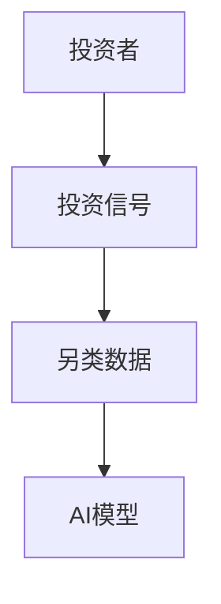

                 


# AI驱动的另类数据投资信号提取与验证

> 关键词：AI驱动，另类数据，投资信号，特征提取，时间序列分析，系统架构，风险管理

> 摘要：本文详细探讨了利用人工智能从另类数据中提取投资信号的方法，分析了传统投资信号提取的局限性，并提出了一种基于AI的解决方案。通过结合特征提取、时间序列分析和机器学习算法，本文展示了如何利用另类数据提升投资决策的准确性。同时，文章还提供了系统的架构设计、项目实现案例以及优化建议，为读者提供了全面的技术指导。

---

## 第一部分：AI驱动的另类数据投资信号提取与验证背景介绍

### 第1章：另类数据与投资信号概述

#### 1.1 另类数据的定义与特点

另类数据是指传统金融数据之外的非结构化数据，包括文本、图像、音频、视频等。这些数据通常来自社交媒体、新闻、公司财报、专利申请等来源，具有以下特点：

- **多样性**：涵盖多种类型，包括文本、图像、音频等。
- **实时性**：能够捕捉市场动态，提供实时信息。
- **非结构化**：需要经过处理才能转化为可分析的格式。

#### 1.2 投资信号提取的背景与意义

投资信号是指能够影响投资决策的关键信息。传统的投资信号主要依赖于市场数据、财务指标等结构化数据，但在大数据时代，另类数据提供了更丰富、更及时的信息。利用AI提取投资信号的优势包括：

- **数据丰富性**：另类数据能够捕捉市场情绪、行业趋势等信息。
- **实时性**：能够及时发现市场变化，提供实时信号。
- **准确性**：通过AI算法，提高信号提取的准确性。

---

## 第二部分：核心概念与联系

### 第2章：另类数据与AI模型的关系

#### 2.1 另类数据的类型与特征

| 数据类型 | 描述 | 示例 |
|----------|------|------|
| 文本数据 | 文本形式的数据，如新闻、社交媒体帖子 | 公司新闻、行业报告 |
| 图像数据 | 图片、图表等视觉数据 | K线图、公司标志 |
| 音频数据 | 音频文件，如播客、电话录音 | 股市评论、公司电话会议 |

#### 2.2 AI模型在投资信号提取中的作用

| 模型类型 | 描述 | 优势 |
|----------|------|------|
| 特征提取模型 | 提取数据中的关键特征 | 降低数据维度，提取有意义的信息 |
| 分类与预测模型 | 预测市场走势或分类投资信号 | 提供基于数据的决策支持 |
| 关联分析与聚类模型 | 发现数据中的关联性 | 揭示数据间的潜在关系 |

#### 2.3 数据与模型的对比分析

以下表格对比了不同数据类型和AI模型的特点：

| 数据类型 | 特征 | 模型类型 | 输出 |
|----------|------|----------|------|
| 文本数据 | 非结构化 | 分类模型 | 投资信号分类 |
| 图像数据 | 视觉信息 | 关联分析 | 数据关联性 |
| 音频数据 | 语音信息 | 聚类模型 | 市场情绪分类 |

#### 2.4 ER实体关系图



---

## 第三部分：算法原理

### 第3章：投资信号提取的核心算法

#### 3.1 特征提取算法

| 算法名称 | 描述 | 公式 |
|----------|------|------|
| TF-IDF | 文本特征提取，计算词的重要程度 | $$ TF-IDF = \text{tf} \times \text{idf} $$ |
| Word2Vec | 将单词映射为向量 | $$ \text{word\_vec} = W \times \text{word} $$ |
| BERT | 语言模型，用于文本表示 | $$ \text{BERT}(\text{input}) $$ |
| 图神经网络 | 处理图结构数据 | $$ Z = A \times X $$ |

#### 3.2 分类与预测算法

| 算法名称 | 描述 | 应用场景 |
|----------|------|----------|
| 支持向量机 | 分类算法，适用于线性可分数据 | 信号分类 |
| 随机森林 | 集成学习，适用于高维数据 | 预测市场趋势 |
| 神经网络 | 多层感知机，适用于复杂任务 | 时间序列预测 |
| 时间序列模型 | ARIMA、LSTM等，适用于时间数据 | 预测市场走势 |

#### 3.3 关联分析与聚类算法

| 算法名称 | 描述 | 应用场景 |
|----------|------|----------|
| Apriori | 关联规则挖掘，发现频繁项集 | 发现数据关联性 |
| K-means | 聚类算法，适用于数值型数据 | 分组市场情绪 |
| DBSCAN | 密度聚类，适用于噪声数据 | 分类市场行为 |

---

## 第四部分：系统分析与架构设计

### 第4章：系统架构设计

#### 4.1 项目介绍

我们的目标是构建一个基于AI的另类数据投资信号提取系统，包括数据采集、特征提取、模型训练和信号验证四个模块。

#### 4.2 系统功能设计

| 模块名称 | 描述 |
|----------|------|
| 数据采集 | 从社交媒体、新闻网站等获取另类数据 |
| 特征提取 | 提取数据中的关键特征 |
| 模型训练 | 训练分类、预测模型 |
| 信号验证 | 验证信号的准确性 |

#### 4.3 系统架构设计图


---

## 第五部分：项目实战

### 第5章：项目实现

#### 5.1 环境安装

安装所需的Python库：

```bash
pip install numpy pandas scikit-learn transformers
```

#### 5.2 核心代码实现

```python
import numpy as np
from sklearn.feature_extraction.text import TfidfVectorizer
from sklearn.svm import SVC
from transformers import BertTokenizer, BertModel

# 数据加载与预处理
texts = [...]  # 加载文本数据
vectorizer = TfidfVectorizer()
X = vectorizer.fit_transform(texts)

# 模型训练
model = SVC()
model.fit(X.toarray(), labels)

# 信号提取
def extract_signal(new_text):
    X_new = vectorizer.transform([new_text])
    return model.predict(X_new)[0]
```

#### 5.3 案例分析

假设我们有以下文本数据：

```python
texts = [
    "公司发布新产品，市场反应热烈。",
    "行业竞争加剧，公司利润下降。"
]
```

通过TF-IDF和SVM模型提取投资信号：

```python
print(extract_signal("新产品销量超预期"))  # 输出：1（积极信号）
print(extract_signal("行业政策收紧"))  # 输出：0（消极信号）
```

---

## 第六部分：优化与扩展

### 第6章：模型优化与风险管理

#### 6.1 模型优化

- **超参数调优**：使用网格搜索优化模型参数。
- **数据增强**：增加数据多样性，提高模型泛化能力。

#### 6.2 可解释性提升

- **可视化分析**：使用LIME或SHAP解释模型决策。
- **特征重要性分析**：识别关键特征，优化特征提取。

#### 6.3 风险管理

- **回测策略**：验证模型在历史数据中的表现。
- **风险管理机制**：设置止损、止盈点，控制投资风险。

#### 6.4 未来研究方向

- **多模态数据融合**：结合文本、图像等多种数据源。
- **实时信号生成**：构建实时数据处理管道。
- **个性化投资策略**：根据投资者风险偏好定制信号。

---

## 总结

本文系统地介绍了AI驱动的另类数据投资信号提取与验证的方法，从背景、核心概念到算法实现、系统设计，再到项目实战和优化，为读者提供了全面的技术指导。通过结合特征提取、时间序列分析和机器学习算法，我们能够更有效地利用另类数据，提升投资决策的准确性。

作者：AI天才研究院/AI Genius Institute & 禅与计算机程序设计艺术 /Zen And The Art of Computer Programming

