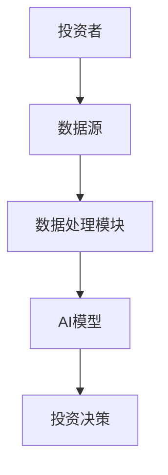
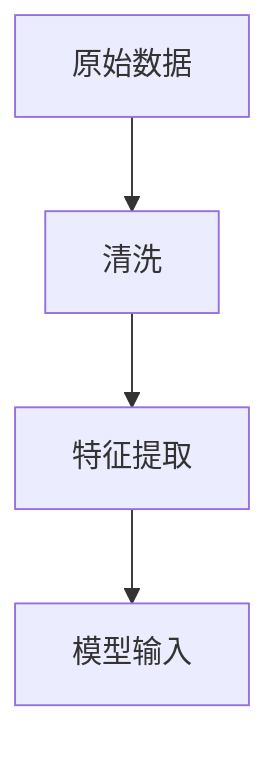
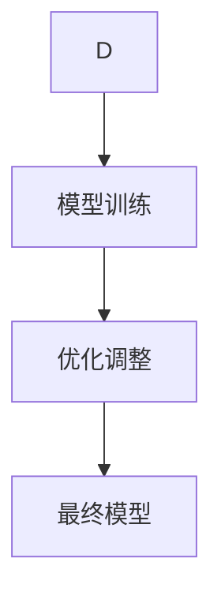
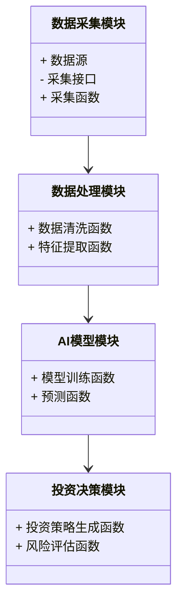
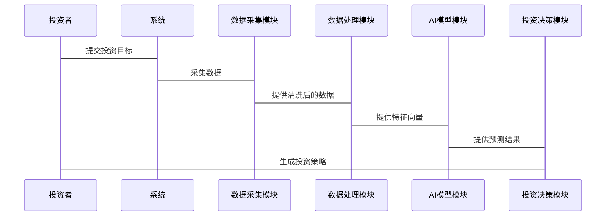

                 


# AI驱动的另类数据投资分析

> 关键词：AI，另类数据，投资分析，数据驱动，机器学习，金融技术

> 摘要：本文探讨了AI在另类数据投资分析中的应用，分析了传统投资方法的局限性，介绍了另类数据的来源和类型，详细讲解了AI驱动的投资分析流程与框架，通过算法原理、数学模型和系统架构设计，结合实际案例，展示了如何利用AI技术提升投资决策的效率和准确性。

---

# 第一部分：AI驱动的另类数据投资分析概述

## 第1章：背景介绍与核心概念

### 1.1 问题背景

#### 1.1.1 投资分析的传统方法与局限性

传统的投资分析方法主要依赖于财务报表、市场数据等结构化数据。然而，这种方法存在以下局限性：

- 数据范围有限：仅依赖财务数据难以捕捉市场全貌。
- 高度依赖经验：投资决策往往受到分析师主观判断的影响。
- 数据处理复杂：传统方法难以处理非结构化数据。

#### 1.1.2 另类数据的定义与特点

另类数据是指传统金融数据以外的其他数据类型，例如：

- **社交媒体数据**：分析投资者情绪。
- **卫星图像**：监测工厂生产情况。
- **互联网搜索数据**：反映市场趋势。
- **物联网数据**：收集实时设备信息。

#### 1.1.3 AI技术在投资分析中的作用

AI技术能够处理大量非结构化数据，发现隐藏的模式和趋势，帮助投资者做出更明智的决策。

### 1.2 核心概念与问题描述

#### 1.2.1 另类数据的来源与类型

| 数据来源 | 数据类型 | 描述 |
|----------|----------|------|
| 社交媒体 | 文本数据 | 分析用户评论和情感 |
| 卫星图像 | 图像数据 | 监测地理位置变化 |
| 互联网搜索 | 日志数据 | 分析搜索关键词热度 |

#### 1.2.2 AI驱动投资分析的流程与框架

AI驱动的投资分析流程通常包括以下几个步骤：

1. 数据采集：从多个来源收集数据。
2. 数据清洗：去除噪声，确保数据质量。
3. 特征提取：从数据中提取有用特征。
4. 模型训练：使用机器学习算法训练模型。
5. 投资决策：根据模型输出制定投资策略。

#### 1.2.3 问题解决的边界与外延

- 边界：仅处理另类数据，不涉及传统金融数据。
- 外延：AI模型的预测结果需要结合人类判断。

### 1.3 核心概念的结构与组成

#### 1.3.1 数据流与信息处理流程

数据流从数据源流向处理模块，最终生成投资决策。

#### 1.3.2 AI模型与投资决策的关系

AI模型为投资决策提供支持，但最终决策需结合人类判断。

#### 1.3.3 系统架构的核心要素

- 数据采集模块：负责数据收集。
- 数据处理模块：负责数据清洗和特征提取。
- AI模型模块：负责模型训练和预测。
- 投资决策模块：负责生成投资策略。

---

## 第2章：核心概念与联系

### 2.1 另类数据与AI的结合原理

#### 2.1.1 数据预处理与特征提取

数据预处理是AI驱动投资分析的关键步骤，包括：

- 数据清洗：去除无效数据。
- 数据转换：将数据转换为模型可接受的格式。
- 特征工程：提取有助于模型预测的特征。

#### 2.1.2 AI模型的训练与优化

AI模型训练包括：

- 数据划分：将数据划分为训练集和测试集。
- 模型训练：使用训练数据训练模型。
- 模型优化：通过调整超参数提高模型性能。

#### 2.1.3 投资决策的生成与验证

投资决策生成基于AI模型的预测结果，验证过程包括：

- 回测：在历史数据上测试模型表现。
- 现实检验：在实际市场中验证模型的有效性。

### 2.2 核心概念的属性特征对比

| 比较维度 | 传统数据 | 另类数据 |
|----------|----------|----------|
| 数据类型 | 结构化 | 非结构化 |
| 数据量 | 小 | 大 |
| 数据来源 | 有限 | 多样 |

### 2.3 ER实体关系图



---

## 第3章：算法原理与数学模型

### 3.1 算法原理

#### 3.1.1 数据预处理流程



#### 3.1.2 模型训练流程



### 3.2 数学模型与公式

#### 3.2.1 数据标准化公式

$$ x' = \frac{x - \mu}{\sigma} $$

其中，$\mu$ 是均值，$\sigma$ 是标准差。

#### 3.2.2 损失函数

$$ L = \frac{1}{n}\sum_{i=1}^{n}(y_i - \hat{y}_i)^2 $$

这是一个均方误差损失函数。

#### 3.2.3 模型预测公式

$$ \hat{y} = f(x) $$

$f$ 是训练好的AI模型。

---

## 第4章：系统分析与架构设计

### 4.1 系统架构设计


### 4.2 系统功能设计



### 4.3 系统接口设计



---

## 第5章：项目实战

### 5.1 环境安装

```bash
pip install numpy pandas scikit-learn
```

### 5.2 核心代码实现

```python
import pandas as pd
from sklearn.model import LinearRegression

# 数据加载
data = pd.read_csv('data.csv')

# 数据清洗
data.dropna()

# 特征提取
X = data[['feature1', 'feature2']]
y = data['target']

# 模型训练
model = LinearRegression()
model.fit(X, y)

# 预测
predictions = model.predict(X)
```

### 5.3 案例分析

假设我们有社交媒体数据，分析市场情绪，预测股票价格。

---

## 第6章：最佳实践与注意事项

### 6.1 最佳实践 tips

- 数据预处理是关键。
- 模型选择要根据数据类型。
- 结合人类判断进行最终决策。

### 6.2 小结

本文详细介绍了AI驱动的另类数据投资分析，从背景到实现，全面覆盖了相关知识。

### 6.3 注意事项

- 数据隐私问题需重视。
- 模型需定期更新。
- 避免过度依赖AI。

### 6.4 拓展阅读

推荐书籍：《机器学习实战》、《数据驱动的投资》。

---

# 结语

通过AI技术，另类数据投资分析变得更加高效和精准。希望本文能为读者提供有价值的见解和指导。

---

# 作者：AI天才研究院 & 禅与计算机程序设计艺术

本文由AI天才研究院与禅与计算机程序设计艺术联合撰写，转载请注明出处。

