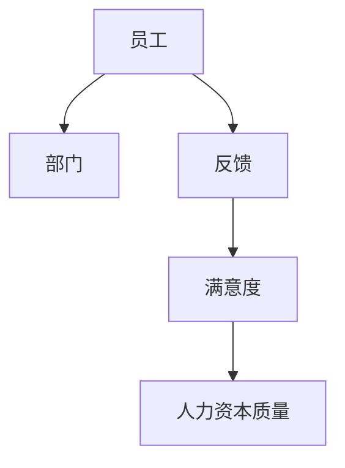

                 


# AI驱动的员工满意度分析：评估人力资本质量

> 关键词：员工满意度，人工智能，自然语言处理，机器学习，人力资本，数据挖掘

> 摘要：随着企业对人力资本质量的重视程度不断提高，员工满意度分析成为评估企业健康状况的重要指标。本文将探讨如何利用人工智能技术，特别是自然语言处理和机器学习算法，来分析员工反馈，评估人力资本质量。通过结合情感分析和混合数据源分析方法，AI能够显著提升员工满意度分析的效率和准确性，为企业提供更具价值的决策支持。

---

# 第1章: AI驱动的员工满意度分析背景与概述

## 1.1 什么是员工满意度分析
### 1.1.1 员工满意度的定义
员工满意度是员工对工作环境、薪酬、职业发展、团队合作等方面的情感和态度的综合体现。它是衡量企业内部员工幸福感和工作积极性的重要指标。

### 1.1.2 员工满意度的重要性
员工满意度高的员工通常表现出更高的工作效率和创造力，能够为公司创造更多的价值。同时，员工满意度也与员工流失率密切相关，高满意度的员工更可能留在公司，降低招聘和培训的成本。

### 1.1.3 人力资本质量的内涵
人力资本质量指的是员工的知识、技能、经验和工作态度的综合水平。通过分析员工满意度，可以评估人力资本的质量，为企业制定有效的员工管理策略提供数据支持。

## 1.2 AI在员工满意度分析中的作用
### 1.2.1 传统员工满意度分析的局限性
传统的员工满意度分析方法通常依赖于问卷调查和统计分析，这种方法耗时长、成本高，且难以捕捉员工反馈中的隐含情感和意图。

### 1.2.2 AI技术如何提升分析效率
人工智能技术，特别是自然语言处理（NLP）和机器学习，能够快速处理大量非结构化数据（如员工反馈文本），提取关键信息，识别潜在问题，并提供个性化的改进建议。

### 1.2.3 AI驱动分析的未来趋势
随着深度学习和自然语言处理技术的进步，AI在员工满意度分析中的应用将更加智能化和自动化。未来，AI可能会集成更多的数据源，提供更精准的预测和洞察。

## 1.3 本书的核心目标与内容
### 1.3.1 本书的核心目标
本书旨在探讨如何利用AI技术提升员工满意度分析的效率和准确性，为企业提供科学的人力资本评估方法。

### 1.3.2 本书的主要内容
本书将详细介绍员工满意度分析的核心概念、AI算法的实现原理、系统设计与实现，以及实际项目中的应用案例。

### 1.3.3 本书的结构安排
本书共分为六大部分：背景与概述、核心概念与联系、算法原理、系统分析、项目实战以及最佳实践。每一部分都将深入探讨相关主题，结合实际案例和代码示例，帮助读者全面理解AI驱动的员工满意度分析。

---

# 第2章: 员工满意度分析的核心概念与联系

## 2.1 员工满意度分析的核心要素
### 2.1.1 影响员工满意度的关键因素
员工满意度受多种因素影响，包括工作环境、薪酬福利、职业发展机会、团队合作氛围等。

### 2.1.2 不同岗位的满意度差异
不同岗位的员工对满意度的影响因素可能不同。例如，技术岗位可能更关注职业发展机会，而客服岗位可能更关注薪酬福利。

### 2.1.3 企业文化与员工满意度的关系
企业文化的包容性和开放性直接影响员工的满意度。积极的企业文化能够促进员工的归属感和工作积极性。

## 2.2 数据来源与分析方法
### 2.2.1 数据来源的多样性
员工满意度分析的数据来源包括员工问卷调查、工作日志、绩效评价、离职面谈记录等。

### 2.2.2 文本分析与数值分析的对比
文本分析能够捕捉员工反馈中的情感和意图，而数值分析则能够量化满意度的高低。结合两种方法可以更全面地分析员工满意度。

### 2.2.3 AI驱动的混合分析方法
通过结合文本分析和数值分析，AI可以更全面地评估员工满意度，发现潜在问题，并提出改进建议。

## 2.3 实体关系图与特征对比表
### 2.3.1 ER实体关系图


### 2.3.2 分析方法特征对比
| 特征 | 传统方法 | AI驱动方法 |
|------|-----------|-------------|
| 数据来源 | 单一数据源 | 多数据源整合 |
| 分析效率 | 低效 | 高效自动分析 |
| 精度 | 较低 | 高精度 |

---

# 第3章: AI驱动的员工满意度分析算法原理

## 3.1 情感分析算法
### 3.1.1 情感分析的基本原理
情感分析是一种自然语言处理任务，旨在识别文本中的情感倾向（正面、负面或中性）。

### 3.1.2 基于词袋模型的情感分析
```python
# 示例代码：基于词袋模型的情感分析
from sklearn.feature_extraction.text import CountVectorizer
from sklearn.svm import SVC

# 数据预处理
text_data = ["I love my job!", "The work environment is terrible."]
vectorizer = CountVectorizer()
X = vectorizer.fit_transform(text_data)
model = SVC()
model.fit(X, [1, 0])
```

### 3.1.3 基于深度学习的情感分析
使用预训练的BERT模型进行情感分析：
```python
from transformers import BertTokenizer, BertForSequenceClassification
import torch

tokenizer = BertTokenizer.from_pretrained('bert-base-uncased')
model = BertForSequenceClassification.from_pretrained('bert-base-uncased')
inputs = tokenizer("I love my job!", return_tensors='pt')
outputs = model(**inputs)
```

## 3.2 机器学习模型
### 3.2.1 机器学习模型的训练与优化
使用监督学习算法（如随机森林或梯度提升树）训练员工满意度预测模型。

### 3.2.2 模型评估与调优
通过交叉验证评估模型性能，并进行超参数调优以提高预测准确率。

---

# 第4章: 系统分析与架构设计方案

## 4.1 问题场景介绍
员工满意度分析系统需要处理大量员工反馈数据，包括文本、数值和结构化数据。

## 4.2 系统功能设计
### 4.2.1 数据采集模块
负责收集员工反馈数据，包括问卷调查和工作日志。

### 4.2.2 数据分析模块
利用NLP和机器学习算法对数据进行处理和分析。

### 4.2.3 可视化报告模块
生成员工满意度分析报告，并以图表形式展示结果。

## 4.3 系统架构设计


## 4.4 系统接口设计
### 4.4.1 REST API接口
提供API供其他系统调用员工满意度分析结果。

### 4.4.2 微服务架构
采用微服务架构，实现模块化开发和部署。

---

# 第5章: 项目实战与结果分析

## 5.1 项目实战
### 5.1.1 环境安装
安装Python和相关库（如TensorFlow、Keras、Scikit-learn）。

### 5.1.2 数据收集与清洗
从员工问卷调查中收集数据，并进行预处理。

### 5.1.3 模型训练与优化
训练情感分析模型，并进行模型调优。

## 5.2 结果分析与可视化
### 5.2.1 模型预测结果
展示模型预测的员工满意度结果。

### 5.2.2 可视化报告
生成图表展示员工满意度分布情况。

---

# 第6章: 最佳实践与注意事项

## 6.1 最佳实践
### 6.1.1 数据隐私保护
确保员工数据的隐私和安全。

### 6.1.2 模型解释性
选择易于解释的模型，以便更好地理解员工满意度的影响因素。

## 6.2 小结
通过AI技术，员工满意度分析变得更加高效和准确，为企业优化人力资本管理提供了有力支持。

## 6.3 注意事项
### 6.3.1 数据质量
确保数据的完整性和准确性。

### 6.3.2 模型维护
定期更新模型，以适应数据变化和业务需求。

## 6.4 拓展阅读
推荐相关书籍和论文，供读者深入学习。

---

作者：AI天才研究院/AI Genius Institute & 禅与计算机程序设计艺术/Zen And The Art of Computer Programming

