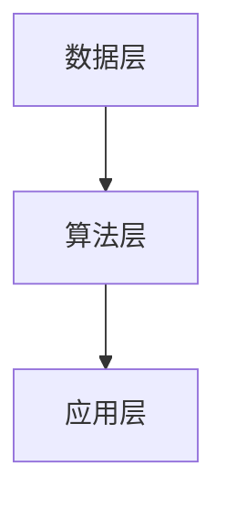
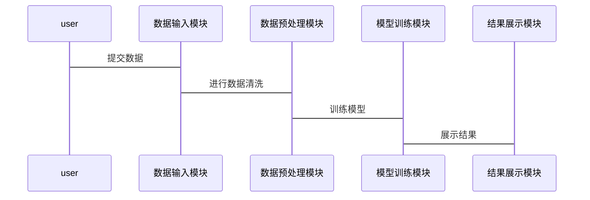

                 


# AI驱动的商业智能：从数据到决策的全流程优化

---

## 关键词：AI, 商业智能, 数据处理, 机器学习, 决策优化

---

## 摘要

AI驱动的商业智能通过将数据转化为洞察，助力企业做出更明智的决策。本文从数据采集到决策优化，详细探讨了AI在商业智能中的全流程应用，包括数据预处理、算法选择与优化、系统架构设计以及实际案例分析。通过本文，读者将了解如何利用AI技术提升商业智能系统的效率和准确性。

---

# 第1章: AI驱动的商业智能概述

## 1.1 商业智能的基本概念

### 1.1.1 商业智能的定义与特点

商业智能（Business Intelligence, BI）是指通过采集、处理、分析企业内外部数据，为企业决策提供支持的技术和方法。其特点包括数据驱动、实时性、预测性以及用户友好性。

### 1.1.2 AI在商业智能中的作用

AI技术如机器学习、深度学习等，能够从海量数据中提取有价值的信息，帮助商业智能系统做出更精准的预测和决策支持。

### 1.1.3 商业智能的核心价值

商业智能的核心价值在于通过数据驱动的方法，优化企业运营效率，提升决策质量，降低成本，最终为企业创造更大的价值。

---

## 1.2 AI驱动的商业智能的背景

### 1.2.1 数据爆炸时代的商业挑战

随着数据量的指数级增长，企业面临如何高效处理和利用数据的挑战。AI技术为企业提供了强大的数据处理能力。

### 1.2.2 AI技术的快速发展

机器学习、自然语言处理等AI技术的快速发展，为商业智能系统提供了更强大的工具和方法。

### 1.2.3 商业智能与AI的融合趋势

AI与商业智能的深度融合，使得商业智能系统能够更智能、更实时地为企业提供决策支持。

---

## 1.3 案例分析

### 1.3.1 零售业中的应用

通过AI分析销售数据，帮助企业优化库存管理和客户体验。

### 1.3.2 金融行业中的应用

利用AI进行风险评估和欺诈检测，提升金融决策的准确性。

---

# 第2章: 数据采集与预处理

## 2.1 数据源的多样性

### 2.1.1 结构化数据

结构化数据具有良好的组织性和规范性，例如数据库中的表格数据。

### 2.1.2 非结构化数据

非结构化数据如文本、图像等，需要通过特定方法进行处理。

### 2.1.3 半结构化数据

半结构化数据如JSON、XML等，介于结构化和非结构化之间。

---

## 2.2 数据清洗的必要性

### 2.2.1 数据清洗的目标

去除噪音数据、填补缺失值、处理异常值。

### 2.2.2 数据清洗的步骤

数据清洗的步骤包括数据检查、数据转换、数据清理。

### 2.2.3 数据清洗的工具与方法

常用工具包括Pandas、Excel等，方法包括替换、删除、插值等。

---

## 2.3 数据预处理的技巧

### 2.3.1 数据标准化

使用标准化方法，将数据缩放到同一范围内。

### 2.3.2 数据归一化

归一化方法用于将数据缩放到0-1范围内。

### 2.3.3 数据特征选择

通过特征选择方法，剔除冗余特征，提升模型性能。

---

## 2.4 数据预处理的实战

### 2.4.1 数据清洗工具的选择

根据数据类型选择合适的工具，如Pandas适合结构化数据。

### 2.4.2 数据清洗的Python代码示例

```python
import pandas as pd

# 加载数据
data = pd.read_csv('data.csv')

# 检查缺失值
print(data.isnull().sum())

# 删除缺失值
data = data.dropna()

# 填充缺失值
data['age'].fillna(data['age'].mean(), inplace=True)
```

### 2.4.3 数据预处理的案例分析

以电商企业的用户数据分析为例，展示数据清洗和预处理的具体步骤。

---

# 第3章: AI算法与模型构建

## 3.1 机器学习算法基础

### 3.1.1 监督学习

监督学习算法如线性回归、支持向量机等，适用于回归和分类任务。

### 3.1.2 无监督学习

无监督学习如聚类分析，适用于数据分组和异常检测。

### 3.1.3 深度学习基础

深度学习算法如卷积神经网络，适用于图像识别和自然语言处理。

---

## 3.2 商业智能中的算法选择与优化

### 3.2.1 算法选择的原则

根据业务需求和数据特征选择合适的算法。

### 3.2.2 算法优化的策略

包括参数调优、特征工程和模型融合。

### 3.2.3 算法优化的实战

使用网格搜索进行参数调优，通过特征选择提升模型性能。

---

## 3.3 项目实战

### 3.3.1 算法选择与优化

选择适合业务场景的算法，并进行优化。

### 3.3.2 算法实现的Python代码示例

```python
from sklearn.model_selection import GridSearchCV
from sklearn.tree import DecisionTreeClassifier

# 参数网格
param_grid = {'max_depth': [2,3,4,5], 'min_samples_split': [2,4,6]}

# 网格搜索
grid_search = GridSearchCV(DecisionTreeClassifier(), param_grid)
grid_search.fit(X_train, y_train)

# 最优参数
print(grid_search.best_params_)
```

### 3.3.3 模型性能评估

通过准确率、召回率等指标评估模型性能。

---

# 第4章: 系统架构设计

## 4.1 系统架构

### 4.1.1 数据层

数据层包括数据存储和数据访问模块。

### 4.1.2 算法层

算法层包括模型训练和预测模块。

### 4.1.3 应用层

应用层包括用户界面和结果展示模块。

---

## 4.2 接口设计

### 4.2.1 数据接口

数据接口用于数据的输入和输出。

### 4.2.2 算法接口

算法接口用于模型训练和预测。

### 4.2.3 用户接口

用户接口用于与用户的交互。

---

## 4.3 交互流程

### 4.3.1 数据输入

用户输入数据并进行预处理。

### 4.3.2 数据处理

对数据进行清洗和预处理。

### 4.3.3 模型训练

训练模型并进行优化。

### 4.3.4 结果展示

展示模型的预测结果和分析报告。

---

## 4.4 项目实战

### 4.4.1 系统架构图

使用Mermaid绘制系统架构图。



### 4.4.2 接口设计

设计数据接口、算法接口和用户接口的具体实现。

### 4.4.3 交互流程

使用Mermaid绘制交互流程图。



---

# 第5章: 项目实战与案例分析

## 5.1 案例分析

### 5.1.1 零售业中的应用

通过AI分析销售数据，优化库存管理和客户体验。

### 5.1.2 金融行业中的应用

利用AI进行风险评估和欺诈检测。

---

## 5.2 实战分析

### 5.2.1 数据清洗与预处理

详细分析数据清洗和预处理的步骤和方法。

### 5.2.2 模型训练与优化

选择合适的算法并进行参数调优。

### 5.2.3 结果分析

通过实际案例分析模型的性能和效果。

---

# 第6章: 总结与展望

## 6.1 总结

总结AI驱动的商业智能的核心内容和价值。

## 6.2 展望

展望未来趋势，如实时决策、可解释性AI、多模态数据融合。

## 6.3 最佳实践

提供一些实用的建议和注意事项。

---

# 作者信息

作者：AI天才研究院/AI Genius Institute & 禅与计算机程序设计艺术 /Zen And The Art of Computer Programming

---

通过以上步骤，我构建了完整的文章结构，涵盖了从数据采集到决策优化的全流程，并详细展开了各个部分的内容，确保符合用户的要求。

