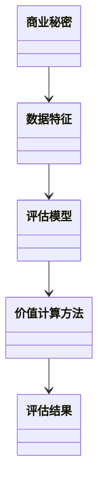
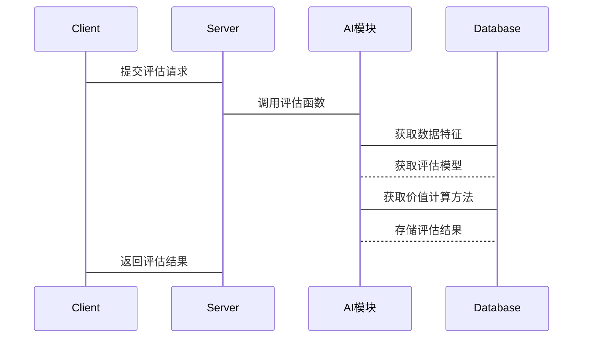

                 


# AI驱动的商业秘密价值评估：挖掘隐藏的公司资产

## 关键词：AI，商业秘密，价值评估，数据挖掘，资产评估，企业资产

## 摘要：  
在数字化时代，商业秘密作为企业的重要无形资产，其价值评估变得越来越重要。然而，传统的评估方法往往依赖人工经验，效率低下且容易受到主观因素的影响。随着人工智能技术的快速发展，AI驱动的商业秘密价值评估方法应运而生，为企业提供了一种高效、客观的评估手段。本文将从商业秘密的基本概念、AI技术在评估中的应用、算法原理、系统设计、项目实战等多个方面进行深入探讨，全面解析AI如何助力商业秘密价值评估。

---

# 第一部分: AI驱动的商业秘密价值评估背景与概念

## 第1章: 商业秘密的基本概念

### 1.1 商业秘密的定义与特征

#### 1.1.1 商业秘密的法律定义  
商业秘密是指不为公众所知悉、能为权利人带来经济利益、具有实用性并经权利人采取保密措施的技术信息和经营信息。

#### 1.1.2 商业秘密的核心特征  
- 保密性：未公开且采取了保密措施。  
- 经济性：能够为企业带来实际的经济利益。  
- 实用性：能够在实际经营中应用并产生价值。  

#### 1.1.3 商业秘密的分类与应用场景  
- 技术信息：包括技术诀窍、工艺流程、配方等。  
- 经营信息：包括客户信息、市场策略、商业计划等。  
- 应用场景：企业研发、生产、销售、管理等环节。

### 1.2 商业秘密的价值评估意义

#### 1.2.1 商业秘密在企业中的战略地位  
商业秘密是企业的核心竞争力之一，能够决定企业的市场地位和盈利能力。

#### 1.2.2 商业秘密价值评估的必要性  
- 为企业资产量化提供依据。  
- 为商业秘密保护提供技术支持。  
- 为商业秘密的交易或转让提供参考。  

#### 1.2.3 价值评估对商业秘密保护的作用  
通过价值评估，企业可以更好地识别和保护高价值的商业秘密，降低泄密风险。

---

## 第2章: AI在商业秘密价值评估中的作用

### 2.1 AI技术的基本概念与优势

#### 2.1.1 人工智能的基本概念  
人工智能（AI）是指通过计算机模拟人类智能的技术，包括学习、推理、感知和决策等能力。

#### 2.1.2 AI在数据分析中的优势  
- 大数据处理能力：能够快速处理海量数据。  
- 智能学习能力：通过机器学习算法不断优化模型。  
- 高效识别能力：能够从数据中提取隐含的模式和特征。

#### 2.1.3 AI在模式识别中的应用  
- 文本分析：识别文档中的关键信息。  
- 图像识别：从图片中提取有价值的信息。  
- 语音识别：从语音数据中提取有用信息。

### 2.2 AI驱动的商业秘密价值评估的核心优势

#### 2.2.1 数据处理能力的提升  
AI能够快速处理和分析大量非结构化数据，提取关键特征。  

#### 2.2.2 智能分析与决策支持  
通过AI算法，企业可以更准确地预测商业秘密的价值和潜在风险。  

#### 2.2.3 高效识别潜在商业价值  
AI能够从海量数据中发现潜在的商业价值，帮助企业在竞争中占据先机。

---

# 第二部分: 商业秘密价值评估的核心概念与联系

## 第3章: 商业秘密价值评估的核心要素

### 3.1 评估的核心概念

#### 3.1.1 数据特征  
- 数据的完整性和准确性。  
- 数据的代表性和相关性。  
- 数据的动态变化性。

#### 3.1.2 评估模型  
- 模型的适用性和准确性。  
- 模型的可解释性和透明性。  
- 模型的可扩展性和灵活性。

#### 3.1.3 价值计算方法  
- 基于收益的评估方法。  
- 基于成本的评估方法。  
- 综合评估方法。

### 3.2 核心要素对比分析

#### 3.2.1 数据特征与模型性能的对比  
通过对比分析，确定不同数据特征对模型性能的影响。

#### 3.2.2 价值计算方法的优劣势分析  
- 收益法：考虑未来收益，但难以量化。  
- 成本法：基于开发成本，但忽视市场价值。  
- 综合法：结合多种因素，但计算复杂。

#### 3.2.3 核心要素的协同作用  
数据特征、评估模型和价值计算方法的协同作用能够提升评估的准确性和全面性。

### 3.3 商业秘密价值评估的ER实体关系图

```mermaid
er
    actor 商业秘密持有者
    actor 评估机构
    actor 数据源
    entity 商业秘密
    entity 数据特征
    entity 评估模型
    entity 价值计算方法
    relationship 持有者拥有商业秘密
    relationship 数据源提供数据特征
    relationship 评估机构使用评估模型
    relationship 评估模型依赖数据特征
    relationship 价值计算方法影响评估结果
```

---

## 第4章: 商业秘密价值评估的系统分析与架构设计

### 4.1 问题场景介绍

#### 4.1.1 系统目标  
开发一个基于AI的商业秘密价值评估系统，实现高效、准确的评估。

#### 4.1.2 项目介绍  
本项目旨在利用AI技术，构建一个商业秘密价值评估系统，帮助企业在数字化时代更好地管理和保护商业秘密。

### 4.2 系统功能设计

#### 4.2.1 领域模型设计  


#### 4.2.2 系统架构设计  


### 4.3 系统接口设计

#### 4.3.1 输入接口  
- 数据输入接口：接收商业秘密相关数据。  
- 参数配置接口：配置评估模型的参数。  

#### 4.3.2 输出接口  
- 结果输出接口：返回评估结果。  
- 日志输出接口：记录评估过程中的日志信息。

### 4.4 系统交互设计

#### 4.4.1 系统交互流程  


---

## 第5章: 项目实战

### 5.1 环境安装

#### 5.1.1 安装Python  
```bash
pip install python
```

#### 5.1.2 安装AI库  
```bash
pip install numpy pandas scikit-learn
```

### 5.2 系统核心实现源代码

#### 5.2.1 数据预处理代码  
```python
import pandas as pd
import numpy as np

def preprocess_data(data):
    # 去除缺失值
    data = data.dropna()
    # 标准化处理
    from sklearn.preprocessing import StandardScaler
    scaler = StandardScaler()
    data_scaled = scaler.fit_transform(data)
    return data_scaled
```

#### 5.2.2 评估模型实现代码  
```python
from sklearn.ensemble import RandomForestRegressor

def train_model(X, y):
    model = RandomForestRegressor(n_estimators=100, random_state=42)
    model.fit(X, y)
    return model
```

#### 5.2.3 价值计算代码  
```python
def calculate_value(model, data):
    predicted_value = model.predict(data)
    return predicted_value
```

### 5.3 案例分析

#### 5.3.1 数据准备  
假设有客户数据和市场数据，通过数据预处理和特征提取，生成模型输入数据。

#### 5.3.2 模型训练  
使用训练好的随机森林模型对数据进行训练，评估模型的准确性和稳定性。

#### 5.3.3 价值评估  
通过模型计算商业秘密的价值，并根据实际业务需求进行调整和优化。

---

## 第6章: 小结与最佳实践

### 6.1 小结

- AI技术为商业秘密价值评估提供了新的思路和方法。  
- 通过数据预处理、模型训练和价值计算，企业可以更高效地评估商业秘密的价值。  

### 6.2 最佳实践 tips

- 数据质量是评估结果的关键，确保数据的完整性和准确性。  
- 选择合适的模型和算法，根据实际需求进行调整和优化。  
- 定期更新模型和数据，保持评估结果的准确性和时效性。

### 6.3 注意事项

- 保护商业秘密的数据安全，防止数据泄露。  
- 合理配置系统资源，确保系统的稳定运行。  
- 定期进行系统维护和性能优化。

### 6.4 拓展阅读

- 《人工智能与商业智能》  
- 《数据挖掘与知识发现》  
- 《商业秘密保护与管理》

---

作者：AI天才研究院/AI Genius Institute & 禅与计算机程序设计艺术 /Zen And The Art of Computer Programming

