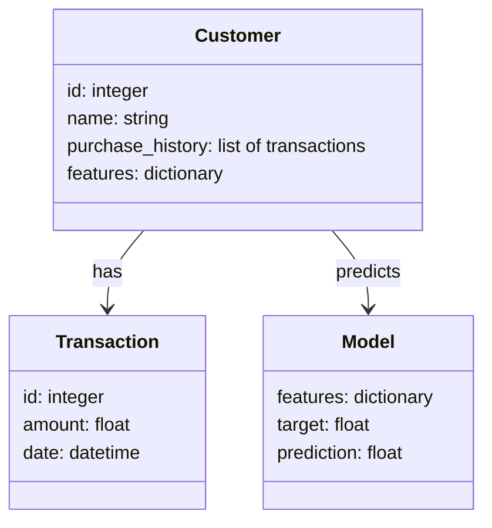
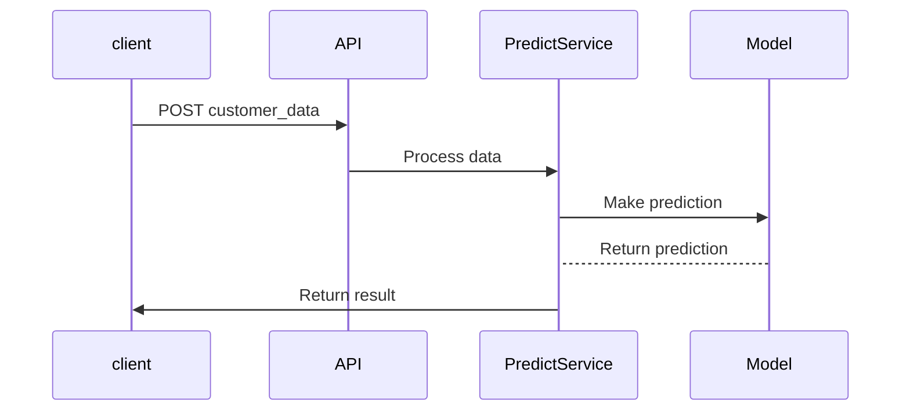
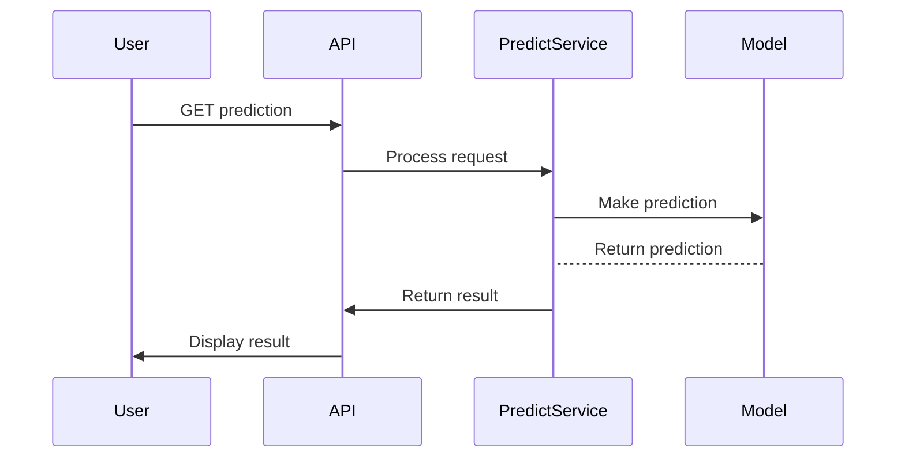

                 


# AI驱动的客户终身价值预测：评估公司的长期盈利能力

## 关键词：客户终身价值（CLV）、人工智能（AI）、机器学习、预测模型、企业盈利能力

## 摘要：本文详细探讨了如何利用AI技术预测客户终身价值（CLV），并评估公司的长期盈利能力。通过分析CLV的理论基础、AI驱动的预测方法、系统架构设计以及项目实战，本文为读者提供了从理论到实践的全面指南，帮助企业在数字化时代中提升客户价值管理能力，实现可持续的长期盈利。

---

## 第一部分: AI驱动的客户终身价值预测概述

### 第1章: 客户终身价值（CLV）与AI预测概述

#### 1.1 客户终身价值（CLV）的定义与重要性

##### 1.1.1 客户终身价值的定义
客户终身价值（Customer Lifetime Value，简称CLV或LTV）是指一个客户在其生命周期内为企业带来的总收入减去获取和维护该客户所产生的成本。CLV是企业评估客户价值和制定客户管理策略的重要指标。

$$ CLV = \frac{R}{d} $$
其中，\( R \) 是客户生命周期价值，\( d \) 是客户流失率。

##### 1.1.2 CLV在企业中的重要性
CLV帮助企业识别高价值客户，优化资源分配，制定精准的营销策略，并评估客户关系的长期盈利能力。通过CLV，企业可以更好地理解客户的行为和需求，从而提升客户满意度和忠诚度，最终实现可持续的增长。

##### 1.1.3 CLV与企业长期盈利能力的关系
CLV是企业长期盈利能力的关键驱动因素。通过预测和优化CLV，企业可以更有效地管理客户关系，降低客户获取成本，提高客户留存率和购买频率，从而提升整体盈利能力。

#### 1.2 AI驱动CLV预测的背景与意义

##### 1.2.1 数据驱动决策的兴起
随着大数据和AI技术的快速发展，企业能够从海量数据中提取有价值的信息，从而做出更精准的决策。数据驱动决策已成为现代企业竞争优势的重要来源。

##### 1.2.2 AI在商业预测中的应用趋势
AI技术在商业预测中的应用越来越广泛，尤其是在客户行为预测、市场趋势分析和风险评估等领域。AI驱动的预测模型能够帮助企业更好地理解市场动态，优化资源配置，提升盈利能力。

##### 1.2.3 CLV预测的商业价值
CLV预测能够帮助企业识别高价值客户，优化客户体验，制定精准的营销策略，并降低客户流失率。通过CLV预测，企业可以更好地评估客户的长期价值，从而做出更明智的商业决策。

#### 1.3 本书的核心目标与内容框架

##### 1.3.1 本书的核心目标
本书旨在通过AI技术帮助企业预测客户终身价值，评估公司的长期盈利能力。通过理论与实践相结合的方式，为读者提供从CLV预测到实际应用的全面指南。

##### 1.3.2 内容框架概述
本书内容分为以下几个部分：CLV的理论基础、AI驱动CLV预测的核心概念、系统架构设计、项目实战以及最佳实践。通过逐步分析和讲解，帮助读者掌握CLV预测的核心技术和实际应用。

##### 1.3.3 读者对象与预期收获
本书适合企业管理人员、数据科学家、市场分析师以及对CLV预测感兴趣的读者。通过阅读本书，读者可以掌握CLV预测的核心方法，了解AI技术在商业预测中的应用，并能够实际操作CLV预测项目，提升企业的长期盈利能力。

---

## 第二部分: 客户终身价值（CLV）的理论基础

### 第2章: 客户终身价值（CLV）的理论基础

#### 2.1 CLV的数学模型与公式

##### 2.1.1 CLV的基本公式
$$ CLV = \frac{R}{d} $$
其中，\( R \) 是客户生命周期价值，\( d \) 是客户流失率。

##### 2.1.2 客户生命周期价值（R）的计算
客户生命周期价值（R）可以通过以下公式计算：
$$ R = \text{客户年收入} \times \text{客户生命周期长度} $$

##### 2.1.3 客户流失率（d）的计算
客户流失率（d）可以通过以下公式计算：
$$ d = \frac{\text{流失客户数}}{\text{客户总数}} $$

#### 2.2 CLV预测的变量与假设

##### 2.2.1 客户收入（Revenue per customer）
客户收入是指客户在企业生命周期内为企业带来的平均收入。收入越高，客户的价值越大。

##### 2.2.2 客户留存率（Retention rate）
客户留存率是指客户在一定时间内继续使用企业产品或服务的概率。留存率越高，客户生命周期越长。

##### 2.2.3 客户获取成本（Customer acquisition cost, CAC）
客户获取成本是指企业获取新客户所花费的平均成本。CAC越低，客户价值越高。

#### 2.3 CLV预测的边界与外延

##### 2.3.1 数据的适用范围
CLV预测基于客户行为数据和交易数据，适用于有足够数据支持的企业。数据质量直接影响预测的准确性。

##### 2.3.2 模型的假设条件
CLV预测模型假设客户行为符合一定的概率分布，并且客户流失和购买行为是独立的。实际应用中，模型需要不断调整以适应实际数据。

##### 2.3.3 预测的准确性与局限性
CLV预测的准确性依赖于数据的质量和模型的复杂性。模型过于简单可能导致预测偏差，而过于复杂的模型可能导致过拟合。因此，在实际应用中需要结合业务知识进行模型优化。

---

## 第三部分: AI驱动CLV预测的核心概念与联系

### 第3章: AI驱动CLV预测的核心概念与联系

#### 3.1 AI驱动CLV预测的核心要素

##### 3.1.1 数据特征
数据特征包括客户的 demographic（人口统计信息）、 behavioral（行为数据）、 transactional（交易数据）等。这些特征是模型预测的基础。

##### 3.1.2 预测模型
预测模型包括机器学习算法（如随机森林、XGBoost）和深度学习模型（如神经网络）。不同模型适用于不同的数据类型和预测目标。

##### 3.1.3 业务规则
业务规则包括客户分组、定价策略、营销策略等。业务规则与模型预测结果相结合，可以更好地指导企业决策。

#### 3.2 核心概念原理

##### 3.2.1 数据特征的选择与处理
数据特征的选择与处理是CLV预测的关键步骤。需要根据业务目标和数据特性选择合适的特征，并进行数据清洗和特征工程。

##### 3.2.2 模型选择与优化
模型选择需要考虑数据类型、预测目标和业务需求。模型优化包括参数调优、特征选择和模型评估。

##### 3.2.3 业务规则的制定与应用
业务规则的制定需要结合企业目标和客户特征。规则的应用可以增强模型的解释性和实用性。

#### 3.3 核心概念对比表

| 核心概念 | 传统方法 | AI驱动方法 |
|----------|-----------|------------|
| 数据特征 | 简单统计指标 | 多维特征分析 |
| 模型选择 | 线性回归 | 机器学习和深度学习模型 |
| 业务规则 | 单一策略 | 组合策略优化 |

---

## 第四部分: 系统架构与项目实战

### 第4章: 系统架构设计

#### 4.1 项目介绍
本项目旨在开发一个基于AI的CLV预测系统，帮助公司评估客户的长期价值，并制定精准的营销策略。

#### 4.2 领域模型设计
以下是领域模型的mermaid类图：



#### 4.3 系统架构设计
以下是系统架构的mermaid架构图：

```mermaid
container Database {
    CustomerData
    TransactionData
}
container ModelTraining {
    FeatureEngineering
    ModelTraining
    ModelEvaluation
}
container PredictService {
    API
    Predict
}
container Frontend {
    Dashboard
}

Database --> ModelTraining
ModelTraining --> PredictService
PredictService --> Frontend
```

#### 4.4 系统接口设计
以下是系统接口的mermaid序列图：



#### 4.5 系统交互设计
以下是系统交互的mermaid序列图：



---

## 第五部分: 项目实战

### 第5章: 项目实战

#### 5.1 环境安装
需要安装以下Python库：
```bash
pip install pandas scikit-learn xgboost
```

#### 5.2 系统核心实现源代码

##### 5.2.1 数据预处理
```python
import pandas as pd

# 加载数据
data = pd.read_csv('customer_data.csv')

# 数据清洗
data.dropna(inplace=True)

# 特征工程
data['age'] = data['birth_date'].apply(lambda x: 2023 - int(x.split('-')[0]))
data.drop('birth_date', axis=1, inplace=True)
```

##### 5.2.2 模型训练
```python
from sklearn.model_selection import train_test_split
from xgboost import XGBRegressor

# 划分训练集和测试集
X_train, X_test, y_train, y_test = train_test_split(data.drop('clv', axis=1), data['clv'], test_size=0.2)

# 训练模型
model = XGBRegressor(n_estimators=100, learning_rate=0.1)
model.fit(X_train, y_train)
```

##### 5.2.3 模型预测
```python
# 预测结果
y_pred = model.predict(X_test)

# 评估结果
from sklearn.metrics import mean_squared_error
print(mean_squared_error(y_test, y_pred))
```

#### 5.3 实际案例分析
通过实际案例分析，验证模型的预测准确性，并根据结果调整模型参数和优化特征选择。

#### 5.4 代码应用解读与分析
详细解读代码实现，分析每一步的操作和目的，确保读者能够理解并应用到实际项目中。

#### 5.5 项目小结
总结项目的实施过程，分析遇到的问题及解决方案，并提出改进建议。

---

## 第六部分: 最佳实践与总结

### 第6章: 最佳实践与总结

#### 6.1 数据质量的重要性
数据质量直接影响模型的预测结果。在实际应用中，需要确保数据的完整性和准确性。

#### 6.2 模型解释性与可扩展性
模型的解释性可以帮助企业更好地理解客户行为，而可扩展性则保证模型能够适应数据量的增加。

#### 6.3 持续优化与创新
模型需要持续优化，结合最新的AI技术和业务需求，不断提升预测的准确性和实用性。

#### 6.4 未来趋势
未来的CLV预测将更加依赖于自动化机器学习和模型解释技术。企业需要关注这些新技术，不断提升自身的竞争力。

---

## 结语

通过本文的详细讲解，读者可以全面了解AI驱动的客户终身价值预测的核心技术和实际应用。从理论到实践，从系统设计到项目实现，本文为读者提供了完整的解决方案，帮助企业在数字化时代中实现长期盈利能力的提升。

---

## 作者：AI天才研究院/AI Genius Institute & 禅与计算机程序设计艺术 /Zen And The Art of Computer Programming

