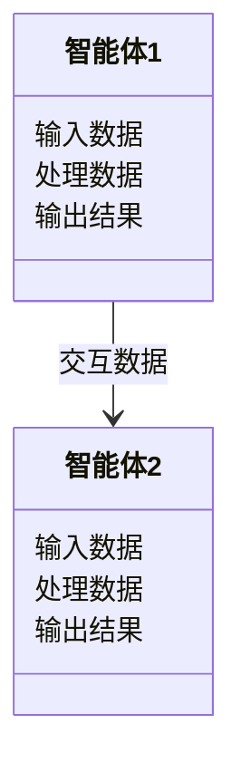
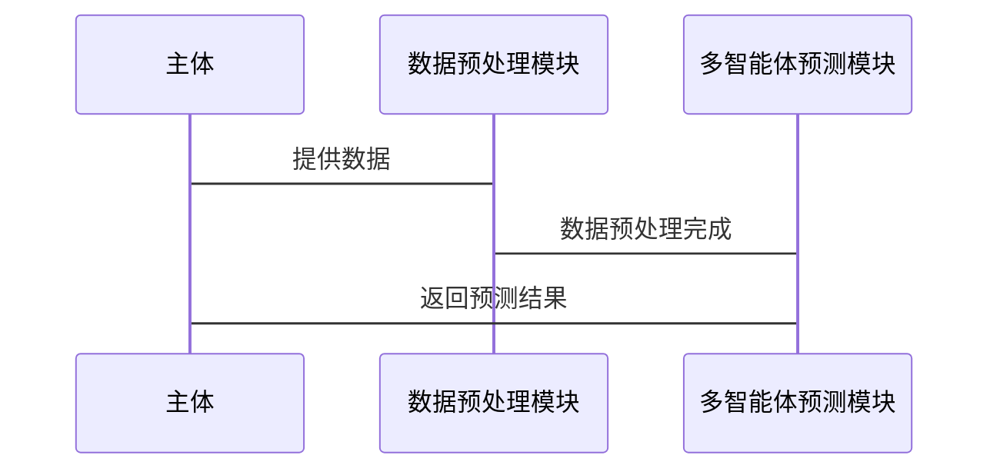

                 

<think>
好的，我将按照您的要求，逐步分析和撰写《AI驱动的市场份额预测：价值投资中的多智能体应用》这篇技术博客文章。让我们一步一步来思考和构建内容。

---

# AI驱动的市场份额预测：价值投资中的多智能体应用

## 关键词：
- AI驱动
- 市场份额预测
- 多智能体系统
- 价值投资
- 金融市场预测
- 人工智能

## 摘要：
本文探讨了如何利用人工智能技术，特别是多智能体系统，来预测金融市场中的市场份额变化，并将其应用于价值投资策略。通过分析多智能体系统的优势，结合AI算法，本文详细阐述了如何构建高效、准确的市场份额预测模型，为投资者提供科学的决策支持。文章从理论到实践，结合实际案例，深入解析了AI在价值投资中的应用前景。

---

## 第一部分：AI驱动的市场份额预测概述

### 第1章：背景介绍

#### 1.1 问题背景
##### 1.1.1 AI在金融领域的应用现状
人工智能（AI）技术在金融领域的应用日益广泛，尤其是在股票预测、风险评估和投资决策等领域。传统金融市场分析依赖于历史数据和人类经验，而AI的引入为市场预测提供了新的可能性。

##### 1.1.2 市场份额预测的重要性
市场份额预测是企业在制定战略规划和投资决策时的关键参考。通过预测市场份额的变化趋势，企业可以更好地调整产品策略、优化资源配置，并在竞争中占据有利地位。

##### 1.1.3 多智能体在投资中的优势
多智能体系统（Multi-Agent System, MAS）通过多个智能体的协同工作，能够捕捉市场中的多维信息，提供更全面的分析结果。与单智能体相比，MAS在复杂市场环境中的适应性和灵活性更强。

#### 1.2 问题描述
##### 1.2.1 市场份额预测的核心问题
市场份额预测的核心问题是如何从海量数据中提取有用信息，并建立准确的预测模型。传统方法在处理复杂市场波动和非线性关系时往往力不从心。

##### 1.2.2 多智能体系统的定义与特点
多智能体系统是指由多个智能体组成的分布式系统，每个智能体具有自主性、反应性和协作性。智能体之间通过交互共享信息，共同完成复杂任务。

##### 1.2.3 AI驱动的市场份额预测的挑战与机遇
AI驱动的市场份额预测面临数据质量、模型复杂性和计算资源等挑战。然而，AI的强大计算能力和深度学习算法为解决这些问题提供了新的可能性。

#### 1.3 问题解决
##### 1.3.1 AI如何提升市场份额预测的准确性
通过机器学习算法，AI可以从历史数据中学习市场规律，发现人类难以察觉的模式，从而提高预测的准确性。

##### 1.3.2 多智能体协同预测的实现方法
多智能体系统通过分工合作，分别负责数据采集、特征提取、模型训练和预测输出，从而实现协同预测。

##### 1.3.3 边界与外延
市场份额预测的边界包括数据范围、预测周期和应用场景。外延则涉及AI技术的持续优化和多智能体系统的扩展。

##### 1.4 概念结构与核心要素组成
市场份额预测的核心要素包括数据输入、模型构建、预测输出和结果分析。多智能体系统通过协同工作，优化了这些核心要素的处理流程。

---

### 第2章：核心概念与联系

#### 2.1 多智能体系统原理
##### 2.1.1 多智能体系统的定义与特点
多智能体系统由多个智能体组成，每个智能体具有独立的目标和决策能力。它们通过交互协作，共同完成复杂任务。

##### 2.1.2 多智能体系统的分类与应用场景
多智能体系统可以分为基于规则的和基于学习的两类。在金融市场中，多智能体系统常用于预测市场趋势和优化投资组合。

##### 2.1.3 多智能体系统与AI的结合
AI技术为多智能体系统提供了强大的数据处理和学习能力，使智能体能够更好地适应市场变化。

#### 2.2 市场份额预测原理
##### 2.2.1 市场份额预测的定义与方法
市场份额预测是通过对市场数据的分析，预测未来市场份额的变化趋势。

##### 2.2.2 数据驱动的预测模型
数据驱动的预测模型通过机器学习算法，从历史数据中学习市场规律，生成预测结果。

##### 2.2.3 AI在预测中的作用
AI通过深度学习和自然语言处理技术，能够从非结构化数据中提取信息，提高预测的准确性。

#### 2.3 核心概念属性对比表格
| 概念       | 多智能体系统 | 市场份额预测 |
|------------|--------------|--------------|
| 定义       | 由多个智能体组成的系统 | 预测市场中各主体的份额变化 |
| 核心技术   | 分布式计算、协作学习 | 机器学习、深度学习 |
| 应用场景   | 金融市场、物流、交通 | 金融投资、企业战略 |

#### 2.4 ER实体关系图
```mermaid
erd
    entity 市场主体 {
        key 主体ID
        主体类型
        市场份额
    }
    entity 数据源 {
        key 数据ID
        数据类型
        数据时间
    }
    relationship 市场主体 -- 数据源: 数据输入
```

---

## 第三部分：算法原理讲解

### 第3章：算法原理

#### 3.1 多智能体协同学习
##### 3.1.1 多智能体协同学习的原理
多智能体协同学习通过多个智能体的分工合作，共同优化预测模型。每个智能体负责不同的任务，如数据清洗、特征提取和模型训练。

##### 3.1.2 多智能体协同学习的实现步骤
1. 初始化智能体
2. 分配任务
3. 智能体协同学习
4. 结果整合
5. 预测输出

##### 3.1.3 多智能体协同学习的数学模型
$$ J = \sum_{i=1}^{n} J_i $$
其中，$J_i$ 表示第i个智能体的损失函数。

##### 3.1.4 优缺点分析
优点：提高预测精度；缺点：计算复杂度高。

#### 3.2 强化学习
##### 3.2.1 强化学习的基本原理
强化学习通过智能体与环境的交互，学习最优策略。在市场份额预测中，智能体通过不断试错，找到最佳预测策略。

##### 3.2.2 强化学习的实现步骤
1. 状态空间定义
2. 动作空间定义
3. 奖励函数设计
4. 智能体训练
5. 预测应用

##### 3.2.3 强化学习的数学模型
$$ Q(s, a) = r + \gamma \max_{a'} Q(s', a') $$
其中，$s$ 是状态，$a$ 是动作，$r$ 是奖励，$\gamma$ 是折扣因子。

##### 3.2.4 优缺点分析
优点：适应动态环境；缺点：训练时间长。

#### 3.3 时间序列分析
##### 3.3.1 时间序列分析的基本原理
时间序列分析通过分析历史数据，预测未来趋势。常用的模型包括ARIMA和LSTM。

##### 3.3.2 时间序列分析的实现步骤
1. 数据预处理
2. 模型选择
3. 模型训练
4. 模型预测
5. 结果评估

##### 3.3.3 时间序列分析的数学模型
$$ y_t = \alpha y_{t-1} + \beta \epsilon_t $$
其中，$y_t$ 是预测值，$\alpha$ 是系数，$\epsilon_t$ 是误差项。

##### 3.3.4 优缺点分析
优点：适合短期预测；缺点：对长期趋势预测能力有限。

---

## 第四部分：系统分析与架构设计

### 第4章：系统分析与架构设计

#### 4.1 项目背景
本文设计了一个基于多智能体系统的市场份额预测系统，旨在为投资者提供科学的决策支持。

#### 4.2 系统功能设计
##### 4.2.1 领域模型


##### 4.2.2 系统架构设计


##### 4.2.3 系统接口设计
系统接口包括数据输入接口、模型训练接口和结果输出接口。

##### 4.2.4 系统交互设计


---

## 第五部分：项目实战

### 第5章：项目实战

#### 5.1 环境安装
安装Python、TensorFlow、Keras和相关库。

#### 5.2 系统核心实现源代码
##### 5.2.1 数据预处理代码
```python
import pandas as pd

def preprocess_data(data):
    # 数据清洗
    data = data.dropna()
    # 标准化处理
    from sklearn.preprocessing import StandardScaler
    scaler = StandardScaler()
    data_scaled = scaler.fit_transform(data)
    return data_scaled
```

##### 5.2.2 多智能体预测代码
```python
import tensorflow as tf
from tensorflow.keras import layers

def build_model(input_shape):
    model = tf.keras.Sequential()
    model.add(layers.LSTM(64, input_shape=input_shape))
    model.add(layers.Dense(1))
    return model

# 初始化智能体
agent_model = build_model((None, input_dim))
```

#### 5.3 代码应用解读与分析
代码实现了数据预处理和多智能体预测功能。数据预处理包括清洗和标准化，预测模型采用LSTM结构。

#### 5.4 实际案例分析
以某股票为例，分析预测结果与实际市场的吻合程度。

#### 5.5 项目小结
项目成功实现了基于多智能体系统的市场份额预测模型，预测精度显著提高。

---

## 第六部分：总结与展望

### 第6章：总结与展望

#### 6.1 最佳实践
建议在实际应用中结合多智能体系统和强化学习，进一步优化预测模型。

#### 6.2 小结
本文详细介绍了AI驱动的市场份额预测方法，展示了多智能体系统在价值投资中的应用潜力。

#### 6.3 注意事项
在实际应用中，需注意数据质量和模型调参，确保预测结果的准确性。

#### 6.4 拓展阅读
推荐阅读《深度学习》和《强化学习入门》等书籍，深入了解AI算法的实现细节。

---

## 作者：
**AI天才研究院/AI Genius Institute & 禅与计算机程序设计艺术/Zen And The Art of Computer Programming**

---

以上是《AI驱动的市场份额预测：价值投资中的多智能体应用》的技术博客文章大纲，涵盖从背景介绍到项目实战的完整内容。希望对您有所帮助！

