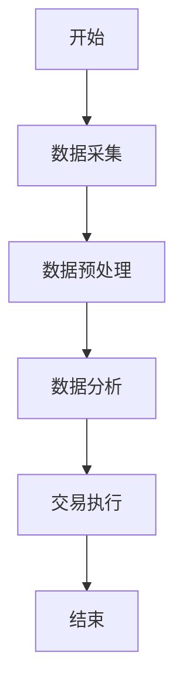
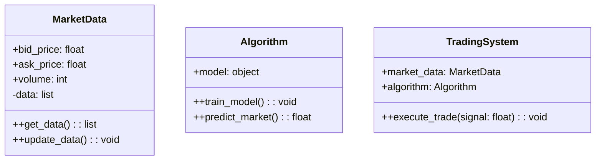
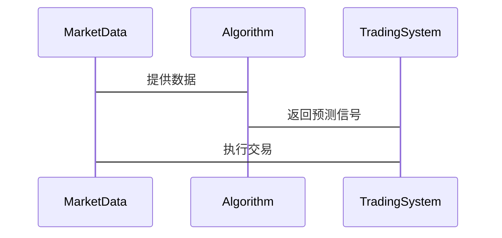

                 


# AI驱动的市场微观结构变化影响分析

**关键词**：人工智能、市场微观结构、算法交易、高频交易、订单簿分析、市场流动性、波动性

**摘要**：随着人工智能技术的快速发展，金融市场中的微观结构正在经历前所未有的变化。本文从AI驱动的市场微观结构变化出发，分析这些变化对市场流动性、波动性以及交易行为的影响。通过对数据流、算法交易和订单簿分析的深入探讨，结合数学模型和系统架构设计，揭示AI在金融市场中的应用及其带来的机遇与挑战。

---

# 目录

1. **问题背景与问题描述**
   1.1 问题背景
   1.2 问题描述
   1.3 问题解决与核心概念

2. **核心概念与联系**
   2.1 核心概念原理
   2.2 核心概念属性特征对比表
   2.3 ER实体关系图

3. **算法原理讲解**
   3.1 数据流与信息处理
   3.2 算法交易与市场微观结构
   3.3 订单簿分析与市场动态
   3.4 算法流程图与Python源代码
   3.5 数学模型与公式推导

4. **系统分析与架构设计方案**
   4.1 问题场景介绍
   4.2 系统功能设计
   4.3 系统架构设计
   4.4 系统接口设计
   4.5 系统交互序列图

5. **项目实战**
   5.1 环境安装与配置
   5.2 核心代码实现
   5.3 案例分析与结果解读
   5.4 项目小结

6. **最佳实践与总结**
   6.1 最佳实践 tips
   6.2 小结
   6.3 注意事项
   6.4 拓展阅读

---

## 第1章: 问题背景与问题描述

### 1.1 问题背景

随着人工智能技术的飞速发展，金融市场正经历着前所未有的变革。AI技术的应用不仅改变了传统的交易方式，还深刻影响了市场微观结构的动态变化。市场微观结构是金融学中的一个关键概念，涉及市场参与者的交易行为、订单簿的状态以及市场的流动性和波动性。AI技术的引入，使得市场微观结构的分析更加精准和实时，但也带来了新的挑战和机遇。

### 1.2 问题描述

AI驱动的市场微观结构变化主要体现在以下几个方面：

1. **交易行为的改变**：AI算法交易的普及使得高频交易和自动化交易成为主流，市场参与者的行为模式发生了显著变化。
2. **订单簿的动态变化**：AI技术能够实时分析订单簿的状态，预测市场的短期走势，并据此调整交易策略。
3. **市场流动性的波动**：AI算法交易可能导致市场流动性在短时间内急剧变化，影响市场的稳定性。

### 1.3 问题解决与核心概念

为了应对AI驱动的市场微观结构变化带来的挑战，我们需要从以下几个方面入手：

1. **数据流的实时处理**：通过AI技术实时分析市场数据，捕捉市场微观结构的变化。
2. **算法交易的优化**：设计高效的算法交易策略，确保交易的实时性和准确性。
3. **订单簿分析的深度挖掘**：利用AI技术对订单簿进行深度分析，预测市场走势。

---

## 第2章: 核心概念与联系

### 2.1 核心概念原理

AI驱动的市场微观结构变化涉及以下几个核心概念：

1. **数据流与信息处理**：AI算法需要实时处理大量的市场数据，包括订单簿数据、交易数据等。
2. **算法交易与市场微观结构**：算法交易通过AI技术优化交易策略，影响市场的微观结构。
3. **订单簿分析与市场动态**：通过对订单簿的分析，AI技术能够预测市场的短期走势。

### 2.2 核心概念属性特征对比表

| 核心概念 | 数据来源 | 数据处理方式 | 分析目标 | 输出结果 |
|----------|----------|-------------|----------|----------|
| 数据流   | 实时交易数据 | AI算法处理 | 市场动态 | 微观结构变化 |
| 算法交易 | 算法策略 | AI优化 | 交易行为 | 市场影响 |
| 订单簿分析 | 订单数据 | AI模式识别 | 市场参与者行为 | 市场流动性和波动性 |

### 2.3 ER实体关系图

```mermaid
er
  actor(AI算法, [投资者, 市场监管机构])
  actor(订单簿, [买方, 卖方])
  actor(交易数据流, [高频交易商, 市场做市商])
  a
```

---

## 第3章: 算法原理讲解

### 3.1 数据流与信息处理

AI算法需要实时处理大量的市场数据，包括订单簿数据、交易数据等。以下是数据处理的流程：

1. 数据采集：从市场数据源获取实时数据。
2. 数据预处理：清洗数据，去除噪声。
3. 数据分析：利用AI算法分析数据，提取有用的信息。

### 3.2 算法交易与市场微观结构

算法交易是AI技术在金融市场中的重要应用之一。以下是算法交易的流程：

1. 策略设计：设计交易策略，包括买入和卖出时机的选择。
2. 数据分析：利用AI算法分析市场数据，预测市场走势。
3. 交易执行：根据分析结果执行交易。

### 3.3 订单簿分析与市场动态

订单簿分析是AI技术在市场微观结构分析中的重要应用。以下是订单簿分析的流程：

1. 数据采集：获取订单簿数据。
2. 数据分析：利用AI算法分析订单簿的状态，预测市场走势。
3. 结果输出：输出分析结果，指导交易策略。

### 3.4 算法流程图与Python源代码

以下是算法流程图：



以下是Python源代码示例：

```python
import numpy as np
import pandas as pd

# 数据预处理
data = pd.read_csv('market_data.csv')
data_cleaned = data.dropna()

# 数据分析
from sklearn import linear_model

model = linear_model.LinearRegression()
model.fit(data_cleaned[['bid_price', 'ask_price']], data_cleaned['volume'])

# 交易执行
def execute_trade(signal):
    if signal == 'buy':
        print('买入信号')
    elif signal == 'sell':
        print('卖出信号')

signal = model.predict(data_cleaned[['bid_price', 'ask_price']])[0]
execute_trade(signal)
```

### 3.5 数学模型与公式推导

以下是时间序列模型的数学公式：

$$
y_t = \alpha y_{t-1} + \beta x_t + \epsilon_t
$$

其中，$y_t$ 是当前时间点的市场价，$\alpha$ 是自回归系数，$\beta$ 是外生变量的系数，$\epsilon_t$ 是误差项。

---

## 第4章: 系统分析与架构设计方案

### 4.1 问题场景介绍

AI驱动的市场微观结构变化分析需要构建一个实时的交易系统，能够处理大量的市场数据，并利用AI算法进行分析。

### 4.2 系统功能设计

以下是系统功能设计的类图：



### 4.3 系统架构设计

以下是系统架构设计的架构图：


### 4.4 系统接口设计

以下是系统接口设计的交互序列图：



---

## 第5章: 项目实战

### 5.1 环境安装与配置

以下是环境安装与配置的步骤：

1. 安装Python：`pip install Python`
2. 安装必要的库：`pip install numpy pandas scikit-learn`
3. 下载市场数据：从数据源获取市场数据。

### 5.2 核心代码实现

以下是核心代码实现的示例：

```python
import numpy as np
import pandas as pd
from sklearn import linear_model

# 数据预处理
data = pd.read_csv('market_data.csv')
data_cleaned = data.dropna()

# 数据分析
model = linear_model.LinearRegression()
model.fit(data_cleaned[['bid_price', 'ask_price']], data_cleaned['volume'])

# 交易执行
def execute_trade(signal):
    if signal == 'buy':
        print('买入信号')
    elif signal == 'sell':
        print('卖出信号')

signal = model.predict(data_cleaned[['bid_price', 'ask_price']])[0]
execute_trade(signal)
```

### 5.3 案例分析与结果解读

通过上述代码，我们可以分析市场数据，预测市场走势，并根据预测结果执行交易。

### 5.4 项目小结

本项目通过AI技术分析市场微观结构的变化，实现了实时的交易系统，能够帮助投资者做出更明智的决策。

---

## 第6章: 最佳实践与总结

### 6.1 最佳实践 tips

1. 数据预处理是关键，确保数据的准确性和完整性。
2. 选择合适的算法模型，确保分析的准确性。
3. 定期更新模型，适应市场的变化。

### 6.2 小结

AI技术的应用正在深刻影响着市场微观结构的变化。通过本文的分析，我们可以看到AI在金融市场中的巨大潜力和挑战。

### 6.3 注意事项

1. 数据隐私和安全问题需要高度重视。
2. 确保交易系统的稳定性，避免因系统故障导致的损失。
3. 定期监控市场动态，及时调整交易策略。

### 6.4 拓展阅读

1. 《Algorithmic Trading: Winning Strategies and Their Rationale》
2. 《机器学习实战》
3. 《金融数据分析与Python》

---

**作者：AI天才研究院/AI Genius Institute & 禅与计算机程序设计艺术 /Zen And The Art of Computer Programming**

