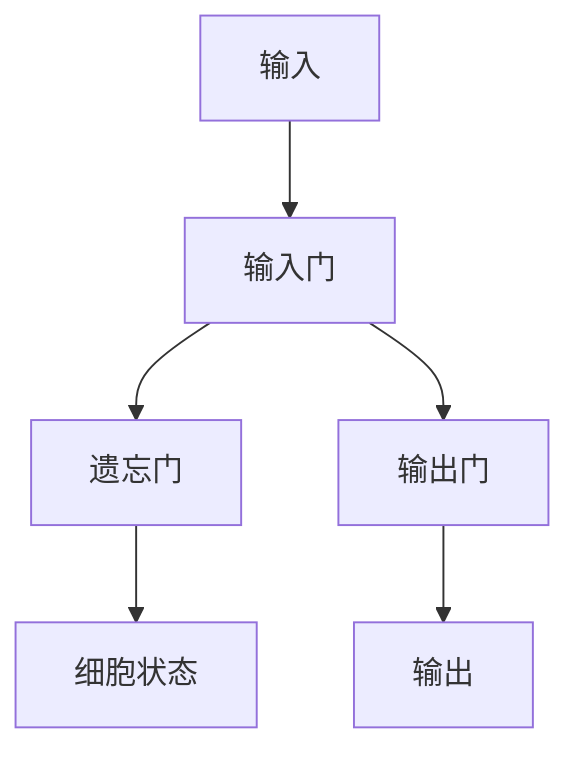
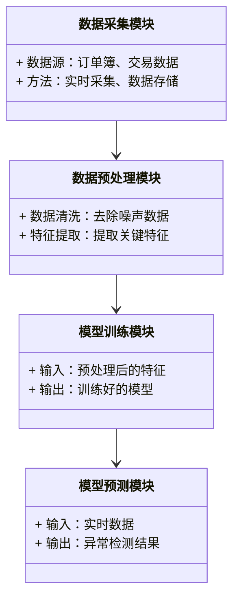
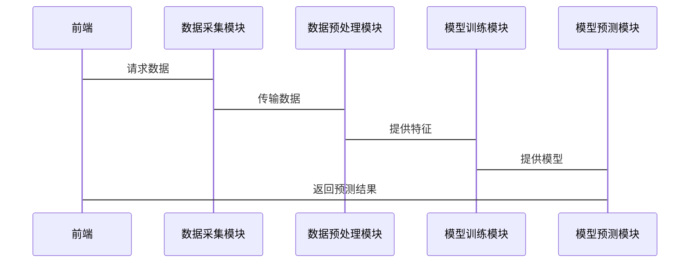

                 


# 《AI驱动的市场微观结构变化检测》

> 关键词：AI, 金融市场, 微观结构, 时间序列分析, LSTM, 异常检测

> 摘要：本文详细探讨了如何利用人工智能技术检测金融市场微观结构的变化，分析了传统方法的局限性，并提出了基于AI的新解决方案。通过时间序列分析、深度学习和异常检测算法，构建了一个高效的检测系统，并通过实际案例展示了其应用和效果。

---

# 第一部分: AI驱动的市场微观结构变化检测概述

# 第1章: 问题背景与挑战

## 1.1 问题背景
### 1.1.1 金融市场微观结构的基本概念
- 市场参与者：机构投资者、零售投资者、做市商等。
- 订单簿：记录市场上的所有订单信息，包括买价、卖价、订单数量等。
- 交易数据：每笔交易的时间、价格、数量等信息。

### 1.1.2 微观结构变化对市场的影响
- 影响市场流动性：异常的交易行为可能导致流动性下降。
- 影响价格波动：大量订单的快速变化可能导致价格剧烈波动。
- 反映市场健康状况：微观结构的变化可能预示着市场的系统性风险。

### 1.1.3 传统方法的局限性与AI的优势
- 传统方法：基于统计分析和规则判断，难以捕捉复杂模式。
- AI的优势：能够处理海量数据，发现非线性关系，实时性高。

## 1.2 问题描述与目标
### 1.2.1 微观结构变化检测的定义
- 检测市场微观结构中的异常变化，识别潜在的市场操纵、闪崩等事件。

### 1.2.2 检测目标与应用场景
- 目标：识别市场参与者的行为变化，预测市场波动。
- 应用场景：高频交易监控、风险管理、异常交易预警。

### 1.2.3 解决方案的技术路线
- 数据采集：实时收集订单簿和交易数据。
- 数据预处理：清洗、特征提取。
- 模型训练：使用深度学习模型进行异常检测。
- 结果分析：实时监控并发出预警信号。

---

# 第2章: 核心概念与理论基础

## 2.1 市场微观结构的核心要素
### 2.1.1 市场参与者的行为模式
- 投资者行为：基于情绪、理性决策的不同，影响市场微观结构。
- 做市商策略：通过维护订单簿提供流动性。

### 2.1.2 订单簿与交易数据的特征
- 订单簿：深度（订单数量）、买卖价差、订单撤销率等。
- 交易数据：成交量、成交价、交易频率等。

### 2.1.3 市场微观结构的动态变化
- 短期内的剧烈波动：闪崩、闪涨。
- 长期的结构变化：市场参与者结构的变化、交易策略的调整。

## 2.2 AI技术的核心原理
### 2.2.1 机器学习的基本概念
- 监督学习、无监督学习、强化学习的定义与区别。
- 常用算法：线性回归、支持向量机、随机森林等。

### 2.2.2 深度学习的原理与优势
- 神经网络的结构：输入层、隐藏层、输出层。
- 长短期记忆网络（LSTM）：用于处理时间序列数据。
- 优势：能够捕捉数据中的非线性关系和复杂模式。

### 2.2.3 时间序列分析的要点
- 时间序列的基本特征：趋势、季节性、随机性。
- 常用模型：ARIMA、GARCH、Prophet等。

## 2.3 核心概念的联系与对比
### 2.3.1 微观结构特征与AI模型的对应关系
- 订单深度与LSTM模型：订单深度的变化可以用LSTM捕捉时间依赖性。
- 成交量与异常检测：异常交易量可能预示着市场操纵。

### 2.3.2 不同AI技术的优劣势对比
| 技术 | 优势 | 劣势 |
|------|-------|------|
| 线性回归 | 简单易懂，计算速度快 | 无法捕捉非线性关系 |
| 支持向量机 | 高维数据表现好 | 参数敏感，计算复杂度高 |
| 随机森林 | 鲁棒性强，易于解释 | 需要较多计算资源 |
| LSTM | 能捕捉时间序列中的长期依赖 | 训练时间长，参数多 |

### 2.3.3 实体关系图（ER图）的构建与分析
```mermaid
erDiagram
    participant 市场参与者 {
        <属性> ID : int
        <属性> 类型 : string
        <属性> 行为模式 : string
    }
    participant 订单数据 {
        <属性> 时间戳 : datetime
        <属性> 订单ID : int
        <属性> 价格 : float
        <属性> 数量 : int
    }
    participant 交易数据 {
        <属性> 时间戳 : datetime
        <属性> 交易ID : int
        <属性> 买方ID : int
        <属性> 卖方ID : int
        <属性> 价格 : float
        <属性> 数量 : int
    }
    市场参与者 --> 订单数据 : 提交订单
    市场参与者 --> 交易数据 : 完成交易
    订单数据 --> 交易数据 : 转换为交易
```

---

# 第3章: 算法原理与实现

## 3.1 时间序列分析
### 3.1.1 时间序列分析的基本原理
- 时间序列数据的特点：趋势、周期性、随机性。
- 常用模型：ARIMA、Prophet。
- 示例：使用Prophet预测股票价格。

```python
from fbprophet import Prophet
model = Prophet()
model.fit(train_data)
future = model.make_future_dataframe(periods=30)
 forecast = model.predict(future)
```

### 3.1.2 时间序列分析的挑战
- 数据的非平稳性：需要进行差分或其他预处理。
- 多个时间序列的同步分析：需要考虑多个变量之间的关系。

## 3.2 基于LSTM的时间序列分析
### 3.2.1 LSTM的基本结构
- LSTM单元：包括输入门、遗忘门、输出门。
- mermaid图展示LSTM结构：



### 3.2.2 LSTM在异常检测中的应用
- 异常检测定义：识别偏离正常模式的数据点。
- 使用LSTM预测正常序列，比较实际值与预测值的差异。

### 3.2.3 LSTM的数学模型
- 输入门计算公式：
  $$ i_t = \sigma(w_i x_t + u_i h_{t-1}) $$
- 遗忘门计算公式：
  $$ f_t = \sigma(w_f x_t + u_f h_{t-1}) $$
- 细胞状态更新公式：
  $$ c_t = f_t c_{t-1} + i_t tanh(w_c x_t + u_c h_{t-1}) $$
- 输出门计算公式：
  $$ o_t = \sigma(w_o x_t + u_o h_{t-1}) $$
- 最终输出：
  $$ h_t = o_t tanh(c_t) $$

## 3.3 基于Isolation Forest的异常检测
### 3.3.1 Isolation Forest的原理
- 基于决策树的隔离方法。
- 通过随机选择特征和随机划分数据，构建决策树，用于异常检测。

### 3.3.2 Isolation Forest的实现
- 使用Scikit-learn库中的IsolationForest类。

```python
from sklearn.ensemble import IsolationForest
model = IsolationForest(n_estimators=100, random_state=42)
model.fit(X)
```

### 3.3.3 检测结果分析
- 异常得分：越小的值表示越可能是异常。
- 调整参数：通过调整n_estimators和 contamination参数来优化检测效果。

---

# 第4章: 系统分析与架构设计

## 4.1 问题场景介绍
### 4.1.1 项目目标
- 实时检测市场微观结构的变化，提供预警信息。
- 分析市场参与者的交易行为，识别异常交易。

### 4.1.2 项目范围
- 数据范围：选取某股票过去一年的订单簿和交易数据。
- 时间范围：实时数据处理，支持历史数据分析。

## 4.2 系统功能设计
### 4.2.1 领域模型设计
- 使用mermaid类图展示系统中的主要实体及其关系。



### 4.2.2 系统架构设计
- 分层架构：数据采集层、数据处理层、模型层、应用层。


### 4.2.3 接口设计
- 数据接口：提供REST API，供前端调用。
- 模型接口：提供预测接口，供其他系统调用。

### 4.2.4 交互流程设计
- 使用mermaid序列图展示系统交互流程。



---

# 第5章: 项目实战与案例分析

## 5.1 环境安装与配置
### 5.1.1 安装依赖
- Python环境：推荐使用Anaconda。
- 安装库：numpy、pandas、scikit-learn、keras、prophet、tensorflow。

```bash
pip install numpy pandas scikit-learn keras prophet tensorflow
```

### 5.1.2 数据源配置
- 数据集：可以从Yahoo Finance API获取股票数据。
- 数据预处理：清洗、标准化。

## 5.2 系统核心实现
### 5.2.1 数据采集模块
- 使用Yahoo Finance API获取订单簿和交易数据。

```python
import pandas_datareader as pdr
data = pdr.get_data_yahoo('AAPL', start='2020-01-01', end='2023-12-31')
```

### 5.2.2 数据预处理模块
- 清洗数据：处理缺失值、异常值。
- 特征提取：计算成交量均值、波动率等。

### 5.2.3 模型训练模块
- 使用LSTM训练时间序列模型。
- 使用Isolation Forest训练异常检测模型。

### 5.2.4 模型预测模块
- 实时预测：输入当前数据，预测下一步的变化。
- 异常检测：识别偏离正常模式的交易行为。

## 5.3 实际案例分析
### 5.3.1 案例背景
- 检测某股票的异常交易行为，如市场操纵。

### 5.3.2 数据分析
- 选取异常交易期间的数据，分析订单簿和交易数据的变化。
- 使用模型预测交易行为，识别异常交易。

### 5.3.3 结果分析
- 预测结果与实际结果对比，评估模型的准确性。
- 调整模型参数，优化检测效果。

---

# 第6章: 总结与展望

## 6.1 总结
### 6.1.1 核心内容回顾
- AI技术在市场微观结构变化检测中的应用。
- 时间序列分析、深度学习、异常检测算法的实现。

### 6.1.2 实战经验总结
- 数据预处理的重要性。
- 模型选择与调优的关键点。

## 6.2 未来展望
### 6.2.1 技术发展
- 更先进的AI技术：如Transformer、图神经网络。
- 多模态数据的融合：结合文本、图像等多源数据。

### 6.2.2 应用场景拓展
- 更多金融市场的应用：外汇市场、加密货币市场。
- 结合监管科技（RegTech）：帮助监管机构识别非法交易。

## 6.3 最佳实践 tips
### 6.3.1 数据处理
- 数据清洗：去除噪声数据，处理缺失值。
- 特征工程：提取有意义的特征，降低维度。

### 6.3.2 模型选择
- 根据数据类型选择合适的模型：时间序列数据选择LSTM，异常检测选择Isolation Forest。

### 6.3.3 模型调优
- 参数调整：通过网格搜索优化模型性能。
- 交叉验证：确保模型的泛化能力。

### 6.3.4 结果分析
- 可视化：绘制预测结果与实际结果的对比图。
- 指标评估：使用准确率、召回率、F1值等指标评估模型性能。

---

# 作者：AI天才研究院/AI Genius Institute & 禅与计算机程序设计艺术 /Zen And The Art of Computer Programming

