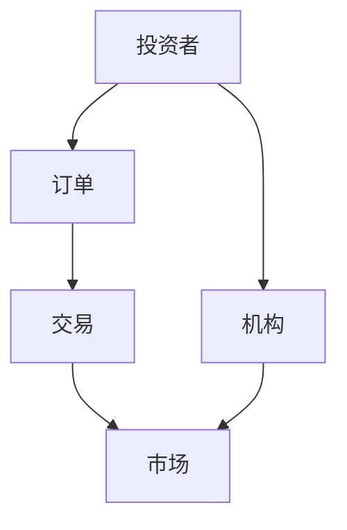
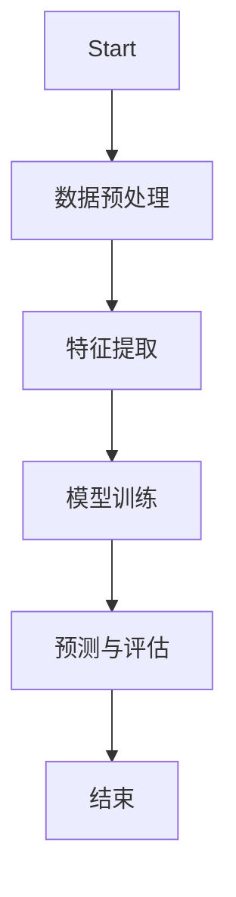
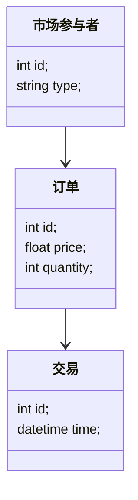

                 


# AI驱动的市场微观结构影响分析

**关键词**：AI，市场微观结构，时间序列分析，机器学习，深度学习

**摘要**：  
本文探讨了人工智能如何影响市场微观结构，分析了AI在金融中的应用，提出了结合时间序列分析和机器学习模型的方法，并通过实际案例展示了AI驱动的市场分析的优势和挑战。文章详细讲解了算法原理、系统架构，并提供了代码示例和案例分析，帮助读者全面理解AI在市场微观结构中的应用。

---

# 文章正文

## 第1章：背景介绍

### 1.1 问题背景

市场微观结构是金融学中的一个重要概念，涉及市场参与者的互动、交易行为和市场机制。传统的市场微观结构分析依赖于统计方法和经验模型，但随着数据量的爆炸式增长和算法复杂性的提升，AI技术的引入为这一领域带来了新的可能性。

#### 1.1.1 市场微观结构的基本概念
市场微观结构研究市场的参与者、交易行为和价格形成机制。主要包括订单簿分析、交易量分析、参与者行为分析等。

#### 1.1.2 AI技术在金融领域的应用现状
AI在金融中的应用日益广泛，特别是在高频交易、风险管理和市场预测方面。AI能够处理大量非结构化数据，提供实时分析，帮助投资者做出更快、更准确的决策。

#### 1.1.3 当前市场微观结构研究的局限性
传统方法在处理复杂数据和动态市场行为时显得力不从心，难以捕捉高频交易和非线性关系。AI的引入可以弥补这些不足。

### 1.2 问题描述

#### 1.2.1 市场微观结构的核心要素
- 市场参与者：机构投资者、散户、做市商等。
- 交易行为：订单生成、执行、撤单等。
- 价格形成：买卖价差、订单簿深度、流动性等。

#### 1.2.2 AI驱动的市场分析面临的挑战
- 数据质量：需要高质量的实时数据。
- 模型复杂性：复杂算法可能导致可解释性差。
- 市场动态：市场的快速变化要求模型具备实时更新能力。

#### 1.2.3 问题解决的必要性与目标
通过AI技术，实时分析市场微观结构，优化交易策略，提高市场预测的准确性。

## 第2章：核心概念与联系

### 2.1 AI与市场微观结构的关系

AI能够分析复杂的市场数据，识别隐藏的模式，提供实时反馈，帮助市场参与者做出决策。通过机器学习模型，AI可以捕捉市场中的微小变化，预测价格波动。

### 2.2 核心概念对比表

| 概念                | 传统统计方法              | AI驱动方法              |
|---------------------|--------------------------|-------------------------|
| 数据处理能力        | 有限，处理结构化数据      | 强大，处理结构化和非结构化数据 |
| 模型复杂性          | 简单，线性模型为主        | 复杂，非线性模型为主    |
| 可解释性            | 高                      | 低                      |

### 2.3 ER实体关系图



## 第3章：算法原理讲解

### 3.1 算法原理

#### 3.1.1 时间序列分析
时间序列分析用于预测未来的市场行为。常用模型包括ARIMA和LSTM。

#### 3.1.2 机器学习模型
随机森林和梯度提升树（如XGBoost）常用于分类和回归任务，适合处理市场数据中的复杂关系。

#### 3.1.3 深度学习模型
LSTM网络擅长处理时间序列数据，捕捉长期依赖关系，适合高频交易中的模式识别。

### 3.2 算法流程图



### 3.3 代码实现

#### 3.3.1 时间序列分析示例

```python
import numpy as np
from statsmodels.tsa.arima_model import ARIMA

# 示例数据
data = np.array([10, 12, 15, 18, 20, 22, 25, 27, 30])

# 模型训练
model = ARIMA(data, order=(1, 1, 1))
model_fit = model.fit()

# 预测
 forecast = model_fit.forecast(steps=5)
 print("预测值:", forecast[0][0:5])
```

#### 3.3.2 LSTM网络示例

```python
import keras
from keras.layers import LSTM, Dense
from keras.models import Sequential

# 示例数据
X = np.random.rand(100, 1, 10)
y = np.random.rand(100, 1)

# 模型构建
model = Sequential()
model.add(LSTM(64, input_shape=(1, 10)))
model.add(Dense(1))
model.compile(loss='mean_squared_error', optimizer='adam')

# 训练
model.fit(X, y, epochs=10, batch_size=32)
```

### 3.4 数学公式

时间序列ARIMA模型的公式：

$$ARIMA(p, d, q) = \frac{(1 - B)^d}{(1 - \phi B)(1 - \theta B)}$$

LSTM的长短期记忆单元：

$$
f_t = \sigma(w_f \cdot [h_{t-1}, x_t] + b_f)
$$

其中，$f_t$ 是遗忘门，$h_{t-1}$ 是前一时刻的隐藏状态，$x_t$ 是当前输入。

## 第4章：系统分析与架构设计

### 4.1 项目场景

设计一个实时市场微观结构分析系统，利用AI技术分析交易数据，预测价格波动，优化交易策略。

### 4.2 系统功能设计

#### 4.2.1 领域模型



#### 4.2.2 系统架构

```mermaid
aws
    architecture {
        核心系统 --> 数据库
        数据采集 --> 核心系统
        用户界面 --> 核心系统
    }
```

## 第5章：项目实战

### 5.1 环境安装

安装必要的Python库：

```bash
pip install numpy pandas scikit-learn keras tensorflow
```

### 5.2 核心代码实现

#### 5.2.1 数据采集与预处理

```python
import pandas as pd
from pandas_datareader import DataReader

# 获取股票数据
data = DataReader('AAPL', 'yahoo')
```

#### 5.2.2 特征提取

```python
data['SMA'] = data['Close'].rolling(20).mean()  # 简单移动平均线
```

#### 5.2.3 模型训练与预测

```python
from sklearn.ensemble import RandomForestClassifier
from sklearn.metrics import accuracy_score

# 训练随机森林模型
model = RandomForestClassifier()
model.fit(X_train, y_train)
y_pred = model.predict(X_test)
print("准确率:", accuracy_score(y_test, y_pred))
```

### 5.3 案例分析

以股票价格预测为例，使用LSTM网络进行训练，评估模型的预测效果。

## 第6章：最佳实践

### 6.1 小结

AI技术显著提升了市场微观结构分析的精度和效率，但模型的可解释性和数据质量仍需关注。

### 6.2 注意事项

- 数据隐私和合规性
- 模型的可解释性
- 实时系统的稳定性

### 6.3 拓展阅读

推荐阅读《机器学习实战》和《深度学习》等书籍，深入理解AI算法的应用。

## 作者信息

作者：AI天才研究院 & 禅与计算机程序设计艺术

---

以上是《AI驱动的市场微观结构影响分析》的技术博客文章的详细目录和内容，涵盖了背景介绍、核心概念、算法原理、系统设计、项目实战和最佳实践等部分，旨在为读者提供全面而深入的分析和见解。

