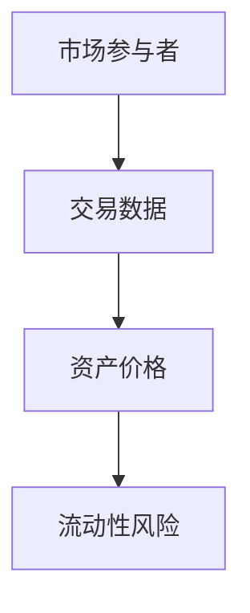
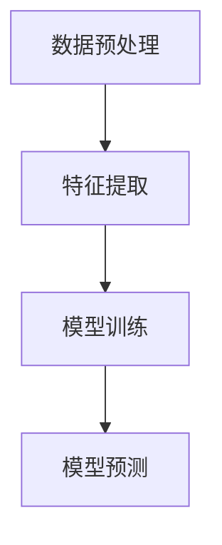
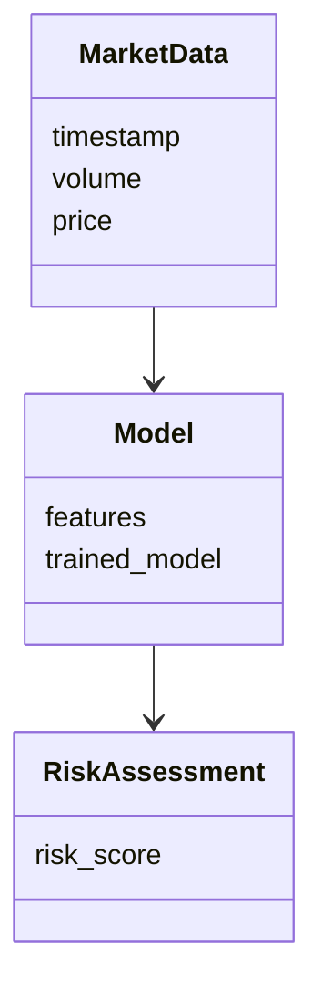
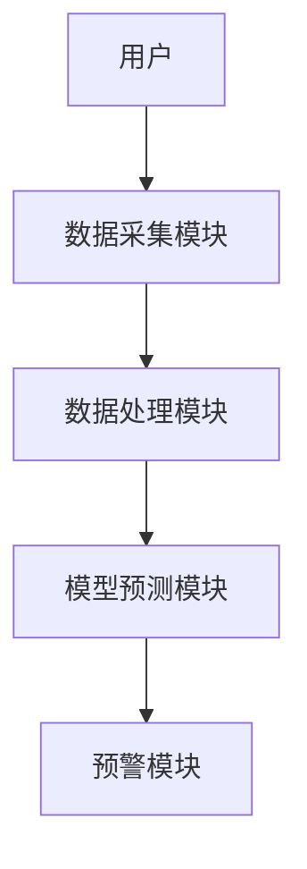

                 


# AI驱动的市场流动性枯竭预警

## 关键词：AI技术、市场流动性、风险预警、机器学习、金融数据分析

## 摘要：本文探讨如何利用AI技术预测和预警市场流动性枯竭，分析其核心概念、算法原理和系统架构，结合实际案例，提供深度见解和技术实现方案。

---

# 第1章：AI驱动的市场流动性枯竭预警背景介绍

## 1.1 问题背景

### 1.1.1 市场流动性风险的定义与特征
- **定义**：市场流动性风险指资产无法以合理价格迅速变现的风险。
- **特征**：涉及交易成本、波动性和市场深度，通常由市场恐慌或信息不对称引发。

### 1.1.2 问题描述
- 市场流动性枯竭可能导致价格崩盘和系统性风险，影响金融市场稳定性。

### 1.1.3 边界与外延
- 研究范围：股票、债券等金融资产。
- 外延：包括信用风险和操作风险，但不涉及声誉风险。

### 1.1.4 核心要素
- 市场深度、交易量、价格波动性。

## 1.2 AI技术在金融领域的应用

### 1.2.1 数据处理能力
- AI擅长处理海量非结构化数据，提升分析效率。

### 1.2.2 预测准确性
- 利用历史数据训练模型，预测市场趋势。

### 1.2.3 实时监控能力
- AI能实时分析市场动态，及时发出预警。

---

# 第2章：AI驱动的市场流动性预警的核心概念

## 2.1 核心概念

### 2.1.1 比较分析

| 概念       | 定义                                                                 |
|------------|----------------------------------------------------------------------|
| 流动性风险  | 资产变现能力下降导致损失风险。                                      |
| 市场风险    | 整体市场波动引发的风险。                                            |
| 信用风险    | 债务人违约风险。                                                  |

### 2.1.2 ER实体关系图


---

# 第3章：AI驱动的市场流动性预警的算法原理

## 3.1 数据预处理

### 3.1.1 数据清洗
- 去除异常值和缺失数据。

### 3.1.2 数据标准化
- 使用归一化或标准化方法处理数据。

### 3.1.3 特征选择
- 采用PCA或相关性分析提取关键特征。

## 3.2 算法实现

### 3.2.1 机器学习算法
- 使用XGBoost或随机森林进行分类。

### 3.2.2 算法流程


### 3.2.3 Python代码示例
```python
import pandas as pd
from sklearn.ensemble import RandomForestClassifier
from sklearn.model_selection import train_test_split
from sklearn.metrics import accuracy_score

# 数据加载与预处理
data = pd.read_csv('market_data.csv')
X = data[['volume', 'price_change']]
y = data['is_illiquid']

# 划分训练集和测试集
X_train, X_test, y_train, y_test = train_test_split(X, y, test_size=0.2)

# 模型训练
model = RandomForestClassifier()
model.fit(X_train, y_train)

# 预测与评估
y_pred = model.predict(X_test)
print("准确率:", accuracy_score(y_test, y_pred))
```

## 3.3 数学模型

### 3.3.1 时间序列模型
$$ ARIMA(p, d, q) $$

### 3.3.2 机器学习模型
$$ y = \sum_{i=1}^{n} \beta_i x_i + \epsilon $$

---

# 第4章：系统分析与架构设计

## 4.1 问题场景

### 4.1.1 交易数据采集
- 从数据源获取实时交易数据。

## 4.2 系统架构

### 4.2.1 领域模型


### 4.2.2 系统架构图


---

# 第5章：项目实战

## 5.1 环境安装

### 5.1.1 安装Python和相关库
- 使用pip安装pandas、scikit-learn、xgboost等库。

## 5.2 核心代码实现

### 5.2.1 数据处理
```python
import pandas as pd
data = pd.read_csv('market_data.csv')
```

### 5.2.2 模型训练
```python
from xgboost import XGBClassifier
model = XGBClassifier()
model.fit(X_train, y_train)
```

## 5.3 实际案例分析

### 5.3.1 案例分析
- 使用2020年某股票市场数据，模型预测流动性风险。

## 5.4 项目小结

### 5.4.1 最佳实践
- 数据质量至关重要。
- 模型需定期调优。
- 结合专家意见提升准确性。

---

# 第6章：总结与展望

## 6.1 总结

### 6.1.1 主要内容回顾
- 介绍了AI在市场流动性预警中的应用。
- 分析了核心算法和系统架构。

## 6.2 未来展望

### 6.2.1 研究方向
- 结合NLP技术分析市场情绪。
- 开发实时预警系统。

### 6.2.2 应用前景
- 提升金融市场稳定性，优化投资策略。

---

# 作者：AI天才研究院 & 禅与计算机程序设计艺术

---

这篇文章详细探讨了AI在市场流动性预警中的应用，从理论到实践，为读者提供了全面的指导。通过清晰的结构和丰富的案例，帮助读者理解如何利用AI技术预测和管理市场风险。

