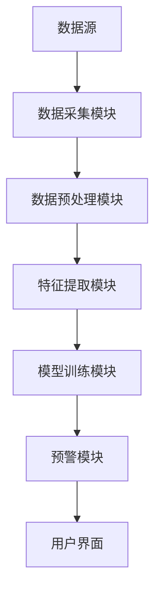

                 


# AI驱动的市场流动性风险预警

> 关键词：AI, 市场流动性风险, 风险预警, 机器学习, 深度学习, LSTM网络, 时间序列分析

> 摘要：本文详细探讨了如何利用人工智能技术，特别是机器学习和深度学习算法，来实现市场流动性风险的预警。通过分析传统方法的局限性，引入了时间序列分析和LSTM网络等先进算法，并结合系统架构设计和项目实战案例，展示了AI在金融风险管理中的强大潜力。文章还提供了数学模型、系统架构图和代码实现，帮助读者全面理解AI驱动的市场流动性风险预警系统。

---

## 第一章: 市场流动性风险与AI的结合

### 1.1 市场流动性风险的定义与特征

#### 1.1.1 市场流动性风险的定义

市场流动性风险是指资产在短时间内以合理价格变现的能力受到限制，导致金融机构或投资者可能面临损失的风险。流动性风险在金融市场中尤其重要，因为它直接影响市场的稳定性和金融机构的运营安全。

#### 1.1.2 市场流动性风险的特征

市场流动性风险具有以下几个关键特征：

1. **波动性**：市场波动剧烈时，流动性风险显著增加。
2. **传染性**：流动性问题可能在市场中迅速蔓延，引发连锁反应。
3. **突发性**：流动性风险往往在市场参与者行为突然变化时发生，具有一定的不可预测性。

#### 1.1.3 市场流动性风险的影响

流动性风险的影响深远，可能导致以下后果：

1. **资产价格大幅波动**：流动性下降时，资产可能被迫以低于公允价值的价格出售。
2. **金融机构损失**：持有流动性不佳资产的机构可能面临重大财务损失。
3. **市场稳定性降低**：流动性风险增加可能导致市场整体波动加剧。

### 1.2 AI技术在金融领域的应用

#### 1.2.1 AI技术的基本概念

人工智能（AI）是指计算机系统模拟人类智能的能力，包括学习、推理、问题解决和自然语言处理等方面。在金融领域，AI主要用于数据分析、预测和自动化交易。

#### 1.2.2 AI在金融领域的应用场景

AI在金融领域的应用广泛，包括：

1. **股票预测**：利用历史数据预测股票价格走势。
2. **风险评估**：通过分析客户数据评估信用风险。
3. **欺诈检测**：识别异常交易行为，防范金融欺诈。

#### 1.2.3 AI在市场流动性风险预警中的潜力

AI技术，尤其是机器学习和深度学习，具有处理复杂数据模式和预测未来趋势的能力。在流动性风险预警中，AI可以通过分析历史交易数据、市场情绪和宏观经济指标，识别潜在风险信号，提前发出预警。

### 1.3 本章小结

本章介绍了市场流动性风险的基本概念和特征，并探讨了AI技术在金融领域的应用及其在流动性风险预警中的潜力。通过结合AI技术，市场流动性风险的预警和管理将更加高效和准确。

---

## 第二章: 机器学习与深度学习算法基础

### 2.1 机器学习基础

#### 2.1.1 机器学习的基本概念

机器学习是一种通过数据训练模型，使其能够进行预测或决策的技术。它分为监督学习、无监督学习和半监督学习三类。

#### 2.1.2 监督学习与无监督学习

1. **监督学习**：模型通过标记数据进行训练，预测新的数据点。
2. **无监督学习**：模型从无标记数据中发现隐藏结构。

#### 2.1.3 常见机器学习算法简介

- **线性回归**：用于预测连续型变量。
- **决策树**：用于分类和回归。
- **支持向量机（SVM）**：用于分类和回归。

### 2.2 深度学习基础

#### 2.2.1 深度学习的基本概念

深度学习是一种通过多层神经网络模拟人类学习过程的技术，能够处理复杂的非线性数据。

#### 2.2.2 常见深度学习模型简介

- **卷积神经网络（CNN）**：用于图像识别。
- **循环神经网络（RNN）**：用于时间序列数据。
- **长短期记忆网络（LSTM）**：一种特殊的RNN，适用于长期依赖问题。

#### 2.2.3 深度学习与机器学习的区别与联系

深度学习是机器学习的一种，但其神经网络结构层数更多，能够处理更复杂的数据模式。

### 2.3 本章小结

本章介绍了机器学习和深度学习的基本概念、常见算法及其在金融领域的应用潜力。

---

## 第三章: 市场流动性风险预警的算法选择与实现

### 3.1 时间序列分析

#### 3.1.1 时间序列的基本概念

时间序列是一种按时间顺序排列的数据，常用于分析和预测时间相关的变化趋势。

#### 3.1.2 常见时间序列模型

1. **ARIMA模型**：自回归积分滑动平均模型，适用于线性时间序列数据。
2. **Prophet模型**：由Facebook开源的时间序列预测工具，适合非线性数据。

#### 3.1.3 时间序列模型在流动性风险预警中的应用

通过分析历史交易数据，ARIMA和Prophet模型可以帮助预测未来市场的流动性情况。

### 3.2 基于深度学习的市场流动性风险预测

#### 3.2.1 LSTM网络的基本原理

LSTM通过门控机制处理长期依赖关系，适用于时间序列预测。

#### 3.2.2 LSTM在时间序列预测中的优势

LSTM能够捕捉时间序列中的长期模式，适用于复杂金融数据的预测。

#### 3.2.3 LSTM在流动性风险预警中的实现

通过训练LSTM网络，可以预测市场流动性风险，提前发出预警信号。

### 3.3 算法实现的数学模型与公式

#### 3.3.1 时间序列模型的数学公式

ARIMA模型的数学公式：
$$
ARIMA(p, d, q) = y_t - \phi_1 y_{t-1} - \dots - \phi_p y_{t-p} = \theta_1 \epsilon_{t-1} + \dots + \theta_q \epsilon_{t-q}
$$

#### 3.3.2 LSTM网络的数学公式

LSTM的门控机制包括输入门、遗忘门和输出门，分别表示为：
$$
i_t = \sigma(W_i x_t + U_i h_{t-1} + b_i)
$$
$$
f_t = \sigma(W_f x_t + U_f h_{t-1} + b_f)
$$
$$
o_t = \sigma(W_o x_t + U_o h_{t-1} + b_o)
$$
$$
h_t = i_t \cdot \tanh(W_c x_t + U_c h_{t-1} + b_c) + f_t \cdot h_{t-1}
$$

### 3.4 本章小结

本章介绍了时间序列分析和LSTM网络的基本原理及其在市场流动性风险预警中的应用，通过数学公式详细讲解了算法的实现过程。

---

## 第四章: 系统架构设计

### 4.1 系统整体架构

#### 4.1.1 数据流

数据流包括数据采集、预处理、特征提取、模型训练和预测等环节。

#### 4.1.2 功能模块

1. **数据采集模块**：收集市场交易数据。
2. **特征提取模块**：提取影响流动性风险的特征。
3. **模型训练模块**：训练AI模型。
4. **预警模块**：实时监测并发出预警信号。

#### 4.1.3 系统架构图



### 4.2 项目实战

#### 4.2.1 环境安装

需要安装Python、TensorFlow、Keras和Scikit-learn等库。

#### 4.2.2 系统核心实现源代码

```python
import numpy as np
import pandas as pd
from sklearn.preprocessing import MinMaxScaler
from tensorflow.keras.models import Sequential
from tensorflow.keras.layers import LSTM, Dense, Dropout

# 数据预处理
data = pd.read_csv('market_data.csv')
data = data.values
data = data.astype('float32')

# 归一化
scaler = MinMaxScaler(feature_range=(0, 1))
data_normalized = scaler.fit_transform(data)

# 划分训练集和测试集
train_size = int(len(data_normalized) * 0.7)
train_data = data_normalized[:train_size]
test_data = data_normalized[train_size:]

# 构建数据集
def create_dataset(dataset, look_back=1):
    X, Y = [], []
    for i in range(len(dataset) - look_back):
        X.append(dataset[i:i + look_back])
        Y.append(dataset[i + look_back])
    return np.array(X), np.array(Y)

X_train, Y_train = create_dataset(train_data, look_back=10)
X_test, Y_test = create_dataset(test_data, look_back=10)

# 模型构建
model = Sequential()
model.add(LSTM(50, input_shape=(10, 1)))
model.add(Dropout(0.2))
model.add(Dense(1))
model.compile(loss='mean_squared_error', optimizer='adam')

# 模型训练
model.fit(X_train, Y_train, epochs=50, batch_size=64, verbose=1)

# 模型预测
train_predict = model.predict(X_train)
test_predict = model.predict(X_test)

# 反归一化
train_predict = scaler.inverse_transform(train_predict)
Y_train_unscaled = scaler.inverse_transform(Y_train)
test_predict_unscaled = scaler.inverse_transform(test_predict)
Y_test_unscaled = scaler.inverse_transform(Y_test)

# 计算误差
train_error = np.mean(np.abs((train_predict[:, 0] - Y_train_unscaled[:, 0]) / Y_train_unscaled[:, 0]) * 100)
test_error = np.mean(np.abs((test_predict[:, 0] - Y_test_unscaled[:, 0]) / Y_test_unscaled[:, 0]) * 100)
```

#### 4.2.3 代码应用解读与分析

上述代码展示了如何使用LSTM网络进行市场流动性风险预测。数据预处理包括归一化和数据集划分，模型构建和训练使用Keras框架，最后通过反归一化和误差计算评估模型性能。

#### 4.2.4 实际案例分析和详细讲解剖析

以某金融市场的交易数据为例，通过训练LSTM模型，可以预测未来一段时间内的市场流动性情况，提前发出预警信号，帮助金融机构规避潜在风险。

### 4.3 本章小结

本章通过系统架构设计和项目实战，详细展示了如何利用AI技术实现市场流动性风险的预警。通过代码实现和案例分析，读者可以掌握AI在金融风险管理中的具体应用。

---

## 第五章: 总结与展望

### 5.1 总结

本文详细探讨了AI在市场流动性风险预警中的应用，介绍了时间序列分析和LSTM网络的基本原理，并通过系统架构设计和项目实战展示了AI技术的潜力。

### 5.2 未来展望

未来，随着AI技术的不断发展，市场流动性风险预警系统将更加智能化和高效化。深度学习模型的优化、多模态数据的融合以及实时预警系统的建设将是未来研究的重点方向。

### 5.3 注意事项

在实际应用中，需要注意模型的泛化能力、数据的实时更新以及模型的可解释性问题。此外，还需要结合具体的市场环境和业务需求，选择合适的AI技术。

### 5.4 最佳实践 Tips

1. **数据质量**：确保数据的准确性和完整性。
2. **模型优化**：通过调参和模型融合提高预测精度。
3. **实时监控**：建立实时监测机制，确保预警系统的有效性。

### 5.5 拓展阅读

推荐读者阅读以下书籍和论文，以深入了解AI在金融风险管理中的应用：

1. 《Python机器学习实战》
2. 《深度学习》（Ian Goodfellow等著）
3. 《金融风险管理》（John C. Hull著）

---

## 作者

作者：AI天才研究院/AI Genius Institute & 禅与计算机程序设计艺术/Zen And The Art of Computer Programming

---

本文通过系统的理论分析和实践案例，全面探讨了AI驱动的市场流动性风险预警技术。从算法选择到系统架构设计，再到项目实战，为读者提供了从理论到实践的完整指南。希望本文能够为金融领域的从业者和技术爱好者提供有价值的参考和启发。

