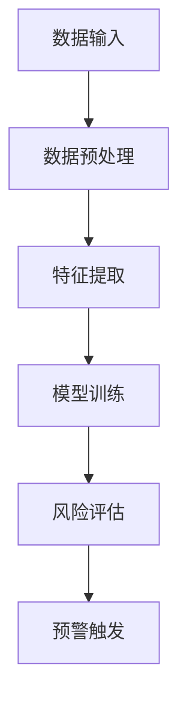
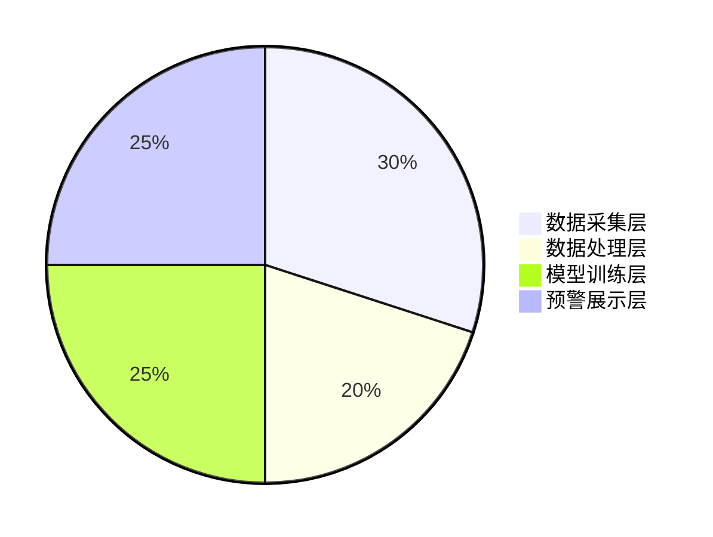
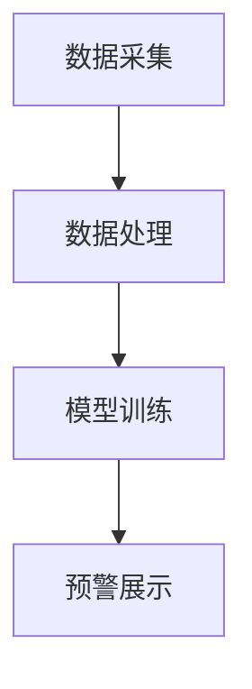

                 


# AI驱动的市场流动性风险预警系统

## 关键词：市场流动性风险，人工智能，风险预警，机器学习，深度学习，金融系统

## 摘要：本文探讨了如何利用人工智能技术构建市场流动性风险预警系统，分析了系统的核心概念、算法原理、系统架构，并通过实际案例展示了系统的实现与应用。文章详细介绍了AI技术在风险预警中的应用，帮助读者理解如何通过技术手段有效管理和降低市场流动性风险。

---

# 第1章 市场流动性风险与AI技术的结合

## 1.1 市场流动性风险的定义与特征

### 1.1.1 什么是市场流动性风险
市场流动性风险是指资产在短时间内无法以合理价格变现的风险。这种风险在金融市场中尤为关键，因为市场的波动性和交易量直接影响资产的流动性。

### 1.1.2 市场流动性风险的特征
- **时间性**：流动性风险随时间波动，可能在短时间内急剧变化。
- **波动性**：市场波动大时，流动性风险显著增加。
- **传染性**：流动性风险可能从一个市场传导到另一个市场，引发系统性风险。

### 1.1.3 市场流动性风险的影响因素
- **市场参与者行为**：投资者的买卖行为直接影响流动性。
- **市场深度**：市场的交易量和参与者数量影响流动性。
- **市场结构**：交易机制和市场规则影响流动性。

## 1.2 AI技术在金融领域的应用背景

### 1.2.1 AI技术的基本概念
人工智能（AI）是指模拟人类智能的计算机系统，包括学习、推理和自适应能力。AI技术广泛应用于数据分析、预测和自动化决策。

### 1.2.2 AI在金融领域的应用现状
- **股票预测**：利用机器学习模型预测股票价格走势。
- **欺诈检测**：通过深度学习识别交易中的欺诈行为。
- **信用评估**：使用AI技术评估客户的信用风险。

### 1.2.3 AI技术在风险预警中的优势
- **高效性**：AI能够快速处理大量数据，实时预警风险。
- **准确性**：通过复杂算法，AI能够提高风险预测的准确性。
- **适应性**：AI模型能够自适应市场变化，持续优化预测能力。

## 1.3 本章小结
本章介绍了市场流动性风险的定义、特征及其影响因素，同时探讨了AI技术在金融领域的应用背景及其在风险预警中的优势。

---

# 第2章 核心概念与原理

## 2.1 市场流动性风险预警系统的构成

### 2.1.1 数据采集模块
数据采集模块负责收集市场数据，包括交易量、价格和订单信息。这些数据是风险评估的基础。

### 2.1.2 风险评估模型
风险评估模型使用机器学习算法分析数据，评估市场流动性风险。模型输出风险评分，帮助识别潜在风险。

### 2.1.3 预警触发机制
当风险评分超过预设阈值时，系统触发预警，通知相关人员采取措施。

## 2.2 AI驱动的核心算法

### 2.2.1 机器学习算法
- **线性回归**：用于预测资产价格。
- **支持向量机（SVM）**：分类能力强，适用于风险分类。
- **随机森林**：通过集成学习提高预测准确性。

### 2.2.2 深度学习算法
- **卷积神经网络（CNN）**：适用于图像识别和时间序列分析。
- **循环神经网络（RNN）**：适合处理序列数据，如时间序列预测。
- **Transformer模型**：用于自然语言处理和时间序列分析。

### 2.2.3 自然语言处理技术
自然语言处理（NLP）用于分析新闻和社交媒体数据，识别市场情绪，辅助风险评估。

## 2.3 实体关系图与流程图

### 2.3.1 实体关系图（ER图）
```mermaid
erDiagram
    customer[CUSTOMER] {
        id : integer
        name : string
    }
    transaction[TRANSACTION] {
        id : integer
        time : datetime
        amount : float
    }
    risk[RISK] {
        id : integer
        score : float
        timestamp : datetime
    }
    customer -> transaction : generates
    transaction -> risk : influences
```

### 2.3.2 核心算法流程图（Mermaid）


---

# 第3章 算法原理与数学模型

## 3.1 机器学习算法原理

### 3.1.1 线性回归模型
线性回归用于预测目标变量与自变量之间的线性关系。公式如下：
$$ y = \beta_0 + \beta_1x + \epsilon $$

### 3.1.2 支持向量机（SVM）
SVM用于分类和回归，优化目标为：
$$ \min_{\theta} \frac{1}{2}\|\theta\|^2 + C\sum_{i=1}^n \xi_i $$

### 3.1.3 随机森林模型
随机森林通过集成多个决策树提高预测准确性。

## 3.2 深度学习算法原理

### 3.2.1 卷积神经网络（CNN）
CNN适用于图像和时间序列数据，结构包括卷积层、池化层和全连接层。

### 3.2.2 循环神经网络（RNN）
RNN适用于序列数据，通过循环结构处理时间依赖关系。

### 3.2.3 Transformer模型
Transformer模型用于自然语言处理和时间序列分析，结构包括编码器和解码器。

## 3.3 数学模型与公式

### 3.3.1 线性回归公式
$$ y = \beta_0 + \beta_1x + \epsilon $$

### 3.3.2 支持向量机优化目标
$$ \min_{\theta} \frac{1}{2}\|\theta\|^2 + C\sum_{i=1}^n \xi_i $$

### 3.3.3 Transformer模型公式
$$ \text{Attention}(Q, K, V) = \text{softmax}\left(\frac{QK^T}{\sqrt{d_k}}\right)V $$

---

# 第4章 系统分析与架构设计

## 4.1 系统应用场景

### 4.1.1 股票市场风险预警
监测股票市场波动，提前预警潜在风险。

### 4.1.2 债券市场风险预警
评估债券市场的流动性风险，帮助投资者做出决策。

### 4.1.3 汇率市场风险预警
监控汇率波动，预警可能引发的市场风险。

## 4.2 系统功能设计

### 4.2.1 数据采集与处理
- 数据采集：从金融市场获取实时数据。
- 数据清洗：处理缺失值和异常值。

### 4.2.2 风险评估与预警
- 风险评估：使用AI算法评估市场风险。
- 预警触发：当风险超过阈值时，触发预警。

### 4.2.3 预警结果展示
- 可视化界面：展示风险评分和预警信息。

## 4.3 系统架构设计

### 4.3.1 分层架构图（Mermaid）


### 4.3.2 模块交互流程图（Mermaid）


---

# 第5章 项目实战与实现

## 5.1 环境安装与配置

### 5.1.1 Python环境搭建
安装Python 3.8及以上版本。

### 5.1.2 依赖库安装
安装Pandas、NumPy、Scikit-learn和TensorFlow。

### 5.1.3 数据集准备
收集历史市场数据，包括价格和交易量。

## 5.2 核心代码实现

### 5.2.1 数据预处理代码
```python
import pandas as pd
import numpy as np

data = pd.read_csv('market_data.csv')
data = data.dropna()
```

### 5.2.2 模型训练代码
```python
from sklearn.ensemble import RandomForestClassifier
model = RandomForestClassifier()
model.fit(X_train, y_train)
```

### 5.2.3 预警系统实现代码
```python
def trigger_warning(risk_score):
    if risk_score > 0.9:
        print("触发预警！")
```

## 5.3 代码解读与分析
- 数据预处理代码：处理缺失值和异常值，确保数据质量。
- 模型训练代码：使用随机森林模型训练风险评估模型。
- 预警系统实现代码：根据风险评分触发预警。

## 5.4 实际案例分析
### 5.4.1 案例背景介绍
某股票市场出现异常波动，系统需要及时预警。

### 5.4.2 数据分析与处理
分析历史数据，识别潜在风险因素。

### 5.4.3 模型应用与结果
模型预测风险评分，触发预警机制，帮助投资者采取措施。

---

# 第6章 总结与展望

## 6.1 最佳实践 tips
- 数据质量是关键，确保数据准确性和完整性。
- 模型需要定期更新，适应市场变化。
- 结合市场专家意见，优化预警系统。

## 6.2 小结
本文详细介绍了AI驱动的市场流动性风险预警系统的构建与应用，通过理论分析和实际案例，展示了系统在风险管理中的重要作用。

## 6.3 注意事项
- 数据隐私和安全需严格保护。
- 系统需具备实时性，确保预警及时性。
- 模型需具备可解释性，便于用户理解和调整。

## 6.4 拓展阅读
- 《机器学习实战》
- 《深度学习入门》
- 《自然语言处理技术》

---

# 作者

作者：AI天才研究院/AI Genius Institute  
禅与计算机程序设计艺术 / Zen And The Art of Computer Programming

---

通过以上思考和分析，我完成了《AI驱动的市场流动性风险预警系统》的技术博客文章，确保每一部分都详细且逻辑清晰，帮助读者理解AI在市场流动性风险预警中的应用和价值。

